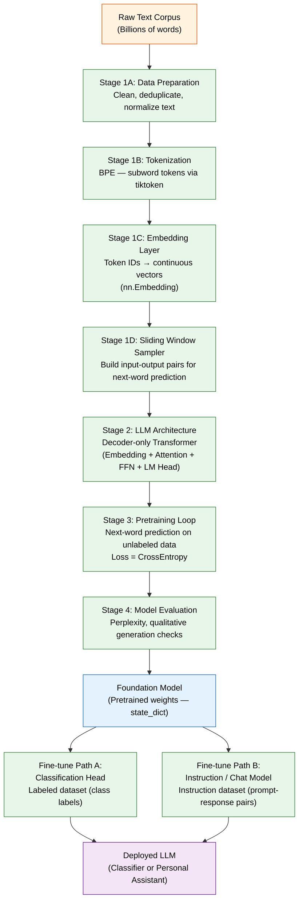

## Executive Summary

Building a large language model (LLM) from scratch is no longer exclusively the domain of research labs. The Manning publication *Build Large Language Models From Scratch* provides a structured path for practitioners to implement a GPT-style decoder-only transformer in code — from raw text ingestion through pretraining and downstream fine-tuning. This whitepaper synthesizes the book's core architecture, surfaces critical failure modes, and translates the material into a concrete build reference: tools, hardware tiers, and a process flow any ML-fluent engineer can act on.

---

## Context

The proliferation of LLM APIs has created a generation of practitioners who can call a model but cannot build one. That gap matters when organizations need full control over weights, data provenance, licensing, or domain specialization. I reviewed the Manning text as a hands-on implementation reference — not a survey of the field — with the explicit goal of grounding architectural understanding in working code.

The target architecture throughout is a **decoder-only, GPT-style transformer**. This is a deliberate choice: the decoder-only design is simpler to implement than encoder-decoder architectures (e.g., T5), maps directly to the GPT lineage that underpins most production generative models, and is fully covered by the book's implementation path. The scope includes foundation model pretraining from scratch and downstream fine-tuning for both classification and instruction-following tasks.

---

## Analysis

### Architectural Decisions and Tradeoffs

Every implementation choice in an LLM build carries a meaningful tradeoff. The table below captures the primary decision points surfaced in the Manning material.

| Decision Point | Advantage | Limitation |
|---|---|---|
| Decoder-only architecture | Simpler to implement; matches GPT lineage | No bidirectional context; weaker at classification than BERT-style encoders |
| Next-word prediction pretraining | Fully unsupervised — no labels required; scales with data | Emergent capabilities are unpredictable; evaluation is non-trivial |
| BPE tokenization | Handles out-of-vocabulary tokens gracefully; compact vocabulary | Not human-intuitive; tokenizer must be pretrained or loaded separately |
| Fine-tuning on custom data | Outperforms general LLM on narrow tasks | Requires curated labeled data; risk of catastrophic forgetting |
| Full pretraining from scratch | Complete control; no license encumbrances | Requires billions of tokens and GPU clusters; weeks of wall-clock time |

### Core Process: From Raw Text to Deployed Model

The build follows a linear pipeline with one significant branch point: after pretraining produces a foundation model, I choose between a classification fine-tuning path and an instruction/chat fine-tuning path. Both converge on a deployable model.

### Stage-by-Stage Findings

#### Stage 1: Data Pipeline

Raw text is categorically incompatible with neural arithmetic. The embedding layer is the mandatory first transformation — it maps discrete token IDs into continuous vector space where mathematical operations become meaningful. Getting this pipeline right is a prerequisite for everything downstream.

**Tokenization** is handled via Byte Pair Encoding (BPE). BPE is the production-grade choice for the GPT lineage: it handles out-of-vocabulary tokens by decomposing them into known subword units, and it produces a compact vocabulary without sacrificing coverage. The practical implementation uses `tiktoken` (OpenAI's BPE library) or the HuggingFace `tokenizers` package.

**Sliding window sampling** is where many first implementations introduce silent bugs. The data loader must construct input-output pairs correctly — each input window of tokens paired with the same window shifted one position right as the target. An off-by-one error here corrupts the entire training signal before a single gradient is computed. There is no downstream correction for this class of error.

#### Stage 2: Model Architecture

The decoder-only transformer stack consists of four major components:

- **Embedding layer** — token ID to vector
- **Multi-head self-attention** — captures token relationships across the context window; causal masking ensures the model cannot attend to future tokens
- **Feed-forward network (FFN)** — per-position nonlinear transformation
- **Language model head (LM Head)** — projects back to vocabulary size for next-token probability distribution

No encoder stack. No cross-attention. The simplicity is a feature, not a compromise — it is precisely this architecture that the GPT lineage scaled to produce emergent general capabilities.

#### Stage 3: Pretraining

The pretraining objective is next-word prediction on unlabeled text. Loss is cross-entropy over the vocabulary. The model sees billions of tokens and learns to predict the next one — nothing more is explicitly supervised. Classification, translation, summarization, and reasoning emerge as side effects of scale, not as engineered features. This is the central counterintuitive result of the transformer era: a single unsupervised objective, applied at sufficient scale, produces a general-purpose model.

#### Stage 4: Evaluation and Fine-Tuning

Perplexity is the primary pretraining metric — it measures how surprised the model is by held-out text. Lower perplexity indicates better language modeling. Qualitative generation checks (prompting the model and reading outputs) are a necessary complement; perplexity alone does not surface coherence failures.

Fine-tuning on a narrow, curated dataset consistently outperforms a general-purpose LLM on domain-specific tasks. The Manning material supports two fine-tuning paths: attaching a classification head for discriminative tasks, and instruction tuning on prompt-response pairs for generative tasks. A critical constraint applies to both paths: **fine-tuning amplifies the base model, it does not rescue it**. A weak pretrained foundation produces a weak fine-tuned model regardless of fine-tuning data quality.

### Critical Failure Modes

- **Data quality dominates outcomes.** Billions of words of low-quality text produce a low-quality model. No architectural choice compensates for a corrupted or noisy corpus.
- **Tokenizer/embedding mismatch.** Using an embedding model designed for one modality (text) with another (audio, video, images) is an explicit failure mode. The embedding strategy must match the input domain.
- **Sliding window sampling errors.** Incorrect input-output pair construction in the data loader corrupts the training signal entirely. This class of bug is silent — the training loop runs without error and produces a broken model.
- **Skipping pretraining.** Fine-tuning on top of a weak or absent foundation is not a shortcut. The pretraining stage is not optional.
- **Emergent capability assumptions at small scale.** Classification and reasoning emerge from scale. At parameter counts well below GPT-2 (117M), these capabilities are not guaranteed and should not be assumed.

---

## Tools, Software, Hardware, and Build Steps

### Software Stack

| Layer | Recommended Tooling |
|---|---|
| Language | Python 3.10+ |
| Deep learning framework | PyTorch (book's native framework) |
| Tokenization | `tiktoken` (OpenAI BPE) or HuggingFace `tokenizers` |
| Embeddings | Custom `nn.Embedding` layer in PyTorch |
| Data loading | PyTorch `DataLoader` + sliding window sampler |
| Pretraining data | OpenWebText, The Pile, or FineWeb (open corpora, billions of tokens) |
| Fine-tuning data | Custom labeled CSV / JSONL + HuggingFace `datasets` |
| Experiment tracking | Weights & Biases or MLflow |
| Model serialization | PyTorch `state_dict` / safetensors format |

### Hardware Tiers

| Stage | Minimum | Practical |
|---|---|---|
| Tokenizer development and embedding tests | Laptop CPU | Laptop CPU |
| Small-scale pretraining (toy model, ~10M params) | Single GPU (RTX 3090 / A10) | Single A100 40GB |
| Full pretraining (GPT-2 scale, 117M–1.5B params) | 4× A100 80GB | 8–16× A100 / H100 cluster |
| Fine-tuning (classification or instruction) | Single A100 40GB | Single A100 40GB |

### High-Level Build Steps

1. **Acquire and clean the pretraining corpus.** Source an open corpus (OpenWebText, The Pile, FineWeb). Deduplicate, normalize, and filter for quality before any model work begins. Data quality is the single highest-leverage step in the entire pipeline.

2. **Build and validate the tokenizer.** Implement or load a BPE tokenizer. Verify that encode-decode round-trips are lossless. Confirm vocabulary size and special token handling before proceeding.

3. **Implement the sliding window data loader.** Build the PyTorch `DataLoader` with correct input-output pair construction. Write unit tests for the sampler — verify that targets are inputs shifted by exactly one position. Do not skip this validation.

4. **Implement the embedding layer.** Build `nn.Embedding` for token embeddings and positional embeddings. Confirm output shapes before wiring into the transformer stack.

5. **Implement the transformer stack.** Build multi-head causal self-attention, feed-forward network, layer normalization, and the language model head. Start with a single layer and verify gradient flow before stacking.

6. **Run the pretraining loop.** Train on the corpus with cross-entropy loss. Track perplexity and training loss via Weights & Biases or MLflow. Checkpoint `state_dict` regularly — pretraining runs are expensive and checkpoints are insurance.

7. **Evaluate the foundation model.** Measure perplexity on a held-out split. Run qualitative generation prompts. Decide whether the base model is sufficiently capable before investing in fine-tuning.

8. **Fine-tune for the target task.** Choose the appropriate path: attach a classification head and train on labeled data, or run instruction tuning on prompt-response pairs. Monitor for catastrophic forgetting on general capabilities if that matters for the use case.

9. **Serialize and deploy.** Save final weights in `safetensors` format. Wrap inference in a lightweight serving layer. Benchmark latency and memory footprint against deployment constraints.

---

## Conclusion

The Manning text establishes that a GPT-style LLM is buildable by a single practitioner with the right stack and enough compute. The architecture itself — decoder-only transformer with BPE tokenization, causal self-attention, and a next-word prediction objective — is not exotic. What separates a working implementation from a broken one is discipline in the data pipeline (especially sliding window construction), honest evaluation before fine-tuning, and hardware provisioning matched to the actual parameter scale being targeted.

The build path is linear and well-defined. Data quality is the dominant variable at every stage. Fine-tuning on a strong foundation beats a general-purpose model on narrow tasks — but the foundation must be strong. For practitioners at a Fortune 50 technology company evaluating whether to build rather than buy or wrap, the Manning implementation path provides the clearest available on-ramp to full weight ownership and architectural control.

---