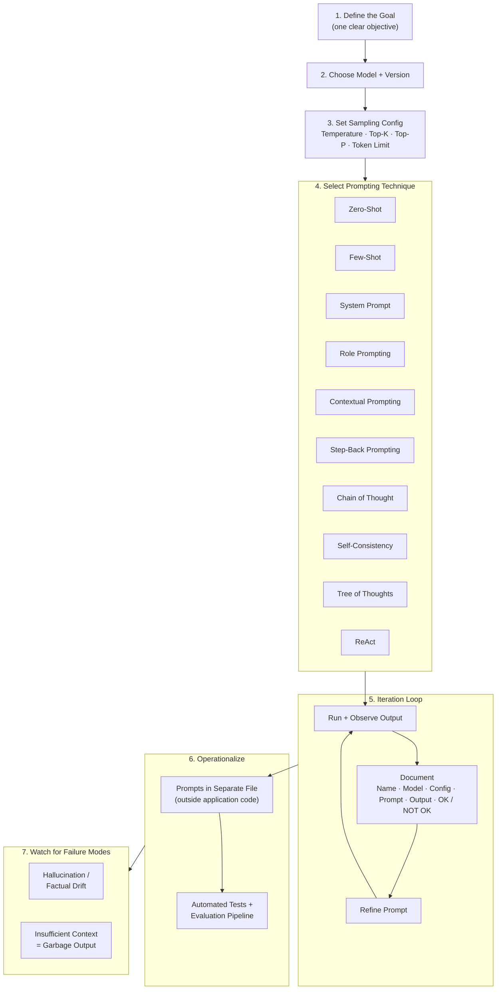

## Executive Summary

Prompt engineering is not a soft skill — it is a repeatable, documentable engineering discipline. This whitepaper distills Google's February 2025 Prompt Engineering whitepaper into a structured process flow and decision architecture that practitioners can apply immediately. It covers the full lifecycle: goal definition, model and sampling configuration, technique selection, iterative refinement, documentation, and production operationalization. The goal is a single reference that removes ambiguity from how prompts are built, debugged, and deployed.

---

## Context

As large language models move from novelty to infrastructure, the gap between practitioners who get consistent, production-grade outputs and those who do not comes down almost entirely to process. Most prompt failures are not model failures — they are process failures: undefined goals, undocumented iterations, no version control, and no evaluation harness.

Google's Prompt Engineering whitepaper establishes a rigorous framework for treating prompts as first-class engineering artifacts. I synthesize that framework here into an architecture diagram, technique selection guide, and documentation standard that teams can adopt without ceremony.

---

## Analysis

### The Core Mental Model

Prompt engineering is iterative, not one-shot. The loop is: craft → test → analyze → document → refine. This loop runs across every technique and every deployment context. The diagram below encodes the full architecture, from goal definition through production monitoring.

---

### Stage 1 — Define the Goal

Every prompt starts with a single, unambiguous objective. If the goal requires two sentences to describe, the prompt is likely trying to do two things, and it should be split. Clarity at this stage is the single highest-leverage action in the entire process — a vague goal produces a vague prompt, and no technique compensates for that.

---

### Stage 2 — Choose Model and Version

Model selection is not an afterthought. Different models have different strengths, context window sizes, instruction-following behaviors, and latency profiles. Critically, a prompt tuned for one version of a model is not guaranteed to transfer to the next version of the same model. Pin the version. Document it. Re-test when it changes.

---

### Stage 3 — Set Sampling Configuration

The four levers that control output behavior:

| Parameter | What It Controls | Practical Guidance |
|---|---|---|
| **Temperature** | Randomness / creativity | 0 for deterministic tasks; 0.7–1.0 for generative tasks |
| **Top-K** | Candidate token pool size | Lower = more conservative vocabulary |
| **Top-P** | Nucleus sampling threshold | Filters low-probability tokens from the pool |
| **Token Limit** | Maximum output length | Set tight for classification; leave room for CoT reasoning |

These settings are part of the prompt artifact — a prompt without its sampling configuration is an incomplete specification.

---

### Stage 4 — Select the Right Technique

Technique selection is driven by task structure, not preference. The table below maps situation to technique with reasoning.

| Situation | Technique | Why |
|---|---|---|
| Simple, well-defined task | **Zero-Shot** | Model has sufficient prior training to complete without examples |
| Need consistent format or tone | **Few-Shot** | Examples constrain the output space directly |
| Persistent persona or behavioral rules | **System Prompt** | Sets behavior across the full session, not just one turn |
| Domain expertise required | **Role Prompting** | "You are a senior financial auditor…" anchors voice and judgment |
| Background context is load-bearing | **Contextual Prompting** | Anchors the model in your domain before the task |
| Complex reasoning, multi-hop inference | **Chain of Thought** | Forces step-by-step decomposition, surfacing intermediate logic |
| Reliability on hard problems | **Self-Consistency** | Sample multiple reasoning paths, take the majority answer |
| Exploratory or branching problems | **Tree of Thoughts** | Explore and prune multiple reasoning branches in parallel |
| Model needs to act and observe | **ReAct** | Interleaves reasoning with tool or API calls |
| Abstract question where the model is struggling | **Step-Back** | Ask the general principle first, then the specific application |

These techniques are not mutually exclusive. A production prompt might combine a system prompt with few-shot examples and chain-of-thought instruction — the architecture above treats them as composable layers, not binary choices.

---

### Stage 5 — The Iteration Loop

The iteration loop is where engineering discipline separates from casual prompting. The loop has three phases: run and observe, document, refine. The documentation step is the one most frequently skipped and the one that makes every subsequent iteration faster.

Without a log, debugging is guesswork. With a log, patterns emerge quickly: which configuration changes moved the needle, which phrasing introduced hallucination, which examples in a few-shot set are doing the heavy lifting.

#### The Documentation Template

| Field | What to Capture |
|---|---|
| **Name** | Prompt name and iteration version |
| **Goal** | One sentence — what this prompt must achieve |
| **Model** | Name and version, pinned |
| **Temperature** | Value used |
| **Token Limit** | Max output tokens |
| **Top-K / Top-P** | Sampling parameters |
| **Prompt** | Full prompt text, verbatim |
| **Output** | Full output(s), not a summary |
| **Result** | OK / NOT OK / SOMETIMES OK |
| **Feedback** | What to change and why |

For teams using Vertex AI Studio: save the prompt under its versioned name and log the direct link. One click to re-run the exact configuration.

#### RAG-Specific Additions

When the prompt is part of a Retrieval-Augmented Generation pipeline, the documentation template expands to include:

- The retrieval **query** used
- **Chunk size and overlap settings**
- The actual **chunks injected** into the prompt context
- Retrieval **score or ranking** if available

Retrieval parameters are as much a part of the prompt artifact as the text itself — changing them changes the output, and that change needs to be traceable.

---

### Stage 6 — Operationalize

Three rules govern the move from experimentation to production:

1. **Separate prompts from code.** Prompts belong in standalone files, not as inline strings buried in application logic. They need to be readable, versionable, and deployable independently.
2. **Automate evaluation.** Manual eyeballing does not scale and does not catch regressions. Build a test harness. Define what a passing output looks like before you ship.
3. **Re-test when the model changes.** Model version upgrades are not backward compatible from a prompting perspective. Treat a model version change as a dependency upgrade that requires regression testing.

---

### Stage 7 — Monitor for Failure Modes

Two failure modes dominate in production:

- **Hallucination and factual drift** — the model generates plausible but incorrect information, especially when context is thin or the question is at the edge of training distribution. Mitigation: provide grounding context, use retrieval, and build evaluation steps that check factual claims.
- **Insufficient context producing garbage output** — the model cannot infer what it is not told. The most common cause is a prompt written by someone who already knows the answer and unconsciously omits the context a naive reader would need. Mitigation: test prompts with colleagues who did not write them.

---

## Recommendation

Treat prompts as code. Version them, test them, and separate them from application logic. Apply the documentation template to every prompt that goes into production — not because process is valuable in itself, but because the iteration loop without documentation is just guessing in a loop.

Start with the simplest technique that could work for the task (zero-shot), document the result, and escalate technique complexity only when simpler approaches demonstrably fail. The most common prompt engineering mistake is reaching for chain-of-thought or tree-of-thoughts before establishing that the problem actually requires them.

The architecture above is not a one-time setup — it is a standing operational model. As models evolve, as retrieval systems change, and as use cases expand, the loop runs again. The teams that compound improvement fastest are the ones with the cleanest logs from the last iteration.

---