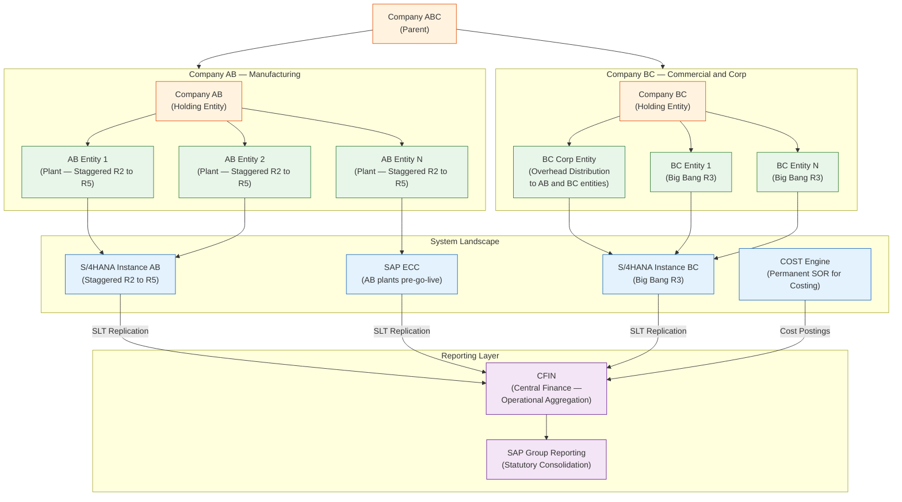
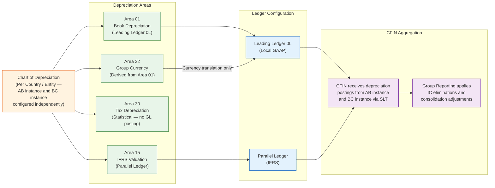
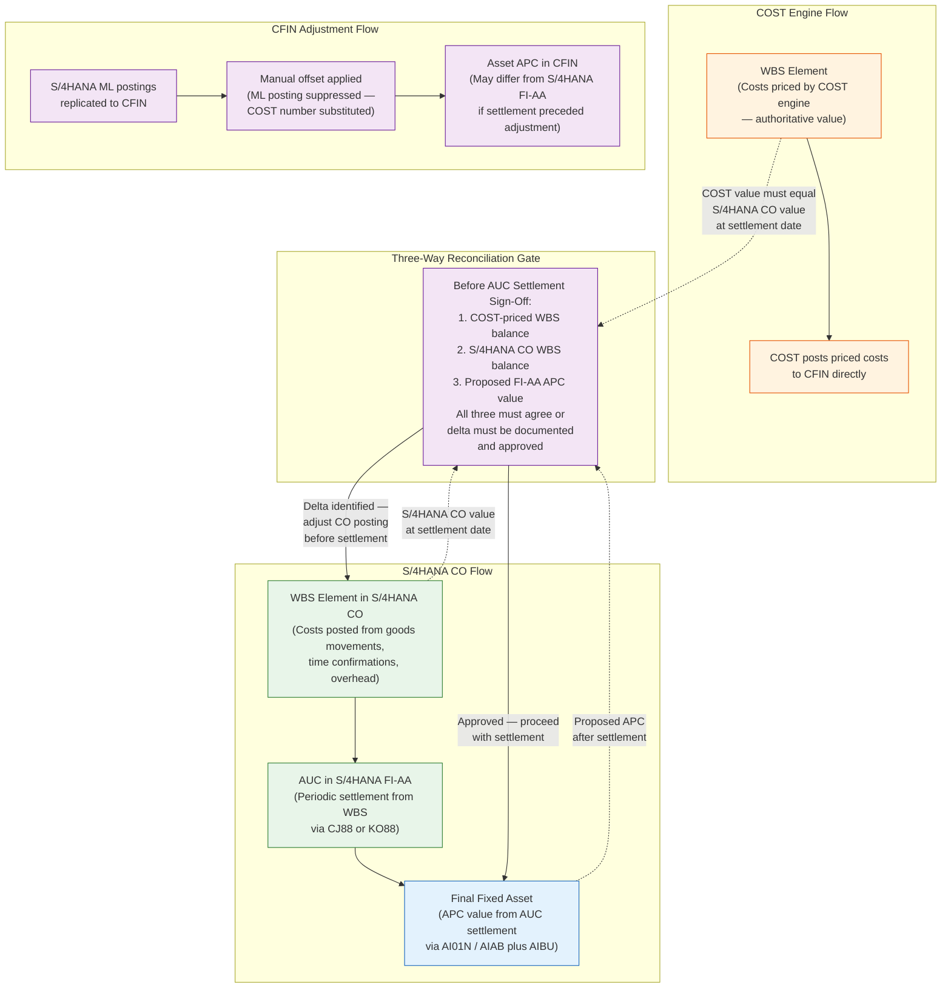
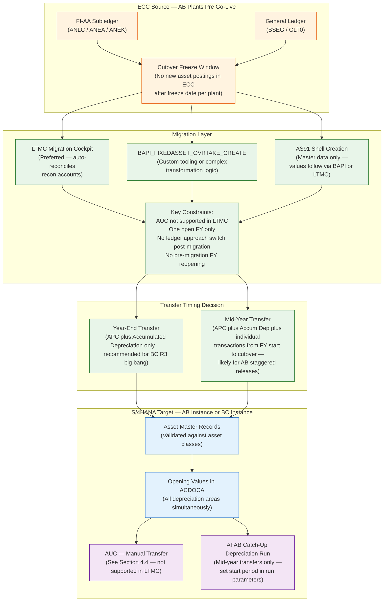
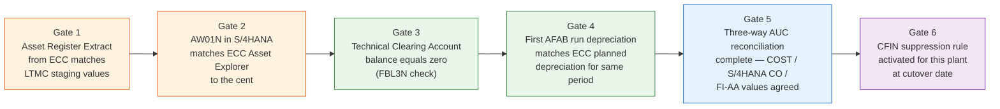
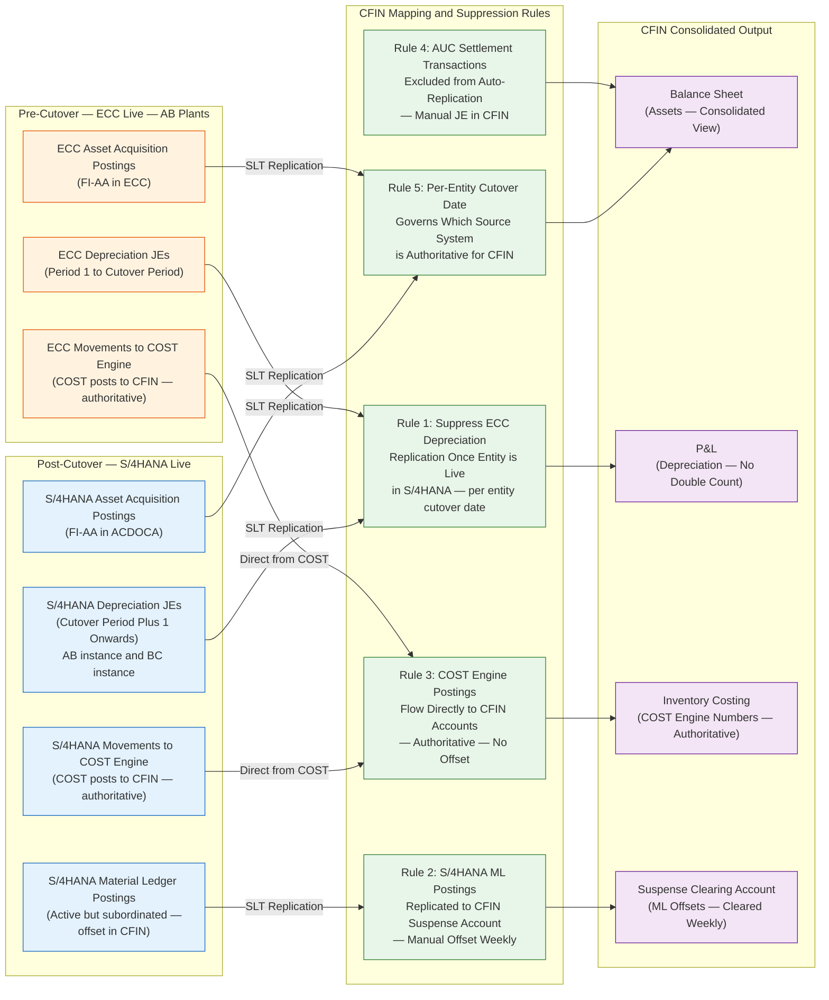
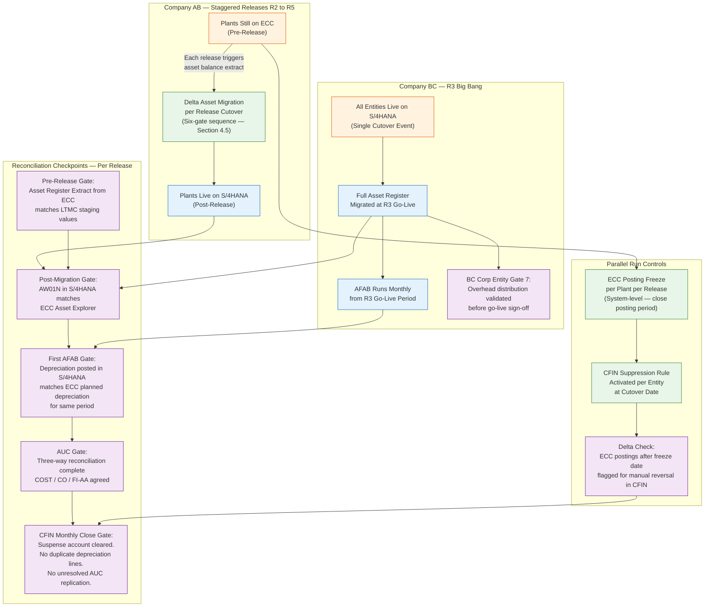

---

## Abstract

This white paper addresses fixed asset accounting in a complex S/4HANA program involving two separate S/4HANA instances, a staggered multi-release go-live spanning five releases, an external costing engine that is the permanent system of record for inventory costing, and a Central Finance (CFIN) layer aggregating financials from multiple source systems before feeding SAP Group Reporting for statutory consolidation.

The paper establishes the architectural differences between SAP ECC and S/4HANA Asset Accounting, defines correct migration pathways for fixed assets in a hybrid landscape, addresses the intersection of project-based capitalization with an external costing engine, and provides a reconciliation framework for parallel run and CFIN replication scenarios.

The most urgent finding is addressed at the outset: inventory movement type MT 561 is architecturally incorrect for fixed asset migration or capitalization under any scenario. Its use in this program must stop before any cutover activity proceeds.

---

## Executive Summary

A multi-instance, multi-release S/4HANA program introduces three asset accounting risks that do not exist in a standard single-instance implementation.

**Risk 1 — Incorrect capitalization method.** Inventory movement type MT 561 has been proposed as a vehicle to bring assets onto the balance sheet. MT 561 is an opening balance upload for valuated stock. It posts to current asset inventory accounts, creates no asset master record, populates no depreciation area values, and generates no entries in the asset accounting fields of the Universal Journal. Any fixed asset brought in via MT 561 will not depreciate, will not appear in the asset register, and will be misclassified on the balance sheet. The correct paths are the LTMC Migration Cockpit or BAPI_FIXEDASSET_OVRTAKE_CREATE for migrated assets, and account assignment category A on a purchase order for newly procured assets.

**Risk 2 — AUC settlement with an external costing engine.** The external costing engine — referred to throughout this paper as COST — is the permanent system of record for inventory costing. WBS elements accumulate costs priced by COST. Those costs settle to Assets Under Construction (AUC), and AUC settles to fixed assets in FI-AA. The capitalized acquisition cost on the asset master therefore contains a COST-engine-derived component. This creates a three-way reconciliation requirement at AUC settlement — between COST-priced WBS values, S/4HANA CO postings, and final FI-AA asset values — that is not present in a standard S/4HANA implementation and is not addressed by the current program approach.

**Risk 3 — Double depreciation in CFIN.** During the parallel run, depreciation postings replicate to CFIN from both ECC (for plants not yet live) and S/4HANA (for plants that are live). Without explicit suppression rules per entity and per release, CFIN will double-count depreciation for assets that have been migrated. This is a configuration requirement, not a procedural control.

The ten recommendations at the end of this paper address each risk with specific, implementable actions. Recommendations 1, 7, and 9 are pre-cutover gates — they must be resolved before any go-live event proceeds.

---

## 1. Program Context

### 1.1 Generic Framing

A multi-instance S/4HANA program with an external costing engine introduces a topology that differs materially from the standard SAP reference architecture. In the standard model, a single S/4HANA instance hosts all financial and controlling processes, the Material Ledger is the system of record for inventory valuation, and Central Finance aggregates from legacy systems during a transitional period only.

In the program described in this paper, the following conditions apply permanently or for a significant portion of the program lifecycle:

- Two separate S/4HANA instances exist — one for the manufacturing entity group, one for the commercial entity group — each with its own chart of accounts, chart of depreciation, and company code configuration
- An external costing engine is the permanent system of record for inventory costing across all entities regardless of release. The Material Ledger in S/4HANA is active but subordinated — its CFIN postings are manually adjusted out and replaced by the costing engine output
- CFIN aggregates from both S/4HANA instances and from the legacy ECC system for manufacturing plants not yet live, and feeds SAP Group Reporting for statutory consolidation
- The manufacturing entity goes live in staggered plant-level releases across five releases. The commercial entity goes live in a single big bang event at Release 3

These conditions affect asset migration sequencing, capitalization architecture, AUC settlement reconciliation, and CFIN replication rules in ways that require explicit design decisions beyond the standard implementation guide.

### 1.2 Company ABC — Illustrative Program

The illustrative program used throughout this paper involves Company ABC as the parent entity, with two subsidiary groups:

**Company AB** is the manufacturing entity. It operates on its own S/4HANA instance. Plants go live in staggered releases from R2 through R5. COST is the system of record for costing throughout. Pre-go-live plants continue to operate on SAP ECC.

**Company BC** is the commercial and corporate entity. It operates on its own separate S/4HANA instance. All entities go live in a single big bang event at R3. Within Company BC, a dedicated corporate entity — the BC Corp Entity — holds assets used for distributing corporate overheads to both AB and BC entities.

Company ABC's consolidated financials are assembled in CFIN from the AB S/4HANA instance, the BC S/4HANA instance, and the ECC residual system. CFIN then feeds SAP Group Reporting for intercompany elimination and statutory consolidation. CFIN and Group Reporting are sequential layers — CFIN is the operational aggregation system; Group Reporting is the consolidation system. They are not substitutes for each other.

### 1.3 Release Sequence

| Release | Company AB | Company BC | CFIN | COST Engine Role |
|---|---|---|---|---|
| **R1** | Not live | Not live | GL go-live only | ECC → COST → ECC → SLT → CFIN |
| **R2** | External sales go-live on AB S/4HANA instance | Not live | AB external sales replicated | ECC → COST → CFIN for non-live AB plants |
| **R3** | Staggered plants go live on AB instance | **Big bang — all BC entities live on BC instance** | AB partial and BC full replicate to CFIN | BC: S/4HANA movements → COST → CFIN. AB non-live: ECC → COST → CFIN |
| **R4** | Additional AB plants go live | Fully live | Shrinking ECC footprint for AB | Hybrid — fewer AB plants on ECC |
| **R5** | All AB plants live | Fully live | All entities in S/4HANA | COST remains SOR — fed entirely from S/4HANA movements |

### 1.4 COST Engine — Permanent System of Record

COST is not a transitional tool. It is the permanent system of record for inventory costing across Company ABC regardless of release. The Material Ledger in S/4HANA is active on both instances but its valuation output is subordinated to COST in CFIN via manual adjustment. S/4HANA Material Ledger postings are manually adjusted out of CFIN and replaced by COST engine output.

**For live S/4HANA plants:**
- S/4HANA inventory movements flow to COST engine, which posts priced costs to CFIN
- S/4HANA Material Ledger postings replicate to CFIN and are manually offset
- COST number is authoritative — ML posting suppressed

**For ECC plants not yet live:**
- ECC movements flow to COST engine, back to ECC, then via SLT to CFIN

Intercompany transactions between live S/4HANA entities are handled natively in S/4HANA — all modules except costing are live. Only inventory movement data flows to COST.

Asset depreciation from S/4HANA FI-AA replicates to CFIN cleanly and is not subject to the ML manual offset. The boundary between COST and Asset Accounting is at AUC settlement, addressed in Section 3.3.

### 1.5 Key Assumptions

| # | Assumption | Risk if Wrong |
|---|---|---|
| 1 | Assets in ECC are held in FI-AA with asset master records | If assets are tracked only in spreadsheets or PM equipment masters without FI-AA linkage, migration scope changes entirely |
| 2 | MT 561 is being proposed as a vehicle to bring assets onto the balance sheet | MT 561 hits stock accounts — not asset accounts. Architecturally incorrect under any scenario |
| 3 | AB and BC operate on separate S/4HANA instances | If instances are shared, chart of depreciation and company code configuration must be validated for isolation |
| 4 | BC Corp Entity and all its overhead distribution assets are included in the R3 big bang | If BC Corp Entity assets are not migrated before R3 go-live, the first overhead distribution run references asset cost centers with no depreciation values |
| 5 | Asset migration is plant-level for AB manufacturing equipment and entity-level for BC big bang | Mixed granularity for AB requires each plant cutover to be an independent migration event with its own reconciliation gate |
| 6 | WBS elements accumulate costs priced by COST; those costs settle to AUC and then to fixed assets in FI-AA | APC values on capitalized assets contain COST-engine-derived components — three-way reconciliation required at settlement |
| 7 | COST engine is permanent SOR — ML in S/4HANA is active but subordinated | If ML is ever designated authoritative for any entity, the CFIN manual adjustment model breaks and must be redesigned |
| 8 | CFIN aggregates operationally; Group Reporting consolidates statutorily | These are sequential layers — CFIN is not the consolidation system |

---

## 2. Asset Accounting Architecture in S/4HANA

### 2.1 The Fundamental Shift from ECC

The most consequential architectural change in S/4HANA Asset Accounting is the elimination of the asset subledger as a separate data store. In ECC, FI-AA maintained its own set of tables — ANLC for period totals, ANEA for unplanned depreciation, ANEK for document headers — that required periodic batch reconciliation to the General Ledger via transactions ASKB and ABST2. This process was prone to timing gaps and reconciliation errors, particularly in programs with multiple company codes and parallel ledgers.

In S/4HANA, these tables are fully absorbed into the Universal Journal (ACDOCA). GL and AA are permanently in sync. No reconciliation step is required. When an asset acquisition posts, ACDOCA receives a single entry covering all depreciation areas and ledgers simultaneously.

AFAB remains a periodic batch run. Depreciation is a calculated planned value, not an event-driven transaction. The calculation engine requires a full pass over all assets in a depreciation area to apply period control methods, useful life changes, and catch-up logic consistently. The real-time change is that when AFAB posts, it writes directly to ACDOCA across all areas simultaneously with no subsequent reconciliation. For Company ABC, AFAB runs independently on the AB instance and the BC instance, with results replicating to CFIN via SLT. There is no shared depreciation run across instances.

```mermaid
flowchart TD
classDef source fill:#fff3e0,stroke:#e65100
classDef integration fill:#e8f5e9,stroke:#2e7d32
classDef target fill:#e3f2fd,stroke:#1565c0
classDef reporting fill:#f3e5f5,stroke:#6a1b9a

subgraph ECC_ARCH["ECC Architecture — AB Plants Pre Go-Live"]
ECC_AA["FI-AA Subledger<br>(ANLC / ANEA / ANEK)"]
ECC_GL["General Ledger<br>(BSEG / GLT0)"]
ECC_REC["Periodic Reconciliation<br>(ASKB / ABST2 — required)"]
ECC_AA -->|"Batch reconciliation<br>at period close"| ECC_GL
ECC_REC -.->|"Reconciliation errors<br>common in practice"| ECC_GL
end

subgraph S4_ARCH["S/4HANA Architecture — AB Instance and BC Instance"]
S4_MD["Asset Master Record<br>(Simplified — no GL config redundancy)"]
S4_DA["Depreciation Areas<br>(Valuation Views — bound to<br>Accounting Principles)"]
S4_ACQ["Asset Acquisition<br>(Integrated AP / Direct FI / MIGO Cat A)"]
S4_TC["Technical Clearing Account<br>(Mandatory — offsets vendor line per ledger)"]
S4_UJ["Universal Journal<br>(ACDOCA — single source of truth)"]
S4_HANA["SAP HANA Aggregation<br>(Totals computed on-the-fly — no ANLC)"]
S4_DEP["Depreciation Run<br>(AFAB — periodic batch per instance)"]
S4_CO["CO Integration<br>(Cost Center / IO / WBS — real-time)"]
S4_FIORI["Fiori Reporting<br>(F3096 Asset Overview / AW01N Explorer)"]

S4_MD --> S4_DA
S4_DA --> S4_ACQ
S4_ACQ --> S4_TC
S4_TC --> S4_UJ
S4_UJ --> S4_HANA
S4_HANA --> S4_DEP
S4_DEP --> S4_CO
S4_UJ --> S4_FIORI
end

class ECC_AA,ECC_GL,ECC_REC source
class S4_MD,S4_DA,S4_ACQ source
class S4_TC,S4_UJ integration
class S4_HANA,S4_DEP target
class S4_CO,S4_FIORI reporting
```

### 2.2 Key Structural Differences

| Dimension | SAP ECC | SAP S/4HANA |
|---|---|---|
| **Data store** | Separate AA subledger (ANLC, ANEA, ANEK) | Fully integrated into ACDOCA Universal Journal |
| **GL reconciliation** | Periodic batch required (ASKB, ABST2) | Not required — GL and AA always in sync |
| **Parallel currencies** | Max 3 parallel currencies | Up to 10 parallel currencies per ledger |
| **Depreciation area to ledger** | Loose coupling via account/ledger approach | Valuation view directly bound to accounting principle and ledger |
| **Totals storage** | ANLC persists period totals | Aggregated on-the-fly via HANA — no totals table |
| **AUC settlement** | Available via standard AA | Available but not supported in LTMC — manual handling required |
| **Instance topology** | Single ECC landscape | AB instance and BC instance are separate — charts of depreciation must be independently configured and validated on each |

### 2.3 Parallel Accounting Model

For Company ABC, IFRS and local GAAP requirements apply across AB and BC entities. The depreciation area to ledger mapping is the critical design decision on each instance. The chart of depreciation governs which areas post to which ledgers and in which currencies. The BC Corp Entity may carry additional depreciation area requirements if it holds assets denominated in group currency for overhead allocation purposes.

---

## 3. Asset Acquisition Pathways and the MT 561 Question

### 3.1 The Critical Design Issue

MT 561 is categorically wrong for fixed asset capitalization. MT 561 is an opening balance upload for valuated stock. It debits a stock inventory account — a current asset on the balance sheet — and credits a stock initial upload offset account. It does not interact with FI-AA, does not create an asset master record, does not post to depreciation areas, and does not generate entries in ACDOCA's asset accounting fields (ANLN1, AFABE, BZDAT).

The confusion likely arises because both an inventory upload and an asset acquisition result in a balance sheet debit. They hit entirely different account classes with entirely different downstream consequences:

| | MT 561 — Inventory Upload | Asset Acquisition via FI-AA |
|---|---|---|
| **Account class** | Current asset — inventory | Fixed asset — property plant and equipment |
| **Asset master created** | No | Yes |
| **Depreciation areas populated** | No | Yes — all areas simultaneously in ACDOCA |
| **Depreciation runs** | Never | Yes — via AFAB per period |
| **Asset Explorer (AW01N)** | Asset not visible | Full value and depreciation history visible |
| **Audit classification** | Inventory | Fixed asset |
| **Balance sheet line** | Inventories | Property, plant and equipment |

Using MT 561 for fixed assets produces a balance sheet that overstates inventory, understates fixed assets, understates depreciation expense, and overstates profit. These are material misstatements. In a program with a CFIN layer feeding Group Reporting for statutory consolidation, the error propagates to consolidated financials.

### 3.2 Asset Acquisition Pathways — Decision Architecture

The following diagram classifies all legitimate paths for bringing an asset or stock item into S/4HANA, including the correct role of MT 561, the NLAG material path, and the AUC settlement path.

```mermaid
flowchart TD
classDef source fill:#fff3e0,stroke:#e65100
classDef integration fill:#e8f5e9,stroke:#2e7d32
classDef target fill:#e3f2fd,stroke:#1565c0
classDef reporting fill:#f3e5f5,stroke:#6a1b9a

START["Item to be brought<br>into S/4HANA"]

Q1{"Is this a Fixed Asset<br>requiring depreciation<br>and FI-AA tracking?"}
Q2{"Is this a consumable or<br>expense item with<br>no balance sheet intent?"}
Q3{"Is this valuated stock<br>for ongoing inventory<br>management?"}

subgraph PATH_A["PATH A — Fixed Asset via FI-AA"]
A1["Create Asset Master<br>(AS01 — assign class,<br>depreciation key, useful life)"]
A2["Account-Assigned PO<br>(Account Assignment Cat. A)"]
A3["MIGO GR<br>(Movement Type 101)<br>Dr Asset / Cr Tech. Clearing"]
A4["MIRO Invoice Receipt<br>Dr Tech. Clearing / Cr Vendor"]
A5["Asset Live in FI-AA<br>ACDOCA — all depreciation<br>areas posted simultaneously"]
A1 --> A2 --> A3 --> A4 --> A5
end

subgraph PATH_B["PATH B — Direct FI Capitalization — Migration or Legacy"]
B1["Create Asset Master<br>(AS01 or via LTMC)"]
B2["Direct Acquisition Posting<br>(ABZON / F-90 / AB01)<br>Transaction Type 100"]
B3["Offsetting Entry to<br>Contra Account or Vendor"]
B4["Asset Live in FI-AA"]
B1 --> B2 --> B3 --> B4
end

subgraph PATH_C["PATH C — NLAG or Consumable — Expense to P&L"]
C1["Account-Assigned PO<br>(Cost Center or GL Account)"]
C2["MIGO GR<br>(MT 101 — Non-Valuated Stock)"]
C3["Expense hits P&L at GR or IR"]
C4["No Asset Master Created<br>No FI-AA Entry"]
C1 --> C2 --> C3 --> C4
end

subgraph PATH_D["PATH D — Valuated Stock Upload — Cutover ONLY"]
D1["Material Master exists<br>(Valuated material type<br>ROH / HALB / FERT)"]
D2["MIGO MT 561<br>Opening Balance Upload<br>Dr Stock Account / Cr Offset"]
D3["Stock on Balance Sheet<br>as Current Asset — Inventory"]
D4["No Depreciation<br>No Asset Master<br>No FI-AA"]
D1 --> D2 --> D3 --> D4
end

subgraph PATH_E["PATH E — Post-Capitalization — Retroactive"]
E1["Asset Should Have Been<br>Capitalized in Prior Period"]
E2["Create Asset Master<br>with Original Capitalization Date"]
E3["Post-Cap Transaction<br>(ABNAN)<br>Offsetting: Revenue from<br>Post-Cap Account Key 06"]
E4["Catch-Up Depreciation<br>Calculated from Original Date"]
E1 --> E2 --> E3 --> E4
end

START --> Q1
Q1 -->|Yes| PATH_A
Q1 -->|"Yes — Migration<br>or Direct FI"| PATH_B
Q1 -->|"Yes — Previously<br>Expensed in Error"| PATH_E
Q1 -->|No| Q2
Q2 -->|Yes| PATH_C
Q2 -->|No| Q3
Q3 -->|Yes| PATH_D

class START,Q1,Q2,Q3 source
class PATH_A,PATH_B,PATH_E integration
class A5,B4,E4 target
class PATH_C,PATH_D,C4,D4 reporting
```

### 3.3 The COST Engine and AUC Settlement — Three-Way Reconciliation

In the Company ABC program, WBS elements accumulate costs priced by COST. Those costs settle periodically to AUC, and at project completion AUC settles to a final fixed asset in FI-AA. This creates a reconciliation requirement that does not exist in a standard S/4HANA implementation.

The three values that must be reconciled at AUC settlement are:

**Value 1 — COST-priced WBS balance (authoritative).** COST has priced the inventory and production costs flowing through the WBS element. This is the system of record number. It represents what the asset actually cost to build or produce.

**Value 2 — S/4HANA CO posting on the WBS element.** S/4HANA CO records costs against the WBS element in real time based on goods movements, time confirmations, and overhead allocations. Because the Material Ledger is subordinated to COST, the CO posting may differ from the COST-priced value before the CFIN manual adjustment is applied.

**Value 3 — FI-AA asset APC value after settlement.** When CJ88 or AIAB/AIBU settles the AUC to the final asset, the settlement posting originates from the S/4HANA CO value — not the COST-adjusted value in CFIN. This means the APC value recorded on the asset master may not reflect the authoritative COST number.

The gap between Value 2 and Value 1 is normally resolved in CFIN via the manual ML offset. But the settlement posting to FI-AA happens in S/4HANA before CFIN sees the adjustment. The result is that the asset APC value in S/4HANA FI-AA may understate or overstate the true capitalized cost as defined by COST.

---

## 4. Asset Migration Architecture

### 4.1 Supported and Deprecated Migration Methods

| Method | Status | Notes |
|---|---|---|
| **LTMC Migration Cockpit** | Supported — Preferred | Auto-reconciles asset recon accounts in GL — no separate GL transfer needed. AUC not supported — handle manually |
| **BAPI_FIXEDASSET_OVRTAKE_CREATE** | Supported | Valid for custom tooling and complex transformation logic |
| **AS91 / AT91 shell creation** | Supported — Master data only | Values must follow via BAPI or LTMC |
| **RAALTD01 / RAALTD11** | Deprecated — Removed | Not available in S/4HANA |
| **Batch input on AS91 / AS92 / AT91 / AT92** | Deprecated — Removed | Not available in S/4HANA |
| **ALE asset transfer** | Deprecated | ALE-based asset distribution via IDOC not supported in new Asset Accounting. Cross-system replication via SLT operates at FI document level and is unaffected |
| **RAARCH03 reload** | Deprecated — Removed | Not available in S/4HANA |
| **MT 561 for asset migration** | Architecturally Incorrect | Hits stock accounts — no FI-AA interaction. See Section 3.1 |

### 4.2 Migration Timing — Year-End vs Mid-Year Transfer

| Dimension | Year-End Transfer | Mid-Year Transfer |
|---|---|---|
| **What migrates** | APC plus accumulated depreciation as of fiscal year end | APC plus accumulated depreciation plus individual transactions from FY start to cutover date |
| **Depreciation in migration year** | Not applicable — clean year-end position | Optional — if excluded, run AFAB post-migration for catch-up |
| **Complexity** | Lower — single balance per area | Higher — transaction-level history required |
| **Parallel run risk** | Lower — clean opening position in S/4HANA | Higher — ECC and S/4HANA must reconcile individual period movements |
| **CFIN implication** | CFIN receives clean opening balance via replication | CFIN must handle delta transactions from ECC during overlap — replication gaps are a real risk |
| **Recommended when** | Go-live aligns with fiscal year boundary | Go-live is mid-fiscal year and transaction history is required for reporting |

For Company ABC, the BC big bang at R3 is best served by a year-end transfer if the program schedule permits — it gives CFIN a clean opening position for all BC entities simultaneously and eliminates the mid-year depreciation overlap problem. For Company AB, the staggered plant releases make year-end alignment harder to achieve uniformly. Where mid-year transfers are unavoidable, the depreciation exclusion and AFAB catch-up run must be planned and tested explicitly before each release sign-off.

### 4.3 Migration Architecture

### 4.4 AUC Migration — Manual Process Required

AUC assets are not supported in the LTMC migration object. For each release in the Company ABC program, the following steps are required:

1. Extract the complete AUC inventory from ECC for the plants going live in that release
2. Create AUC asset shells manually in S/4HANA using the AUC asset class
3. Link each AUC to its corresponding WBS element or internal order in S/4HANA
4. Validate that settlement rules are correctly configured before the first CJ88 run post-go-live
5. Run the three-way reconciliation described in Section 3.3 before any AUC settlement is executed post-migration

AUC costs replicated to CFIN before settlement will appear as P&L in CFIN but as balance sheet in S/4HANA. AUC settlement transactions must be excluded from CFIN auto-replication and handled via manual journal entry. Automated replication of AUC settlement will create a CFIN balance sheet that does not match S/4HANA FI-AA.

### 4.5 Company AB — Staggered Migration Gate Sequence

Each Company AB plant release is an independent migration event. The following gate checks must pass independently for each release before go-live sign-off.

A failure at any gate blocks go-live for that release. A failure in Release 3 gate checks carried forward unresolved will cascade into Release 4 asset balances.

### 4.6 Company BC — Big Bang Migration at R3

Company BC migrates all entities simultaneously at R3. The standard six-gate sequence above applies. A seventh gate is required specifically for the BC Corp Entity:

**Gate 7 — BC Corp Entity overhead distribution validation.** Run a test overhead distribution cycle in the quality system against the migrated BC Corp Entity asset values. Confirm that depreciation costs are flowing correctly to the receiving cost centers in both AB and BC entities before go-live sign-off. If BC Corp Entity assets are not fully migrated and linked to cost centers before the first overhead distribution run post-R3, the distribution will reference cost centers with no depreciation values and overhead allocations will be understated.

---

## 5. Capitalization in S/4HANA — Release-by-Release

### 5.1 Capitalization Step Reference

| Step | What Happens | S/4HANA Specifics | Company ABC Note |
|---|---|---|---|
| **1. Asset Master (AS01)** | Shell record created — no value until acquisition posted | Asset class controls account determination and default depreciation key | AB: created per plant at each release. BC: created for all entities at R3 |
| **2. Acquisition** | Integrated AP (PO→GR→IR), direct FI vendor invoice transaction type 100, or in-house production order | Technical clearing account mandatory — configure per chart of accounts on each instance | AB instance and BC instance have separate charts of accounts — technical clearing account must be configured on both independently |
| **3. Universal Journal** | Single entry in ACDOCA covers all depreciation areas and ledgers simultaneously | No separate reconciliation with GL needed | Depreciation area configuration must be validated independently on AB instance and BC instance before first acquisition posting |
| **4. Depreciation Run (AFAB)** | Calculates and posts planned depreciation per area | Batch still required — posts to FI and CO simultaneously | AFAB runs independently per instance. Results replicate to CFIN via SLT — not subject to ML manual offset |
| **5. AUC Settlement** | WBS or internal order costs settle to AUC; AUC settles to final asset | AUC not supported in LTMC — manual transfer and linking required post-migration | Three-way reconciliation (Section 3.3) must pass before settlement sign-off. Exclude from CFIN auto-replication |
| **6. Verification** | AW01N shows values per depreciation area; Fiori F3096 for portfolio KPIs | Values aggregated on-the-fly via HANA — no ANLC totals table to reconcile | Run on respective instance — AB instance for AB plants, BC instance for BC entities |
| **7. CO Assignment** | Depreciation posts to cost center or internal order per master record assignment | When both IO and cost center exist on master, depreciation posts to IO — validate against program configuration | BC Corp Entity: confirm depreciation posts to overhead distribution cost center before first allocation cycle |

### 5.2 Capitalization Flows by Scenario

```mermaid
flowchart TD
classDef source fill:#fff3e0,stroke:#e65100
classDef integration fill:#e8f5e9,stroke:#2e7d32
classDef target fill:#e3f2fd,stroke:#1565c0
classDef reporting fill:#f3e5f5,stroke:#6a1b9a

subgraph COMMON["Common Steps — All Scenarios"]
STEP1["Step 1: Asset Master Validation<br>(Class, depreciation key,<br>useful life, cost center)"]
STEP2["Step 2: Opening Values Loaded<br>(LTMC or BAPI — APC and Accum Dep<br>per depreciation area in ACDOCA)"]
STEP3["Step 3: Reconcile to ECC<br>(AW01N must match ECC<br>Asset Explorer to the cent)"]
STEP4["Step 4: Technical Clearing Account<br>Balance equals Zero<br>(Mandatory pre-AFAB check)"]
STEP1 --> STEP2 --> STEP3 --> STEP4
end

subgraph YE_PATH["Year-End Go-Live — BC R3 Big Bang Preferred"]
YE1["No catch-up depreciation needed<br>(Migration at fiscal year boundary)"]
YE2["First AFAB run calculates<br>Period 1 depreciation from<br>clean opening position"]
YE3["CO cost objects receive<br>depreciation per assignment"]
YE4["CFIN receives depreciation<br>via SLT — no manual offset<br>(depreciation not from COST engine)"]
YE1 --> YE2 --> YE3 --> YE4
end

subgraph MY_PATH["Mid-Year Go-Live — AB Staggered Releases"]
MY1["Individual transactions migrated<br>from FY start to cutover date"]
MY2["Depreciation already posted in ECC<br>for prior periods — exclude from<br>migration to avoid double-counting"]
MY3["AFAB run from cutover period<br>forward only — set start period<br>in depreciation run parameters"]
MY4["Reconcile YTD depreciation:<br>ECC posted periods plus S/4HANA<br>posted periods equals full FY planned"]
MY5["CFIN: ECC depreciation replicated<br>for pre-cutover periods.<br>S/4HANA depreciation replicated<br>for post-cutover periods.<br>Must not overlap."]
MY1 --> MY2 --> MY3 --> MY4 --> MY5
end

subgraph AUC_PATH["AUC Settlement — Both Scenarios"]
AUC1["AUC not in LTMC —<br>create manually in S/4HANA"]
AUC2["Link AUC to WBS element<br>or Internal Order"]
AUC3["Three-way reconciliation:<br>COST value / S/4HANA CO value /<br>proposed APC agreed"]
AUC4["Settle AUC to final asset<br>(AI01N / AIAB plus AIBU)"]
AUC5["Capitalization date and<br>depreciation start date<br>set on final asset"]
AUC6["Exclude settlement from<br>CFIN auto-replication —<br>manual JE in CFIN"]
AUC1 --> AUC2 --> AUC3 --> AUC4 --> AUC5 --> AUC6
end

STEP4 --> YE_PATH
STEP4 --> MY_PATH
STEP4 --> AUC_PATH

class STEP1,STEP2 source
class STEP3,STEP4 integration
class YE2,YE3,MY3,MY4,AUC4,AUC5 target
class YE4,MY5,AUC3,AUC6 reporting
```

---

## 6. CFIN Parallel Run — Risks and Reconciliation

### 6.1 Risk Register

| Risk | Likelihood | Impact | Mitigation |
|---|---|---|---|
| **Double depreciation in CFIN** — ECC posts depreciation AND S/4HANA posts depreciation for the same asset in the same period | High | Critical | Enforce hard cutover date per plant per entity. CFIN mapping rules must suppress ECC-side depreciation replication once S/4HANA is live for that entity |
| **Manual offset JEs becoming unreconciled** — COST engine JEs vs replicated ML movements accumulate and diverge | High | High | Implement a clearing suspense account per entity in CFIN. Reconcile weekly not monthly |
| **AUC costs replicated to CFIN before settlement** — WBS costs appear as P&L in CFIN but as balance sheet in S/4HANA | Medium | High | Exclude AUC settlement transactions from auto-replication. Handle via dedicated mapping rule or manual JE in CFIN |
| **Staggered AB releases introducing asset value inconsistencies** — each release creates a new cutover point with its own asset balance extraction | High | High | Treat each release as an independent asset migration event. Reconcile asset register per release before go-live sign-off using the six-gate sequence in Section 4.5 |
| **APC value discrepancy at AUC settlement** — COST-priced WBS value differs from S/4HANA CO posting at time of settlement | Medium | Critical | Three-way reconciliation gate (Section 3.3) is mandatory before any AUC settlement proceeds. Delta must be documented and approved or resolved in CO before settlement |
| **BC Corp Entity overhead assets not live before first distribution run** — overhead allocations reference cost centers with no depreciation values | Medium | High | Gate 7 in Section 4.6 — test overhead distribution cycle in quality system before R3 go-live sign-off |
| **Parallel ledger depreciation area mismatch** — IFRS and local GAAP depreciation diverging between ECC and S/4HANA due to different depreciation key configurations | Medium | Critical | Validate chart of depreciation configuration on each instance mirrors ECC before first AFAB run |
| **Technical clearing account not zeroing** — caused by GR/IR timing mismatches during cutover window | Medium | Medium | Run FBL3N on technical clearing account as a pre-go-live gate check for every release |
| **S/4HANA ML postings and COST engine postings double-counted in CFIN** — treated as the same flow in CFIN mapping rules | High | High | These are distinct flows requiring distinct CFIN rules. ML postings from S/4HANA are suppressed via manual offset. COST engine postings are authoritative. Configure as separate mapping rules — do not merge |

### 6.2 CFIN Replication Boundary

### 6.3 Parallel Run Reconciliation Framework

The parallel run creates two distinct reconciliation obligations that must be managed simultaneously.

**Obligation 1 — ECC to S/4HANA asset value parity.** For any plant that has gone live in S/4HANA, the asset register values must match what ECC carried at the cutover date. Depreciation posted in S/4HANA from cutover forward must match what ECC would have posted had it remained live.

**Obligation 2 — CFIN consolidated view integrity.** CFIN must show a clean consolidated position with no double-counting of depreciation across ECC-replicated and S/4HANA-replicated transactions, no unresolved ML offsets aging beyond the weekly clearing cycle, and no AUC settlement postings in the automated replication layer.

---

## Recommendations

### Recommendation 1 — Stop the MT 561 Approach for Assets Immediately

MT 561 must not be used for fixed asset migration or capitalization under any scenario in this program. It creates current asset inventory postings with no FI-AA master record, no depreciation area values, and no ACDOCA asset fields populated. The downstream consequences — no depreciation, no asset register, incorrect balance sheet classification, material misstatement in consolidated financials — are severe. The correct paths are LTMC or BAPI for migrated assets, and account assignment category A on a PO for newly procured assets. This is a pre-cutover gate. Nothing proceeds until this is resolved.

### Recommendation 2 — Establish the Three-Way AUC Reconciliation as a Formal Program Control

The intersection of COST-priced WBS costs, S/4HANA CO postings, and FI-AA APC values at AUC settlement is the most structurally novel risk in this program. It does not exist in a standard S/4HANA implementation and it is not addressed by the current program approach. A formal reconciliation control must be established — with named owners from the COST team, the S/4HANA CO team, and the FI-AA team — before any AUC settlement proceeds post-go-live. The three values must agree or the delta must be documented and approved. Any delta that flows unresolved into an asset APC value will persist in the asset register for the life of the asset and will affect depreciation calculations for every subsequent period.

### Recommendation 3 — Define APC Value Authority at AUC Settlement

The program must make an explicit decision: when COST-priced WBS value and S/4HANA CO WBS value differ at the time of AUC settlement, which number is authoritative for the asset APC? COST is the system of record for costing, which argues for COST-derived APC. But the settlement posting originates in S/4HANA CO and posts to FI-AA — the mechanics of the system will record the CO number unless a manual adjustment is made. This decision must be made, documented, and operationalized as a process step before the first AUC settlement in any release.

### Recommendation 4 — Prefer Year-End Transfer for BC R3 Big Bang

For Company BC, a year-end transfer at R3 eliminates the mid-year depreciation overlap problem entirely and gives CFIN a clean opening position for all BC entities simultaneously. If the program schedule forces a mid-year go-live for BC, the depreciation exclusion and AFAB catch-up run must be planned and tested explicitly before R3 sign-off.

### Recommendation 5 — Treat Each Company AB Release as an Independent Migration Event

Each AB plant release creates a new cutover point with its own asset balance extraction. The six-gate sequence in Section 4.5 must pass independently for each release before go-live sign-off. A failure in Release 3 gate checks that is carried forward unresolved will cascade into Release 4 asset balances. The gates are not optional and are not interchangeable across releases.

### Recommendation 6 — Handle AUC Manually — Do Not Rely on LTMC

AUC assets are not supported in LTMC. For each release, produce a complete AUC inventory from ECC, create asset shells manually in S/4HANA, link them to WBS elements or internal orders, and validate settlement rules before the first CJ88 run post-go-live. AUC settlement transactions must be excluded from CFIN auto-replication and handled via manual journal entry in CFIN.

### Recommendation 7 — Enforce Hard Cutover Dates at the System Level

The ECC posting freeze per plant per release must be enforced at the system level by closing the posting period in ECC for that company code at the cutover date. Procedural controls alone will fail at the scale of a five-release program. Any ECC postings after the freeze date must be flagged automatically for manual reversal in CFIN. This is a pre-cutover gate.

### Recommendation 8 — Implement Weekly CFIN Suspense Account Clearing

The manual offset model for S/4HANA Material Ledger postings is architecturally necessary given COST's role as permanent SOR but is operationally fragile at scale. Monthly clearing creates too large a reconciliation backlog at period close when depreciation runs are also being validated. A clearing suspense account per entity in CFIN with weekly clearing is the minimum viable control.

### Recommendation 9 — Validate Chart of Depreciation Configuration Before First AFAB

Before the first AFAB run in S/4HANA for any entity — on either the AB instance or the BC instance — validate that the chart of depreciation configuration, depreciation keys, useful life defaults, period control methods, and parallel ledger assignments exactly mirrors ECC. A one-period discrepancy in depreciation amounts between the two systems during the parallel run will cascade through every subsequent period and into CFIN. This is a pre-go-live gate check, not a post-go-live remediation task.

### Recommendation 10 — Migrate BC Corp Entity Assets Before First Post-R3 Overhead Distribution Run

The BC Corp Entity holds assets whose depreciation feeds the overhead distribution mechanism that allocates corporate costs to both AB and BC entities. These assets must be fully migrated, linked to the correct cost centers, and validated in a test overhead distribution cycle in the quality system before R3 go-live sign-off. If this gate is missed, the first overhead distribution run post-R3 will allocate understated costs to receiving entities — an error that is difficult to reverse cleanly in a live system.

---

## Further Reading

- Thomas Saueressig — *SAP S/4HANA Architecture*, Rheinwerk Publishing, 2021
- Stoil Jotev — *Configuring SAP S/4HANA Finance*, SAP Press, 2021
- *Financial Reporting with SAP S/4HANA*, SAP Press
- Narayanan Veeriah — *Financial Accounting in SAP S/4HANA Finance Simplified: Questions and Answers*, BPB Publications, 2024
- *SAP S/4HANA Migration Cockpit — Migration Object Documentation*
- *SAP S/4HANA Simplification List — SIMPL_OP2022*
