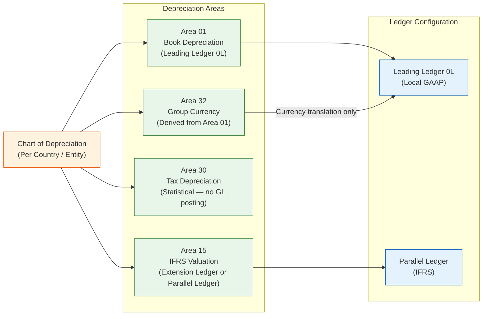
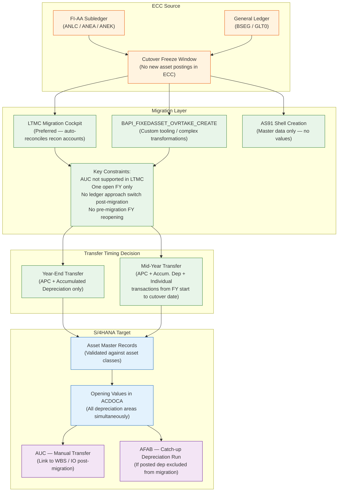
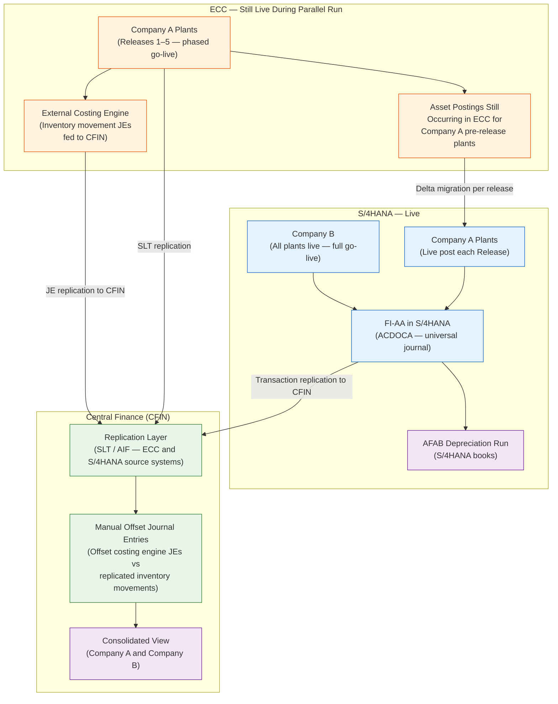
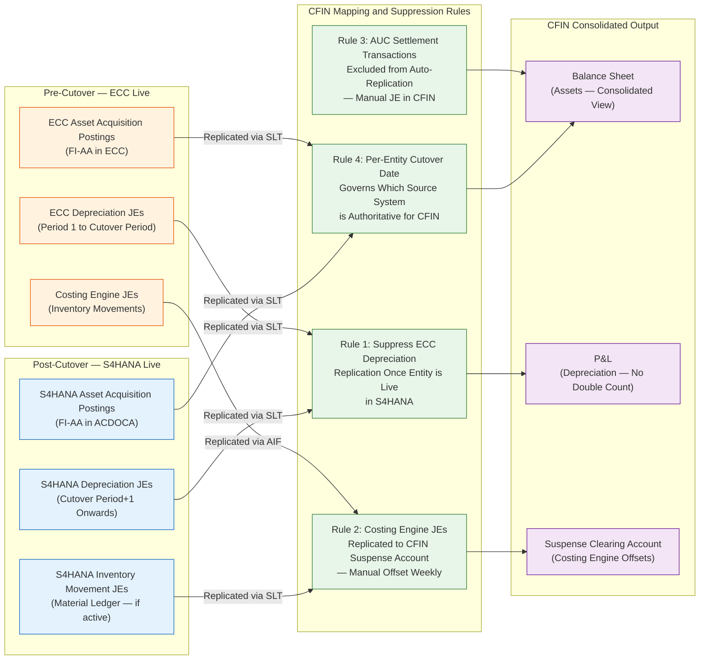
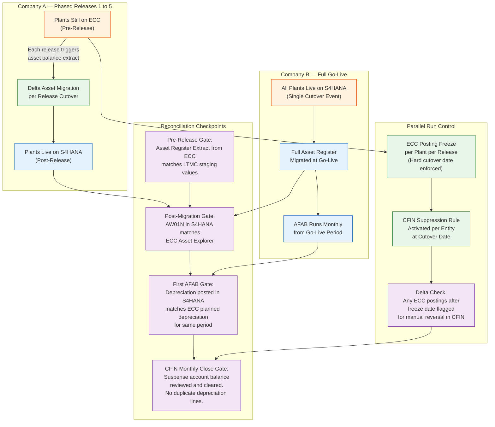

---

## Executive Summary

This paper addresses three interconnected concerns for an S/4HANA program with a phased, multi-entity rollout at a technology company. First, it establishes the high-level architecture of Asset Accounting in S/4HANA and the fundamental structural differences from SAP ECC. Second, it defines the correct migration pathways for fixed assets from ECC to S/4HANA — including an explicit ruling on the use of inventory movement types for asset migration. Third, it addresses capitalization handling during a parallel run where Company A plants go live in phased releases (e.g., 1–5) and Company B goes live with all plants simultaneously, with an external costing engine feeding Central Finance (CFIN) and inventory movement journals being manually offset.

The parallel-run and CFIN replication topology materially complicates what would otherwise be a straightforward asset migration. Each of these complications is addressed with specific architectural guidance, a reconciliation framework, and a risk register. The paper closes with eight concrete recommendations, the most urgent of which is halting any use of Movement Type 561 for fixed asset migration — an approach that is architecturally incorrect and carries significant audit and compliance exposure.

---

## Context

### Program Topology

The program involves two entities with distinct go-live profiles:

- **Company A** — plants go live in phased releases (Releases 1–5). For Releases 1–5, costing continues through an external costing engine, with G/L postings for costs posted directly to CFIN. Source system transactions replicate to CFIN where they are manually offset against costing engine journal entries.
- **Company B** — all plants go live simultaneously in a single cutover event.

During the parallel run, both ECC and S/4HANA are live and books must reconcile. This is not a technical test — it is a live financial reporting obligation. Asset depreciation, APC values, and accumulated depreciation must match across both systems during the overlap period.

### Assumptions Surfaced

Before proceeding, the following implicit assumptions in the program need to be made explicit:

| # | Assumption | Risk if Wrong |
|---|---|---|
| 1 | Assets in ECC are held in FI-AA with asset master records | If assets are tracked only in spreadsheets or PM equipment masters without FI-AA linkage, migration scope changes entirely |
| 2 | The inventory load discussion refers to MT 561 being proposed as a vehicle to bring assets onto the balance sheet | MT 561 hits stock accounts — not asset accounts. This is architecturally incorrect for fixed assets |
| 3 | Company A plants go live in releases 1–5; Company B has intercompany transactions with Company A plants still on ECC | CFIN replication must handle the asymmetry across source systems |
| 4 | The external costing engine produces journal entries for inventory movements fed to CFIN | These JEs will create cost postings that duplicate what S/4HANA's material ledger would also generate — manual offset is the stated mitigation but is fragile at scale |
| 5 | Parallel run means ECC and S/4HANA are both live and books must reconcile | Asset depreciation, APC values, and accumulated depreciation must match to the cent across both systems |
| 6 | Capitalization of assets happens in S/4HANA only — ECC is source of truth pre-cutover | If ECC continues to post asset transactions during parallel run, a delta migration or cutover freeze window is required |

---

## Analysis

### 1. High-Level Asset Accounting Architecture in S/4HANA

#### 1.1 Architectural Shift from ECC

The most consequential architectural change in S/4HANA Asset Accounting is the elimination of the asset subledger as a separate data store. In ECC, FI-AA maintained its own set of tables (ANLC, ANEA, ANEK) that required periodic batch reconciliation to the General Ledger via transactions ASKB and ABST2 — a process prone to timing gaps and reconciliation errors. In S/4HANA, these tables are fully absorbed into the Universal Journal (ACDOCA), making GL and AA permanently in sync with no reconciliation step required.

```mermaid
flowchart TD
    classDef source fill:#fff3e0,stroke:#e65100
    classDef integration fill:#e8f5e9,stroke:#2e7d32
    classDef target fill:#e3f2fd,stroke:#1565c0
    classDef reporting fill:#f3e5f5,stroke:#6a1b9a

    subgraph ECC_ARCH["ECC Architecture (Legacy)"]
        ECC_AA["FI-AA Subledger<br>(ANLC / ANEA / ANEK)"]
        ECC_GL["General Ledger<br>(BSEG / GLT0)"]
        ECC_REC["Periodic Reconciliation<br>(ASKB / ABST2 — required)"]
        ECC_AA -->|"Batch reconciliation<br>at period close"| ECC_GL
        ECC_REC -.->|"Reconciliation errors<br>common in practice"| ECC_GL
    end

    subgraph S4_ARCH["S/4HANA Architecture (Target)"]
        S4_MD["Asset Master Record<br>(Simplified — no redundancy with GL config)"]
        S4_DA["Depreciation Areas<br>(Valuation Views linked to Accounting Principles)"]
        S4_ACQ["Asset Acquisition<br>(Integrated AP / Direct FI / MIGO Cat A)"]
        S4_TC["Technical Clearing Account<br>(Mandatory — offsets vendor line per ledger)"]
        S4_UJ["Universal Journal<br>(ACDOCA — single source of truth)"]
        S4_HANA["SAP HANA Aggregation<br>(Totals computed on-the-fly — no ANLC)"]
        S4_DEP["Depreciation Run<br>(AFAB — still periodic batch)"]
        S4_CO["CO Integration<br>(Cost Center / IO / WBS — real-time)"]
        S4_FIORI["Fiori Reporting<br>(F3096 Asset Overview / AW01N Explorer)"]

        S4_MD --> S4_DA
        S4_DA --> S4_ACQ
        S4_ACQ --> S4_TC
        S4_TC --> S4_UJ
        S4_UJ --> S4_HANA
        S4_HANA --> S4_DEP
        S4_DEP --> S4_CO
        S4_UJ --> S4_FIORI
    end

    class ECC_AA,ECC_GL,ECC_REC source
    class S4_MD,S4_DA,S4_ACQ source
    class S4_TC,S4_UJ integration
    class S4_HANA,S4_DEP target
    class S4_CO,S4_FIORI reporting
```

#### 1.2 Key Structural Differences

| Dimension | SAP ECC | SAP S/4HANA |
|---|---|---|
| **Data store** | Separate AA subledger (ANLC, ANEA, ANEK) | Fully integrated into ACDOCA Universal Journal |
| **Reconciliation** | Periodic batch required (ASKB, ABST2) | Not required — GL and AA always in sync |
| **Parallel currencies** | Max 3 parallel currencies | Up to 10 parallel currencies per ledger |
| **Depreciation area → ledger** | Loose coupling via account/ledger approach | Valuation view directly bound to accounting principle and ledger |
| **Totals storage** | ANLC persists period totals | Aggregated on-the-fly via HANA — no totals table |
| **AUC settlement** | Available via standard AA | Available but not supported in LTMC migration object — manual handling required |

#### 1.3 Parallel Accounting Model

For a multi-entity program with IFRS and local GAAP requirements, the depreciation area to ledger mapping is the critical design decision. The chart of depreciation governs which areas post to which ledgers and in which currencies.

---

### 2. Asset Acquisition Pathways — The Inventory Load Question

#### 2.1 The Critical Design Issue

On the discussion about bringing assets through inventory loads using Movement Type 561, I need to address this directly.

**MT 561 is categorically wrong for fixed asset capitalization.** MT 561 is an opening balance upload for valuated stock. It debits a stock/inventory account (Balance Sheet — current asset) and credits a stock initial upload offset account. It does not interact with FI-AA, does not create an asset master record, does not post to depreciation areas, and does not generate entries in ACDOCA's asset accounting fields (ANLN1, AFABE, BZDAT). The confusion likely arises because both paths result in a Balance Sheet debit — but they hit entirely different account classes with entirely different downstream consequences for depreciation, reporting, and compliance.

#### 2.2 Asset Acquisition Pathways — Decision Architecture

The following diagram classifies all legitimate paths for bringing an asset or stock item into S/4HANA, including the correct role of MT 561, the NLAG material path, and the AUC settlement path.

```mermaid
flowchart TD
    classDef source fill:#fff3e0,stroke:#e65100
    classDef integration fill:#e8f5e9,stroke:#2e7d32
    classDef target fill:#e3f2fd,stroke:#1565c0
    classDef reporting fill:#f3e5f5,stroke:#6a1b9a

    START["Item to be brought<br>into S/4HANA"]

    Q1{"Is this a Fixed Asset<br>requiring depreciation<br>and FI-AA tracking?"}
    Q2{"Is this a consumable /<br>expense item with<br>no balance sheet intent?"}
    Q3{"Is this valuated stock<br>for ongoing inventory<br>management?"}

    subgraph PATH_A["PATH A — Fixed Asset via FI-AA (CORRECT for Assets)"]
        A1["Create Asset Master<br>(AS01 — assign class,<br>depreciation key, useful life)"]
        A2["Account-Assigned PO<br>(Account Assignment Cat. A)"]
        A3["MIGO GR<br>(Movement Type 101)<br>Dr Asset / Cr Tech. Clearing"]
        A4["MIRO Invoice Receipt<br>Dr Tech. Clearing / Cr Vendor"]
        A5["Asset Live in FI-AA<br>ACDOCA — all depreciation<br>areas posted simultaneously"]
        A1 --> A2 --> A3 --> A4 --> A5
    end

    subgraph PATH_B["PATH B — Direct FI Capitalization (Migration / Legacy)"]
        B1["Create Asset Master<br>(AS01 or via LTMC)"]
        B2["Direct Acquisition Posting<br>(ABZON / F-90 / AB01)<br>Transaction Type 100"]
        B3["Offsetting Entry to<br>Contra Account / Vendor"]
        B4["Asset Live in FI-AA"]
        B1 --> B2 --> B3 --> B4
    end

    subgraph PATH_C["PATH C — NLAG / Consumable (Expense to P&L — NOT an Asset)"]
        C1["Account-Assigned PO<br>(Cost Center or GL Account)"]
        C2["MIGO GR<br>(MT 101 — Non-Valuated Stock)<br>or MT 561 for cutover upload"]
        C3["Expense hits P&L<br>at GR or IR<br>(depending on valuated GR flag)"]
        C4["No Asset Master Created<br>No FI-AA Entry"]
        C1 --> C2 --> C3 --> C4
    end

    subgraph PATH_D["PATH D — Valuated Stock Upload (Cutover ONLY — NOT Assets)"]
        D1["Material Master exists<br>(Valuated material type<br>e.g. ROH, HALB, FERT)"]
        D2["MIGO MT 561<br>Opening Balance Upload<br>Dr Stock Account / Cr Offset"]
        D3["Stock on Balance Sheet<br>as Current Asset — Inventory"]
        D4["No Depreciation<br>No Asset Master<br>No FI-AA"]
        D1 --> D2 --> D3 --> D4
    end

    subgraph PATH_E["PATH E — Post-Capitalization (Retroactive — items previously expensed)"]
        E1["Asset Should Have Been<br>Capitalized in Prior Period"]
        E2["Create Asset Master<br>with Original Capitalization Date"]
        E3["Post-Cap Transaction<br>(ABNAN)<br>Offsetting: Revenue from<br>Post-Cap Account (Key 06)"]
        E4["Catch-Up Depreciation<br>Calculated from Original Date"]
        E1 --> E2 --> E3 --> E4
    end

    START --> Q1
    Q1 -->|Yes| PATH_A
    Q1 -->|"Yes — Migration<br>or Direct FI"| PATH_B
    Q1 -->|"Yes — Previously<br>Expensed in Error"| PATH_E
    Q1 -->|No| Q2
    Q2 -->|Yes| PATH_C
    Q2 -->|No| Q3
    Q3 -->|Yes| PATH_D

    class START,Q1,Q2,Q3 source
    class PATH_A,PATH_B,PATH_E integration
    class A5,B4,E4 target
    class PATH_C,PATH_D,C4,D4 reporting
```

#### 2.3 The Account-Assigned PO Scenario — P&L Expense vs. Balance Sheet

A specific scenario raised is a PO that books the expense to P&L while storing the asset on the balance sheet. This is an internal contradiction in standard SAP unless it refers to one of three legitimate scenarios.

**Scenario 1 — NLAG material with cost center assignment (expense only, no asset):**
The intent is purely expense. No asset is created. MT 561 at cutover loads opening consumable stock, not fixed assets. This is Path C/D above.

**Scenario 2 — Asset-assigned PO with technical clearing (asset on BS, vendor liability cleared):**
- GR posts: Dr Fixed Asset Account (BS) / Cr Technical Clearing Account
- IR posts: Dr Technical Clearing Account / Cr Vendor Payable
- Technical clearing account nets to zero — this is the S/4HANA-specific mandatory configuration requirement
- The P&L impact is depreciation over time via AFAB — not the acquisition posting

**Scenario 3 — AUC with subsequent settlement:**
Costs accumulate on an AUC (WBS element or internal order). During the construction phase, costs flow through CO cost objects and appear as P&L costs. At completion, CJ88/AI01N settles AUC to the final asset — capitalizing those P&L costs to the balance sheet. This is the mechanism that bridges "expense posted to P&L" to "asset on balance sheet." If the business is describing this scenario, the NLAG/MT 561 discussion is irrelevant.

---

### 3. Migration Architecture — ECC to S/4HANA

#### 3.1 Migration Pathways

#### 3.2 Supported vs. Deprecated Migration Methods

| Method | Status | Notes |
|---|---|---|
| **LTMC Migration Cockpit** | ✅ Supported — Preferred | Auto-reconciles asset recon accounts in GL — no separate GL transfer needed |
| **BAPI_FIXEDASSET_OVRTAKE_CREATE** | ✅ Supported | Valid for custom tooling; handles complex transformation logic |
| **AS91 / AT91 shell creation** | ✅ Supported — Master data only | Values must follow via BAPI or LTMC |
| **RAALTD01 / RAALTD11** | ❌ Deprecated | Removed in S/4HANA |
| **Batch input on AS91 / AS92 / AT91 / AT92** | ❌ Deprecated | No longer available |
| **ALE asset transfer** | ❌ Deprecated | Not supported in S/4HANA migration context |
| **RAARCH03 reload** | ❌ Deprecated | Removed |
| **MT 561 for asset migration** | ❌ Architecturally Incorrect | Hits stock accounts — no FI-AA interaction whatsoever |

#### 3.3 Year-End vs. Mid-Year Transfer — Decision Criteria

| Dimension | Year-End Transfer | Mid-Year Transfer |
|---|---|---|
| **What migrates** | APC + accumulated depreciation as of fiscal year end | APC + accumulated depreciation + individual transactions from FY start to cutover date |
| **Depreciation in migration year** | Not applicable — clean year-end position | Optional — if excluded, run AFAB post-migration to calculate catch-up |
| **Complexity** | Lower — single balance per area | Higher — transaction-level history required |
| **Parallel run risk** | Lower — clean opening position in S/4HANA | Higher — ECC and S/4HANA must reconcile individual period movements |
| **Recommended when** | Go-live aligns with fiscal year boundary | Go-live is mid-fiscal year and transaction history is required for reporting |
| **CFIN implication** | CFIN receives clean opening balance via replication | CFIN must handle delta transactions from ECC during overlap — replication gaps are a real risk |

---

### 4. Capitalization in S/4HANA — Parallel Run with Company A and Company B

#### 4.1 Program Topology

#### 4.2 Capitalization Steps — Both Timing Scenarios

```mermaid
flowchart TD
    classDef source fill:#fff3e0,stroke:#e65100
    classDef integration fill:#e8f5e9,stroke:#2e7d32
    classDef target fill:#e3f2fd,stroke:#1565c0
    classDef reporting fill:#f3e5f5,stroke:#6a1b9a

    subgraph COMMON["Common Steps — Both Scenarios"]
        STEP1["Step 1: Asset Master Validation<br>(Verify class, depreciation key,<br>useful life, cost center assignment)"]
        STEP2["Step 2: Opening Values Loaded<br>(LTMC / BAPI — APC and Accum. Dep<br>per depreciation area in ACDOCA)"]
        STEP3["Step 3: Reconcile to ECC<br>(AW01N values must match ECC<br>Asset Explorer to the cent)"]
        STEP4["Step 4: Technical Clearing Account<br>Balance = Zero<br>(Mandatory pre-AFAB check)"]
        STEP1 --> STEP2 --> STEP3 --> STEP4
    end

    subgraph YE_PATH["Year-End Go-Live Path"]
        YE1["No catch-up depreciation needed<br>(Migration at fiscal year boundary)"]
        YE2["First AFAB run in S/4HANA<br>calculates Period 1 depreciation<br>from clean opening position"]
        YE3["CO cost objects receive<br>depreciation per assignment<br>(Cost Center / IO)"]
        YE4["CFIN receives depreciation<br>postings via replication —<br>no manual offset needed<br>(depreciation not from costing engine)"]
        YE1 --> YE2 --> YE3 --> YE4
    end

    subgraph MY_PATH["Mid-Year Go-Live Path"]
        MY1["Individual transactions migrated<br>from FY start to cutover date"]
        MY2["Depreciation already posted<br>in ECC for prior periods —<br>exclude from migration<br>to avoid double-counting"]
        MY3["AFAB run from cutover period<br>forward only — set start period<br>in depreciation run parameters"]
        MY4["Reconcile YTD depreciation:<br>ECC posted periods plus<br>S/4HANA posted periods equals<br>full FY planned depreciation"]
        MY5["CFIN: ECC depreciation JEs<br>replicated for pre-cutover periods.<br>S/4HANA depreciation JEs<br>replicated for post-cutover periods<br>— must not overlap"]
        MY1 --> MY2 --> MY3 --> MY4 --> MY5
    end

    subgraph AUC_PATH["AUC Settlement Path"]
        AUC1["AUC not in LTMC —<br>create manually in S/4HANA"]
        AUC2["Link AUC to WBS element<br>or Internal Order"]
        AUC3["Costs settle from WBS/IO<br>to AUC via periodic settlement<br>(CJ88 / KO88)"]
        AUC4["On completion: settle AUC<br>to final asset master<br>(AI01N / AIAB + AIBU)"]
        AUC5["Capitalization date and<br>depreciation start date<br>set on final asset"]
        AUC1 --> AUC2 --> AUC3 --> AUC4 --> AUC5
    end

    STEP4 --> YE_PATH
    STEP4 --> MY_PATH
    STEP4 --> AUC_PATH

    class STEP1,STEP2 source
    class STEP3,STEP4 integration
    class YE2,YE3,MY3,MY4,AUC4,AUC5 target
    class YE4,MY5,AUC3 reporting
```

#### 4.3 Capitalization Step Reference

| Step | What Happens | S/4HANA Specifics |
|---|---|---|
| **1. Asset Master (AS01)** | Shell record created — no value until acquisition posted | Asset class controls account determination and default depreciation key |
| **2. Acquisition** | Integrated AP (PO→GR→IR), direct FI vendor invoice (transaction type 100), or in-house production order | Technical clearing account mandatory in S/4HANA — configure per chart of accounts |
| **3. Universal Journal** | Single entry in ACDOCA covers all depreciation areas and ledgers simultaneously | No separate reconciliation with GL needed |
| **4. Depreciation Run (AFAB)** | Calculates and posts planned depreciation per area | Batch still required to move depreciation values to FI/CO |
| **5. AUC Settlement** | If asset was built internally (WBS / Internal Order), settle to final asset number | AUC not supported in LTMC — manual transfer and linking required post-migration |
| **6. Verification** | AW01N (Asset Explorer) shows values per depreciation area; Fiori F3096 for portfolio KPIs | Values aggregated on-the-fly via HANA — no ANLC totals table to reconcile |
| **7. CO Assignment** | Depreciation posts to cost center or internal order per master record assignment | When both IO and cost center exist on master, depreciation always posts to IO, not cost center |

---

### 5. CFIN Parallel Run — Specific Risks for Asset Accounting

#### 5.1 Risk Register

| Risk | Likelihood | Impact | Mitigation |
|---|---|---|---|
| **Double depreciation in CFIN** — ECC posts depreciation AND S/4HANA posts depreciation for the same asset in the same period | High | Critical | Enforce hard cutover date per plant/entity; CFIN mapping rules must suppress ECC-side depreciation replication once S/4HANA is live for that entity |
| **Manual offset JEs becoming unreconciled** — costing engine JEs vs. replicated MM movements accumulate and diverge | High | High | Implement a clearing/suspense account per entity in CFIN; reconcile weekly not monthly |
| **AUC costs replicated to CFIN before settlement** — WBS costs appear as P&L in CFIN but as BS in S/4HANA | Medium | High | Exclude AUC settlement transactions from auto-replication; handle via dedicated mapping rule or manual JE in CFIN |
| **Company A delta migrations introducing asset value inconsistencies** — each release creates a new cutover point with its own asset balance extraction | High | High | Treat each release as an independent asset migration event; reconcile asset register per release before go-live sign-off |
| **Parallel ledger depreciation area mismatch** — IFRS and local GAAP depreciation diverging between ECC and S/4HANA due to different depreciation key configurations | Medium | Critical | Validate chart of depreciation configuration in S/4HANA mirrors ECC before first AFAB run |
| **Technical clearing account not zeroing** — caused by GR/IR timing mismatches during cutover window | Medium | Medium | Run clearing account analysis (FBL3N on tech clearing account) as a pre-go-live gate check |

#### 5.2 CFIN Replication Boundary for Asset Transactions

#### 5.3 Parallel Run Reconciliation Framework

The parallel run creates two distinct reconciliation obligations that must be managed simultaneously.

**Obligation 1 — ECC to S/4HANA asset value parity:**
For any plant that has gone live in S/4HANA (Company B all plants; Company A post each release), the asset register values in S/4HANA must match what ECC carried at the cutover date. Depreciation posted in S/4HANA from cutover forward must match what ECC would have posted had it remained live.

**Obligation 2 — CFIN consolidated view integrity:**
CFIN must show a clean consolidated position with no double-counting of depreciation across ECC-replicated and S/4HANA-replicated transactions, and no unresolved costing engine offsets aging beyond the agreed clearing cycle.

---

## Recommendations

### 1. Stop the MT 561 Approach for Assets Immediately

MT 561 must not be used for fixed asset migration or capitalization under any scenario. It creates current asset inventory postings with no FI-AA master record, no depreciation area values, and no ACDOCA asset fields populated. The downstream consequences — no depreciation, no asset register, incorrect balance sheet classification, audit findings — are severe. The correct paths are LTMC or BAPI for migrated assets, and account assignment category A on a PO for newly procured assets.

### 2. Prefer Year-End Transfer for Company B

For Company B (full go-live), a year-end transfer eliminates the mid-year depreciation overlap problem entirely and gives CFIN a clean opening position. If the project / program schedule forces a mid-year go-live, the depreciation exclusion and AFAB catch-up run must be planned and tested explicitly before go-live sign-off.

### 3. Treat Each Company A Release as an Independent Migration Event

Each release creates a new cutover point with its own asset balance extraction. The asset register extract, LTMC staging reconciliation, and first AFAB validation must all pass as independent gate checks before each release is signed off. A failure in Release 2 asset reconciliation will cascade into Release 3 if not resolved at source.

### 4. Handle AUC Manually — Do Not Rely on LTMC

AUC assets are not supported in LTMC. For each release, produce a complete AUC inventory from ECC, create asset shells manually in S/4HANA, link them to WBS elements or internal orders, and validate settlement rules are correctly configured before the first CJ88 run post-go-live. AUC costs replicated to CFIN before settlement will appear as P&L in CFIN but as balance sheet in S/4HANA — exclude AUC settlement transactions from auto-replication and handle via manual JE in CFIN.

### 5. Enforce Hard Cutover Dates at the System Level

The ECC posting freeze per plant per release must be enforced at the system level — close the posting period in ECC for that company code at the cutover date. Procedural controls alone will fail at the scale of a five-release program. Any ECC postings after the freeze date must be flagged automatically for manual reversal in CFIN.

### 6. Implement Weekly CFIN Suspense Account Clearing

The manual offset model for costing engine journal entries is architecturally fragile at the scale of a multi-release, multi-entity program. Monthly clearing creates too large a reconciliation backlog at period close when depreciation runs are also being validated. A clearing/suspense account per entity in CFIN with weekly clearing is the minimum viable control.

### 7. Validate Chart of Depreciation Configuration Before First AFAB

Before the first AFAB run in S/4HANA for any entity, validate that the chart of depreciation configuration — depreciation keys, useful life defaults, period control methods, and parallel ledger assignments — exactly mirrors ECC. A one-period discrepancy in depreciation amounts between the two systems during parallel run will cascade through every subsequent period and into CFIN. This is a pre-go-live gate check, not a post-go-live remediation task.

### 8. Run Technical Clearing Account Analysis as a Pre-Go-Live Gate

Run FBL3N on the technical clearing account before each go-live event. A non-zero balance indicates unmatched GR/IR or acquisition postings that will cause asset values to be misstated in ACDOCA. This check costs thirty minutes and avoids weeks of post-go-live forensic reconciliation.

---