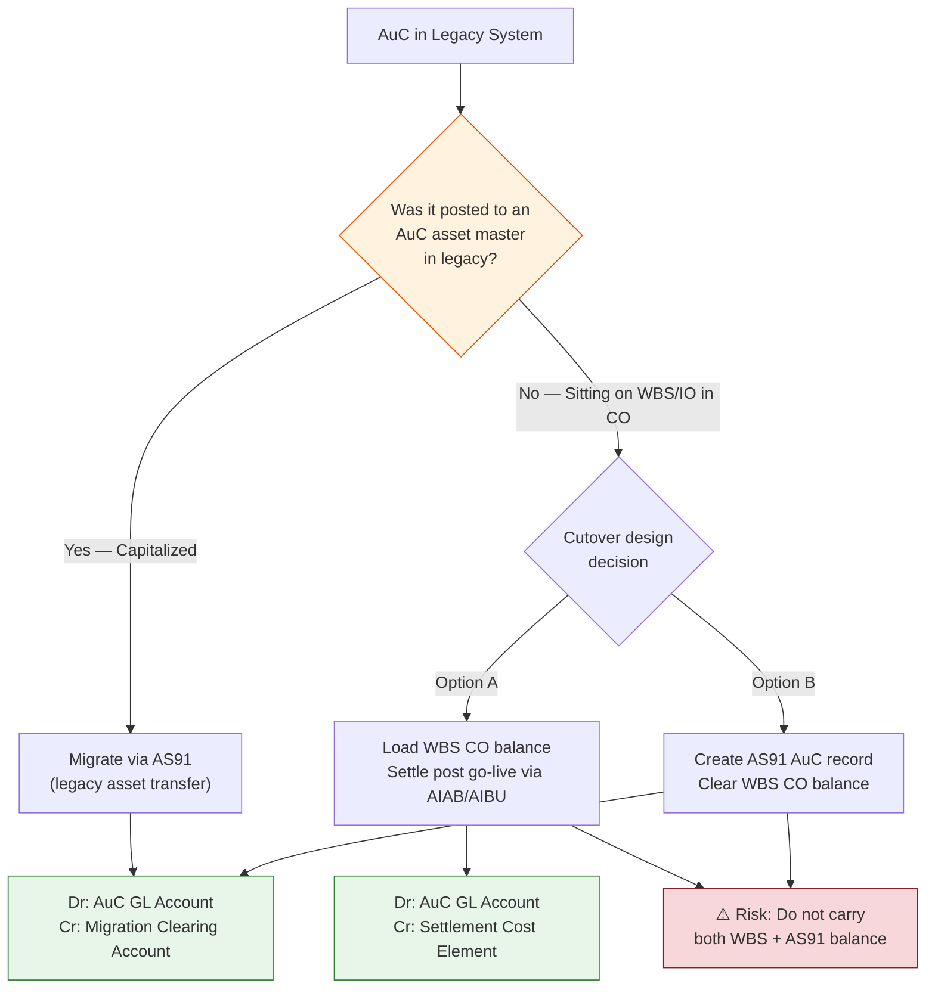

## Executive Summary

Assets Under Construction (AuC) presents one of the more nuanced challenges at SAP S/4HANA cutover. Unlike fully capitalized fixed assets — where the migration path is well-understood — AuC balances can exist in two fundamentally different states in the legacy system: already capitalized onto an AuC asset master, or still sitting as open costs on a WBS element within CO. Each state demands a different accounting entry, a different migration vehicle, and a different set of controls to prevent double-counting. This paper defines both scenarios, establishes the correct debit/credit structure for each, and provides a decision framework for cutover design teams.

---

## Context

### What AuC Is and Where WBS Fits

Assets Under Construction represent capital expenditure that has been incurred but not yet completed — the asset is not yet ready for its intended use and therefore not yet subject to depreciation. In SAP, AuC costs are accumulated on a **cost collector** before being settled to a fixed asset. That cost collector is typically one of three objects: an internal order, a production order, or a **WBS element**.

A WBS element does not exist independently. It is always a subordinate node within a **Project Definition**, which acts as the project header carrying critical attributes — budget profile, planning profile, result analysis key, investment profile, controlling area, company code, business area, profit center, and plant. The hierarchy follows a strictly top-down structure:

```
Project Definition (header)
  └── WBS Element (level 1)
        └── WBS Element (level 2)
              └── ... (further decomposition)
```

When a capital investment project is underway, costs flow to the WBS element. Periodic settlement (executed via transactions AIAB and AIBU) moves those costs from the WBS element to an AuC asset master record, posting to the AuC balance sheet GL account. Eventual completion and capitalization then moves the balance from AuC to the final asset.

### Why Cutover Is Complicated

At the point of cutover, a given AuC project can be in one of two states:

1. **Capitalized in legacy** — the costs have already been settled from the WBS element to an AuC asset master in the old system. The balance sits on the AuC balance sheet account.
2. **Non-capitalized in legacy** — the costs are still sitting on the WBS element in CO. No AuC asset master exists in the old system.

These two states require materially different handling. Treating them the same is the most common cutover error for in-flight capital projects.

---

## Analysis

### The Two Scenarios Compared

| Dimension | Capitalized AuC | Non-Capitalized AuC |
|---|---|---|
| Where the balance lives in legacy | AuC asset master (balance sheet) | WBS element / CO open costs |
| Migration vehicle | AS91 (legacy asset transfer) | WBS balance migration OR AS91 after CO clearance |
| Depreciation leg in migration entry | None — AuC is not depreciated | None |
| Post go-live settlement required | No | Yes (Option A) or No (Option B) |
| Double-count risk | Low | High if both WBS and AS91 carry the value |

---

### Scenario 1: AuC Already Capitalized in Legacy

The AuC exists as an asset master record in the legacy system. Costs have been settled from the WBS element; the balance sits on the AuC GL account. Migration is executed via **AS91**, SAP's legacy data transfer transaction for asset masters.

**Accounting entry at cutover:**

```
Dr  AuC Balance Sheet Account       (e.g., 19310000 — Assets Under Construction)
    Cr  Migration Offset / Data Transfer Clearing Account
```

Because AuC assets are not subject to depreciation, there is no accumulated depreciation leg. The entire credit goes to the migration clearing account, which is reconciled and zeroed as part of the overall balance sheet migration close.

The AS91 record captures the cumulative acquisition value. No further settlement activity is required post go-live for this balance — it sits cleanly as an asset master in S/4HANA awaiting final capitalization when the project completes.

---

### Scenario 2: Costs Still Sitting on WBS — Never Capitalized in Legacy

This is the more operationally complex case. The project is in flight; costs have accumulated on the WBS element in CO but have never been settled to an AuC asset master. Two design options exist.

#### Option A: Migrate WBS CO Balance, Settle to AuC Post Go-Live

The open CO balance on the WBS element is migrated as a CO open item. No AuC asset master is created for this balance at cutover. After go-live, the standard settlement run (AIAB for rule definition, AIBU for execution) posts the settlement from WBS to the AuC asset.

**Accounting entry generated by post-go-live settlement:**

```
Dr  AuC Balance Sheet Account
    Cr  Cost Element for Settlement — AuC to CO Objects
```

The credit-side cost element is configured in account determination specifically for AuC settlement from CO objects. This is standard account determination configuration, not a manual journal.

This option preserves the CO audit trail — the WBS balance history migrates intact and the settlement generates a clean, system-driven posting.

#### Option B: Create AuC Asset Master via AS91, Clear WBS CO Balance

The project team decides to capitalize the WBS balance at cutover. An AuC asset master is created via AS91, and the cumulative WBS cost is loaded as the acquisition value.

**Accounting entry at cutover:**

```
Dr  AuC Balance Sheet Account
    Cr  Migration Offset / Data Transfer Clearing Account
```

The WBS CO balance is simultaneously cleared to zero as part of the migration — typically via a CO migration entry that offsets against the same clearing account — ensuring the cost does not remain live in CO alongside the newly created asset master.

This option produces a cleaner asset register at go-live but sacrifices the granular CO cost history on the WBS element.

---

### The Double-Count Risk

The single most consequential error in this space is migrating **both** the WBS CO open balance **and** creating an AS91 AuC record for the same set of costs. The result is the same capital expenditure appearing twice on the balance sheet: once as a CO balance that will eventually settle to an asset, and once as an already-created asset master. Controls must be designed to enforce mutual exclusivity: exactly one vehicle carries the value, not both.

---

### Decision Framework



---

### A Note on Parallel Ledgers

Where an implementation runs Universal Parallel Accounting — maintaining separate ledgers for local GAAP and IFRS — settlement rules and capitalized amounts can differ per ledger. Any cutover entry design for AuC must account for ledger-specific values: the AS91 acquisition value loaded, and the settlement cost element posting, may need to carry different amounts across ledgers. This is not an edge case in a Fortune 50 environment — it is standard operating reality.

---

## Recommendation

Cutover teams should classify every in-flight capital project into one of the two scenarios before migration weekend. The classification exercise is simple: does an AuC asset master exist in my legacy system for this project, or do the costs sit exclusively in CO on a WBS element? That single question determines the migration vehicle, the accounting entry, and my post-go-live settlement obligations.

The recommended default for **non-capitalized WBS balances** is **Option A** — migrate the CO balance and let the standard settlement run create the AuC posting post go-live. This preserves the cost history, uses system-standard account determination, and produces a clean audit trail. Option B is appropriate only where business or audit requirements demand that the asset register be fully populated at go-live, and where my team has the controls discipline to ensure the WBS CO balance is fully cleared at the same moment the AS91 record is created.

Regardless of option chosen, my cutover reconciliation checklist must include a line-by-line cross-check: every WBS element carrying an open CO balance must either have a corresponding cleared migration entry (Option B) or remain without an AS91 counterpart (Option A). Any WBS element that appears on both lists is a double-count and must be resolved before the migration is signed off.

AuC is not a complex asset class operationally — but it sits at the intersection of Asset Accounting, Project System, and Controlling in a way that makes cutover design genuinely error-prone. Getting the classification right upfront is the entire game.

---