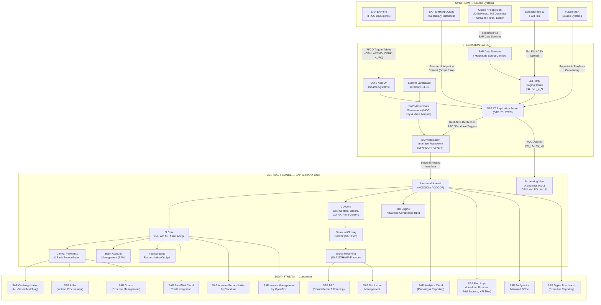
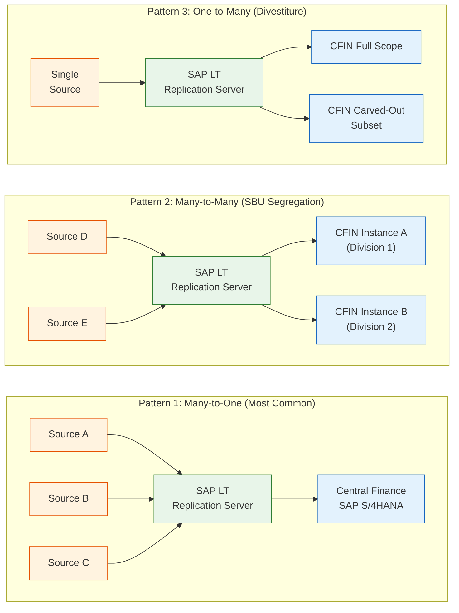
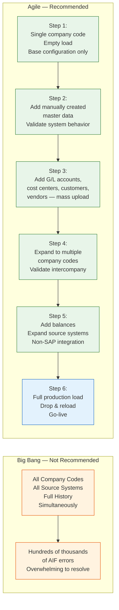
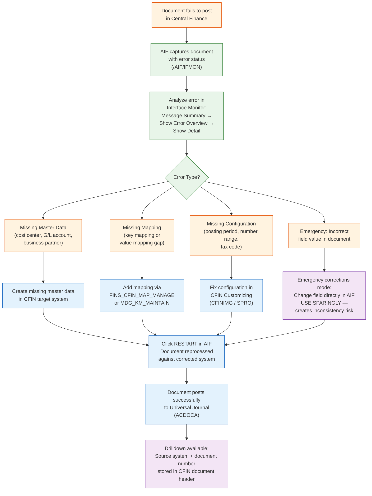
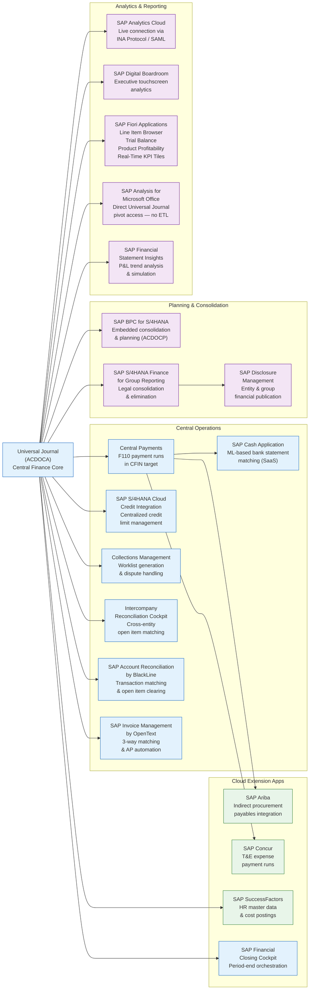
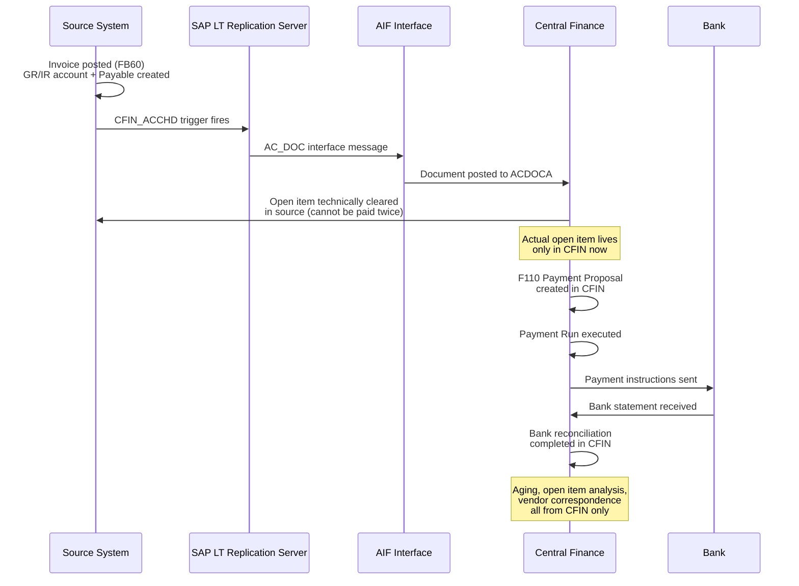
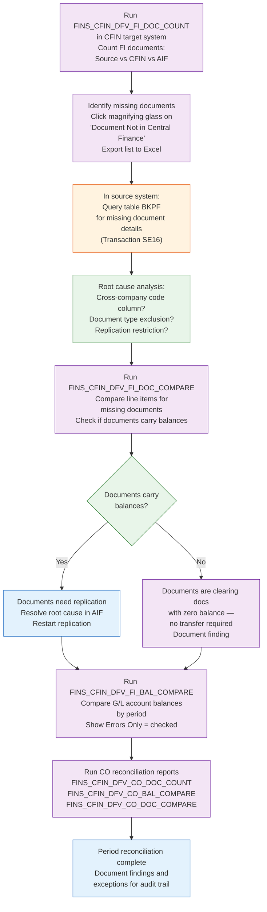
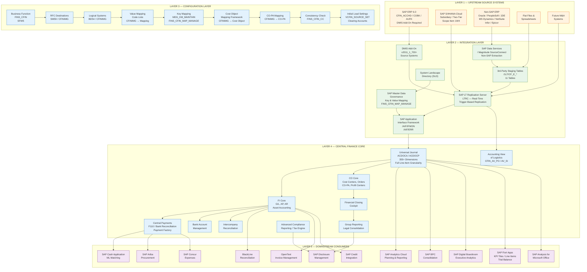

# SAP Central Finance: Architecture, Integration & Configuration
By I · July 2025

## Executive Summary

Central Finance (CFIN) is SAP's standard solution for creating a harmonized, real-time financial hub across heterogeneous ERP landscapes. This white paper maps every upstream source, every downstream consumer, and the full configuration chain required to bring the system to production. It covers the complete integration architecture, SAP LT Replication Server setup, AIF monitoring and error handling, Central Payments configuration, Accounting View of Logistics, reconciliation reporting, real-time replication verification, and a consolidated 97-item go-live checklist — grounded entirely in the SAP PRESS reference material and the Central Finance 2020 Configuration & User Guide.

Central Finance is not a reporting layer bolted onto existing ERP systems. It is SAP S/4HANA — deployed first for finance, with logistics onboarding available to the same instance without a subsequent upgrade. Every financial posting from every connected source system — SAP or non-SAP — lands in the Universal Journal (ACDOCA) at full line-item granularity, creating a single source of truth for reporting, planning, consolidation, payments, and compliance across the enterprise.

---

## Context

Large enterprises operating across multiple ERP instances — the result of organic growth, acquisitions, regional system diversity, or deliberate two-tier ERP strategies — face a structural problem: financial data is fragmented across systems with different charts of accounts, master data models, fiscal year variants, and currency configurations. Consolidation is slow, reconciliation is manual, and executive reporting requires spreadsheet assembly across multiple extracts.

Central Finance addresses this directly. Rather than replacing source systems — which is disruptive, expensive, and politically difficult — it replicates financial postings in real time into a single SAP S/4HANA instance, harmonizing master data and coding blocks through a mapping layer, and making the consolidated financial position available immediately to downstream consumers. Source systems continue operating unchanged. The Central Finance instance becomes the system of record for reporting, and progressively for operations — payments, collections, closing, and consolidation.

The solution comprises two layers:

| Layer | Purpose |
|---|---|
| **Enabling Layer** | SAP LT Replication Server, SAP MDG, SAP Application Interface Framework, ALE/IDocs |
| **Execution Layer** | SAP S/4HANA Finance processes — FI, CO, Treasury, Consolidation, Payments |

The technical backbone is the **Universal Journal (ACDOCA)** — a single table storing all financial postings from every connected source at full line-item granularity, with 355+ dimensions available for reporting.

---

## Analysis

### Section 1 — Architectural Foundation

Central Finance sits at the core of SAP S/4HANA and operates as both a **receiving system** (from upstream ERP sources) and a **serving system** (to downstream consumers). The solution comprises two layers:

| Layer | Purpose |
|---|---|
| **Enabling Layer** | SAP LT Replication Server, SAP MDG, SAP Application Interface Framework, ALE/IDocs |
| **Execution Layer** | SAP S/4HANA Finance processes — FI, CO, Treasury, Consolidation, Payments |

The technical backbone is the **Universal Journal (ACDOCA)** — a single table storing all financial postings from every connected source at full line-item granularity, with 355+ dimensions available for reporting.

---

### Section 2 — Complete Component Map



---

### Section 3 — Upstream Sources

#### 3.1 SAP ERP Source Systems

SAP ERP 6.0 is the primary upstream feeder. The DMIS add-on (version `2011_1_700` or higher) must be installed in every SAP source system. The following staging tables in the source system drive replication:

| Table | Content |
|---|---|
| `CFIN_ACCHD` | FI document header — triggers AC_DOC interface |
| `COBK` | CO document headers — triggers CO_DOC interface |
| `AUFK` | Order master (cost objects) — triggers CO_OBJ interface |
| `CFIN_CMT_H` | Commitment postings |

Source system activation is controlled via maintenance view `VCFIN_SOURCE_SET`. For each company code, the administrator defines:

- **Start – Balances**: fiscal year from which balances transfer
- **Start – Documents**: fiscal year / period for full document transfer
- **Initial Load Finished**: checkbox that switches the system to live replication
- **GL Reconciliation**: whether CO-triggered GL reconciliation postings replicate

#### 3.2 SAP S/4HANA Cloud (Subsidiary / Two-Tier)

SAP S/4HANA Cloud instances integrate via SAP Activate scope item **1W4 (Subsidiary Integration of SAP S/4HANA Cloud to Central Finance)**, using standard integration content available at `https://rapid.sap.com/bp/#/browse/scopeitems/1W4`. This enables a two-tier strategy where subsidiaries run lean cloud ERP while the parent operates Central Finance on-premise or in a private cloud.

#### 3.3 Non-SAP Source Systems

Non-SAP integration is handled via SAP LT Replication Server's third-party staging area. The staging tables below must be generated by executing custom program `ZCFIN_EX_CREATE_SLT_TAB` (source code from SAP Note 2713300):

| Staging Table | Content |
|---|---|
| `/1LT/CF_E_HEADER` | Document header |
| `/1LT/CF_E_ACCT` | Accounting line items |
| `/1LT/CF_E_DEBIT` | Debtor items |
| `/1LT/CF_E_CREDIT` | Creditor items |
| `/1LT/CF_E_PRDTAX` | Product tax items |
| `/1LT/CF_E_WHTAX` | Withholding tax items |
| `/1LT/CF_E_COPA` | CO-PA criteria |
| `/1LT/CF_E_CLRITM` | Clearing items (supported from SAP S/4HANA 1909) |
| `/1LT/CF_E_EXTENT` | Customer extensions (header level) |
| `/1LT/CF_E_EXT_IT` | Customer extensions (item level) |

The driving source tables by non-SAP ERP platform:

| Non-SAP ERP | Source Table |
|---|---|
| Oracle E-Business Suite | `GL_JE_HEADERS` |
| PeopleSoft | `PS_JRNL_HEADER` |
| JD Edwards EnterpriseOne | `F0911` |
| Microsoft Dynamics AX | `GENERALJOURNALENTRY` |
| Microsoft Dynamics GP | `GL20000` |
| NetSuite | `NS_TRANSACTIONS` |
| Infor Baan | `TTFGLD106<CompanyCode>` |
| Epicor iScala | `GL06<CompanyCode><FiscalYear>` |

---

### Section 4 — Configuration Layer

#### 4.1 Business Function Activation

**Transaction:** `SFW5`
**SPRO Path:** `Switch Framework → Activate Business Functions`

Activate business function **`FINS_CFIN`**. A yellow light bulb confirms activation. This deploys all Central Finance-specific Customizing nodes under `Transaction CFINIMG`.

#### 4.2 System Setup — RFC & Logical Systems

| Step | Transaction/SPRO | Purpose |
|---|---|---|
| Define Logical Systems | `CFINIMG → Set Up Systems → Define Logical System` | Creates aliases for source and target systems in accounting documents |
| Assign RFC Destinations | `CFINIMG → General Settings → Maintain Source Systems and RFC Assignments` | Links logical systems to RFC type-3 ABAP connections (SM59) |
| RFC for Object Display | `CFINIMG → Assign RFC Destination for Displaying Objects` | Enables drilldown from CFIN to source documents |
| Check Central Finance Client | `CFINIMG → Check Logical System Assignment for Central Finance Client` | Verifies the CFIN client is correctly identified as a logical system |
| AIF Runtime Config Group | `CFINIMG → Set Up Systems → Assign AIF Runtime Configuration Group` | Associates processing groups to FI/CO/Cost Object replication objects |

RFC destinations follow the naming convention: `<SystemID>CLNT<ClientNumber>`.

#### 4.3 Mapping Layer

Central Finance requires two types of mapping, both configured in the target system.

##### 4.3.1 Value Mapping (Code Mapping)

Handles differences in Customizing codes between source and target. Configured at:

`CFINIMG → Mapping → Define Value Mapping (Code Mapping)`

Key mapping entities:

| Mapping Entity | Global Data Type |
|---|---|
| Document Type | `BLART` |
| Company Code | `BUKRS` |
| Controlling Area | `KOKRS` |
| Tax Code | `MWSKZ` |
| Ledger Group | `FAGL_LDGRP` |
| Business Area | `GSBER` |
| Payment Method | `DZLSCH` |
| Tax Procedure | `FINS_CFIN_TAX_KALSM` |

The **Internal Code Value** column = CFIN target value; **External Code Value** column = source value.

##### 4.3.2 Key Mapping (ID Mapping)

Handles object identifier differences (e.g., vendor `4711` in source → vendor `8912` in target). Configured via:

**Transaction:** `MDG_KM_MAINTAIN` or `FINS_CFIN_MAP_MANAGE`

Key objects requiring ID mapping:

| Business Object | Data Element |
|---|---|
| Cost Center | `KOSTL` |
| General Ledger Account | `SAKNR` |
| Customer (ERP) | `KUNNR` |
| Vendor (ERP) | `LIFNR` |
| Profit Center | `PRCTR` |
| Plant | `WERKS` |
| Activity Type | `LSTAR` |
| Material | `MATNR` |
| Tax Jurisdiction | `TXJCD` |

Mass maintenance uses `FINS_CFIN_MAP_MANAGE` to generate, populate, upload, and display CSV-based mapping templates.

#### 4.4 Cost Object Mapping Framework

Configured at: `CFINIMG → Mapping → Cost Object Mapping → Define Cost Object Mapping`

Supports N:1 and 1:1 mapping of SAP cost objects:

| Source Cost Object | Target Cost Object | Cardinality |
|---|---|---|
| Production Order | Product Cost Collector | N:1 |
| Product Cost Collector | Product Cost Collector | 1:1 |
| Internal Order | Internal Order | 1:1 |
| Service (PM) Order | Service (PM) Order | N:1 |
| QM Order | QM Order | N:1 |
| Production Order | Internal Order | N:1 |

The **"Derive From Local"** flag controls whether target characteristics replicate as-is from the source or use an explicit mapping rule.

**Smoke Test** (before actual posting): `CFINIMG → Initial Load Preparation for Management Accounting → Smoke Test for Cost Object Mapping and CO Document Replication` — handles up to 999 records.

#### 4.5 CO-PA Mapping

Configured at: `CFINIMG → Mapping → CO-PA Mapping → Define CO-PA Mapping`

Maps source operating concern characteristics and value fields to the Central Finance operating concern. Supports one-to-one and many-to-one characteristic combinations. Account-based CO-PA is the default and recommended approach in SAP S/4HANA.

#### 4.6 Configuration Consistency Check

Before executing any initial load, the configuration consistency check must be run to identify incompatibilities between source and target systems. Attempting to fix configuration after data is posted can require a full drop and reload.

**Transaction:** `FINS_CFIN_CC`
**SPRO Path:** `CFINIMG → Central Finance: Target System Settings → Execute Configuration Consistency Check Report`

The report operates at source system level — one logical system is compared against the CFIN system at a time. Check groups available:

| Check Group | What Is Verified |
|---|---|
| **FI Configuration** | Currency decimal places, local currency match, document splitting activation, G/L account type, open item indicator, balance in local currency flag, tax category, ledger group-specific clearing, multimapping actions |
| **Central Payment** | Loans management not activated in source, SEPA activation consistency |
| **Tax Configuration** | VAT and withholding tax codes, tax country, jurisdiction code, tax procedure alignment |
| **CO Configuration** | G/L account type consistency, cost element category, cost object statistical flag, multimapping, profit center assignment of cost centers |

If currency settings, tax codes, or document splitting are inconsistent between source and target, documents cannot post in Central Finance. These must be resolved before go-live. The check can be scoped by company code. Leaving the company code field empty checks all active company codes simultaneously.

---

### Section 5 — SAP LT Replication Server

SAP LT Replication Server (SAP LT / LTRC) is the mandatory data bus between every source system and Central Finance. It operates via database trigger-based replication — listening to specific source tables and pushing changes to the CFIN accounting interface in real time.

#### 5.1 Deployment Architecture

SAP recommends installing SAP LT Replication Server on a standalone server separate from both the source system and the Central Finance instance. Three deployment patterns are supported:



#### 5.2 DMIS Add-On Installation

The **Data Migration Server (DMIS)** add-on version `2011_1_700` or higher must be installed on:
- The SAP LT Replication Server system
- Every SAP ERP source system

This add-on makes replication roles available (e.g., `SAP_IUUC_REPL_REMOTE`) and enables the Central Finance Business Integration scenario `CFIN_PI`.

#### 5.3 SAP LT Replication Server Configuration (Transaction LTRC)

**Transaction:** `LTRC` — SAP LT Replication Server Cockpit

| Step | Action | Detail |
|---|---|---|
| 1 | Create new configuration | Name: `<Source>_<Target>`, e.g., `ERP1_CFIN` |
| 2 | Specify source system | RFC Connection to source; select `Allow Multiple Usage` if source feeds multiple CFIN instances |
| 3 | Specify target system | RFC Connection to Central Finance instance |
| 4 | Transfer settings | Select `Performance Optimized` mode (requires ~10% additional disk for buffering) |
| 5 | Data class of tablespace | Group logging tables in source system |
| 6 | Application | Select `Central Finance → Business Integration (CFIN_PI)` |
| 7 | Jobs | Set `No. of Data Transfer Jobs`, `No. of Initial Load Jobs`, `No. of Calculation Jobs` to `1` initially |
| 8 | Replication options | Set frequency: `Real Time`, `Scheduled`, or `On-demand` |
| 9 | Create configuration | System generates a **Mass Transfer ID** — record this ID |

After configuration creation, open `Transaction SE16` in the SAP LT system and create three entries in table `DMC_MT_GEN_EXIT` for the mass transfer ID to activate the `CFIN_PI` Business Integration scenario.

#### 5.4 Replication Object Setup

Execute program `IUUC_REPL_PREDEF_OBJECTS` in the SAP LT system, selecting the mass transfer ID and project `REPL_CFIN`.

##### SAP Source Replication Objects

| Source Table | Load Object | Replication Object | Purpose |
|---|---|---|---|
| `AUFK` | `CFI_SIM_AUFK_L` (simulation) / `CFI_AUFK_L` | `CFI_AUFK_R` | Cost object replication |
| `CFIN_ACCHD` | `CFI_ACCHD_L` | `CFI_ACCHD_R` | FI document replication |
| `COBK` | `CFI_SIM_COBK_L` (simulation) / `CFI_COBK_L` | `CFI_COBK_R` | CO document replication |
| `CFIN_CMT_H` | `CFI_CMT_H_L` | `CFI_CMT_H_R` | Commitment replication |

Use simulation objects (`CFI_SIM_AUFK_L`, `CFI_SIM_COBK_L`) during the discovery and pilot phase. Simulation replication objects do not require a replication object to be active, reducing risk during initial testing.

##### Non-SAP Source Replication Objects

For third-party sources, use subproject `REPL_CFIN_ST`:

| Predefined Object | Type | Target Table |
|---|---|---|
| `CFIST_ACDOC_L` | Load | `/1LT/CF_E_HEADER` |
| `CFIST_ACDOC_R` | Replication | `/1LT/CF_E_HEADER` |

Only the header staging table needs load/replication objects. The system reads child tables automatically based on the header document number — which is why line items must be loaded before header information.

#### 5.5 Security Role Configuration

Two security steps are mandatory before replication can begin.

**Step 1 — Update `SAP_IUUC_REPL_REMOTE`** (in all source systems):
- `Transaction PFCG` → Role `SAP_IUUC_REPL_REMOTE`
- Add `BDCH` to the RFC whitelist under `Authorization Check for RFC Access (RFC_NAME)`

**Step 2 — Create AIF Processing Role** (in Central Finance):
- `Transaction PFCG` → Create new role from template `SAP_AIF_PROCESSING`
- This grants access to the Interface Monitor (`/AIF/IFMON`)

---

### Section 6 — Initial Load

The initial load is the mandatory transfer of historical financial data from source systems into Central Finance before live replication begins. Even an empty load (no documents) must be executed to activate ongoing replication.

#### 6.1 Prerequisites (Source System)

Before triggering the initial load, the following consistency checks must pass in the source system:

```
1. Run report RFINDEX (Documents vs Indexes, Documents vs Transaction Figures,
   Indexes vs Transaction Figures)
2. Run TFC_COMPARE_VZ or Transaction FAGLF03 (New G/L subledger reconciliation)
3. Run RGUCOMP4 or Transaction GCAC (Ledger comparison)
4. Run RM07MBST / RM07MMFI (Materials Management vs G/L reconciliation)
5. Carry forward balances — SAPF010 (AP/AR), Transaction FAGLGVTR (G/L)
6. Execute all scheduled jobs; lock all periods except current
7. Perform periodic asset postings (RAPERB2000) and depreciation run (RAPOST2000)
```

#### 6.2 Initial Load Sequence — Complete Flow

```mermaid
flowchart TD
  classDef source fill:#fff3e0,stroke:#e65100
  classDef integration fill:#e8f5e9,stroke:#2e7d32
  classDef target fill:#e3f2fd,stroke:#1565c0
  classDef reporting fill:#f3e5f5,stroke:#6a1b9a

  A["Source System:<br>Maintain VCFIN_SOURCE_SET<br>(Company Codes, Fiscal Years,<br>Balances Start, Docs Start)"]:::source

  B["Target System:<br>Define Clearing &<br>Substitution Accounts<br>(CFINIMG → Initial Load Settings)"]:::target

  C["SAP LT:<br>Start Load for AUFK<br>(Cost Object Initial Load)<br>CFI_SIM_AUFK_L → CFI_AUFK_L"]:::integration

  D["Target AIF:<br>Monitor CO_OBJ_SIM<br>Resolve mapping errors"]:::target

  E["Target System:<br>Prepare CO Postings<br>(CFINIMG → Prepare for and<br>Monitor Initial Load of CO Postings)"]:::target

  F["SAP LT:<br>Start Load for CFIN_ACCHD<br>(FI Document Initial Load)"]:::integration

  G["Target System:<br>Extract Data for Initial Load<br>(FINS_CFIN_LOAD_GRP_E)<br>→ CFIN_ACCHD staging tables"]:::target

  H["Target System:<br>Mapping Simulation<br>(FINS_CFIN_LOAD_GRP_E)<br>Identify missing mappings"]:::target

  I["Target AIF:<br>Monitor & Resolve<br>Mapping Errors"]:::target

  J["Target System:<br>Posting Simulation<br>Find missing Customizing<br>& master data"]:::target

  K["Target System:<br>Execute Posting<br>(FINS_CFIN_LOAD_GRP_E)<br>Documents posted to ACDOCA"]:::target

  L["SAP LT:<br>Start Load for COBK<br>(CO Secondary Postings)"]:::integration

  M["Target AIF:<br>Monitor CO_DOC<br>Resolve errors"]:::target

  N["Target System:<br>Compare Actual vs<br>Expected CO Postings<br>(CFINIMG → Compare Actual<br>and Expected CO Postings)"]:::target

  O["Source System:<br>Set Initial Load Finished = X<br>(VCFIN_SOURCE_SET)"]:::source

  P["SAP LT:<br>Activate Replication for<br>CFIN_ACCHD, COBK, AUFK<br>→ Live Replication Begins"]:::integration

  Q["Target System:<br>Run Reconciliation Reports<br>FINS_CFIN_DFV_FI_*<br>FINS_CFIN_DFV_CO_*"]:::reporting

  A --> B --> C --> D --> E --> F --> G --> H --> I --> J --> K --> L --> M --> N --> O --> P --> Q
```



#### 6.3 Clearing and Substitution Accounts

**SPRO Path:** `CFINIMG → Initial Load Settings → Define Clearing and Substitution Accounts`

| Account Type | Purpose | Expected End State |
|---|---|---|
| **Migration Clearing Account** | One per company code; used for offsetting postings during balance load | Balance = zero after initial load |
| **Substitution Accounts** | One per reconciliation account and open-item-managed account; handles AP/AR open items during load | Balance = zero after initial load |

Account ranges (from–to) are supported. Ranges must be in ascending order and must not overlap.

#### 6.4 Initial Load Groups

**SPRO Path:** `CFINIMG → Initial Load Execution for Financial Accounting → Initial Load Execution for Selected Company Codes → Define Initial Load Groups`

Initial load groups allow parallel processing of company codes from different source systems. Rules:

- A combination of logical system + company code can only be assigned to one initial load group
- The two methods (all company codes vs. selected company codes by group) cannot be mixed
- If methods are switched after a load has started, all initial load data must be deleted first

Use single company code per load group during pilot to isolate errors and minimize resolution effort. Execute groups in parallel during production loads to reduce total load time.

#### 6.5 Agile vs Big Bang Initial Load Strategy

The recommended approach is an agile, iterative strategy rather than a single big bang load. A big bang approach against all company codes simultaneously can generate hundreds of thousands of AIF errors that are overwhelming to resolve.



The recommended agile load sequence in detail:

| Step | Scope | Purpose |
|---|---|---|
| 1 | Single source system, single company code, empty load | Base configuration validation, number ranges, fiscal periods |
| 2 | Manually created master data | Validate mapping logic against valid and invalid master data |
| 3 | Analysis using reconciliation reports | Establish baseline comparison |
| 4 | Mass upload — G/L accounts, cost centers, customers, vendors | Production master data quality check |
| 5 | Activate reporting scope | Validate SAP Fiori reporting against replicated data |
| 6 | Expand to management accounting documents | Map all cost objects to dummy internal order first |
| 7 | Expand internal orders to 1:1 mapping | Refine cost object strategy |
| 8 | Expand to more source systems | Single company code per additional source |
| 9 | Expand to non-SAP source systems | Validate third-party staging table flow |
| 10 | Multiple company codes | Validate intercompany postings |
| 11 | CO-PA mapping and postings | Profitability analysis validation |
| 12 | Configure and execute full initial load | Extract → Simulate → Post |
| 13 | Drop Central Finance and reload including balances | Final production cutover |
| 14 | Configure and test central operations | Central payments, treasury, closing |

#### 6.6 Deleting and Resetting Initial Load Data

When configuration changes require a restart, the following tools clean up posted data:

| Tool | Transaction / Program | Scope |
|---|---|---|
| Delete initial load staging data | `CFINIMG → Initial Load → Delete Initial Load Data` | Clears extraction, posting, and simulation staging tables |
| Delete posted FI documents | `FINS_CFIN_DOC_DELETE` | Deletes documents posted to ACDOCA in CFIN |
| Reset CO initial load | `FINS_CFIN_CO_DOCS_IL_RESET` | Resets CO document initial load status |
| Delete CO documents | `FINS_CFIN_CO_DOC_DEL` | Removes CO documents from CFIN |
| CO central reversal with reposting | `FINS_CFIN_CO_DOC_CRCT` | Corrects CO postings |
| Delete internal orders (AUFK) | `CFIN_CO_MAPPING_DEL` | Removes cost object mappings |
| Delete G/L, customer, vendor master | `SAPF019` (Transaction `OBR2`) | Resets master data in CFIN |
| Full source system reset | SAP Note 2182309 | Complete reset of all initial load data from source |

Only initial load data posted in CFIN is deleted by the standard deletion transaction. For a complete reset including source system staging tables, SAP Note 2182309 must be followed.

---

### Section 7 — SAP Application Interface Framework

The SAP Application Interface Framework (AIF) is the single error handling and monitoring hub for all Central Finance replication interfaces. Every document that fails to post in CFIN lands in AIF for resolution.

#### 7.1 AIF Activation & BC Sets

Before AIF can monitor Central Finance replication, the following BC sets must be imported via `Transaction SCPR20`:

| BC Set | Purpose |
|---|---|
| `FINS_CFIN_AIF_GEN` | General AIF configuration |
| `FINS_CFIN_AIF_CO` | CO objects and documents |
| `FINS_CFIN_AIF_DOC_POST` | Document posting interface |
| `FINS_CFIN_AIF_DOC_CHG` | Document change replication |
| `FINS_CFIN_AIF_CMT` | Commitment documents |
| `FINS_CFIN_AIF_DOC_SER` | Multi-index serialization |
| `FINS_CFIN_AIF_PCA` | Profit Center Accounting |
| `FINS_CFIN_AIF_PS` | Project System IDocs |
| `FINS_CFIN_EX_AIF_DOC_POST_V2` | External interface version 2 |

After BC set import, execute `Transaction FINS_CFIN_AIF_SETUP` → select `Complete Configuration` → `Execute`.

**AIF User Setup:** Assign users recipient configuration via `Transaction /AIF/RECIPIENTS`:

| Field | Value |
|---|---|
| Namespace | `/FINCF` |
| Recipient | `CFIN_RECIPIENT` |
| Message Type | `Application Error` or `Technical Error` |
| Include on Overview Screen | `Selected` |

#### 7.2 AIF Interface Map

Each replication type has a dedicated AIF interface:

| AIF Interface | Source Table | Replication Type |
|---|---|---|
| `AC_DOC` | `CFIN_ACCHD` | FI accounting document replication |
| `AC_DOC_CHG` | `CFIN_ACCHD` | FI accounting document change replication |
| `AC_DOC_EX` | `/1LT/CF_E_HEADER` | Third-party / non-SAP document replication |
| `CO_DOC` | `COBK` | CO document replication |
| `CO_DOC_SIM` | `COBK` | CO document simulation |
| `CO_OBJ` | `AUFK` | Cost object replication |
| `CO_OBJ_SIM` | `AUFK` | Cost object simulation |
| `CMT_DOC` | `CFIN_CMT_H` | Commitment document replication |
| `PCA_DOC` | `GLPCA` | Profit Center Accounting replication |
| `AV_PO` | `EKKO/EKPO` | AVL Purchase Order replication |
| `AV_SI` | `RBKP/RSEG` | AVL Supplier Invoice replication |

#### 7.3 AIF Error Resolution Process



#### 7.4 AIF Advanced Features

**Date filtering:** From the Interface Monitor first screen, click `Without Date Restriction` to isolate new errors from previously identified ones.

**Hints (tooltip documentation):** From the document analysis screen, click the `Hints` cell or call `Transaction /AIF/CUST_HINTS`. Enter symptom / root cause / resolution text. This builds a shared knowledge base across the project team.

**Custom functions (shortcuts):** Via `Transaction /AIF/CUST_FUNC`, create shortcuts that pre-fill transactions with error-relevant data. For example, link a missing material error directly to `Transaction MM03` with the material number pre-populated.

**AIF archiving:** Table `/AIF/PERS_XML` stores all AIF messages. In production, implement archiving via `Transaction SARA`, archiving object `/AIF/PERSX`. Only archive successful messages — error messages must remain available for reprocessing.

---

### Section 8 — Downstream Consumers

Once financial data lands in the Universal Journal, it becomes available to a full suite of downstream consumers without further extraction or ETL.

#### 8.1 Downstream Consumer Map



#### 8.2 Key Downstream Consumer Details

| Consumer | Connection Method | Key Capability |
|---|---|---|
| **SAP Analytics Cloud** | Live connection via INA Protocol; SAML authentication; SSL certificates required | Real-time planning on `ACDOCA`; no data replication needed |
| **SAP Analysis for Microsoft Office** | Direct Universal Journal connection via SAP BW embedded in S/4HANA | Access all 355+ coding block dimensions; no VLOOKUPs or manual extracts required |
| **SAP Fiori Line Item Browser** | Native embedded analytics | Bottom-up data exploration from maximum dataset without runtime errors |
| **SAP BPC for S/4HANA** | Same-stack embedded; direct access to `ACDOCA` and `ACDOCP` | Financial planning, budgeting, and consolidation without data duplication |
| **SAP S/4HANA Finance for Group Reporting** | Embedded in same S/4HANA instance as CFIN | Legal consolidation, intercompany elimination, continuous close |
| **SAP Financial Closing Cockpit** | Native S/4HANA component | Task orchestration, workflow, remote execution of source system closing steps |
| **SAP Cash Application** | SaaS — SAP Cloud Platform; ML-based | Automated bank statement matching using Leonardo Machine Learning Foundation |
| **SAP Invoice Management by OpenText** | Partner solution deployed within CFIN instance | Virtual 3-way matching against source system purchase orders |
| **SAP Account Reconciliation by BlackLine** | Cloud connector via SAP Cloud Platform | Transaction matching and clearing for all open items |
| **SAP Ariba** | Cloud connector; indirect procurement integration | Central payments handling for indirect procurement categories |
| **SAP Concur** | Cloud connector | Travel and expense payment runs and employee master data exchange |
| **SAP Digital Boardroom** | SAP Analytics Cloud foundation | Executive-level visual analytics via large touchscreens |
| **SAP Disclosure Management** | Data feed from Group Reporting | Entity and group financial statement publication from single source |

---

### Section 9 — Central Payments

Central Payments is one of the most operationally significant capabilities in Central Finance, shifting payment execution from source systems into the CFIN instance. Released with SAP S/4HANA 1709.

#### 9.1 Central Payments Flow



#### 9.2 Central Payments Configuration Steps

**Step 1 — Create House Bank for Central Payments Company Code**

`Transaction FBZP` → Create House Bank and Bank Account for the CFIN company code (e.g., `CF00`).

**Step 2 — Tax Consistency Check Activation**

`SPRO → CFINIMG → Set Up Systems → Settings for Accounting Document Replication → Activate Tax Consistency Check for Company Codes`

This is a mandatory prerequisite for Central Payments. Once activated, the following reference tables must be loaded to CFIN via SAP LT:

| Table | Content |
|---|---|
| `FINS_CFIN_T000F` | Client settings |
| `FINS_CFIN_T001` | Company codes |
| `FINS_CFIN_T005` | Countries |
| `FINS_CFIN_T007A` | Tax codes |
| `FINS_CFIN_T007B` | Tax processing keys |
| `FINS_CFIN_TTXD` | Tax jurisdictions |

**Step 3 — Central Payment Activation**

`SPRO → CFINIMG → Central Finance: Target System Settings → Central Payment → Activate Central Payment for Company Codes`

Specify the source system company codes for which central payment is activated. Upon activation, all open items are technically cleared in the source system and the actual open item moves to CFIN.

**Step 4 — Activate Clearing Transfer**

`SPRO → CFINIMG → Clearing Transfers → Activate Clearing Transfer for Source Systems`

Prerequisites before activating:
- Review SAP Note 2292043 (restrictions)
- Ensure SAP Note 2633841 is installed in all source systems

When clearing transfer is active, the following clearing fields in already technically-cleared documents are not updated to match source system values:

| Field | Description |
|---|---|
| `AUGDT` | Clearing Date |
| `AUGCP` | Clearing Entry Date |
| `AUGBL` | Document Number of the Clearing Document |

To verify activation status: `CFINIMG → Maintain RFC Assignments and Settings for Source Systems` → check `Clearing Transfer` column.

To deactivate if activated in error: `Transaction FINS_CFIN_DEACT_CLR`.

**Step 5 — Reopen Technically Cleared Items**

`SPRO → CFINIMG → Clearing Transfers → Reopen Technically Cleared Items`
`Transaction FINS_MIG_CJ3`

Reopens items that were technically cleared in CFIN but remain open in the source system. Only applies to logical systems for which clearing transfer is already activated.

**Step 6 — Monitor Reopening**

`Transaction FINS_MIG_MONITOR_CJ3` — confirms all relevant documents have been successfully reopened.

#### 9.3 Payment Execution in Central Finance

Once Central Payments is configured, the full payment cycle runs in CFIN:

| Step | Transaction | Action |
|---|---|---|
| 1 | `F110` | Enter payment parameters (company codes, payment methods, vendors) |
| 2 | `F110` → Parameters tab | Save parameters |
| 3 | `F110` → Proposal button | Generate payment proposal |
| 4 | `F110` → Payment Run | Execute payment |
| 5 | `FBL1N` | Verify vendor account cleared in CFIN |
| 6 | Bank statement import | `FF_5` or `Manage Bank Statements` app |

For customer collections, the incoming payment process runs via `Transaction F-28` in CFIN. Open items are selected, activated, and posted — clearing happens exclusively in CFIN with bank reconciliation following in the same instance.

#### 9.4 Central Payments Architecture Options

| Scenario | Description | System of Record |
|---|---|---|
| **Reporting only** | Open items managed in source; CFIN holds reporting view | Source system |
| **AP without Central Payments** | Source makes payments; clearing document optionally replicated | Source system |
| **AP with Central Payments** | CFIN makes all payments; source items technically cleared | Central Finance |
| **AR without Central Payments** | Customer payments in source; CFIN holds harmonized view | Source system |
| **AR with Central Payments** | Customer collections in CFIN; bank reconciliation in CFIN | Central Finance |
| **Payment Factory** | Payments on behalf of multiple entities across multiple source systems | Central Finance |
| **Collection Factory** | Collections on behalf of — requires Central Payments active | Central Finance |

---

### Section 10 — Accounting View of Logistics

The AVL feature, available from SAP S/4HANA 1909, replicates a defined subset of logistics document data from source systems into dedicated CFIN tables — without populating standard logistics tables in the CFIN instance.

#### 10.1 AVL Supported Business Objects

| Business Object | AVL Tables in CFIN | Source System Tables |
|---|---|---|
| Purchase Order | `CFIN_AV_PO_ROOT`, `CFIN_AV_PO_ITEM`, `CFIN_AV_PO_ACC`, `CFIN_AV_PO_SCH`, `CFIN_AV_PO_RO`, `CFIN_AV_PO_ROACC` | `EKKO`, `EKPO`, `EKKN`, `EKET`, `EKBE`, `EKBE_MA` |
| Supplier Invoice | `CFIN_AV_SI_ROOT`, `CFIN_AV_SI_ITEM`, `CFIN_AV_SI_GLACC`, `CFIN_AV_SI_ACCAS` | `RBKP`, `RSEG`, `RBCO` |
| Sales Order | AVL Sales Order tables | `VBAK`, `VBAP` |
| Customer Invoice | AVL Customer Invoice tables | `VBRK`, `VBRP` |

AVL replicates logistics data only to dedicated AVL tables, not to standard logistics tables (`EKKO`, `EKPO` etc.) in the CFIN system. Solutions such as Document and Compliance Reporting and Central Accrual Management consume AVL data from these dedicated tables.

#### 10.2 AVL Configuration Steps

**Source System — Business Function Activation:**

`Transaction SFW5` → Select `LOG_ESOA_OPS_2` → Activate

Implement required SAP Notes in source system:
- SAP Note 2647022 — for project ID as CO-PA characteristic
- SAP Note 2735582 — for Purchase Order AVL replication

**Target System — AIF Content for AVL:**

Execute report `/AIF/CONTENT_EXTRACT` for scenarios:
- `FINCF_AV_SO` (Sales Order)
- `FINCF_AV_CI` (Customer Invoice)
- `FINCF_AV_SI` (Supplier Invoice)

Verify via `Transaction /AIF/ERR` → namespace `/FINCF` → check for added AVL interfaces.

**SAP LT — AVL Replication Objects:**

Add predefined AVL objects to the mass transfer ID in `Transaction LTRC` following the same procedure as standard replication objects. Refer to SAP Note 2154420 for the latest predelivered AVL content.

#### 10.3 AVL Verification

```
1. Create Purchase Order in source (ME21N)
2. Create Goods Receipt (MIGO)
3. Create Invoice Receipt (MIRO)
4. In CFIN: /AIF/IFMON → AV_PO/1 → checkered flag → verify replication
5. In CFIN: /AIF/IFMON → AV_SI/1 → checkered flag → verify supplier invoice
6. Validate via FINS_CFIN_DFV_AV_PO (PO comparison report)
7. Validate via FINS_CFIN_DFV_AV_SI (Supplier Invoice comparison report)
```

---

### Section 11 — Reconciliation Reports

Reconciliation between source and CFIN systems is mandatory after each period close and should be performed regularly during live replication. All reports execute in the target CFIN system.

#### 11.1 FI Reconciliation Reports

| Report | Program | Purpose |
|---|---|---|
| Comparison of FI Document Headers | `FINS_CFIN_DFV_FI_DOC_COUNT` | Counts FI documents in source vs CFIN vs AIF; identifies missing documents |
| Comparison of FI Balances | `FINS_CFIN_DFV_FI_BAL_COMPARE` | Compares debit/credit balances by G/L account and period; shows zero-balance accounts optionally |
| Comparison of FI Line Items | `FINS_CFIN_DFV_FI_DOC_COMPARE` | Compares individual line items by document number, fiscal year, G/L account, currency, and reference key between source and CFIN |

#### 11.2 CO Reconciliation Reports

| Report | Program | Purpose |
|---|---|---|
| Comparison of CO Document Headers | `FINS_CFIN_DFV_CO_DOC_COUNT` | Counts CO documents in source vs CFIN; identifies missing CO documents |
| Comparison of CO Balances | `FINS_CFIN_DFV_CO_BAL_COMPARE` | Compares debit/credit totals for cost elements between source and CFIN by fiscal year and posting period |
| Comparison of CO Line Items | `FINS_CFIN_DFV_CO_DOC_COMPARE` | Compares CO line items by document number, fiscal year, cost element, currency, and reference key |

#### 11.3 AVL Reconciliation Reports

| Report | Transaction | Purpose |
|---|---|---|
| Purchase Order Comparison | `FINS_CFIN_DFV_AV_PO` | Validates source PO values against AVL replicated data in CFIN |
| Supplier Invoice Comparison | `FINS_CFIN_DFV_AV_SI` | Validates source supplier invoice against AVL replicated data in CFIN |

#### 11.4 Magnitude SourceConnect Reconciliation (Non-SAP Sources)

For non-SAP source systems using Magnitude SourceConnect Transaction Replication, five levels of reconciliation reporting are available:

| Level | View Name | Purpose |
|---|---|---|
| Level 1 | `/MAGSW/C_RECON_LV1` | Document control totals |
| Level 2 Detail | `/MAGSW/C_RECON_LV2_DET` | Single company code currency control totals |
| Level 2 Summary | `/MAGSW/C_RECON_LV2_SUM` | Quantity control totals |
| Level 3 Detail | `/MAGSW/C_RECON_LV3_DET` | Total currencies and currencies by ledger |
| Level 3 Summary | `/MAGSW/C_RECON_LV3_SUM` | Transaction currency by currency code |
| Level 4 | `/MAGSW/C_RECON_LV4` | G/L account balances by company code |
| Level 5 Detail | `/MAGSW/C_RECON_LV5_DET` | Document header-level summary attributes |
| Level 5 Summary | `/MAGSW/C_RECON_LV5_SUM` | Document line-level attributes |

#### 11.5 Standard AIF Reconciliation Process



When central payments, allocations, or reclassifications are active, some documents and line items will exist in CFIN but not in source systems. The reconciliation approach must account for these expected and natural differences.

---

### Section 12 — Real-Time Replication Verification

After the initial load is complete and the `Initial Load Finished` indicator is set in `VCFIN_SOURCE_SET`, ongoing real-time replication must be verified for all object types.

#### 12.1 Verification Sequence

```mermaid
flowchart LR
  classDef source fill:#fff3e0,stroke:#e65100
  classDef integration fill:#e8f5e9,stroke:#2e7d32
  classDef target fill:#e3f2fd,stroke:#1565c0
  classDef reporting fill:#f3e5f5,stroke:#6a1b9a

  subgraph STEP1["Step 1: Set Initial Load Finished"]
    direction TB
    S1A["Source system:<br>SM30 → VCFIN_SOURCE_SET<br>Set Initial Load Finished = X<br>for each company code"]:::source
  end

  subgraph STEP2["Step 2: Verify AUFK Replication Status"]
    direction TB
    S2A["SAP LT: LTRC<br>Mass Transfer ID<br>Participating Objects tab<br>AUFK → Current Phase =<br>'Replication / Waiting for Changes'"]:::integration
  end

  subgraph STEP3["Step 3: Verify COBK Replication Status"]
    direction TB
    S3A["SAP LT: LTRC<br>Mass Transfer ID<br>Participating Objects tab<br>COBK → Current Phase =<br>'Replication / Waiting for Changes'"]:::integration
  end

  subgraph STEP4["Step 4: Test Cost Object Replication"]
    direction TB
    S4A["Source system:<br>KO01 — Create Internal Order"]:::source
    S4B["CFIN target:<br>/AIF/IFMON → CO_OBJ/1<br>Check Success flag<br>Verify order type mapping<br>(e.g., 0450 → 0400)"]:::target
    S4C["CFIN target:<br>KO03 — Display replicated<br>internal order<br>Confirm mapped order type"]:::target
    S4A --> S4B --> S4C
  end

  subgraph STEP5["Step 5: Test FI Document Replication"]
    direction TB
    S5A["Source system:<br>FB60 — Post vendor invoice"]:::source
    S5B["CFIN target:<br>/AIF/IFMON → AC_DOC/2<br>Check Success flag<br>Note target document number"]:::target
    S5C["CFIN target:<br>FB03 — Display replicated document<br>Verify G/L account mapping<br>Check sender document in header"]:::target
    S5A --> S5B --> S5C
  end

  subgraph STEP6["Step 6: Test CO Document Replication"]
    direction TB
    S6A["Source system:<br>KB11N — Manual reposting<br>of primary costs"]:::source
    S6B["CFIN target:<br>/AIF/IFMON → CO_DOC/1<br>Check Success flag<br>Note source & target doc numbers"]:::target
    S6C["CFIN target:<br>KB13N — Display CO document<br>Verify document type = CO<br>Check financial accounting doc created"]:::target
    S6A --> S6B --> S6C
  end

  subgraph STEP7["Step 7: Test Reverse and Repost"]
    direction TB
    S7A["Source system:<br>Post document FB60"]:::source
    S7B["CFIN target:<br>FINS_CFIN_CREV or<br>RFINS_CFIN_REVERSAL_REPOST<br>Select document<br>Check 'Reversal Possible = Yes'"]:::target
    S7C["CFIN target:<br>Execute reversal<br>AIF batch job scheduled<br>/AIF/IFMON — verify<br>reversed + reposted documents"]:::target
    S7A --> S7B --> S7C
  end

  STEP1 --> STEP2 --> STEP3 --> STEP4 --> STEP5 --> STEP6 --> STEP7
```



#### 12.2 SAP LT Performance Monitoring

| Parameter | Location | Guidance |
|---|---|---|
| Background jobs | `Transaction SM50 / SM51` | Minimize background jobs in SAP LT for CFIN-only scenarios; typically fewer than 5 tables monitored |
| Table logging — SP15+ | `LTRC → Utilities → Specify Option for Logging Tables` | Select `Only Process Logging Tables with Records` to reduce source system performance impact |
| Package size — online replication | `Transaction LTRS → Performance Options` | Default = 5,000 documents per package; increase for online replication; reduce for initial load |
| Memory consumption | `Transaction ST03` — workload analysis | Monitor during initial loads; spikes can compete with source production system resources |
| Recovery / partial load | SAP Note 2154420 | Create additional replication objects with filters to resync after unscheduled downtime |

#### 12.3 Reverse and Repost Verification

| Step | Transaction | Action |
|---|---|---|
| 1 | `FINS_CFIN_CREV` | Select incorrectly posted document; verify `Reversal Possible = Yes` |
| 2 | `FINS_CFIN_CREV` → Execute | Status changes to `No`; AIF batch job scheduled |
| 3 | `MDG_KM_MAINTAIN` | Correct the mapping (e.g., controlling area from `A000` to `1000`) |
| 4 | `/AIF/IFMON` | Verify reversed document and newly reposted document with correct mapping |
| 5 | `FB03` | Display reversed document — confirm correct cost center/controlling area in reposted document |

---

### Section 13 — Master Transaction Reference

#### 13.1 Configuration Transactions

| Transaction | System | Purpose |
|---|---|---|
| `SFW5` | CFIN Target | Activate business function `FINS_CFIN` |
| `CFINIMG` | CFIN Target | Central Finance IMG — all CFIN Customizing nodes |
| `SPRO` | CFIN Target | General IMG — enterprise structure, FI, CO configuration |
| `SM59` | CFIN Target / SAP LT | Create and maintain RFC destinations |
| `BD54` | CFIN Target | Create logical systems for third-party source systems |
| `SICF` | CFIN Target | Activate Web Dynpro service `MDG_BS_WD_ID_MATCH_SERVICE` |
| `PFCG` | CFIN Target / Source | Role maintenance — `SAP_IUUC_REPL_REMOTE`, `SAP_AIF_PROCESSING` |
| `SU01` | Source System | Create RFC communication users (type C) |
| `LTRC` | SAP LT Server | SAP LT Replication Server Cockpit — configuration and monitoring |
| `LTRS` | SAP LT Server | Replication settings — package size, performance options |
| `SCPR20` | CFIN Target | Activate BC sets for AIF |
| `SCPR3` | CFIN Target / Source | Create, display, and maintain BC sets |
| `FBZP` | CFIN Target | Create house bank for Central Payments |
| `KEA0` | Source / CFIN Target | Maintain CO-PA operating concern |
| `EC01` | Source / CFIN Target | Display company code — controlling area assignment |

#### 13.2 Mapping Transactions

| Transaction | System | Purpose |
|---|---|---|
| `FINS_CFIN_MAP_MANAGE` | CFIN Target | Mass generate, upload, display, download, delete mappings |
| `MDG_KM_MAINTAIN` | CFIN Target | Individual key mapping creation and edit |
| `MDG_ANALYSE_IDM` | CFIN Target | Search and analyze existing key mappings |
| `FINS_CFIN_CC` | CFIN Target | Configuration consistency check report |
| `SM30` → `VCFIN_SOURCE_SET` | Source System | Maintain initial load settings per company code |

#### 13.3 Initial Load Transactions

| Transaction / Program | System | Purpose |
|---|---|---|
| `FINS_CFIN_LOAD_GRP_E` | CFIN Target | Execute initial load by load group (Extract, Map Simulate, Post Simulate, Post) |
| `FINS_CFIN_LOAD_GRP_M` | CFIN Target | Monitor initial load by load group |
| `FINS_CFIN_AIF_SETUP` | CFIN Target | Complete AIF integration setup |
| `FINS_MIG_CJ3` | CFIN Target | Reopen technically cleared items |
| `FINS_MIG_MONITOR_CJ3` | CFIN Target | Monitor reopening of technically cleared items |
| `FINS_CFIN_DEACT_CLR` | CFIN Target | Deactivate clearing transfer |
| `FINS_CFIN_DOC_DELETE` | CFIN Target | Delete posted FI documents from CFIN |
| `FINS_CFIN_CO_DOCS_IL_RESET` | CFIN Target | Reset CO initial load status |
| `FINS_CFIN_CO_DOC_DEL` | CFIN Target | Delete CO documents from CFIN |
| `CFIN_CO_MAPPING_DEL` | CFIN Target | Delete cost object mappings |
| `OBR2` (program `SAPF019`) | CFIN Target | Delete master data (G/L, customer, vendor) |

#### 13.4 Monitoring & Error Handling Transactions

| Transaction | System | Purpose |
|---|---|---|
| `/AIF/IFMON` | CFIN Target | Interface Monitor — all replication interfaces |
| `/AIF/ERR` | CFIN Target | Error monitor and handling |
| `/AIF/RECIPIENTS` | CFIN Target | Maintain AIF user recipient configuration |
| `/AIF/CUST_HINTS` | CFIN Target | Create tooltip documentation for recurring errors |
| `/AIF/CUST_FUNC` | CFIN Target | Create custom function shortcuts in error monitor |
| `/AIF/PERS_CGR` | CFIN Target | Maintain AIF runtime configuration group |
| `SARA` | CFIN Target | Archive AIF messages — object `/AIF/PERSX` |
| `SM37` | CFIN Target / SAP LT | Monitor background jobs for initial load |
| `SM50` | CFIN Target / SAP LT | Work process overview |
| `SM51` | CFIN Target / SAP LT | Application server instances |
| `ST03` | CFIN Target / SAP LT | Workload analysis |
| `ST22` | CFIN Target / SAP LT | ABAP dump analysis |
| `SM21` | CFIN Target / SAP LT | System log review |
| `SMGW` | SAP LT | Gateway logs — communication issues |

#### 13.5 Reconciliation Transactions

| Transaction / Program | System | Purpose |
|---|---|---|
| `FINS_CFIN_DFV_FI_DOC_COUNT` | CFIN Target | FI document header comparison — source vs CFIN vs AIF |
| `FINS_CFIN_DFV_FI_BAL_COMPARE` | CFIN Target | FI G/L account balance comparison by period |
| `FINS_CFIN_DFV_FI_DOC_COMPARE` | CFIN Target | FI line item comparison by document |
| `FINS_CFIN_DFV_CO_DOC_COUNT` | CFIN Target | CO document header comparison |
| `FINS_CFIN_DFV_CO_BAL_COMPARE` | CFIN Target | CO balance comparison by cost element |
| `FINS_CFIN_DFV_CO_DOC_COMPARE` | CFIN Target | CO line item comparison |
| `FINS_CFIN_DFV_AV_PO` | CFIN Target | AVL purchase order comparison |
| `FINS_CFIN_DFV_AV_SI` | CFIN Target | AVL supplier invoice comparison |

#### 13.6 Real-Time Replication & Operations Transactions

| Transaction | System | Purpose |
|---|---|---|
| `FINS_CFIN_CREV` | CFIN Target | Reverse and repost incorrectly mapped CFIN documents |
| `RFINS_CFIN_REVERSAL_REPOST` | CFIN Target | Program for reversal and repost |
| `F110` | CFIN Target | Central payment run — proposals and execution |
| `FBL1N` | CFIN Target | Vendor line item display — verify clearing in CFIN |
| `FBL5N` | CFIN Target | Customer line item display — verify clearing in CFIN |
| `F-28` | CFIN Target | Incoming customer payments — clear open items |
| `FB03` | CFIN Target / Source | Display financial document — verify replication and mapping |
| `KB11N` | Source System | Manual reposting of primary costs — CO document test |
| `KB13N` | CFIN Target | Display CO document — verify replication |
| `KO01` | Source System | Create internal order — cost object replication test |
| `KO03` | CFIN Target | Display internal order — verify mapped order type |
| `ME21N` | Source System | Create purchase order — AVL replication test |
| `MIGO` | Source System | Goods receipt — AVL replication test |
| `MIRO` | Source System | Invoice receipt — AVL replication test |
| `FB60` | Source System | Post vendor invoice — FI replication test |
| `FB70` | Source System | Post customer invoice — FI/AR replication test |
| `FB50` | Source System | Post G/L document — CO-PA replication test |

---

## Recommendation & Conclusion

### End-to-End Architecture Summary



### Go-Live Readiness Checklist

#### Phase 1 — System Setup

| # | Task | Transaction | System | Status |
|---|---|---|---|---|
| 1 | Activate business function `FINS_CFIN` | `SFW5` | CFIN Target | ☐ |
| 2 | Activate Web Dynpro service `MDG_BS_WD_ID_MATCH_SERVICE` | `SICF` | CFIN Target | ☐ |
| 3 | Install DMIS add-on v2011_1_700+ | Basis | Source / SAP LT | ☐ |
| 4 | Update RFC whitelist in `SAP_IUUC_REPL_REMOTE` — add `BDCH` | `PFCG` | All Source Systems | ☐ |
| 5 | Create AIF processing role from template `SAP_AIF_PROCESSING` | `PFCG` | CFIN Target | ☐ |
| 6 | Create RFC communication users (type C) in source systems | `SU01` | Source Systems | ☐ |
| 7 | Create RFC destinations (type 3 ABAP connections) | `SM59` | CFIN Target / SAP LT | ☐ |
| 8 | Define logical systems for source and CFIN | `CFINIMG` | CFIN Target | ☐ |
| 9 | Assign RFC destinations to logical systems | `CFINIMG` | CFIN Target | ☐ |
| 10 | Assign RFC destination for displaying objects from source | `CFINIMG` | CFIN Target | ☐ |
| 11 | Check logical system assignment for CFIN client | `CFINIMG` | CFIN Target | ☐ |
| 12 | Define decimal places for currencies in source systems | `CFINIMG` | CFIN Target | ☐ |
| 13 | Define AIF runtime configuration group | `/AIF/PERS_CGR` | CFIN Target | ☐ |
| 14 | Assign AIF runtime configuration group to replication objects | `CFINIMG` | CFIN Target | ☐ |

#### Phase 2 — Mapping Configuration

| # | Task | Transaction | System | Status |
|---|---|---|---|---|
| 15 | Define technical settings for business systems (SLD) | `CFINIMG` | CFIN Target | ☐ |
| 16 | Define mapping actions for all mapping entities | `CFINIMG` | CFIN Target | ☐ |
| 17 | Assign code lists to elements and systems (value mapping) | `CFINIMG` | CFIN Target | ☐ |
| 18 | Maintain value mappings for all required codes | `CFINIMG` | CFIN Target | ☐ |
| 19 | Create and upload key mappings — G/L accounts | `FINS_CFIN_MAP_MANAGE` | CFIN Target | ☐ |
| 20 | Create and upload key mappings — customers / vendors | `FINS_CFIN_MAP_MANAGE` | CFIN Target | ☐ |
| 21 | Create and upload key mappings — cost centers / profit centers | `FINS_CFIN_MAP_MANAGE` | CFIN Target | ☐ |
| 22 | Create and upload key mappings — all remaining objects | `MDG_KM_MAINTAIN` | CFIN Target | ☐ |
| 23 | Define cost object mapping scenarios | `CFINIMG` | CFIN Target | ☐ |
| 24 | Define mapping rules for cost object scenarios | `CFINIMG` | CFIN Target | ☐ |
| 25 | Define CO-PA mapping — characteristics and value fields | `CFINIMG` | CFIN Target | ☐ |
| 26 | Run smoke test for cost object mapping | `CFINIMG` | CFIN Target | ☐ |

#### Phase 3 — SAP LT Configuration

| # | Task | Transaction | System | Status |
|---|---|---|---|---|
| 27 | Create SAP LT configuration (mass transfer ID) | `LTRC` | SAP LT Server | ☐ |
| 28 | Create entries in `DMC_MT_GEN_EXIT` for `CFIN_PI` | `SE16` | SAP LT Server | ☐ |
| 29 | Create predefined replication objects for `AUFK` | `IUUC_REPL_PREDEF_OBJECTS` | SAP LT Server | ☐ |
| 30 | Create predefined replication objects for `CFIN_ACCHD` | `IUUC_REPL_PREDEF_OBJECTS` | SAP LT Server | ☐ |
| 31 | Create predefined replication objects for `COBK` | `IUUC_REPL_PREDEF_OBJECTS` | SAP LT Server | ☐ |
| 32 | Create predefined replication objects for `CFIN_CMT_H` | `IUUC_REPL_PREDEF_OBJECTS` | SAP LT Server | ☐ |
| 33 | Create predefined replication objects for non-SAP staging tables | `IUUC_REPL_PREDEF_OBJECTS` | SAP LT Server | ☐ |
| 34 | Set all replication objects to Active status | `LTRC` | SAP LT Server | ☐ |
| 35 | Generate third-party staging tables via `ZCFIN_EX_CREATE_SLT_TAB` | `SE38` | SAP LT Server | ☐ |
| 36 | Download and install latest replication content | SAP Note 2713300 | SAP LT Server | ☐ |

#### Phase 4 — Consistency Check & AIF Activation

| # | Task | Transaction | System | Status |
|---|---|---|---|---|
| 37 | Import all AIF BC sets | `SCPR20` | CFIN Target | ☐ |
| 38 | Execute AIF integration setup | `FINS_CFIN_AIF_SETUP` | CFIN Target | ☐ |
| 39 | Configure AIF user recipients | `/AIF/RECIPIENTS` | CFIN Target | ☐ |
| 40 | Run configuration consistency check — FI | `FINS_CFIN_CC` | CFIN Target | ☐ |
| 41 | Run configuration consistency check — Tax | `FINS_CFIN_CC` | CFIN Target | ☐ |
| 42 | Run configuration consistency check — CO | `FINS_CFIN_CC` | CFIN Target | ☐ |
| 43 | Run configuration consistency check — Central Payment | `FINS_CFIN_CC` | CFIN Target | ☐ |
| 44 | Resolve all consistency check errors before initial load | `CFINIMG / SPRO` | CFIN Target | ☐ |

#### Phase 5 — Initial Load Execution

| # | Task | Transaction | System | Status |
|---|---|---|---|---|
| 45 | Run source system consistency checks (`RFINDEX`, `FAGLF03`, `GCAC`) | Various | Source System | ☐ |
| 46 | Carry forward balances in source system | `FAGLGVTR` / `SAPF010` | Source System | ☐ |
| 47 | Maintain `VCFIN_SOURCE_SET` — balances, documents, periods | `SM30` | Source System | ☐ |
| 48 | Define clearing and substitution accounts | `CFINIMG` | CFIN Target | ☐ |
| 49 | Define initial load groups | `CFINIMG` | CFIN Target | ☐ |
| 50 | Choose logical systems for initial load | `CFINIMG` | CFIN Target | ☐ |
| 51 | Start AUFK load in SAP LT (simulation first) | `LTRC` | SAP LT Server | ☐ |
| 52 | Monitor and resolve CO_OBJ_SIM errors in AIF | `/AIF/IFMON` | CFIN Target | ☐ |
| 53 | Switch to production AUFK objects | `LTRC` | SAP LT Server | ☐ |
| 54 | Prepare initial load of CO postings | `CFINIMG` | CFIN Target | ☐ |
| 55 | Execute data extraction for FI initial load | `FINS_CFIN_LOAD_GRP_E` | CFIN Target | ☐ |
| 56 | Monitor data extraction | `FINS_CFIN_LOAD_GRP_M` | CFIN Target | ☐ |
| 57 | Execute mapping simulation | `FINS_CFIN_LOAD_GRP_E` | CFIN Target | ☐ |
| 58 | Monitor and resolve mapping simulation errors | `FINS_CFIN_LOAD_GRP_M` | CFIN Target | ☐ |
| 59 | Execute posting simulation | `FINS_CFIN_LOAD_GRP_E` | CFIN Target | ☐ |
| 60 | Monitor and resolve posting simulation errors | `FINS_CFIN_LOAD_GRP_M` | CFIN Target | ☐ |
| 61 | Execute production posting | `FINS_CFIN_LOAD_GRP_E` | CFIN Target | ☐ |
| 62 | Monitor production posting | `FINS_CFIN_LOAD_GRP_M` | CFIN Target | ☐ |
| 63 | Start COBK load in SAP LT for CO secondary postings | `LTRC` | SAP LT Server | ☐ |
| 64 | Monitor and resolve CO_DOC errors in AIF | `/AIF/IFMON` | CFIN Target | ☐ |
| 65 | Compare actual vs expected CO postings | `CFINIMG` | CFIN Target | ☐ |
| 66 | Set `Initial Load Finished` indicator in source system | `SM30` → `VCFIN_SOURCE_SET` | Source System | ☐ |
| 67 | Activate live replication for `CFIN_ACCHD`, `COBK`, `AUFK` | `LTRC` | SAP LT Server | ☐ |

#### Phase 6 — Reconciliation & Go-Live Verification

| # | Task | Transaction | System | Status |
|---|---|---|---|---|
| 68 | Run FI document header comparison report | `FINS_CFIN_DFV_FI_DOC_COUNT` | CFIN Target | ☐ |
| 69 | Run FI balance comparison report | `FINS_CFIN_DFV_FI_BAL_COMPARE` | CFIN Target | ☐ |
| 70 | Run FI line item comparison report | `FINS_CFIN_DFV_FI_DOC_COMPARE` | CFIN Target | ☐ |
| 71 | Run CO document header comparison report | `FINS_CFIN_DFV_CO_DOC_COUNT` | CFIN Target | ☐ |
| 72 | Run CO balance comparison report | `FINS_CFIN_DFV_CO_BAL_COMPARE` | CFIN Target | ☐ |
| 73 | Run CO line item comparison report | `FINS_CFIN_DFV_CO_DOC_COMPARE` | CFIN Target | ☐ |
| 74 | Test real-time FI replication — post `FB60` in source | `FB60` / `/AIF/IFMON` | Source / CFIN | ☐ |
| 75 | Test real-time CO replication — post `KB11N` in source | `KB11N` / `/AIF/IFMON` | Source / CFIN | ☐ |
| 76 | Test cost object replication — create `KO01` in source | `KO01` / `/AIF/IFMON` / `KO03` | Source / CFIN | ☐ |
| 77 | Test reverse and repost functionality | `FINS_CFIN_CREV` | CFIN Target | ☐ |
| 78 | Verify AUFK replication status in SAP LT | `LTRC` | SAP LT Server | ☐ |
| 79 | Verify COBK replication status in SAP LT | `LTRC` | SAP LT Server | ☐ |
| 80 | Set up AIF archiving strategy | `SARA` | CFIN Target | ☐ |

#### Phase 7 — Central Payments (If in Scope)

| # | Task | Transaction | System | Status |
|---|---|---|---|---|
| 81 | Create house bank and bank accounts for CFIN company code | `FBZP` | CFIN Target | ☐ |
| 82 | Activate tax consistency check for company codes | `CFINIMG` | CFIN Target | ☐ |
| 83 | Load tax reference tables via SAP LT | `LTRC` | SAP LT Server | ☐ |
| 84 | Activate central payment for company codes | `CFINIMG` | CFIN Target | ☐ |
| 85 | Review SAP Notes 2292043 and 2633841 | SAP Notes | Source Systems | ☐ |
| 86 | Activate clearing transfer for source systems | `CFINIMG` | CFIN Target | ☐ |
| 87 | Reopen technically cleared items | `FINS_MIG_CJ3` | CFIN Target | ☐ |
| 88 | Monitor reopening of technically cleared items | `FINS_MIG_MONITOR_CJ3` | CFIN Target | ☐ |
| 89 | Test vendor invoice replication and payment run | `FB60` / `F110` / `FBL1N` | Source / CFIN | ☐ |
| 90 | Test customer invoice replication and clearing | `FB70` / `F-28` / `FBL5N` | Source / CFIN | ☐ |

#### Phase 8 — AVL Configuration (If in Scope)

| # | Task | Transaction | System | Status |
|---|---|---|---|---|
| 91 | Activate business function `LOG_ESOA_OPS_2` in source | `SFW5` | Source System | ☐ |
| 92 | Implement SAP Note 2647022 (project ID as CO-PA characteristic) | SAP Note | Source System | ☐ |
| 93 | Implement SAP Note 2735582 (purchase order AVL) | SAP Note | Source System | ☐ |
| 94 | Execute `/AIF/CONTENT_EXTRACT` for AVL scenarios | `SE38` | CFIN Target | ☐ |
| 95 | Add AVL predefined objects to mass transfer ID in SAP LT | `LTRC` | SAP LT Server | ☐ |
| 96 | Test purchase order AVL replication — `ME21N` / `MIGO` / `MIRO` | Various / `/AIF/IFMON` | Source / CFIN | ☐ |
| 97 | Validate AVL data via comparison reports | `FINS_CFIN_DFV_AV_PO` / `FINS_CFIN_DFV_AV_SI` | CFIN Target | ☐ |

### Key SAP Notes Reference

| SAP Note | Topic |
|---|---|
| 2148893 | Central Finance: Implementation and Configuration — primary reference |
| 2184567 | Central Finance: Frequently Asked Questions |
| 2323494 | Overview of Notes Relevant for Source System |
| 2713300 | Replication content download and third-party staging table creation |
| 2154420 | SAP LT Replication Server for Central Finance — primary SAP LT reference |
| 2292043 | Clearing transfer restrictions — review before activating |
| 2633841 | Required in all source systems before clearing transfer activation |
| 2180924 | Cost object mapping — supported scenarios |
| 2103482 | Supported cost objects in Central Finance |
| 2509047 | Tax impacts — Central Finance |
| 2656874 | Tax impacts — Central Finance (supplement) |
| 2337685 | SAP MDG Financials — standard validation checks spreadsheet |
| 2221398 | SAP MDG Business Partners — supported and unsupported fields |
| 2021246 | SAP MDG Financials — supported and unsupported fields |
| 2647022 | AVL — project ID as CO-PA characteristic (source system) |
| 2679506 | AVL — WBS element conversion for CO-PA (source system) |
| 2735582 | AVL — purchase order replication enablement |
| 2676800 | AVL — WBS internal/external ID conversion (target system) |
| 2182309 | Complete reset of all initial load data from source system |
| 2329453 | FI document deletion from CFIN |
| 2239701 | SAP Data Services — licensing for rapid data migration content |
| 2650201 | SAP S/4HANA migration cockpit — create-only limitation |
| 2287723 | SAP S/4HANA migration cockpit vs LSMW guidance |
| 1605140 | SAP LT Replication Server — installation guide |
| 1661202 | SAP HANA database sharing restrictions — MDG and S/4HANA |

### Key Implementation Principles

| # | Principle |
|---|---|
| 1 | **Configuration before data** — All consistency checks must pass before the initial load. Fixing configuration after posting requires full drop and reload. |
| 2 | **Master data before transactions** — Cost objects must replicate before FI/CO documents. Business partners must exist before open items can post. |
| 3 | **Agile over big bang** — Single company code, empty load, iterative expansion is always preferred over loading all company codes simultaneously. |
| 4 | **Restart not emergency correct** — Always remove the root cause and restart replication in AIF. Emergency corrections create inconsistency between source and CFIN and should be the absolute exception. |
| 5 | **Line items load before headers** — For third-party non-SAP staging tables, item data must be loaded into `/1LT/CF_E_ACCT` and child tables before the header table `/1LT/CF_E_HEADER` triggers replication. |
| 6 | **Tax consistency is mandatory for Central Payments** — Tax codes, jurisdictions, and procedures must align between source and CFIN before Central Payments can be activated. Misalignment breaks payment processing and tax reporting. |
| 7 | **Technically cleared items cannot be accidentally double-paid** — Once Central Payments is activated, source system open items are technically cleared and can only be paid from CFIN. This is by design and irreversible without deactivation. |
| 8 | **Universal Journal is the single source of truth** — All financial data from all source systems — SAP and non-SAP — lands in ACDOCA. All downstream consumers read from this single table without further ETL or extraction. |
| 9 | **Replication never loses postings** — AIF holds failed documents until root cause is resolved and they are restarted. No document is silently dropped. |
| 10 | **Central Finance is already SAP S/4HANA** — Deploying Central Finance means the organization is already on the SAP S/4HANA code line. No subsequent upgrade is required — logistics can be onboarded to the same instance. |
| 11 | **AVL does not populate standard logistics tables** — Purchase orders and supplier invoices replicated via AVL land in dedicated `CFIN_AV_*` tables only. Standard logistics tables (`EKKO`, `EKPO`) are not populated in the CFIN instance. |
| 12 | **Reconciliation must account for central operations** — When central payments, allocations, or reclassifications are active, documents will exist in CFIN that do not exist in source systems. This is expected and must be designed into the reconciliation approach. |
| 13 | **SAP LT standalone deployment is recommended** — Installing SAP LT Replication Server on its own dedicated server eliminates patch dependencies on both source and CFIN systems and allows independent performance sizing. |
| 14 | **Mapping is target-system-centric** — Internal Code Value = CFIN target value; External Code Value = source value. Mappings are always maintained in the CFIN target system, never in the source. |
| 15 | **AIF archiving must be planned before go-live** — Table `/AIF/PERS_XML` grows rapidly in production. Archive successful messages via `Transaction SARA` / object `/AIF/PERSX`. Never archive error messages that still require reprocessing. |

---