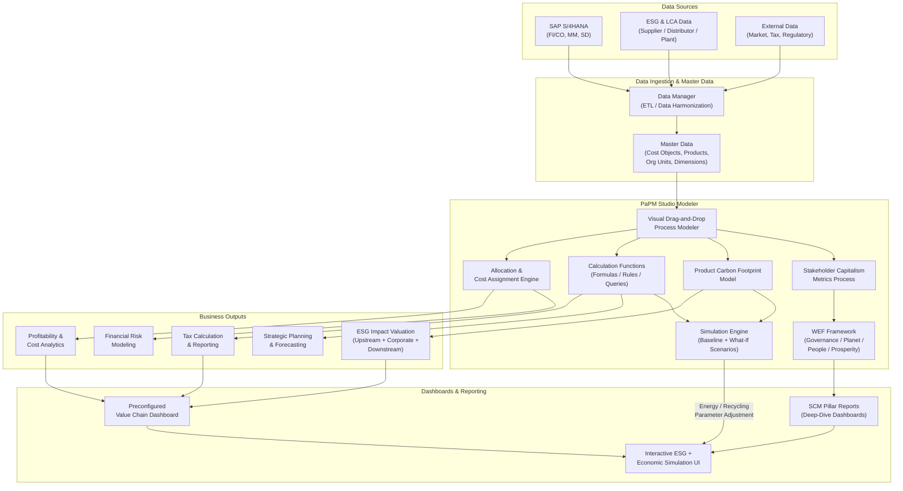
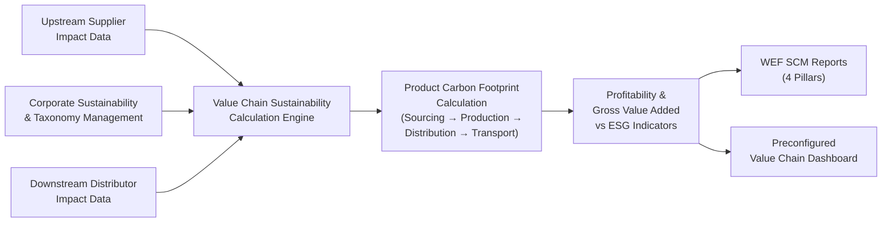

## Executive Summary

SAP Profitability and Performance Management (PaPM) is a unified calculation and allocation platform that spans profitability analytics, tax modeling, financial risk, strategic planning, and ESG impact valuation — all within a single visual modeling environment. This whitepaper presents a comprehensive end-to-end process architecture for PaPM, mapping its core components, data flows, calculation engines, and output surfaces. The goal is to give practitioners, architects, and business stakeholders a single reference view of how PaPM's building blocks connect — and where deployment decisions must be made deliberately.

---

## Context

Enterprise finance and sustainability functions are converging. Regulatory pressure on ESG disclosure, increasing complexity in cost allocation, and the demand for simulation-ready planning models have pushed organizations toward integrated performance management platforms. SAP PaPM sits at the intersection of all three: it can model a product's carbon footprint and its profitability contribution within the same process template, driven by the same master data.

Despite this breadth, PaPM deployments frequently underperform because the architectural scope is defined too narrowly at the outset — usually as a reporting layer bolted onto an existing ERP, rather than as a central calculation fabric. A clear picture of the full component architecture is the prerequisite to avoiding that failure mode.

---

## Analysis

### Core Architecture: End-to-End Process Flow

The diagram below maps the complete PaPM architecture from data sourcing through modeling, output generation, and visualization.

---

### Layer 1: Data Sources

PaPM consumes data from three categories of source systems. The distinction matters because each source type carries different latency, quality, and governance requirements — and misconfiguring any one of them cascades into model inaccuracy downstream.

| Layer | Examples | Notes |
|---|---|---|
| ERP Transactional | FI/CO documents, MM/SD flows | Primary financial grain |
| ESG & LCA | Plant emissions, supplier/distributor data | Feeds carbon footprint model |
| External | Tax tables, regulatory benchmarks, market rates | Supports tax and risk use cases |

SAP S/4HANA provides the financial and operational spine. ESG and Life Cycle Assessment (LCA) data — covering supplier, distributor, and plant-level emissions — feed the carbon footprint model directly. External data (market rates, regulatory benchmarks, tax tables) enables the tax and risk modeling use cases that often get underweighted in initial scoping conversations.

---

### Layer 2: Data Ingestion and Master Data

The Data Manager handles ETL and data harmonization before anything reaches the modeling layer. This is not a passive staging step — the quality of cost object definitions, org unit hierarchies, product master assignments, and dimensional structures established here determines the fidelity of every allocation and calculation downstream.

Master data in PaPM must be treated as a first-class design artifact. Organizations that rush this layer to reach the modeling surface faster consistently find themselves rebuilding dimension structures after go-live.

---

### Layer 3: PaPM Studio Modeler

The Studio Modeler is PaPM's central design and execution environment. It operates through a visual drag-and-drop interface that allows process designers to assemble calculation flows from prebuilt and custom components without requiring ABAP development.

The Modeler hosts several distinct engines that operate in parallel:

**Allocation and Cost Assignment Engine** — assigns costs and revenues across org units, products, and cost objects using configurable driver-based logic. This is the foundation of profitability and risk output.

**Calculation Functions** — formula-based and query-based rules that power tax modeling, planning, and the Stakeholder Capitalism Metrics (SCM) reporting processes. The query function layer is specifically what enables WEF pillar-level reporting.

**Product Carbon Footprint Model** — traces emissions from sourcing through production, distribution, and transport using LCA data mapped to plant activities and materials. This model is what allows PaPM to produce a per-product carbon footprint rather than only aggregate organizational emissions.

**Simulation Engine** — allows runtime adjustment of parameters such as energy efficiency rates and recycling rates, then recalculates both ESG and economic impacts simultaneously. This is PaPM's most strategically distinctive capability: a single parameter change flows through to both the carbon footprint and the P&L model in the same execution, making it genuinely useful for investment scenario analysis rather than just compliance reporting.

**Stakeholder Capitalism Metrics Process** — a preconfigured process template aligned to the World Economic Forum's four reporting pillars (Governance, Planet, People, Prosperity). It produces structured SCM outputs and feeds the deep-dive WEF pillar dashboards.

---

### Layer 4: ESG Value Chain Flow

The ESG processing path within PaPM deserves its own architectural view because it is the most novel and least understood component of the platform. It is not a reporting add-on; it is a full calculation pipeline with upstream, corporate, and downstream legs.

Upstream supplier impact data, corporate sustainability and taxonomy management outputs, and downstream distributor impact data all converge in the Value Chain Sustainability Calculation Engine. That engine feeds the Product Carbon Footprint Calculation, which traces the full sourcing-to-transport arc. The output is a Gross Value Added view that places ESG indicators alongside profitability metrics — the connection that enables trade-off analysis rather than parallel reporting.

---

### Layer 5: Business Outputs

| Output Domain | Driven By | Primary Consumer |
|---|---|---|
| Profitability & Cost Analytics | Allocation Engine | Finance / Controlling |
| ESG Impact Valuation | PCF Model + Value Chain Engine | Sustainability / IR |
| Tax Calculation & Reporting | Calculation Functions | Tax / Legal |
| Financial Risk Modeling | Allocation + Simulation Engine | Risk / Treasury |
| Strategic Planning & Forecasting | Calculation Functions | FP&A |

The five output domains are not independent silos. Because they share a common master data layer and calculation fabric, a change to a cost object definition or an emissions factor propagates consistently across all domains. This is the architectural advantage PaPM holds over disconnected best-of-breed solutions — but it is also the source of the highest implementation risk if master data governance is weak.

---

### Layer 6: Dashboards and Simulation UI

Three surface types sit at the top of the stack:

**Preconfigured Value Chain Dashboard** — consolidates profitability, ESG, and tax outputs into a single view. This is the primary operational reporting surface for leadership.

**SCM Pillar Reports** — deep-dive dashboards aligned to the WEF four pillars, intended for ESG disclosure preparation and investor relations use cases.

**Interactive Simulation UI** — the runtime interface where analysts adjust parameters (energy mix, recycling rates, cost driver assumptions) and observe the simultaneous economic and ESG impact of those adjustments. This surface is where PaPM's simulation capability becomes tangible to business users who are not modelers.

---

### Key Feature Reference

| Feature | Function | Deployment Priority |
|---|---|---|
| Visual drag-and-drop modeler | Process design without ABAP development | High — required for all use cases |
| Simulation / What-If engine | Runtime parameter adjustment across ESG and economic models | High — differentiating capability |
| Product Carbon Footprint model | Per-product emissions tracing via LCA | High for ESG reporting mandates |
| Stakeholder Capitalism Metrics | WEF 4-pillar structured ESG reporting | Medium — compliance timeline dependent |
| Profitability & cost analytics | Driver-based cost allocation and P&L analysis | High — foundational financial use case |
| Tax calculation & reporting | Flexible multi-jurisdiction tax modeling | Medium — depends on tax function maturity |
| Financial risk modeling | Scenario-based risk quantification | Medium — often phased to later releases |
| Allocation engine | Cost and revenue assignment across all dimensions | High — underpins profitability and risk |

---

## Recommendation

The single most consequential decision in a PaPM deployment is scope definition before configuration begins. The platform's value proposition is the integration of ESG and financial calculation within a shared model — but that integration requires deliberate architectural choices that cannot be easily retrofitted.

Three decisions must be resolved at the outset:

**1. Define the primary business driver.** PaPM's process templates and output priorities differ materially depending on whether the deployment is led by profitability analytics, ESG disclosure compliance, tax modeling, or planning. The answer shapes which calculation engines are configured first and which master data structures are non-negotiable from day one.

**2. Establish master data governance before modeling begins.** Cost objects, org unit hierarchies, product master assignments, and emissions factors must be governed as shared assets across Finance, Sustainability, and Tax. Organizations that treat master data as a back-end concern and prioritize the front-end dashboard consistently encounter mid-project rebuilds.

**3. Determine the enterprise architecture integration point.** PaPM must be positioned relative to S/4HANA, BW/4HANA, and SAP Analytics Cloud before the first process template is configured. Where PaPM sits in the data flow — as a calculation layer consuming S/4HANA actuals, as a planning layer feeding SAC, or as both — determines the ETL design, latency expectations, and reporting surface ownership. This decision is reversible only at significant cost.

Organizations that answer these three questions with specificity before entering the Studio Modeler will find that PaPM's breadth is an asset. Those that defer them will find it is a liability.

---