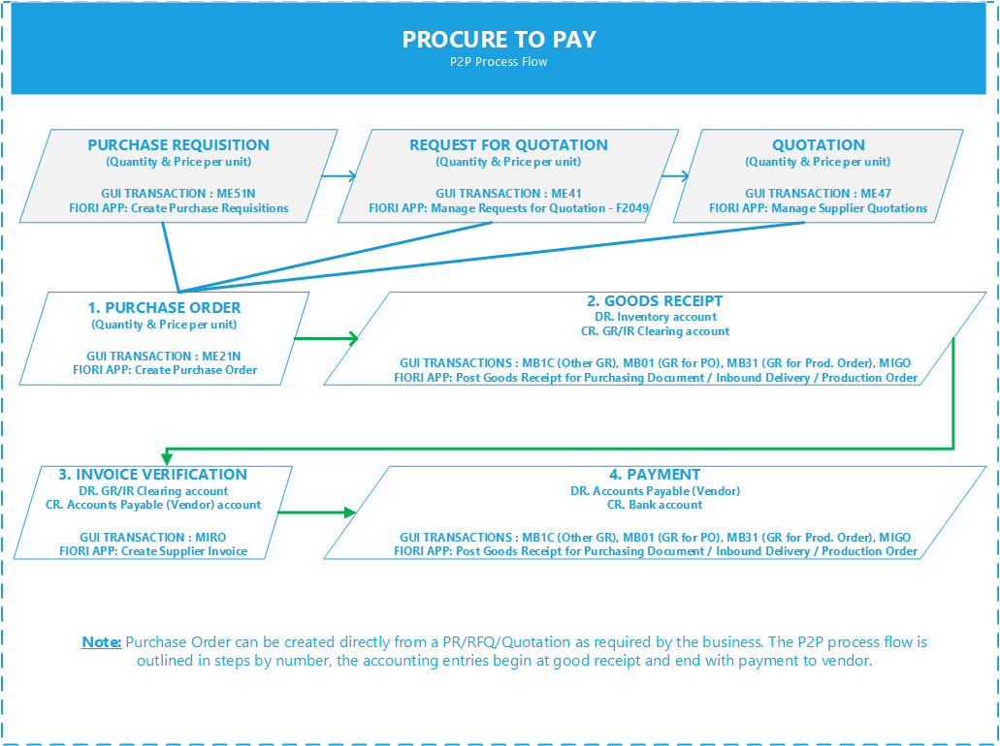
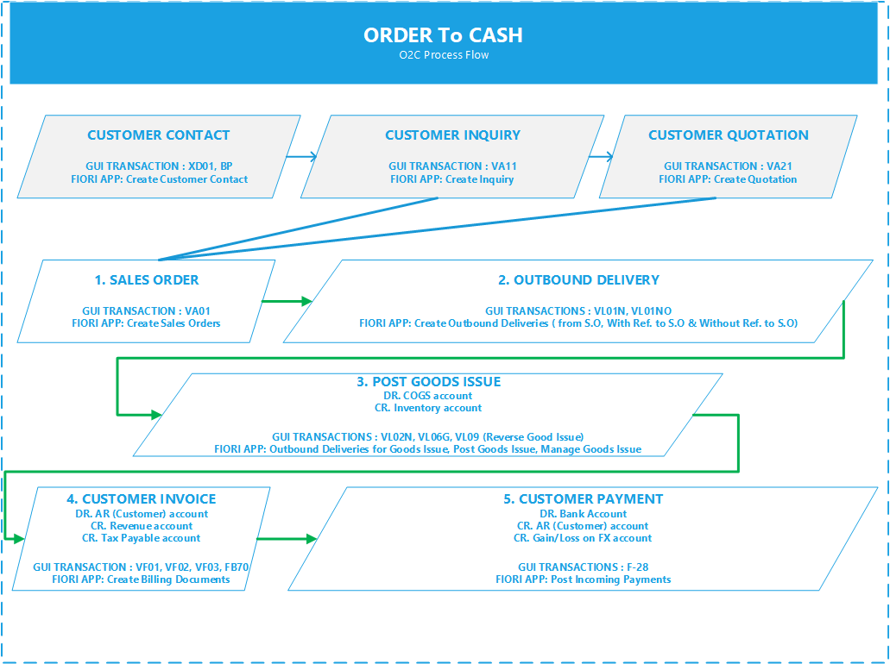

import PDFEmbed from '@/components/PDFEmbed.astro';

```
DOCS related to Accounting

```
"Accounting or accountancy is the measurement, processing, and communication of financial and non financial information about economic entities such as businesses and corporations. Accounting, which has been called the "language of business", measures the results of an organization's economic activities and conveys this information to a variety of users, including investors, creditors, management, and regulators. Practitioners of accounting are known as accountants. The terms "accounting" and "financial reporting" are often used as synonyms." - from Wikipedia.

## Classification of Accounting:

1. Real accounts - (e.g. Assets – Tangible, Goodwill - Intangible)
2. Personal accounts - (e.g. Persons - Customers, Vendors or Individuals)
3. Nominal accounts - (e.g. Expenses, Incomes or gains transferred to Retained Earning of each year)

Rules of accounting for debits and credits:

| Description | INCREASE | DECREASE	|
|----------------------|-------|--------|
| ASSET |	Debit |	Credit |		
| EXPENSES | Debit | Credit |		
| LIABILITY |	Credit | Debit |		
| REVENUE	| Credit | Debit |		


## Accounting Entries by process flow in SAP:

### Procure to pay process - (FI-MM Integration):

[](https://www.sap.com "SAP")

1. Generating purchase requisition( PP-MM) - ME51N
2. Making inquiries (MM)  
3. Raising purchase order (MM) - ME21N
4. Release of purchase order ( MM) - ME29N
5. Goods received from vendor ( MM and FI ) - MIGO
Entry will be:

```
Raw Material Inventory a/c Dr.
  GR/IR clearing a/c Cr.

```
6. Invoice verification and quality assurance (FI and MM) - MIRO
Entry will be:

```
GR/IR clearing a/c Dr
  Vendor a/c Cr  

```
7. Vendor PAYMENT - F110 (Payment Processing Run - Checks)

```
Vendor a/c Dr
  Cash/Bank a/c Cr  

```
Note: Incoming Bank Statement: FF_5

### Order to cash process - (FI-SD Integration):

[](https://www.sap.com "SAP")

1. Generating a Sales Quotation (from CRM) - VA21
2. Creating a Sales Order (SD) - VA01
3. Outbound Delivery (SD) - VL01N
4. Goods Issues to Customer (SD and FI) - VL02N
Entry will be:

```
Goods consumption / COGS a/c - GBB Dr
  Inventory - BSX Cr

```
5. Billing/Invoice generated for Customer (SD and FI) - VF01
Entry will be:

```
Customer a/c Dr
  Revenue a/c Cr
  Customs Duty Payable a/c Cr
  Sales Tax Payable a/c Cr  


```
6. Receipt of payment from Customer (FI) - F-28
Entry will be:

```
Incoming Cash/Bank a/c Dr
  Customer a/c Cr
  Gain/Loss on FX a/c Cr

```
7. Lockbox & EBS
   - Lockbox Processing Transaction Codes
    - FLB2 (Import file) &
    - FLB1 (Post processing - Execute)
   - EBS for Incoming Bank Statement - FF_5

### Asset Accounting Entries:

1. Asset Acquisition: (Create Asset Master Record: AS01)

```
Fixed Asset – Acquisition Cost Dr
  Cash/Bank a/c Cr

```

2. Asset Acquisition from Vendor: F-90

```
Fixed Asset – Acquisition Cost Dr
  Vendor (Accounts payable) Cr

```
3. Asset Disposal – Sales to a Customer using F-92

```
Customer account (A/R) Dr	10,000
Accumulated depreciation Dr	1000
Clearing account for asset disposal Dr	10,000
  Revenue for asset disposal Cr	10,000
  Fixed asset – acquisition cost Cr	9,000
  Gain/loss of fixed asset disposal Cr	2000

```
Note: Asset having a book value of $9K and accumulated depreciation of $1K is sold to a customer for $10K.

4. Asset Disposal - Scrap without Revenue:

```
Gain/Loss on F.A Disposal Dr 8000
Accumulated Depreciation Dr 1000
  Fixed Asset acquisition cost Cr 9000
```
Note: Loss of $8K written off to P&L

## Global SAP Chart of Accounts:

<PDFEmbed src="/pdf/sap-accounting-standards-accounting/1rtWyaN4R4l0IbTeOfNwJquvXB9ni0g8W.pdf" />

<details>
<summary>Show extracted text</summary>


```text
1/19/2021
1 / 96
Main Technical Account Attributes 
Show/hide columnsShow 10  entries. Previous1 Next
G/L Account Number
(SAKNR)
G/L Account Long Text
(SKAT)
Account Hierarchy Level Balance Sheet Account
(XBILK)
Field Status
(FSTAG)
Search within the column Search within the column Search within the column Search within the column Search wi
99999900 ICO Clearing Account -
Consultancy
NOTES | FS_NOTES |
INTERCOMPANY |
YBXX
98888800 ICO Clearing Account -
Margin
NOTES | FS_NOTES |
INTERCOMPANY |
YBXX
97777700 ICO Margin NOTES | FS_NOTES |
INTERCOMPANY |
SECC
94311000 Personnel hours SECONDARY ACCOUNTS |
INTERNAL ACTIVITY
ALLOCATION | |
94310000 QM Control SECONDARY ACCOUNTS |
INTERNAL ACTIVITY
ALLOCATION | |
94309000 Development OTHER ACCOUNTS |
ACCOUNTS NOT IN USE | |
94308500 Activity Unit based Billing SECONDARY ACCOUNTS |
INTERNAL ACTIVITY
ALLOCATION | |
94308100 Service Time SECONDARY ACCOUNTS |
INTERNAL ACTIVITY
ALLOCATION | |
SECC
94308020 QualityReview OTHER ACCOUNTS |
ACCOUNTS NOT IN USE | |
94308010 Training OTHER ACCOUNTS |
ACCOUNTS NOT IN USE | |
94308000 Consulting SECONDARY ACCOUNTS |
INTERNAL ACTIVITY
ALLOCATION | |
94307000 Internal Transport OTHER ACCOUNTS |
ACCOUNTS NOT IN USE | |
94306000 Environmental OTHER ACCOUNTS |
ACCOUNTS NOT IN USE | |
94305000 Industry Effluent OTHER ACCOUNTS |
ACCOUNTS NOT IN USE | |
Search: Search the entire table
1/19/2021
2 / 96
G/L Account Number
(SAKNR)
G/L Account Long Text
(SKAT)
Account Hierarchy Level Balance Sheet Account
(XBILK)
Field Status
(FSTAG)
Search within the column Search within the column Search within the column Search within the column Search wi
94304000 Water OTHER ACCOUNTS |
ACCOUNTS NOT IN USE | |
94303000 Setup Production SECONDARY ACCOUNTS |
INTERNAL ACTIVITY
ALLOCATION | |
94302000 Machine hours 2 SECONDARY ACCOUNTS |
INTERNAL ACTIVITY
ALLOCATION | |
94301000 Machine hours 1 SECONDARY ACCOUNTS |
INTERNAL ACTIVITY
ALLOCATION | |
94229900 COPA -consulting overhead SECONDARY ACCOUNTS |
ASSESSMENT |
PROFITABILITY ANALYSIS |
94229000 COPA -cash Discount SECONDARY ACCOUNTS |
ASSESSMENT |
PROFITABILITY ANALYSIS |
94228000 COPA -Taxes SECONDARY ACCOUNTS |
ASSESSMENT |
PROFITABILITY ANALYSIS |
94227000 COPA-Non-Operating Income SECONDARY ACCOUNTS |
ASSESSMENT |
PROFITABILITY ANALYSIS |
94226000 COPA-Non-Operating
Expense
SECONDARY ACCOUNTS |
ASSESSMENT |
PROFITABILITY ANALYSIS |
94225000 COPA -Sales. Overhead SECONDARY ACCOUNTS |
ASSESSMENT |
PROFITABILITY ANALYSIS |
94224000 COPA -Admin. Overhead SECONDARY ACCOUNTS |
ASSESSMENT |
PROFITABILITY ANALYSIS |
94223000 COPA -R&D SECONDARY ACCOUNTS |
ASSESSMENT |
PROFITABILITY ANALYSIS |
94222000 COPA-Marketing SECONDARY ACCOUNTS |
ASSESSMENT |
PROFITABILITY ANALYSIS |
94221000 COPA-overhead cost SECONDARY ACCOUNTS |
ASSESSMENT |
PROFITABILITY ANALYSIS |
SECC
1/19/2021
3 / 96
G/L Account Number
(SAKNR)
G/L Account Long Text
(SKAT)
Account Hierarchy Level Balance Sheet Account
(XBILK)
Field Status
(FSTAG)
Search within the column Search within the column Search within the column Search within the column Search wi
94220000 COPA Assessment SECONDARY ACCOUNTS |
ASSESSMENT |
PROFITABILITY ANALYSIS |
SECC
94202000 Assessment Quality costs SECONDARY ACCOUNTS |
ASSESSMENT | COST
CENTER |
SECC
94201000 Buildings & Periodic Service SECONDARY ACCOUNTS |
ASSESSMENT | COST
CENTER |
SECC
94114000 Overhead sales SECONDARY ACCOUNTS |
OVERHEAD | COSTING
SHEETS |
SECC
94113000 Overhead administration SECONDARY ACCOUNTS |
OVERHEAD | COSTING
SHEETS |
SECC
94112000 Overhead production SECONDARY ACCOUNTS |
OVERHEAD | COSTING
SHEETS |
SECC
94111000 Overhead material SECONDARY ACCOUNTS |
OVERHEAD | COSTING
SHEETS |
SECC
93116000 Result Analysis OVH Reserv. SECONDARY ACCOUNTS |
PERIOD-END CLOSING |
ORDER / PROJECT / RESULT
ANALYSIS |
SECC
93115000 Result Analysis OVH Costs SECONDARY ACCOUNTS |
PERIOD-END CLOSING |
ORDER / PROJECT / RESULT
ANALYSIS |
SECC
93114000 Result Analysis COS Reserv. SECONDARY ACCOUNTS |
PERIOD-END CLOSING |
ORDER / PROJECT / RESULT
ANALYSIS |
SECC
93113000 Result Analysis SEC Costs SECONDARY ACCOUNTS |
PERIOD-END CLOSING |
ORDER / PROJECT / RESULT
ANALYSIS |
SECC
93112000 Result Analysis COP Reserv. SECONDARY ACCOUNTS |
PERIOD-END CLOSING |
ORDER / PROJECT / RESULT
ANALYSIS |
SECC
1/19/2021
4 / 96
G/L Account Number
(SAKNR)
G/L Account Long Text
(SKAT)
Account Hierarchy Level Balance Sheet Account
(XBILK)
Field Status
(FSTAG)
Search within the column Search within the column Search within the column Search within the column Search wi
93111100 Result Analysis Primary
Costs
SECONDARY ACCOUNTS |
PERIOD-END CLOSING |
ORDER / PROJECT / RESULT
ANALYSIS |
SECC
93100000 Result Analysis Technical SECONDARY ACCOUNTS |
PERIOD-END CLOSING |
ORDER / PROJECT / RESULT
ANALYSIS |
SECC
92111000 Settlement Costs - Unit
Based
OTHER ACCOUNTS |
ACCOUNTS NOT IN USE | |
92110000 Settlement Revenue - Unit
Based
OTHER ACCOUNTS |
ACCOUNTS NOT IN USE | |
92105500 Settlement Service Costs OTHER ACCOUNTS |
ACCOUNTS NOT IN USE | |
92105400 Secondary costs SECONDARY ACCOUNTS |
PERIOD-END CLOSING |
SETTLEMENT | Maintenance
Order
92105300 Other costs SECONDARY ACCOUNTS |
PERIOD-END CLOSING |
SETTLEMENT | Maintenance
Order
92105200 Spare/Service/Ext material
con
SECONDARY ACCOUNTS |
PERIOD-END CLOSING |
SETTLEMENT | Maintenance
Order
92105100 Personnel costs SECONDARY ACCOUNTS |
PERIOD-END CLOSING |
SETTLEMENT | Maintenance
Order
92105000 Settlement Service Revenue OTHER ACCOUNTS |
ACCOUNTS NOT IN USE | |
92104000 Settlement External Service OTHER ACCOUNTS |
ACCOUNTS NOT IN USE | |
92103000 Settlement Internal Activity OTHER ACCOUNTS |
ACCOUNTS NOT IN USE | |
92102000 Settlement Third Party
material
OTHER ACCOUNTS |
ACCOUNTS NOT IN USE | |
92101900 Settlement Sales Order OTHER ACCOUNTS |
ACCOUNTS NOT IN USE | |
1/19/2021
5 / 96
G/L Account Number
(SAKNR)
G/L Account Long Text
(SKAT)
Account Hierarchy Level Balance Sheet Account
(XBILK)
Field Status
(FSTAG)
Search within the column Search within the column Search within the column Search within the column Search wi
92101800 Settlement R&D SECONDARY ACCOUNTS |
PERIOD-END CLOSING |
SETTLEMENT | R&D Orders
92101500 Settl. Rework SECONDARY ACCOUNTS |
PERIOD-END CLOSING |
SETTLEMENT | Rework
Orders
92101000 Settl.material OTHER ACCOUNTS |
ACCOUNTS NOT IN USE | |
92100000 Settlement Technical RA OTHER ACCOUNTS |
ACCOUNTS NOT IN USE | |
90002000 Deferred Carried Forward
Losses
NOTES | FS_NOTES |
ACCOUNTS WITH ZERO
AMOUNT |
YBXX
90001000 Activated Carried Forward
Losses
NOTES | FS_NOTES |
ACCOUNTS WITH ZERO
AMOUNT |
YBXX
80090000 RE_ACCOUNT Constant OTHER ACCOUNTS | Account
used in addtional scope items
| Public Sector Management |
YB04
80020000 Low Value Assets - Budget
Account
OTHER ACCOUNTS | Account
used in addtional scope items
| Public Sector Management |
YB01
80009000 Assets under Construction -
Budget Account
OTHER ACCOUNTS | Account
used in addtional scope items
| Public Sector Management |
YB01
80008000 Computer Software - Budget
Account
OTHER ACCOUNTS | Account
used in addtional scope items
| Public Sector Management |
YB01
80007000 Computer Hardware - Budget
Account
OTHER ACCOUNTS | Account
used in addtional scope items
| Public Sector Management |
YB01
80006000 Fixtures and Fittings - Budget
Account
OTHER ACCOUNTS | Account
used in addtional scope items
| Public Sector Management |
YB01
80005000 Office Equipment - Budget
Account
OTHER ACCOUNTS | Account
used in addtional scope items
| Public Sector Management |
YB01
80004000 Vehicles - Budget Account OTHER ACCOUNTS | Account
used in addtional scope items
| Public Sector Management |
YB01
1/19/2021
6 / 96
G/L Account Number
(SAKNR)
G/L Account Long Text
(SKAT)
Account Hierarchy Level Balance Sheet Account
(XBILK)
Field Status
(FSTAG)
Search within the column Search within the column Search within the column Search within the column Search wi
80003000 Building Improvements -
Budget Account
OTHER ACCOUNTS | Account
used in addtional scope items
| Public Sector Management |
YB01
```

</details>
