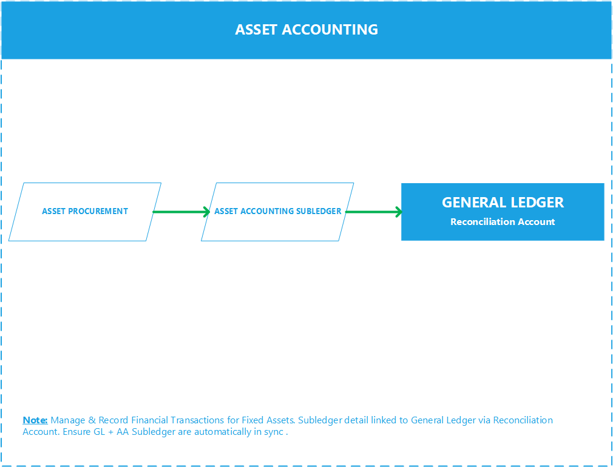
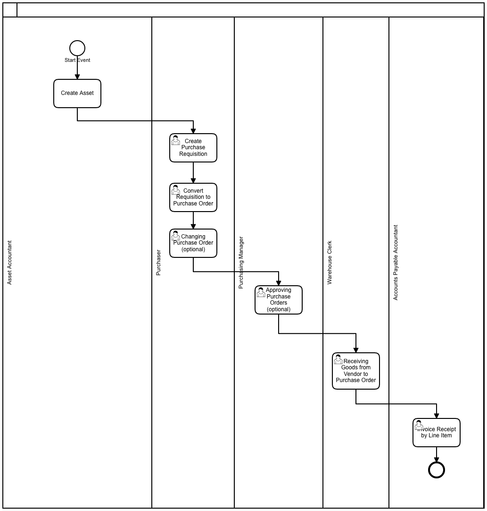
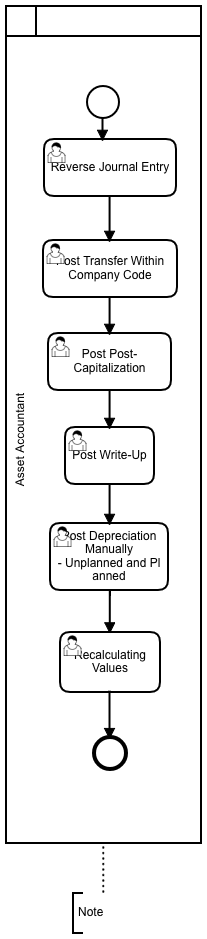
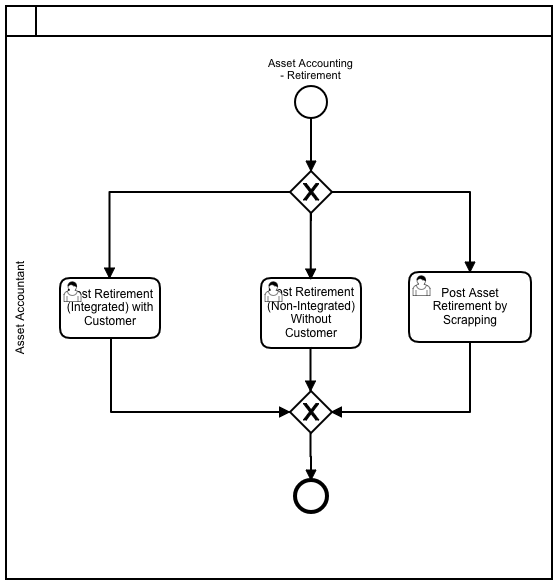
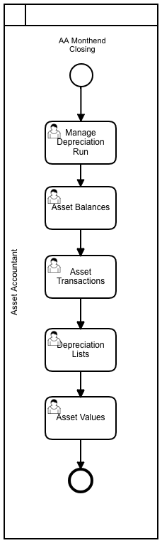
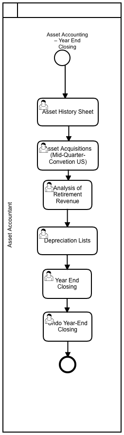

import PDFEmbed from '@/components/PDFEmbed.astro';

```
DOCS FOR SAP AA

```

Commands:

```
SAP ASSET ACCOUNTING

```

## Process Modeling:

### Asset Procurement from PO:

[](https://www.sap.com "SAP")

[](https://www.sap.com "SAP")

### Asset Valuation:

[](https://www.sap.com "SAP")

### Asset Retirement:

[](https://www.sap.com "SAP")

### Asset Month End Close:

[](https://www.sap.com "SAP")

### Asset Year End Close:

[](https://www.sap.com "SAP")

## SAP Best Practices Assets Account Structure:

<PDFEmbed src="/pdf/sap-erp-s4hana-asset-accounting/1UoPi7b4V4DZ8Q2PszBaGwZfN9D5MuHFx.pdf" />

<details>
<summary>Show extracted text</summary>


```text
1/19/2021
https://help.sap.com/http.svc/dynamicpdfcontentpreview?deliverable_id=23188577&topics=da47dc0cae0a49098b4ce705f3d… 2/79
19330000 - Goodwill
G/L Account Number
(I_SAKNR)
19330000
G/L Acct Long Text (SKAT) Goodwill
G/L Account Group ANL.
Balance/ P&L Account Balance
Account Category Fixed Asset
Account Purpose Reconcil. Account, assigned to asset classes
Account Hierarchy Level ASSETS | NON-CURRENT ASSETS | INTANGIBLE ASSETS | Goodwill
Used in Conguration or Master
Data
X
Where Used in the Global
Account Determination or
Master Data
Balance sheet accounts for depreciation areas
Account Usage In the documentation group for Goodwill, the following accounts are described:
G/L Account Number
(I_SAKNR)
G/L Acct Long Text (SKAT)
19330000 Goodwill
19430000 Amortization - Goodwill
Process Related Information Mr. Black acquires a company. The purchase price includes the goodwill of 300000 EUR.
Mr. Black posts the acquisition of a company.
Up to this point there is agreement on trade and tax law. Due to the different depreciation, differences
arise from the year of acquisition, because the duration of depreciation in the trading and tax balances
is different.
Example - Germany:
For goodwill, the goodwill should be amortized over 15 years.
Under commercial law, the 300000 EUR is depreciated over 10 years. If there is no possibility to
estimate the estimated useful life, this is to be applied at 10 years.
Depreciation:
Dep. Local
Gaap
Dep.for Tax
law
Difference Deferred
taxes
Dep. 1st year 30000 EUR 20000 EUR 10000 EUR 3000 EUR
Dep. 2nd year 30000 EUR 20000 EUR 10000 EUR 3000 EUR
Dep. 3rd year 30000 EUR 20000 EUR 10000 EUR 3000 EUR
Dep. 4th year 30000 EUR 20000 EUR 10000 EUR 3000 EUR
Dep. 5th year 30000 EUR 20000 EUR 10000 EUR 3000 EUR
Dep. 6th year 30000 EUR 20000 EUR 10000 EUR 3000 EUR
Dep. 7th year 30000 EUR 20000 EUR 10000 EUR 3000 EUR
1/19/2021
https://help.sap.com/http.svc/dynamicpdfcontentpreview?deliverable_id=23188577&topics=da47dc0cae0a49098b4ce705f3d… 3/79
Dep. 8th year 30000 EUR 20000 EUR 10000 EUR 3000 EUR
Dep. 9th year 30000 EUR 20000 EUR 10000 EUR 3000 EUR
Dep. 10th year 30000 EUR 20000 EUR 10000 EUR 3000 EUR
Dep. 11-15 year 0 EUR 100000 EUR 100000 EUR 30000 EUR
Stand 31.12. after 15 years 0 EUR
Posting Examples Acquistion of the company:
Debit Credit
19330000Goodwill 300000 EUR 11001000 - Bank 1 - Bank (Main) Account
300000 EUR
Depreciation of Goodwill
a) Local Gaap
Debit Credit
19430000 Amortization of Goodwil
20000 EUR
19330000Goodwill 20000 EUR
b) Tax law:
Debit Credit
19430000 Amortization of Goodwill
3000 EUR
19330000Goodwill 30000 EUR
19430000 - Amortization - Goodwill
G/L Account Number
(I_SAKNR)
19430000
G/L Acct Long Text (SKAT) Amortization - Goodwill
G/L Account Group ANL.
Balance/ P&L Account Balance
Account Category Fixed Asset
Account Purpose Reconcil. Account, assigned to asset classes
Account Hierarchy Level ASSETS | NON-CURRENT ASSETS | INTANGIBLE ASSETS | Goodwill
Used in Conguration or Master
Data
X
Where Used in the Global
Account Determination or
Master Data
FI-AA - G/L accounts value adjustment
Account Usage In the documentation group for Goodwill, the following accounts are described:
1/19/2021
https://help.sap.com/http.svc/dynamicpdfcontentpreview?deliverable_id=23188577&topics=da47dc0cae0a49098b4ce705f3d… 4/79
G/L Account Number
(I_SAKNR)
G/L Acct Long Text (SKAT)
19330000 Goodwill
19430000 Amortization - Goodwill
Process Related Information Mr. Black acquires a company. The purchase price includes the goodwill of 300000 EUR.
Mr. Black posts the acquisition of a company.
Up to this point there is agreement on trade and tax law. Due to the different depreciation, differences
arise from the year of acquisition, because the duration of depreciation in the trading and tax balances
is different.
Example - Germany:
For goodwill, the goodwill should be amortized over 15 years.
Under commercial law, the 300000 EUR is depreciated over 10 years. If there is no possibility to
estimate the estimated useful life, this is to be applied at 10 years.
Depreciation:
Dep. Local
Gaap
Dep.for Tax
law
Difference Deferred
taxes
Dep. 1st year 30000 EUR 20000 EUR 10000 EUR 3000 EUR
Dep. 2nd year 30000 EUR 20000 EUR 10000 EUR 3000 EUR
Dep. 3rd year 30000 EUR 20000 EUR 10000 EUR 3000 EUR
Dep. 4th year 30000 EUR 20000 EUR 10000 EUR 3000 EUR
Dep. 5th year 30000 EUR 20000 EUR 10000 EUR 3000 EUR
Dep. 6th year 30000 EUR 20000 EUR 10000 EUR 3000 EUR
Dep. 7th year 30000 EUR 20000 EUR 10000 EUR 3000 EUR
Dep. 8th year 30000 EUR 20000 EUR 10000 EUR 3000 EUR
Dep. 9th year 30000 EUR 20000 EUR 10000 EUR 3000 EUR
Dep. 10th year 30000 EUR 20000 EUR 10000 EUR 3000 EUR
Dep. 11-15 year 0 EUR 100000 EUR 100000 EUR 30000 EUR
Stand 31.12. after 15 years 0 EUR
Posting Examples Acquistion of the company:
Debit Credit
19330000Goodwill 300000 EUR 11001000 - Bank 1 - Bank (Main) Account
300000 EUR
Depreciation of Goodwill
a) Local Gaap
Debit Credit
19430000 Amortization of Goodwil 19330000Goodwill 20000 EUR
1/19/2021
https://help.sap.com/http.svc/dynamicpdfcontentpreview?deliverable_id=23188577&topics=da47dc0cae0a49098b4ce705f3d… 5/79
20000 EUR
b) Tax law:
Debit Credit
19430000 Amortization of Goodwill
3000 EUR
19330000Goodwill 30000 EUR
16008000 - Computer Software
G/L Account Number
(I_SAKNR)
16008000
G/L Acct Long Text (SKAT) Computer Software
G/L Account Group ANL.
Balance/ P&L Account Balance
Account Category Fixed Asset
Account Purpose Reconcil. Account, assigned to asset classes
Account Hierarchy Level ASSETS | NON-CURRENT ASSETS | INTANGIBLE ASSETS | Intangible assets
Used in Conguration or Master
Data
X
Where Used in the Global
Account Determination or
Master Data
Balance sheet accounts for depreciation areas
Account Usage In the documentation group for Intangible Assets, the following accounts are described:
G/L Account Number (I_SAKNR) G/L Acct Long Text (SKAT)
16008000 Computer Software
16011500 Input Tax Clearing Intangibles Down
Payments made
17008000 Accumulated Depreciation - Computer
Software
19310000 Internal Development
19320000 Intangible Assets
19410000 Accumulated amortization - Internal
Development
19420000 Accumulated depreciation - Intangible
Assets
Intangible Assets, such as patents, are managed in the same way as tangible assets in the system.
There are no special system functions for handling the requirements of intangible assets.
Process Related Information Example- Asset acquisition, Computer Software
Test script for J62
Process step Acquisition without Order (Integrated AP)
1/19/2021
https://help.sap.com/http.svc/dynamicpdfcontentpreview?deliverable_id=23188577&topics=da47dc0cae0a49098b4ce705f3d… 6/79
In this activity, you can post an asset acquisition without a purchase order directly against a vendor as
part of your daily business.
Example- intangible assets
Company A Ltd. is re-designing its website in 2017. The Company A Ltd. will incur the following costs:
Conception and
layout
14520 EUR
Programming of
company data
15800 EUR
Online shop for
online orders
44400 EUR
= Total costs 74720 EUR
The development of conception and layout (EUR 14520) and the programming of company-related data
(EUR 15800) do not lead to an asset because another company can not use this data for its own
purposes.
The expenses for the conception, layout and programming of company-related data (EUR 14520 EUR +
15800 EUR) EUR 30320 must be booked as an expense in any case and the expenses for the Internet
sales shop can be recorded immediately as operating expenses.
Posting Examples Intangible Assets:
Debit Credit
19320000 Intangible Assets 74720 EUR 7777 -Vendor Company A-Switzerland (21200000
Payables Foreign) 74720 EUR
Acquistion of Computer Software:
Debit Credit
16008000 Computer Software 12000 EUR 7777 -Vendor Company A-Switzerland (21200000
Payables Foreign) 12000 EUR
16011500 - Input Tax Clearing Intangibles Down Payments made
G/L Account Number
(I_SAKNR)
16011500
G/L Acct Long Text (SKAT) Input Tax Clearing Intangibles Down Payments made
G/L Account Group
```

</details>

## Tables:

| Table | Name | S/4HANA - Notes |
|-------|------|-----------------|
| ANLA | Asset Master Record Segment |  |
| ANLB | Depreciation terms | In Logical Database ADA. |
| ANLI | Link table for investment measure -> AuC |  |
| ANLT | Asset Texts |  |
| ANLU | Asset Master Record: User Fields |  |
| ANLZ | Asset Allocations | Acc. Assign. for DEP, Gain/Loss from asset sales - Logical Database ADA |
| T087 | Evaluation groups |  |
| ANEA | Asset Line Items for Proportional Values |  |
| ANEK | Document Header Asset Posting | In Logical Database ADA. |
| ANEP | Asset Line Items |  |
| ANLC | Asset Value Fields |  |
| ANLH | Main asset number |  |
| ANLP | Asset Periodic Values | In Logical Database ADA. |
| ANLW | Insurable values (year dependent) |  |
| ANLX | Asset Master Record Segment |  |
| BKPF | Accounting Document Header | In Logical Database BMM BRF BRM DDF KDF SDF. |
| BSEG | Accounting Document Segment | In Logical Database BMM BRF BRM DDF KDF SDF. |
| TABA | Depreciation posting documents | Current status of depreciation and amortization. |
| VBKPF | Document Header for Document Parking |  |
| VBSEGA | Document Segment for Document Parking - Asset Database |  |
| BSEG_ADD | Entry View of Accounting Document | When the document is not relevant for the leading ledger. |
| FAGLFLEXA | General Ledger: Items |  |
| FAGLFLEXP | General Ledger: Plan Line Items |  |
| FAGLFLEXT | General Ledger: Totals |  |
| ACDOCA | Universal Journal Entry Line Items |  |
| ACDOCC | Consolidation Journal |  |
| ACDOCP | Plan Data Line Items |  |
| FAAT_DOC_IT | Statistical Line Item in Asset Accounting |  |
| FAAT_PLAN_VALUES | Planned Depreciations and Revaluations |  |
| FAAT_YDDA | Year-Dependent Attributes for Depreciation |  |
| T001B | Permitted Posting Periods |  |
| T093 | Real and derived depreciation areas |  |
| T093A | Real depreciation area |  |
| T093B | Company code-related depreciation area specifications | Closed Asset-fiscal year. S/4:Edit with transaction FAA_CMP. |
| T093C | Company codes in Asset Accounting | Fiscal year change. |
| T093D | Control dep. posting | Depriciation. |
| T096 | Chart of depreciation |  |
| ANKA | Asset classes: general data |  |
| ANKB | Asset class: depreciation area |  |
| ANKT | Asset classes: Description |  |
| NRIV | Number Range Intervals | Edit with transaction SNUM. Object=ANLANR for assets |
| T003 | Document Types | Document Types AA, AP und AF for Asset Accounting. |
| T082A | Field string asset master record maintenance |  |
| T082B | Field groups assets definition |  |
| T082G | Field strings for screen selection asset master data |  |
| T082L | Summary of logical field groups |  |
| T082T | Names For Field Groups |  |
| T087 | Evaluation groups |  |
| T090NA | Depreciation Keys |  |
| T090NAZ | Depreciation Keys - Method Assignment |  |
| T090NP | Period Control Method |  |
| T090NR | Base Method |  |
| T095 | Balance sheet accounts for depreciation areas |  |
| T095B | G/L accounts value adjustment |  |
| T095P | Reconcil.accts. derived dep. areas |  |
| TABW | Asset transaction types |  |
| TABWA | Transaction types/dep. areas |  |
| TABWT | Asset transaction types texts |  |
|-------|------|-----------------|

## Transactions:

| ECC Tr. | S4 Tr. | Description |
|-------------------|-------------------|-------------|
| ABST | ABSTL | Asset reconciliation
| AB01 | AB01L | Create asset transaction |
| ABAA | ABAAL | Unplanned depreciation |
| ABAKN | ABAKNL | Last Retirement on Group Asset |
| ABAO | ABAOL | Asset Sale Without Customer |
| ABAV | ABAVL | Asset Retirement by Scrapping |
| ABAW | ABAWL | Balance sheet revaluation |
| ABCO | ABCOL | Adjustment Posting to Areas |
| ABGF | ABGFL | Credit Memo in Year after Invoice |
| ABGL | ABGLL | Enter Credit Memo in Year of Invoice |
| ABIF | ABIFL | Investment support |
| ABMA | ABMAL | Manual depreciation |
| ABMR | ABMRL | Manual transfer of reserves |
| ABNA | ABNAL | Post-capitalization |
| ABNE | ABNEL | Subsequent Revenue |
| ABNK | ABNKL | Subsequent Costs |
| ABSO | ABSOL | Miscellaneous Transactions |
| ABUM | ABUML | Transfer From |
| ABZE | ABZEL | Acquisition from in-house production |
| ABZO | ABZOL | Asset acquis. autom. offset. posting |
| ABZP | ABZPL | Acquistion from affiliated company |
| ABZU | ABZUL | Write-up |
|-----------------|--------------|--------------|

## Programs, Function Modules and Exits:

| Programs | Description | Type |
|-----------------|--------------|--------------|
| AW01N  |  Asset Explorer  | AA |
| RAPOST2000  |  Depreciation Posting Run  | AA |
| RAALTD01  |  Legacy Data Transfer Program   Asset Accounting | AA |
| SAPMA01B  |  ?…  | AA |
| RACSTABL  |  Asset Customizing: Calling Up Different Views  | AA |
| RAVCLUST  |  FI-AA: Call of view clusters  | AA |
| RAFABNEW  |  Automatic Opening of a New Depreciation Area  | AA |
| RABEST_ALV01  |  Asset Balances  | AA |
| RAUMFE20  |  Analysis of an asset and its environment: Data collect. and analysis  | AA |
| RAALTD11  |  Direct Data Import   Asset Accounting | AA |
| RAAFAR00  |  Recalculate Depreciation  | AA |
| RASIMU02  |  Depreciation Simulation  | AA |
| RAPERB2000  |  Periodic Asset Postings  | AA |
| RAGITT_ALV01  |  Asset History Sheet  | AA |
| RAGITT01 | Asset History Sheet | S_ALR_87011990 |
| RAUNVA00  |  Incomplete Assets   Detail List | AA |
|-----------------|--------------|--------------|

## Role-based Fiori Apps:

- Asset Balances (Design Studio)
- Asset History Sheet (Design Studio)
- Asset Transactions
- Depreciation Lists
- Manage Fixed Assets

## Platforms:

|     ECC      |  S/4 HANA    |      U/X      |  Database     |
|--------------|--------------|---------------|---------------|
|   SAP ERP    | SAP S/4 HANA |  SAP FIORI    |  SAP HANA     |
|--------------|--------------|---------------|---------------|

Note: S/4 (cloud & on-premise) works only on Hana DB while SAP ERP is compatible with Hana DB, MS Sql, Oracle DB, IBM DB2 etc.


## Asset Accounting Doc:

<PDFEmbed src="/pdf/sap-erp-s4hana-asset-accounting/1rtlNXu7i9L31XH0JMgmO5brxa6SrrQ9J.pdf" />

<details>
<summary>Show extracted text</summary>


```text
SAP
ASSET ACCOUNTING
Sajiv Francis
June 2020
Table of Contents
SAP ASSET ACCOUNTING ................................ ................................ ................................ ............... 3
Configuration Document ................................ ................................ ................................ .........................  3
ASSETS MASTER DATA PROCESSING ................................ ................................ ..............................  4
Create asset................................ ................................ ................................ ................................ ............ 4
Change asset master ................................ ................................ ................................ .............................  14
Changes of cost center ................................................................................................................................................... 15
Display asset master ................................ ................................ ................................ .............................  17
To display asset master .................................................................................................................................................. 18
To view asset values ................................ ................................ ................................ .............................  20
ASSET ACCOUNTING- BUSINESS TRANSACTIONS ................................ ................................ .......... 21
Asset Acquisition (Capitalization of Asset) ................................ ................................ .............................  21
Overview ........................................................................................................................................................................ 21
Reverse Asset Document ................................ ................................ ................................ ......................  24
Periodic Processing ................................ ................................ ................................ ...............................  25
Depreciation Run ........................................................................................................................................................... 25
ASSET ACCOUNTING INFORMATION SYSTEMS ................................ ................................ ............. 31
Standard Sap Reports ................................ ................................ ................................ ...........................  31
ASSET RETIREMENT................................ ................................ ................................ ..................... 32
Overview ................................ ................................ ................................ ................................ ............. 32
Asset Retirement with transaction code ABAVN ................................ ................................ ................. 32
ASSET ACQUISITION-SAP ................................ ................................ ................................ ............. 36
Overview ................................ ................................ ................................ ................................ ............. 36
Asset Acquisition with transaction code ABZON................................ ................................ ................. 36
ASSET HISTORY SHEET ................................ ................................ ................................ ................. 40
Report Scenario ............................................................................................................................................................ 40
Report Execution .......................................................................................................................................................... 40
Configuration................................................................................................................................................................ 41
AA – ASSET EXPLORER ................................ ................................ ................................ ................. 42
Overview ................................ ................................ ................................ ................................ ............. 42
Exploring an asset with Transaction Code AW01n................................ ................................ .............. 42
AA – LEGACY MIGRATION GUIDE ................................ ................................ ................................ . 48
STEPS IN ASSET ACCOUNTING: ................................ ................................ ................................ .... 49
AA- ACCOUNTING ENTRIES ................................ ................................ ................................ .......... 51
SAP ASSET ACCOUNTING
 Configuration Document
Step by step customization/configuration instructions related to Asset Accounting submodule in SAP
FI. Following are headlines from the document;
• Organizational Structures Configuration
In this section features of the Asset Accounting organizational objects (chart of depreciation, FI
company code, asset class) are defined. All assets in the system are assigned to these organizational
objects that you defined.
• Integration with General Ledger A090
The system settings and entries you make in this section are required for the integration of Asset
Accounting with the General Ledger
• Valuation Configuration
In this section, all configurations that have to do with the valuation of fixed assets are made. We
define and manage all valuation and depreciation parameters in the chart of depreciation
• Depreciation Configuration
The settings for fixed assets depreciation are defined in this section.
• Special Valuation Configuration
• Master Data Configuration
• Transaction Types Configuration
Click on below mentioned link to view full SAP Asset Accounting configuration Document
ASSETS MASTER DATA PROCESSING
Create asset
Access transaction by:
Via Menus Accounting→Financial Accounting→Fixed assets→Asset→Create→ Asset
Via Transaction Code AS01
On screen “Create Asset: Initial Screen”, enter information in the fields as specified in the table below:
Field Name Description R/O/C Comments
Asset class Classification of the asset R Use drill-down to locate the
asset class
Company code Enter “FBR” R
Field Name Description R/O/C Comments
Number of
similar assets
Number of similar assets that you want to create in
the system when you save.
O This function enables you to
create multiple similar
assets in one master
transaction. These assets
initially only differ in their
asset numbers. When you
save, you can also enter a
description and inventory
number for each individual
record.
Reference:
Asset
Sub-number
Company
code
The reference asset that you are copying from O
Press <Enter> or click on
On screen “Create Asset: Master Data”, enter information in the fields as specified in the table below:
Field Name Description R/O/C Comments
Description The description of the asset R
Asset main no text One line description of the asset.
It will appear in reporting.
O If leave blank, the first line of
description will be copied over to this
field.
Serial Number Enter the manufacturer Number O
Inventory no You must enter an inventory number for
the asset. The inventory is output in the
standard inventory list for Asset
Accounting (Information System).
O
Last inventory on You can enter the date of the last inventory. O This field is for information only
Include assets in
inventory list.
Set this indicator if you want this asset to
be counted in a physical inventory check.
O This indicator ensures that this asset is
included in the standard inventory list
of Asset Accounting. Asset without this
```

</details>
