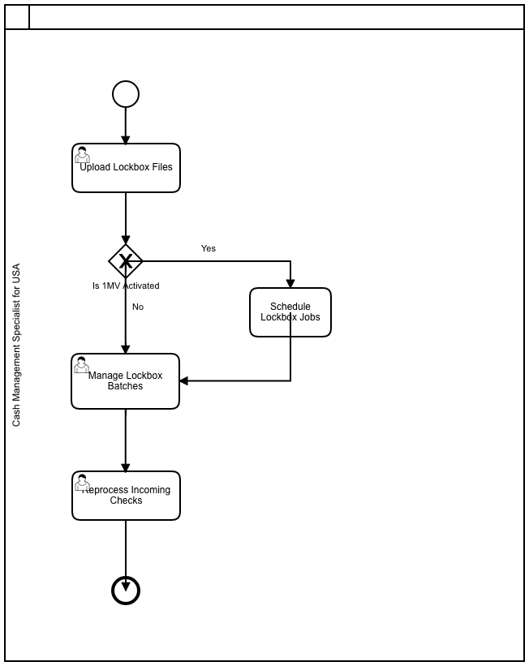
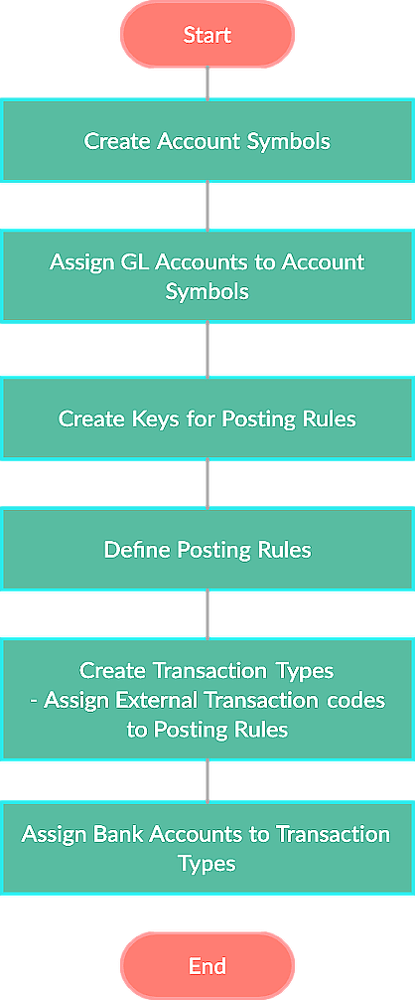

import PDFEmbed from '@/components/PDFEmbed.astro';

```
DOCS FOR SAP Banking

```

Commands:

```
SAP BANKING

```

## Process Modeling:

### LockBox

[](https://www.sap.com "SAP Banking")

### EBS

[](https://www.sap.com "SAP Banking")

## SAP Best Practices Banking Account Structure:

<PDFEmbed src="/pdf/sap-erp-s4hana-banking/1uq93Nx6a44LNf8cn4C0kKrI9BtzVm8ty.pdf" />

<details>
<summary>Show extracted text</summary>


```text
1/19/2021
https://help.sap.com/http.svc/dynamicpdfcontentpreview?deliverable_id=23188577&topics=bbfa643a86094e3e9dba8f6b49f… 2/124
11001000 - Bank 1 - Bank (Main) Account
G/L Account Number
(I_SAKNR)
11001000
G/L Acct Long Text (SKAT) Bank 1 - Bank (Main) Account
G/L Account Group FIN.
Balance/ P&L Account Balance
Account Category Cash/Bank management
Account Purpose Detailed account structure for reference bank 1, to be mapped by customer
Account Hierarchy Level ASSETS | CURRENT ASSETS | CASH AND CASH EQUIVALENTS | Bank
Used in Conguration or Master
Data
X
Where Used in the Global
Account Determination or
Master Data
Bank Master Data / Banking account determination / Bank Subaccounts for Bill of Exchange Usage /
Cash - Assign Flow Types to G/L Accounts
Account Usage In the documentation group for Bank, the following accounts are described:
G/L Account Number (I_SAKNR) G/L Acct Long Text (SKAT)
11001000 Bank 1 - Bank (Main) Account
11001010 Bank 1 - Cash Payment
11001020 Bank 1 - Bank Transfer
(Domestic/SEPA/Foreign)
11001030 Bank 1 - Other Interim Transfers
11001040 Bank 1 - Direct Debit
11001045 Bank 1 - Returns
11001050 Bank 1 - Checks Out
11001055 Bank 1 - BoE Out
11001057 Bank 1 - VCard Out
11001060 Bank 1 - Checks In
11001065 Bank 1 - BoE Collection
11001066 Bank 1 - BoE Discounting
11001067 Bank 1 - BoE Forfeiting
11001070 Bank 1 - Check Clearing Account
11001080 Bank 1 - Cash Receipt
11001090 Bank 1 - Technical Account for Bank
Statement
11001099 Bank 1 - Foreign Currency Adjustment
11001100 Bank 1 - Bank (Main) Account Foreign
Currency
11001200 Bank 1 - Bank (Lockbox) Account
1/19/2021
https://help.sap.com/http.svc/dynamicpdfcontentpreview?deliverable_id=23188577&topics=bbfa643a86094e3e9dba8f6b49f… 3/124
G/L Account Number (I_SAKNR) G/L Acct Long Text (SKAT)
11002000 Bank 2 - Bank (Main) Account
11002010 Bank 2 - Cash Payment
11002020 Bank 2 - Bank Transfer
(Domestic/SEPA/Foreign)
11002030 Bank 2 - Other Interim Transfers
11002040 Bank 2 - Direct Debit
11002045 Bank 2 - Returns
11002050 Bank 2 - Checks Out
11002055 Bank 2 - BoE Out
11002060 Bank 2 - Checks In
11002065 Bank 2 - BoE Collection
11002066 Bank 2 - BoE Discounting
11002070 Bank 2 - Check Clearing Account
11002080 Bank 2 - Cash Receipt
11002090 Bank 2 - Technical Account for Bank
Statement
11002099 Bank 2 - Foreign Currency Adjustment
11008000 Bank 3 - Digital Payments Acquirer Bank
11008030 Bank 3 - Digital Payments Transfer
Account
11008070 Bank 3 - Digital Payments Acquirer Clrng
(Stlmnt)
11008099 Bank 3 - Foreign Currency Adjustment
Bank accounting provides two main bank accounts which you can tailor for each currency and for each
account. Clearing accounts (bank subaccount) are per processing type on a lower level.
Only transactions which are active according to the bank statement are posted in (actual) bank
accounts, they should be managed on an open item basis.
The conguration of bank accounts determines how account transactions are allocated in cash
positions:
Open item management in clearing/subaccounts
Line item display in bank balance sheet accounts and bank clearing accounts
Sort key
Planning level is copied to the document from the master record; it is an assignment
characteristic and qualies account movement.
Objectives:
Accounts can be reconciled at any time
Accounts can be dened and managed in the local or a foreign currency
Accounts can be managed by value date
1/19/2021
https://help.sap.com/http.svc/dynamicpdfcontentpreview?deliverable_id=23188577&topics=bbfa643a86094e3e9dba8f6b49f… 4/124
Interest can be calculated
Line item analysis possible
Contingent liabilities can be monitored
Items posted automatically using automatic payment transactions
Automatic breakdown using electronic banking transactions
Process Related Information Payment transaction are posted against the clearing accounts using the payment program
Test script for J60
Process step Payment Run
Bank statements balance the clearing entries against the bank account
Test script for BFB
Process step Bank statement
Posting Examples Payment transaction
Debit Credit
11001020 - Bank 1 - Bank Transfer
2000 EUR
7777 Vendor 2000 EUR
Protability Analysis Attribute: for example, functional area, prot center, land, customer and so
on
Debit Credit
21311010 Accounts Payable - Suppier
Financing Vcard
CR 11001057 Bank 1 VCard Out
Bank statement
Debit Credit
11001000 - Bank 1 - Bank (Main) Account 2000
EUR
11001020 - Bank 1 - Bank Transfer 2000 EUR
Bank statement clearing account for return process and return lot processing
During bank statement uploading for returns lot, and return lots posting, the return lot process
ow will use it.
Bank statement uploading:
Debit Credit
11001000 - Bank 1 - Bank (Main) Account 3000
EUR
11001045 - Bank 1 - Returns 3000 EUR
Return lot process:
1/19/2021
https://help.sap.com/http.svc/dynamicpdfcontentpreview?deliverable_id=23188577&topics=bbfa643a86094e3e9dba8f6b49f… 5/124
Debit Credit
11001045 - Bank 1 - Returns
3000 EUR
Business Partner
11001010 - Bank 1 - Cash Payment
G/L Account Number
(I_SAKNR)
11001010
G/L Acct Long Text (SKAT) Bank 1 - Cash Payment
G/L Account Group FIN.
Balance/ P&L Account Balance
Account Category Cash/Bank management
Account Purpose Detailed account structure for reference bank 1, to be mapped by customer
Account Hierarchy Level ASSETS | CURRENT ASSETS | CASH AND CASH EQUIVALENTS | Bank
Used in Conguration or Master
Data
X
Where Used in the Global
Account Determination or
Master Data
Account determination for Cash Journal / Acct Determ. for Open Item Exch.Rate Differences / Banking
account determination / Demo data for Cash - Dene Default Liquidity Items for G/L Accounts
Account Usage In the documentation group for Bank, the following accounts are described:
G/L Account Number (I_SAKNR) G/L Acct Long Text (SKAT)
11001000 Bank 1 - Bank (Main) Account
11001010 Bank 1 - Cash Payment
11001020 Bank 1 - Bank Transfer
(Domestic/SEPA/Foreign)
11001030 Bank 1 - Other Interim Transfers
11001040 Bank 1 - Direct Debit
11001045 Bank 1 - Returns
11001050 Bank 1 - Checks Out
11001055 Bank 1 - BoE Out
11001057 Bank 1 - VCard Out
11001060 Bank 1 - Checks In
11001065 Bank 1 - BoE Collection
11001066 Bank 1 - BoE Discounting
11001067 Bank 1 - BoE Forfeiting
11001070 Bank 1 - Check Clearing Account
11001080 Bank 1 - Cash Receipt
1/19/2021
https://help.sap.com/http.svc/dynamicpdfcontentpreview?deliverable_id=23188577&topics=bbfa643a86094e3e9dba8f6b49f… 6/124
G/L Account Number (I_SAKNR) G/L Acct Long Text (SKAT)
11001090 Bank 1 - Technical Account for Bank
Statement
11001099 Bank 1 - Foreign Currency Adjustment
11001100 Bank 1 - Bank (Main) Account Foreign
Currency
11001200 Bank 1 - Bank (Lockbox) Account
11002000 Bank 2 - Bank (Main) Account
11002010 Bank 2 - Cash Payment
11002020 Bank 2 - Bank Transfer
(Domestic/SEPA/Foreign)
11002030 Bank 2 - Other Interim Transfers
11002040 Bank 2 - Direct Debit
11002045 Bank 2 - Returns
11002050 Bank 2 - Checks Out
11002055 Bank 2 - BoE Out
11002060 Bank 2 - Checks In
11002065 Bank 2 - BoE Collection
11002066 Bank 2 - BoE Discounting
11002070 Bank 2 - Check Clearing Account
11002080 Bank 2 - Cash Receipt
11002090 Bank 2 - Technical Account for Bank
Statement
11002099 Bank 2 - Foreign Currency Adjustment
11008000 Bank 3 - Digital Payments Acquirer Bank
11008030 Bank 3 - Digital Payments Transfer
Account
11008070 Bank 3 - Digital Payments Acquirer Clrng
(Stlmnt)
11008099 Bank 3 - Foreign Currency Adjustment
Bank accounting provides two main bank accounts which you can tailor for each currency and for each
account. Clearing accounts (bank subaccount) are per processing type on a lower level.
Only transactions which are active according to the bank statement are posted in (actual) bank
accounts, they should be managed on an open item basis.
The conguration of bank accounts determines how account transactions are allocated in cash
positions:
Open item management in clearing/subaccounts
Line item display in bank balance sheet accounts an
```

</details>

## Tables:

| Table | Name | S/4HANA - Notes |
|-------|------|-----------------|
| BNKA | Bank master record | In Logical Database BANK. |
| KNBK | Customer Master (Bank Details) | In Logical Database BRF DDF. |
| LFBK | Vendor Master (Bank Details) | In Logical Database BRF KDF. |
| TCURF | Conversion Factors |  |
| TCURR | Exchange Rates |  |
| TIBAN | IBAN | In Logical Database IBAN. |
| T001B | Permitted Posting Periods |  |
| T012 | House Banks |  |
| T012K | House Bank Accounts |  |
| T012C | Terms for bank transactions |
| T012D | Parameter for DME's and foreign PM |
| T012E | EDI-compatible house banks/PM |
| T012K | House Bank Accounts |
| T012T | House Bank Account Names |
| T012O | ORBIAN Detail: Bank Accounts |
| BANK_PACK_PARAMS | Application-Specific Parameters for Package Templates |
| BANK_PP_PARAMS | Application-Specific Global Parameters |
| BANK_PP_PAR_PCR | Parameters for Package Generation |
| BANK_PP_RUNPARM | Global Parameters for Mass Run |
|-----------------|--------------------------------|

## Programs, Function Modules and Exits:

| Programs | Description | Type |
|-----------------|--------------|--------------|
| SAPFPAYM  |  Payment Medium: Creation  | Banking |
| RFCHKE00  |  Check Extract Creation  | Banking |
| SAPFPAYM_SCHEDULE  |  Payment Medium: Scheduling of Creation  | Banking |
| RFBLBC00  |  Bank Chains for House Banks  | Banking |
| RFBLBC01  |  Bank chains for bank account carry forwards  | Banking |
| RFBLBC02  |  Bank chains for creditors/debtors  | Banking |
| SAPFPAYM_MERGE  |  Creation of Cross-Payment Run Payment Media  | Banking |
| RFCCSSTT  |  Payment Cards: Execute Settlement  | Banking |
| RFCHKL00  |  List of Checks for Company Code &0..  | Banking |
| RFCHKN10  |  Check Register  | Banking |
| RFCHKD30  |  Reset Check Information Data  | Banking |
| RFMPAY00  |  Status of Payments for Cross-Payment Run Payment Media  | Banking |
| OFX_MSG_SELECT_DISPLAY  |  Display Internet Messages  | Banking |
| RFCHKD00  |  Delete Check Information on Payment Run  | Banking |
| RFCHKD10  |  Delete Check Information on Voided Checks  | Banking |
| RFFOD__L | Payment Medium Workbench | PMW |
| RFFOD__S | Payment Medium Workbench | PMW |
| RFFOUS_T | Payment Medium Workbench | PMW |
| RFFOM200 | Payment Medium Workbench | PMW |
| RFFOM202 | Payment Medium Workbench | PMW |
| RFFOM210 | Payment Medium Workbench | PMW |
|----------|--------------------------|-----|

## Platforms:

|     ECC      |  S/4 HANA    |      U/X      |  Database     |
|--------------|--------------|---------------|---------------|
|   SAP ERP    | SAP S/4 HANA |  SAP FIORI    |  SAP HANA     |
|--------------|--------------|---------------|---------------|

Note: S/4 (cloud & on-premise) works only on Hana DB while SAP ERP is compatible with Hana DB, MS Sql, Oracle DB, IBM DB2 etc.


## EBS PROCESS:
<PDFEmbed src="/pdf/sap-erp-s4hana-banking/1p7NXjlpvlglWnm4-rur00JCASCL-AJNk.pdf" />

<details>
<summary>Show extracted text</summary>


```text
SAP EBS
Sajiv Francis
June 2018
Table of Contents
Electronic Banking Statement (EBS) Settings ................................ ...............................  3
EBS Process ................................ ................................ ................................ ................ 3
Configuration Steps ................................ ................................ ................................ .... 4
Define House Banks (FI12) ................................ ................................ .......................... 4
Make Global Settings for EBS ................................ ................................ ..................... 4
Overview of Account Determination ................................ ................................ ........... 5
EBS UPLOAD AS PER BAI/BAI2 FORMAT ................................ ................................ ...... 6
Execution of the Electronic Bank Statement ................................ ................................  8
Electronic Banking Statement (EBS) Settings
• EBS is an electronic document sent by the Bank giving the details of the transactions done
by the Customer / Account Holder.
• The electronic document can be remitted by the Bank in the following formats – SWIFT,
Multicash, BAI etc.
• This Statement is used i n SAP to do an automatic reconciliation of the bank related
transactions.
• The statement is uploaded in SAP and it clears the various bank clearing accounts such as
the check out, check-in account to the Main Bank Account.
EBS Process
Start
         Create Account Symbols
      Assign GL accounts to Account
                  Symbols
     Create Keys for posting rules
Define Posting Rules
          Create Transaction Types
             o Assign External transaction
                         codes to posting rules
       Assign Bank Accounts to
       Transaction Types
End
Configuration Steps
• The component Bank Accounting in R/3 System is used to handle accounting transactions that
are processed with the clients’ Banks.
• R/3 System provides the settings for EBS.
• It includes management of Bank master data, the creation and processing of incoming and
outgoing payments.
• All country specific characteristics such as the specifications for manual and electronic
payment procedures, payment forms or data media can be freely defined.
Define House Banks (FI12)
Path – SPRO> Financial Accounting > Bank Accounting > Bank Accounts > Define House
Banks
• Create GL account (Tcode FS00) for the Main Bank and sub GL accounts such as
Checks received, checks paid, wire transfer etc.  All the sub GL accounts are
maintained on an Open Item basis. Maintain the GL Code and the Account Id.
(Account ID together with the ID for the House Bank uniquely defines a Bank
Account).
• Assign the Main Bank GL Account to the House Bank.
Make Global Settings for EBS
Path – SPRO> Financial Accounting > Bank Accounting > Business Transactions >
Payment Transactions > Electronic Bank Statement > Make Global Settings for
Electronic Bank Statement
• Create Account Symbols
• Assign GL accounts to Account Symbols
• Create Keys for posting rules
• Posting Specifications - Define Posting Rules (2 posting rules: GL (Bank
Accounting) posting and Sub ledger posting.
o For posting rules we define the posting area and assign document type,
posting type and account symbols.
o As the GL accounts are assigned to account symbols, the posting rules
will pick the data from the account symbols.
o Posting specification consists of one or two posting records (debit
/credit)
o One posting rule can have two posting areas
• Create Transaction Types
o Assign External transaction codes to posting rules
• Assign Bank Accounts to Transaction Types
Note – Account symbols are not defined for sub ledger accounts. Since these are determined
either by the standard interpretation algorithm for finding clearing information or by
functional enhancements.
Overview of Account Determination
SNO A/c Symbol Description GL A/C Before upld
of EBS
After upld
EBS
1 BANK Bank Account +++++++ - -
2 GEBUHREN Bank Charges
Account
479000  DR 2
CR 1
3 SCHECKINGANG Incoming Checks ++++++8 DR  DR 1
CR 3
4 SCHECKAUSGANG Outgoing Checks ++++++1 CR DR 4
CR 1
5 OUTCHQCLR Outgoing Checks
clear
++++++1 CR DR 5
CR 1
6 INCHQCLR Incoming checks
clear
++++++8 DR DR 1
CR 6
Search sequence
- Bank key and bank account identifies Transaction type
- Transaction type will store details of external transaction codes and posting rule assigned
to the transaction codes.
A Generic view of Accounting Entries for the following transactions
Invoice
Purchase
Raw Material Consumption A/c DR
Vendor A/c  CR
Sale
Customer A/c DR
Sales A/c CR
After uploading of EBS File
When Checks issued out
Vendor A/c DR
Checks payable Cr
(Scenario: When check are directly
deposited by the customer in the Bank).
When Checks Received In
Incoming Checks DR
Customer A/c CR
Checks payable DR
Main Bank A/c CR
Main Bank A/c DR
Incoming Checks CR
Other Relevant Entries
Bank Charges
Bank Charges A/c  DR
Main Bank A/c CR
EBS UPLOAD AS PER BAI/BAI2 FORMAT
Company Code – KIM1
Chart of Accounts – INT
Create Account Symbols and assign accounts to Account Symbols
Created Account Symbols  Description  GL Account  assigned to
Account Symbols
Bank Bank Account +++++++
GEBUHREN Charges 479000
SCHECKEINGANG (Customer
check receipts  & other
receipts)
Incoming Checks
account
++++++8
SCHECKAUSGANG (Vendor
payments & other
payments)
Outgoing checks
account
++++++1
Create keys for posting rules
Define Posting Rule
One posting rule can be assigned to two posting areas – GL posting and Sub ledger posting
Create Transaction Type
Created Transaction Type KIM1–BAI.
Assigned external transaction types and assigned posting rules
The external transaction types used for the KIM-BAI transaction type are
Ext Trans
+/- Posting Rule  Description Interpretation
Algorithm
175 + 0023 Incoming
checks
Document
number search
475 - 0025 Outgoing
Checks
Document
number search
495 - 0009 Account
Charges
No interpretation
498 - 107 Checks paid Document
number search
186 + 007 Checks
received
Document
number search
Note – External transactions are known as Business Transaction Codes
Assigned Bank Accounts to Transaction Types
Assigned KIM-BAI transaction type to the Bank account of KIM1
Execution of the Electronic Bank Statement
- Posted invoices for the customers and vendors and maintained as open items. Also created
open items for other payments and other receipts. Created a file in BAI format with customer,
vendor, other payments, other receipts, and bank charges transactions
Open Item Total Any other info
Customer
138
139
2
2
2 open items per
customer
Vendor
300080
300081
2
2
2 open items per
vendor
Other payments
2 Open items
already exist;
clearing the open
items.
Other receipts
2 Open items
already exist;
clearing the open
items.
Bank Charges     2  (Not an open
item)
Total number of transactions 14
Bank statement upload – FF.5
The following accounts are cleared after the upload of EBS
- the customer open items are cleared and a clearing document is generated as above.
- the vendor open items are cleared and a clearing document is generated as above.
- the existing open items in the GL accounts (checks payable(113101) and checks
receivable (113108)) are cleared at the time of Bank statement upload.
Check for any transactions that are unposted.
FEBA_BANK_STATEMENT_Reprocess for any unposted transactions
To display all the bank statements uploaded - FF_6.
This screen shows that
the statement # 9 is
cleared and is shown in
green
```

</details>

## BAI2 FILE FORMAT:
<iframe src="https://drive.google.com/file/d/0B-TzAlgXPGrTSFRHT0hLd2dIVlk/preview" width="640" height="480" />

## APP PAYMENT PROGRAM:
<PDFEmbed src="/pdf/sap-erp-s4hana-banking/1zHXwuSIEOo400o-bjqqlxVwffOUGMatt.pdf" />

<details>
<summary>Show extracted text</summary>


```text
SAP – APP
FBZP, House Bank, DMEE - Configuration Steps
Sajiv Francis
December 2019
Table of Contents
BUSINESS PROCESS FLOW – APP: ................................ ................................ ................................ ........3
PAYMENT METHODS: ................................ ................................ ................................ .............................. 3
APP BUSINESS PROCESS FLOW: ................................ ................................ ................................ .................3
1. CREATION OF VENDOR INVOICE – F-43/MIRO (IMMEDIATE PAYMENT TERMS) .................................................. 3
2. CHECK THE VENDOR LINE ITEM BALANCE – FBL1N .......................................................................................... 4
3. APP EXECUTION – DME PAYMENT METHOD: F110 ....................................................................................... 4
4. SELECT PAYMENT PROPOSAL – START IMMEDIATELY ........................................................................................ 5
5. DME ADMINISTRATION WORKBENCH: TCODE - FDTA .................................................................................... 6
6. OUTPUT: ................................................................................................................................................. 6
7. END TO END APP – DMEE PROCESS FLOW STEPS ........................................................................................... 6
PAYMENT PROCESS CONFIGURATION: (STEPS TO BE UNDERTAKEN) ................................ .................... 8
DEFINE BANK KEY – FI01.................................................................................................................................... 8
DEFINE THE HOUSE BANK – FI12 ......................................................................................................................... 9
SET UP ALL COMPANY CODE –FBZP ................................................................................................................... 10
SET UP PAYING COMPANY CODE –FBZP ............................................................................................................. 10
SET UP PAYMENT METHOD PER COUNTRY –FBZP ............................................................................................... 11
SET UP PAYMENT METHOD PER COMPANY CODE –FBZP ....................................................................................... 13
SET UP BANK DETERMINATION –FBZP ............................................................................................................... 15
DEFINE VALUE DATE RULES – FBZP (SELECT BANK DETERMINATION & CHOOSE COMPANY CODE) .............................. 17
DME FILE CONFIGURATION STEPS:................................ ................................ ................................ .... 19
1. SETUP PAYMENT MEDIUM FORMAT – OBPM1................................ ................................ ....................  19
2. GO TO TRANSACTION DMEE1 – DMEE TREE CONFIGURATION ................................ ................................  19
3. ASSIGN PAYMENT MEDIUM FORMAT IN STEP 3 CONFIGURATION – PAYMENT METHODS IN COUNTRY ....... 20
4. CREATE AND ASSIGN VARIANT TO BANK: OBPM4 ................................ ................................ ................. 21
DMEE TREE CONFIGURATION STEPS: ................................ ................................ ................................  23
SETTINGS FOR GENERATING DME FILE IN PAYMENT RUN: ................................ ................................ . 24
SAP TRANSPORT CUSTOMIZATIONS: ................................ ................................ ................................  25
TRANSPORT BETWEEN CLIENTS IN THE SAME SYSTEM: ................................ ................................ ....................  25
TRANSPORT BETWEEN CLIENT IN DIFFERENT SYSTEM:................................ ................................ .....................  26
Business Process Flow – APP:
Payment Methods:
- APP Check (Company will print check and send it to the vendor)
- APP IDOC (Bank will print check and send it to vendors) Outbound IDOC transferred to
bank.
- APP DME (After executing APP-DME, output file will be submitted to BANK, BANK will
transfer amount to vendor) (Flat file, XML file will be uploaded to bank server or sent to
the bank, this file is designed as per the bank requirement).
APP Business process flow:
1. Creation of vendor invoice – F-43/MIRO (Immediate payment terms)
2. Check the vendor line item balance – FBL1N
3. APP Execution – DME Payment Method: F110
 Parameters
 Execute Proposal
 Execute Payment Run
 Printout
4. Select Payment proposal – start immediately
Click on display proposal:
5. DME Administration Workbench: Tcode - FDTA
6. OUTPUT:
1. Export the DME output file
2. Submit to Bank (Upload to bank server or send it to bank)
7. End to end APP – DMEE process flow steps
-----------Automatic Payment Configuration---------------
1. All Company codes ---- Add your company code here
2. Paying Company codes -- Add your company Code here
3. Payment Methods in Country --- Here we will do the config for Payment Methods like
Cheque, IDOC, DME etc.
4. Payment Methods in Company Code -- Add the Payment Methods Configured in 3rd step
5. Create Bank GL Account for - Outgoing Payments ---FS00
6. Create House Banks-----FI12 OR FBZP.
7. Create Bank Accounts (ID) --------FI12 OR FBZP
 8.   Bank Determination---------------FBZP
    --Ranking Order
    --Bank Accounts
    --Available Amounts
 9.   Create Payment Medium Formats --- OBPM1
 10. Assign Payment Medium format in step 3 of configuration.
 11. Create and Assign Variant to Bank--- OBPM4--------- DONE
 12. Create DMEE Tree------------------DMEE
---------------Master Data Updating---------------------
 1. Update Vendor Payments Terms
------------Unit Testing-------------------
 1. Post Vendor Invoices --  F-43
 2. Execute APP  F110
 3. Analyse Results
Payment Process Configuration: (Steps to be undertaken)
Define Bank Key – FI01
Define the House Bank – FI12
Enter in the details for House Bank – Tabs for Data, Communications, Address, Control Data, EDI
partner profiles, Data Medium Exchange (General data), Charges Account and Running mode.
Set up All company code –FBZP
Set Up Paying Company code –FBZP
Set Up Payment Method per Country –FBZP
- Create payment method format – OBPM1
- Assign variant to company code:
Set up payment Method per company code –FBZP
Set up Bank Determination –FBZP
- Create Bank GL Account for Outgoing Payments – FS00
For e.g. 113428 Citibank
- Create House Banks FI12
Create House Bank
Create Bank Account
Define Value Date rules – FBZP (Select Bank determination & choose company code)
Select Ranking Order – New Entries
Highlight & Double click Bank Accounts: NEW ENTRIES
Highlight & Double click Bank Accounts (Enhanced): NEW ENTRIES
Highlight & Double click Available Amounts: NEW ENTRIES
Update new Payment Method in Vendor Master – XK02
DME File Configuration steps:
1. Setup Payment Medium Format – OBPM1
Select NEW ENTRIES and Use forward slash e.g. /ZDME_WG01 before the format name.
2. Go to transaction DMEE1 – DMEE Tree Configuration
3. Assign Payment Medium Format in Step 3 configuration – PAYMENT METHODS IN
COUNTRY
4. Create and assign variant to Bank: OBPM4
Select your payment medium format e.g. /ZDME_WG01
Enter the variant description & SAVE – Hit on the back button and save the variant again
SAVE THE VARIANT
```

</details>
