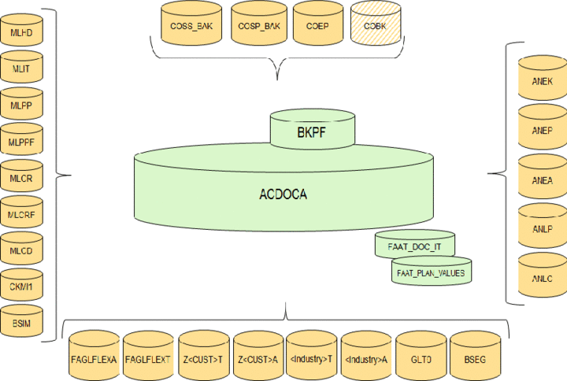
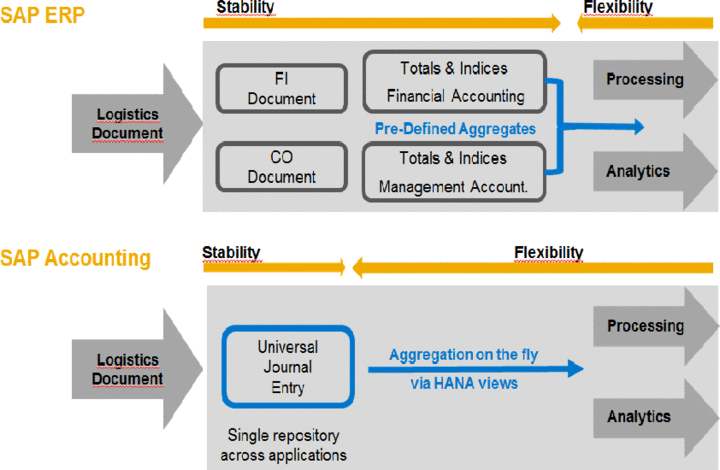

import PDFEmbed from '@/components/PDFEmbed.astro';

```
DOCS FOR SAP CO

```

Commands:

```
SAP CONTROLLING

```

## Process Modeling:


## SAP Best Practices Controlling - Secondary Account Structure:

<PDFEmbed src="/pdf/sap-erp-s4hana-controlling/1667WFOu1lSkR7LUj7piRxw1P4GBicxYr.pdf" />

<details>
<summary>Show extracted text</summary>


```text
1/19/2021
https://help.sap.com/http.svc/dynamicpdfcontentpreview?deliverable_id=23188577&topics=97f6eb03be1b4069af73a9ebf878… 2/35
94201000 - Buildings & Periodic Service
G/L Account Number
(I_SAKNR)
94201000
G/L Acct Long Text (SKAT) Buildings & Periodic Service
G/L Account Group SECC
Balance/ P&L Account P&L
Account Category Sec. Cost element
Account Purpose Cost Center Assessments (Content provide demo data only-by company)
Account Hierarchy Level SECONDARY ACCOUNTS | ASSESSMENT | COST CENTER |
Used in Conguration or Master
Data
X
Where Used in the Global
Account Determination or
Master Data
CO master data
Account Usage In the documentation group for Assessment, the following G/L accounts are described:
G/L Account Number
(I_SAKNR)
G/L Acct Long Text (SKAT)
94201000 Buildings & Periodic Service
94202000 Assessment Quality costs
G/L account type is ”secondary costs”. Cost element category is “42”, “Assessment”.
Within the month end closing, assessments can be used for redistribution of costs from one cost center
to another cost center.
Process Related Information The posting amounts are distributed with the aid of the cost element type 42. These G/L accounts are
deposited in the assessment cycle e.g. A102000.
As an example, the amounts for the G/L account “63003000 Other Periodic Service” with 100 EUR and
“63008000 Building Periodic Service” with 50 EUR have been posted at the cost center “11101750
Build. & Maintenance” in the current month.
With the assessement to the receiving cost center "11101101 Financials", the cost center "10101750
Build. & Maintenance" will be relieved with the G/L account "94201000 Buildings & Periodic Service "
by 150 EUR. The receiver cost center "11101101 Financials", is charged with 150 EUR.
For all other accounts the example is analogous.
For example, see Test script J54.
Posting Examples
Debit Credit
94201000 - Buildings & Periodic Service on cost
center 11101101 Financials
150 EUR
94201000 - Buildings & Periodic Service cost center
11101750 Build. & Maintenance
150 EUR
94202000 - Assessment Quality costs
1/19/2021
https://help.sap.com/http.svc/dynamicpdfcontentpreview?deliverable_id=23188577&topics=97f6eb03be1b4069af73a9ebf878… 3/35
G/L Account Number
(I_SAKNR)
94202000
G/L Acct Long Text (SKAT) Assessment Quality costs
G/L Account Group SECC
Balance/ P&L Account P&L
Account Category Sec. Cost element
Account Purpose Cost Center Assessments (Content provide demo data only)
Account Hierarchy Level SECONDARY ACCOUNTS | ASSESSMENT | COST CENTER |
Used in Conguration or Master
Data
X
Where Used in the Global
Account Determination or
Master Data
CO master data
Account Usage In the documentation group for Assessment, the following G/L accounts are described:
G/L Account Number
(I_SAKNR)
G/L Acct Long Text (SKAT)
94201000 Buildings & Periodic Service
94202000 Assessment Quality costs
G/L account type is ”secondary costs”. Cost element category is “42”, “Assessment”.
Within the month end closing, assessments can be used for redistribution of costs from one cost center
to another cost center.
Process Related Information The posting amounts are distributed with the aid of the cost element type 42. These G/L accounts are
deposited in the assessment cycle e.g. A102000.
As an example, the amounts for the G/L account “63003000 Other Periodic Service” with 100 EUR and
“63008000 Building Periodic Service” with 50 EUR have been posted at the cost center “11101750
Build. & Maintenance” in the current month.
With the assessement to the receiving cost center "11101101 Financials", the cost center "10101750
Build. & Maintenance" will be relieved with the G/L account "94201000 Buildings & Periodic Service "
by 150 EUR. The receiver cost center "11101101 Financials", is charged with 150 EUR.
For all other accounts the example is analogous.
For example, see Test script J54.
Posting Examples
Debit Credit
94201000 - Buildings & Periodic Service on cost
center 11101101 Financials
150 EUR
94201000 - Buildings & Periodic Service cost center
11101750 Build. & Maintenance
150 EUR
94301000 - Machine hours 1
G/L Account Number
(I_SAKNR)
94301000
1/19/2021
https://help.sap.com/http.svc/dynamicpdfcontentpreview?deliverable_id=23188577&topics=97f6eb03be1b4069af73a9ebf878… 4/35
G/L Acct Long Text (SKAT) Machine hours 1
G/L Account Group SECC
Balance/ P&L Account P&L
Account Category Sec. Cost element
Account Purpose Part of cost component structure Labour time, activity type 1 Machine hours 1 and Manufacturing WIP
MBMF01 and MBMF03
Account Hierarchy Level SECONDARY ACCOUNTS | INTERNAL ACTIVITY ALLOCATION | |
Used in Conguration or Master
Data
X
Where Used in the Global
Account Determination or
Master Data
CO master data / CO account determination - Dene Cost Component Structure / CO account
determination - Assignment of Cost Elements for WIP and Results Analysis
Account Usage In the documentation group for Internal Activity Allocation, the following G/L accounts are described:
G/L Account Number
(I_SAKNR)
G/L Acct Long Text (SKAT)
94301000 Machine hours 1
94302000 Machine hours 2
94303000 Setup Production
94308000 Consulting
94308500 Activity Unit based Billing
94310000 QM Control
94311000 Personnel hours
94308100 Service Time
G/L account type is ”secondary costs”. Cost element category is “43”, “Internal activity allocation”.
Process Related Information To post an activity allocation, an activity type must be created rst.
Each activity type must contain a G/L account type “secondary costs” with cost element category “43”.
With this G/L account, the sender is relieved and the receiver is charged.
For example: The cost center “10101101 1 Financials”, worked one hour with the activity type
“Consulting” for the project OQ1000. The costs are allocated to the wbs element 1000.100 QM.
The activity type “Consulting” contains the G/L account, “94308000 Consulting” and the tarif for one
hour is 70 EUR.
For all other accounts the example is analogous.
Posting Examples
Debit Credit
94308000 Consulting on
Cost Center 10101401
70 EUR
94308000 Consulting on
wbs element 1000.100
QM
70 EUR
1/19/2021
https://help.sap.com/http.svc/dynamicpdfcontentpreview?deliverable_id=23188577&topics=97f6eb03be1b4069af73a9ebf878… 5/35
94302000 - Machine hours 2
G/L Account Number
(I_SAKNR)
94302000
G/L Acct Long Text (SKAT) Machine hours 2
G/L Account Group SECC
Balance/ P&L Account P&L
Account Category Sec. Cost element
Account Purpose Part of cost component structure Labour time, activity type 2 Machine hours 2 and Manufacturing WIP
MBMF01 and MBMF03
Account Hierarchy Level SECONDARY ACCOUNTS | INTERNAL ACTIVITY ALLOCATION | |
Used in Conguration or Master
Data
X
Where Used in the Global
Account Determination or
Master Data
CO master data / CO account determination - Dene Cost Component Structure / CO account
determination - Assignment of Cost Elements for WIP and Results Analysis
Account Usage In the documentation group for Internal Activity Allocation, the following G/L accounts are described:
G/L Account Number
(I_SAKNR)
G/L Acct Long Text (SKAT)
94301000 Machine hours 1
94302000 Machine hours 2
94303000 Setup Production
94308000 Consulting
94308500 Activity Unit based Billing
94310000 QM Control
94311000 Personnel hours
94308100 Service Time
G/L account type is ”secondary costs”. Cost element category is “43”, “Internal activity allocation”.
Process Related Information To post an activity allocation, an activity type must be created rst.
Each activity type must contain a G/L account type “secondary costs” with cost element category “43”.
With this G/L account, the sender is relieved and the receiver is charged.
For example: The cost center “10101101 1 Financials”, worked one hour with the activity type
“Consulting” for the project OQ1000. The costs are allocated to the wbs element 1000.100 QM.
The activity type “Consulting” contains the G/L account, “94308000 Consulting” and the tarif for one
hour is 70 EUR.
For all other accounts the example is analogous.
Posting Exam
```

</details>

## Tables:

[](https://www.sap.com "SAP")

| Table | Name | S/4HANA - Notes |
|-------|------|-----------------|
|  COBRA  |  Settlement Rule for Order Settlement  |  In Logical Database ODK PSJ.  |
|  COBRB  |  Distribution Rules Settlement Rule Order Settlement  |  In Logical Database ODK PSJ.  |
|  COBK  |  CO Object: Document Header  |   |
|  COEJ  |  CO Object: Line Items (by Fiscal Year)  |   |
|  COEP  |  CO Object: Line Items (by Period)  | WRTTP = 04 & WRTTP = 11 for stat in table ACDOCA. Other values in table COEP.|
|  COES  |  CO Object: Sales Order Value Line Items  |   |
|  COOI  |  Commitments Management: Line Items  |  Program RKANBU01 for purchase requisitions and purchase orders.  |
|  COSB  |  CO Object: Total Variances/Results Analyses  |   |
|  COSP  |  CO Object: Cost Totals for External Postings  |   |
|  COSS  |  CO Object: Cost Totals for Internal Postings  |   |
|  COVP  |  Generated Table for View  |   |
|  ACDOCA  |  Universal Journal Entry Line Items  |   |
|  ACDOCC  |  Consolidation Journal  |   |
|  ACDOCP  |  Plan Data Line Items  |   |
|  KAPS  |  CO Period Locks  |   |
|  TKA01  |  Controlling Areas  |   |
|  TKA02  |  Controlling area assignment  |  Assigment Company Code to Controlling area.  |
|  TKEB  |  Management for Operating Concerns (Client-Specific)  |   |
|  NRIV  |  Number Range Intervals  |  Edit with transaction SNUM.  |
|  TKA3A  |  Automatic account assignment - default assignments  |  S/4: Replaces the default account assignment.  |
|  CSKA  |  Cost Elements |  S/4: Accounts for Pri/Sec Costs and Revenues are also filled in Tables SKA1, SKB1 and SKBT. |
|  CSKB  |  Cost Elements (Data Dependent on Controlling Area)  |  Pri/Sec Cos/Rev are also filled in SKA1, SKB1 and SKBT. |
|  CSKU  |  Cost Element Texts  |  Pri/Sec Cos/Rev are also filled in SKA1, SKB1 and SKBT.  |
|  CSKS  |  Cost Center Master Data  |  In Logical Database CEK CIK CPK CRK.  |
|  CSKT  |  Cost Center Texts  |  In Logical Database CRK.  |
|  CSLA  |  Activity master  |   |
|  CSLT  |  Activity type texts  |   |
|  CSSL  |  Cost Center/Activity Type  |  In Logical Database CEK CIK CPK CRK.  |
|  T811C  |  Allocation-Cycles  |   |
|  COST  |  CO Object: Price Totals  |   |
|  AFPO  |  Order item  |  In Logical Database ODC ODK OFC OHC OPC POH PSJ.  |
|  AUFK  |  Order master data  |  In Logical Database ODK PSJ.  |
|  AUFKV  |  Generated Table for View  |  In Logical Database IMA.  |
|  COAS  |  Generated Table for View  |   |
|  T003O  |  Order Types  |   |
|  GLPCA  |  EC-PCA: Actual Line Items  |  In Logical Database GLG.  |
|  GLPCC  |  EC-PCA: Transaction Attributes  |   |
|  GLPCO  |  EC-PCA: Object Table for Account Assignment Elements  |   |
|  GLPCP  |  EC-PCA: Plan Line Items  |   |
|  GLPCT  |  EC-PCA: Totals Table  |   |
|  CEPC_BUKRS  |  Assignment of Profit Centers to a Company Code  |   |

| Overhead Cost Controlling | Description |
|-----------------|--------------|
|  A132  |  Price per Cost Center  |
|  A136  |  Price per Controlling Area  |
|  A137  |  Price per Country / Region  |
|  COSC  |  CO Objects: Assignment of Original Cost Sheets  |
|  CSSK  |  Cost Center / Cost Element  |

| General CO  | Description |
|-----------------|--------------|  
|  COEJL  |  CO Object: Line Items for Activity  |
|  COEJR  |  CO Object: Line Items for SKF  |
|  COEJT  |  CO Object: Line Items for Prices  |
|  COEPL  |  CO Object: Line Items for Activity  |
|  COEPR  |  CO Object: Line Items for SKF  |
|  COEPT  |  CO Object: Line Items for Prices  |
|  COKA  |  CO Object: Control Data for Cost  |
|  COKL  |  CO Object: Control Data for Activity  |
|  COKP  |  CO Object: Control Data for Primary Planning  |
|  COKR  |  CO Object: Control Data for Statistical key Figures  |
|  COKS  |  CO Object: Control Data for Secondary Planning  |

| Cost Element Accounting (Reconciliation Ledger) ECC | Description |
|-----------------|--------------|
| COFI01 | Object Table for Reconciliation |
| COFI02 | Transaction Dependent Fields |
| COFIP | Single Plan Items for Reconciliation |
| COFIS | Actual Line Items for Reconciliation |

| Cost Center Accounting | Description |
|-----------------|--------------|
| A138 |  Price per Company Code |
| A139 | Price per Profit Center |

| ECC Cost Accounting Settlement | Description |
|-----------------|--------------|
|  AUAA  |  Settlement Document: Receiver Segment  |
|  AUAB  |  Settlement Document: Distribution Rules  |
|  AUAI  |  Settlement Rules per Depreciation Area  |
|  AUAK  |  Document Header for Settlement  |
|  AUAO  |  Document Segment: CO Objects to be Settled  |
|  AUAV  |  Document Segment: Transactions  |
|  AUFLAY0  |  Entity Table: Order Layouts  |

| Profit Center Accounting | Description |
|-----------------|--------------|
|  CEPC  |  Profit Center Master Data Table  |
|  CEPCT  |  Texts for Profit Center Master Data  |
|  LPCC  |  EC-PCA: Transaction Attributes  |

| PCA Basic Settings: | Description |
|-----------------|--------------|
| A141 | Dependent on Material and Receive profit center |
| A142 | Dependent on Material |
| A143 | Dependent on Material Group |

| Costing | Description |
|-----------------|--------------|
| CKHS | Unit Costing (Control + Totals) |
| CKHT | Storing Texts for CKHS |
| CKIP | Unit Costing: Period costs line item |
| CKIS | Items Unit Costing/Itemization Product Costing |
| CKIT | Storing texts for CKIS |

| Material Ledger | Description |
|-----------------|--------------|
| CKMLKEKO | Material Ledger - Cost Component Split (Header) data |
| CKMLKEPH | Material Ledger - Cost Component Split (Elements) data |
| CKMLPRKEKO | Material Ledger - Cost Component Split (Header) for prices related data. |
| CKMLPRKEPH | Material Ledger - Cost Component Split (Elements) for prices related data |
|-----------------|--------------|

## Transactions:

| ECC Tr. | S4 Tr. | Description |
|-------------------|-------------------|-------------|
| KA01 | FS00 | Create Primary Cost Element |
| KA02 | FS00 | Change Cost Element |
| KA03 | FS00 | Display Cost Element |
| KA06 | FS00 | Create Secondary Cost Element |
| KP06 | FCOM_IP_CC_COSTELEM0 1 | Change Cost and Activity Inputs (only SFIN) |
| KP07 | FCOM_IP_CC_COSTELEM0 1 | Display Cost and Activity Inputs (only SFIN)  |
| KP65 | FCOM_IP_CC_COSTELEM0 1 | Create Cost Planning Layout (only SFIN) |
| KP66 | FCOM_IP_CC_COSTELEM0 1 | Change Cost Planning Layout (only SFIN) |
| KP67 | FCOM_IP_CC_COSTELEM0 1 | Display Cost Planning Layout (only SFIN) |
| CJ40 | FCOM_IP_PROJ_OVERALL 01 | Change Project Plan (only SFIN) |
| CJ41 | FCOM_IP_PROJ_OVERALL 01 | Display Project Plan (only SFIN) |
| CJ42 | FCOM_IP_PROJ_OVERALL 01 | Change Project Revenues (only SFIN) |
| CJ43 | FCOM_IP_PROJ_OVERALL 01 | Display Project Revenues (only SFIN |
| CJR2 | FCOM_IP_PROJ_COSTELE M01 | PS: Change plan CElem/Activ. input (only SFIN) |
| CJR3 | FCOM_IP_PROJ_COSTELE M01 | PS: Display plan CElem/Activ. input (only SFIN) |
| CJR4 | FCOM_IP_PROJ_COSTELE M01 | PS: Change plan primary cost element (only SFIN) |
| CJR5 | FCOM_IP_PROJ_COSTELE M01 | PS: Display plan primary cost elem. (only SFIN) |
| CJR6 | FCOM_IP_PROJ_COSTELE M01 | PS: Change activity input planning (only SFIN) |
| KPF6 | FCOM_IP_ORD_COSTELEM 01 | Change CElem/Activity Input Planning (only SFIN) |
| KPF7 | FCOM_IP_ORD_COSTELEM 01 | Display CElem./Acty Input Planning (only SFIN) |
| KO14 | FCOM_IP_ORD_COSTELEM 01 | Copy Planing for Internal Orders (only SFIN) |
| KPG7 | FCOM_IP_ORD_COSTELEM 01 | Display Cost Planning Layout (only SFIN) |
| CK11 | CK11N | Create Product Cost Estimate |
| CK13 | CK13N | Display Product Cost Estimate |
| CK41 | CK40N | Create Costing Run |
| CK42 | CK40N | Change Costing Run |
| CK43 | CK40N | Display Costing Run |
| CK60 | CK40N | Preselection for Material/Plant |
| CK62 | CK40N | Find Structure: BOM Explosion |
| CK64 | CK40N | Run: Cost Estimate of Objects |
| CK66 | CK40N | Mark Run for Release |
| CK68 | CK40N | Release Costing Run |
| CK74 | CK74N | Create Additive Costs |
| KB11 | KB11N | Enter Reposting of Primary Costs |
| KB21 | KB21N | Enter Activity Allocation |
| KB31 | KB31N | Enter Statistical Key Figures |
| KB33 | KB33N | Display Statistical Key Figures |
| KB34 | KB34N | Reverse Statistical Key Figures |
| KB51 | KB51N | Enter Activity Posting |
| KKE1 | CKUC | Add Base Planning Object |
| KKE2 | CKUC | Change Base Planning Object |
| KKE3 | CKUC | Display Base Planning Object |
| KKEC | CKUC | Compare Base Object - Unit Cost Est |
| KKED | CKUC | BOM for Base Planning Objects |
| KKB4 | CKUC | Itemization for Base Planning Obj. |
| KKBF | KKR0 | Order Selection (Classification) |
| KKPHIE | CKMDUVMAT/CKMDUVACT (Distribution) | Cost Object Hierarchy |
| KKP2 | CKMDUVMAT/CKMDUVACT (Distribution) | Change Hierarchy Master Record |
| KKP4 | CKMDUVMAT/CKMDUVACT (Distribution) | Display Cost Object Hierarchy |
| KKP6 | CKMDUVMAT/CKMDUVACT (Distribution) | Cost Object: Analysis |
| KKPX | CKMDUVMAT/CKMDUVACT (Distribution) | Actual Cost Distribution: Cost Obj. |
| KKPY | CKMDUVMAT/CKMDUVACT (Distribution) | Actual Cost Distribution: Cost Obj. |
| CPV1 | KSV1 | Create Distribution Cycle |
| CPV2 | KSV2 | Change Distribution Cycle |
| CPV3 | KSV3 | Display Distribution Cycle |
| CPV5 | KSV5 | Run Distribution Cycle |
| CPP1 | KSU1 | Create Assessment Cycle |
| CPP2 | KSU2 | Change Assessment Cycle |
| CPP3 | KSU3 | Display Assessment Cycle |
| CPP5 | KSU5 | Run Assessment Cycle |
| CPC1 | KSC1 | Create Indirect Activity Allocation Cycle |
| CPC2 | KSC2 | Change Indirect Activity Allocation Cycle |
| CPC3 | KSC3 | Display Indirect Activity Allocation Cycle |
| CPC5 | KSC5 | Run Indirect Activity Allocation Cycle |
| CPII | KSII | Calculate Activity Prices |
| S_E38_98000088 | PC Group: Plan/Actual/Dif | PC - Plan/Actual (Fiori-ID: F0926; Query: /ERP/SFIN_M01_Q2701)  |
| S_E38_98000089 | PC Group: Plan/Plan/Actual | PC - Plan/Actual current year (Fiori-ID: F0932; Query: /ERP/SFIN_M01_Q2702)  |
| N/A | FAGLCOFIFLUP | Transfer CO documents from worklist to FI (Realtime – integration) |
|-----------------|--------------|--------------|

## Programs, Function Modules and Exits:

| Programs | Description | Type |
|-----------------|--------------|--------------|
| RKES0101  |  Call View Maintenance for V_TKESV  | PA |
| RKEAGENV  |  Regenerate View Maintenance for User-Defined Characteristics  | PA |
| SAPMKEI2  |  Create/Display LI  | PA |
| SAPMGPSP  |  Maintain Distribution Key  | PA |
| RKEAGENF  |  Delete, Refil, Display Internal CO-PA Field Table FIELDTAB  | PA |
| RKEB0601  |  Display Line Items  | PA |
| RKECADL1  |  Cancel CO-PA Line Items  | PA |
| SAPMKEFB  |  Module Pool for Authorization Objects  | PA |
| RKEDRCHECK  |  Characteristic Derivation: Check Table  | PA |
| RKEREOCE4  |  Reorganization of the Segment Table  | PA |
| RKETRERU  |  Build Summarization Levels for Profitability Analysis  | PA |
| RKEB090F  |  FORMs for Extra Processing in CO-PA Background Processing  | PA |
| RKE_ANALYSE_COPA  |  CO-PA Analysis Program  | PA |
| RKEVRK2A_MULTICURR_2  |  CO-PA update: actual data, parallel currencies (fixed part)  | PA |
| SAPMKEDR  |  Customizing for Characteristic Derivation  | PA |
|-----------------|--------------|--------------|


## Platforms:

|     ECC      |  S/4 HANA    |      U/X      |  Database     |
|--------------|--------------|---------------|---------------|
|   SAP ERP    | SAP S/4 HANA |  SAP FIORI    |  SAP HANA     |
|--------------|--------------|---------------|---------------|

Note: S/4 (cloud & on-premise) works only on Hana DB while SAP ERP is compatible with Hana DB, MS Sql, Oracle DB, IBM DB2 etc.


## Key differences summarized between ECC and S/4 HANA

  - CO RELATED POSTINGS
  - CO-CEA ( COST ELEMENT ACCOUNTING )
  - ACCOUNT ASSIGNMENT
  - GL ACCOUNT MAPPING
  - CO-CCA / CO-OM ( COST CENTER ACCOUNTING / INTERNAL ORDER MANAGEMENT )
  - Planning in ECC & S4
  - CO-PCC ( PRODUCT COSTING CONTROLLING )
  - MATERIAL LEDGER
  - MATERIAL PRICE ANALYSIS (TRANSACTION CKM3)
  - COST OF GOODS SOLD POSTINGS
  - PRODUCTION ORDER VARIANCES
  - CO-COPA ( PROFITABILITY ANALYSIS )
  - CO-ABC (ACCOUNT BASED COSTING)

Note: Please read the following document for further information

<PDFEmbed src="/pdf/sap-erp-s4hana-controlling/1A4I9463F4wur4udBppx3etrVyBdECLmf.pdf" />

## ECC vs S4HANA

[](https://www.sap.com "SAP")
