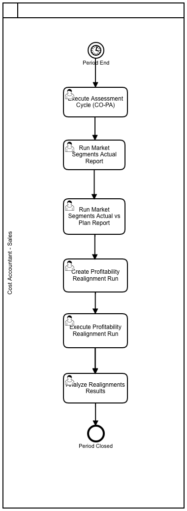

import PDFEmbed from '@/components/PDFEmbed.astro';

```
SAP COPA

```

## Process Modeling:

### Profitability and Cost Analysis:

[](https://www.sap.com "SAP")

### Types of COPA 

- Costing-based CO-PA groups costs and revenues according to value fields and Costing-based valuation approaches in a
separate persistence. This solution is already available for long period and is widely used by customers. Costing-based CO-PA
is available in SAP ERP Financials and SAP S/4HANA Finance (in maintenance mode).

- Account-based CO-PA profitability analysis is using an account-based valuation approach. Also, this solution is available for
a long period. Account-based is available only in SAP ERP Financials (in maintenance mode).

- Combined CO-PA (fka “profitability subledger”) is designed as “Best of both worlds”. Technically this is an enhancement of Costing-based CO-PA with additional persistence consisting of 4 new tables CE9xxxx_xx. It eliminates shortcomings
of the legacy versions 1. and 2. of CO-PA regarding reconciliation with GL, currencies and quantities. Combined CO-PA can be
run in addition to CB and/ or AB CO-PA and is currently available with S/4HANA.

- Simplified Profitability Analysis (fka “Profitability Analysis in the Universal Journal”) offers a new form of profitability analysis, which is part of the new product SAP S/4HANA Finance and is technically based on the former Account-based CO-PA. 

## Configuration

### Costing based COPA:

- Define Characteristics (Transaction: KEA5)
- Define Value Fields (Transaction: KEA6)
- Create Operating Concern (Transaction: KEA0)
- Assign Company Code to Controlling Area (Transaction: OX19)
- Assign Controlling Area to Operating Concern (Transaction: KEKK)
- Activate COPA (Transaction: KEKE)
- COPA: Additional Functionalities (Transaction: KECP)
- COPA: Transport (Dev, Quality system to Prod - KE3I)
- Master Data: Maintain Characteristic Values (Transaction: KES1)
- Master Data: Define Characteristic Hierarchy (Transaction: KES3)
- Master Data: Derivation Rule (Transaction: KEDR)
- Master Data: Valuation (Transaction: KE21S)
    - Valuation using Material Cost Estimate.
    - Valautio using Condition.
- Planning: (Level, Package, Parameter Set)  (Transaction: KEPM)
- Planning Methods: (Display, Copy PM) (Transaction: KEPM)
- Planning Methods: (Forecast PM) (Transaction: KE1T)
    - Top down Distribution
- Planning Methods: Ratio (Transaction: KE1I, KE16)
- Planning Methods: Valuation (Transaction: KE1I, KE16)
    - Define access to Standard Cost Estimates 
    ```
    (SPRO --> Controlling --> P.A --> Master Data --> Valuation --> Set Up Valuation using Material Cost Estimate
    --> Define access to Standard Cost Estimates)

    ```
    - Define access to actual costing/material ledger
        ```
    (SPRO --> Controlling --> P.A --> Master Data --> Valuation --> Set Up Valuation using Material Cost Estimate
    --> Define access to actual costing/material ledger)

    ```
    - Assign Costing Key to Product (Transaction: KE4H)
    - Assign costing key to material type (Transaction: KE4J)
    - Assign costing keys to any characteristics (Transaction: KEPC)
    - Assign value fields (Transaction: KE4R)
    - Create parameter (Transaction: KEPM)
    - Execute method (Transaction: KEPM)
    - Valuation Simulation (Transaction: KE21S)
        - Valaution using Material Cost Estimate
        - Valaution using Condition & Costing Sheet

- Planning Methods: Condition Table - Profitability Analysis
    - Define Condition Table (Transaction: KE4A)
    - Define Access Sequences (Transaction: KE48)
    - Create condition type & costing sheet (Transaction: 8KEV)
    - Display condition type (Transaction: KE41)
    - Assign Value Field (Transaction: KE45)
    - Define & Assign Valuation Strategy (Transaction: KE4U)
    - Valuation using condition & costing sheet (Transaction: KE4A)

- Planning Methods: Revaluation
- Planning Methods: Event (Transaction: KEPM)
- Planning Methods: Period Distribution (Transaction: KEPM)
- Planning Methods: Planning Sequence (Transaction: KEPM)

- Assessment Cycle: Create - (Transaction: KEU1)
- Assessment Cycle: Plan - (Transaction: KEU7)
- Assessment Cycle: Execute - Actual (Transaction: KEU5)
- Assessment Cycle: Execute - Plan (Transaction: KEUB)


### Costing versus Account based COPA:

| Description | Costing based | Account based |
|-------------|---------------|---------------|
| Postings | Sales Order is Created | Accounting Document is posted to Financial Accounting |
| Data Transfer | Value Fields to Costing based COPA Tables | Revenue/Cost elements to ACDOCA tables. |
| COGS Postings | With Billing Document Posting | With Post Goods Issue (PGI) |
| Reconciliation with GL | Pain point | Reconciled |
| Currencies | Op. Concern Curr; Comp.Code Curr | Cont. Area Curr, Comp.Code Curr, Tr. Curr |
| Settlement | Costs are settled from the original cost elements to the value fields to which they are assigned in the PA transfer structure | Costs are settled to the settlement cost element specified in the settlement structure |
| Parallel Valuation | Costing based COPA provides 6 parallel valuations forcalculating the cost of goods sold (COGS). This enables youcompare the standard cost for sales processes with differentproduction opportunities in different plants. | N/A |
| Sales Order Analysis | Can transfer the sales order data to Profitability Analysis =>an early analysis of profit forecast can be carried out. | N/A |
| COPA Tables | Costing based COPA Stores Data in CE1XXXX to CE1XXXX tables. CE1XXXX is actuals data CE2XXXX is Plan data. CE3XXXX & CE4XXXX contain aggregated and segment level data within the Operating Concern | Account based COPA Stores data in general CO tables. Line item actual data in ACDOCA. Line item plan data in ACDOCP. Actual line item in COEP value type not equal to 4 and not equal to 11. Plan line item in COSP & COEJ specific value types |
|-------------|---------------|---------------|


## SAP Best Practices COPA Account Structure:

<PDFEmbed src="/pdf/sap-erp-s4hana-copa/1h0I7oaphfTzy_mSqYfOyIUuBoxkvHy-q.pdf" />

<details>
<summary>Show extracted text</summary>


```text
1/19/2021
https://help.sap.com/http.svc/dynamicpdfcontentpreview?deliverable_id=23188577&topics=2f87a8cec3b44e31968f2da52b86… 2/42
94220000 - COPA Assessment
G/L Account Number
(I_SAKNR)
94220000
G/L Acct Long Text (SKAT) COPA Assessment
G/L Account Group SECC
Balance/ P&L Account P&L
Account Category Sec. Cost element
Account Purpose COPA Assessment (Content provide demo data only-by company)
Account Hierarchy Level SECONDARY ACCOUNTS | ASSESSMENT | PROFITABILITY ANALYSIS |
Used in Conguration or Master
Data
X
Where Used in the Global
Account Determination or
Master Data
CO master data
Account Usage In the documentation group for Protability Analysis, the following G/L accounts are described:
G/L Account Number
(I_SAKNR)
G/L Acct Long Text (SKAT)
94220000 COPA Assessment
94221000 COPA-overhead cost
94222000 COPA-Marketing
94223000 COPA -R&D
94224000 COPA -Admin. Overhead
94225000 COPA -Sales. Overhead
94226000 COPA-Non-Operating Expense
94227000 COPA-Non-Operating Income
94228000 COPA -Taxes
94229000 COPA -cash Discount
94229900 COPA -consulting overhead
G/L account type is ”secondary costs”. Cost element category is “42”, “Assessment”.
Within the month end closing, assessments can be used for redistribution of cost on cost center to the
protability analysis.
Process Related Information The posting amounts are distributed with the aid of a cost element type 42. This account is deposited in
the assessment cycle, for example, YA1010.
As an example, the amounts for the G/L account “63002000 Water” with 100 EUR and “63004000
Insurance” with 50 EUR have been posted at the cost center “101011601 Marketing” in the current
month.
With the assessment to the Protablility Analysis the sender cost center “101011601 Marketing” is
relieved with the G/L account “94222000 COPA-Marketing”by 150 EUR and the receiver “Protability
Analysis” is charged with 150 EUR.
1/19/2021
https://help.sap.com/http.svc/dynamicpdfcontentpreview?deliverable_id=23188577&topics=2f87a8cec3b44e31968f2da52b86… 3/42
For all other accounts the example is analogous.
For example: Test script for J55.
Posting Examples
Debit Credit
94222000 COPA-Marketing on
Protability Analysis
150 EUR
94222000 COPA-Marketing on
cost center 10101601 Marketing
150 EUR
94221000 - COPA-overhead cost
G/L Account Number
(I_SAKNR)
94221000
G/L Acct Long Text (SKAT) COPA-overhead cost
G/L Account Group SECC
Balance/ P&L Account P&L
Account Category Sec. Cost element
Account Purpose COPA Assessment (Content provide demo data only-by company)
Account Hierarchy Level SECONDARY ACCOUNTS | ASSESSMENT | PROFITABILITY ANALYSIS |
Used in Conguration or Master
Data
X
Where Used in the Global
Account Determination or
Master Data
CO master data
Account Usage In the documentation group for Protability Analysis, the following G/L accounts are described:
G/L Account Number
(I_SAKNR)
G/L Acct Long Text (SKAT)
94220000 COPA Assessment
94221000 COPA-overhead cost
94222000 COPA-Marketing
94223000 COPA -R&D
94224000 COPA -Admin. Overhead
94225000 COPA -Sales. Overhead
94226000 COPA-Non-Operating Expense
94227000 COPA-Non-Operating Income
94228000 COPA -Taxes
94229000 COPA -cash Discount
94229900 COPA -consulting overhead
1/19/2021
https://help.sap.com/http.svc/dynamicpdfcontentpreview?deliverable_id=23188577&topics=2f87a8cec3b44e31968f2da52b86… 4/42
G/L account type is ”secondary costs”. Cost element category is “42”, “Assessment”.
Within the month end closing, assessments can be used for redistribution of cost on cost center to the
protability analysis.
Process Related Information The posting amounts are distributed with the aid of a cost element type 42. This account is deposited in
the assessment cycle, for example, YA1010.
As an example, the amounts for the G/L account “63002000 Water” with 100 EUR and “63004000
Insurance” with 50 EUR have been posted at the cost center “101011601 Marketing” in the current
month.
With the assessment to the Protablility Analysis the sender cost center “101011601 Marketing” is
relieved with the G/L account “94222000 COPA-Marketing”by 150 EUR and the receiver “Protability
Analysis” is charged with 150 EUR.
For all other accounts the example is analogous.
For example: Test script for J55.
Posting Examples
Debit Credit
94222000 COPA-Marketing on
Protability Analysis
150 EUR
94222000 COPA-Marketing on
cost center 10101601 Marketing
150 EUR
94222000 - COPA-Marketing
G/L Account Number
(I_SAKNR)
94222000
G/L Acct Long Text (SKAT) COPA-Marketing
G/L Account Group SECC
Balance/ P&L Account P&L
Account Category Sec. Cost element
Account Purpose COPA Assessment (Content provide demo data only-by company)
Account Hierarchy Level SECONDARY ACCOUNTS | ASSESSMENT | PROFITABILITY ANALYSIS |
Used in Conguration or Master
Data
X
Where Used in the Global
Account Determination or
Master Data
CO master data
Account Usage In the documentation group for Protability Analysis, the following G/L accounts are described:
G/L Account Number
(I_SAKNR)
G/L Acct Long Text (SKAT)
94220000 COPA Assessment
94221000 COPA-overhead cost
94222000 COPA-Marketing
1/19/2021
https://help.sap.com/http.svc/dynamicpdfcontentpreview?deliverable_id=23188577&topics=2f87a8cec3b44e31968f2da52b86… 5/42
94223000 COPA -R&D
94224000 COPA -Admin. Overhead
94225000 COPA -Sales. Overhead
94226000 COPA-Non-Operating Expense
94227000 COPA-Non-Operating Income
94228000 COPA -Taxes
94229000 COPA -cash Discount
94229900 COPA -consulting overhead
G/L account type is ”secondary costs”. Cost element category is “42”, “Assessment”.
Within the month end closing, assessments can be used for redistribution of cost on cost center to the
protability analysis.
Process Related Information The posting amounts are distributed with the aid of a cost element type 42. This account is deposited in
the assessment cycle, for example, YA1010.
As an example, the amounts for the G/L account “63002000 Water” with 100 EUR and “63004000
Insurance” with 50 EUR have been posted at the cost center “101011601 Marketing” in the current
month.
With the assessment to the Protablility Analysis the sender cost center “101011601 Marketing” is
relieved with the G/L account “94222000 COPA-Marketing”by 150 EUR and the receiver “Protability
Analysis” is charged with 150 EUR.
For all other accounts the example is analogous.
For example: Test script for J55.
Posting Examples
Debit Credit
94222000 COPA-Marketing on
Protability Analysis
150 EUR
94222000 COPA-Marketing on
cost center 10101601 Marketing
150 EUR
94223000 - COPA -R&D
G/L Account Number
(I_SAKNR)
94223000
G/L Acct Long Text (SKAT) COPA -R&D
G/L Account Group SECC
Balance/ P&L Account P&L
Account Category Sec. Cost element
Account Purpose COPA Assessment (Content provide demo data only-by company)
Account Hierarchy Level SECONDARY ACCOUNTS | ASSESSMENT | PROFITABILITY ANALYSIS |
Used in Conguration or Master
Data
X
1/19/2021
https://help.sap.com/http.svc/dynamicpdfcontentpreview?deliverable_id=23188577&topics=2f87a8cec3b44e31968f2da52b86… 6/42
Where Used in the Global
Account Determination or
Master Data
CO master data
Account Usage In the documentation group for Protability Analysis, the following G/L accounts are described:
G/L Account Number
(I_SAKNR)
G/L Acct Long Text (SKAT)
94220000 COPA Assessment
94221000 COPA-overhead cost
94222000 COPA-Marketing
94223000 COPA -R&D
94224000 COPA -Admin. Overhead
94225000 COPA -Sales. Overhead
94226000 COPA-Non-Operating Expense
94227000 COPA-Non-Operating Income
94228000 COPA -Taxes
94229000 COPA -cash Discount
94229900 COPA -consulting overhead
G/L account type is ”secondary costs”. Cost element category is “42”, “Assessment”.
Within the month end closing, assessments can be used for redistribution of cost on cost center to the
protability analysis.
Process Related Information The posting amounts are distributed with the aid of a cost element type 42. This account is deposited in
the assessment cycle, for example, YA1010.
As an example, the amounts for the G/L account “63002000
```

</details>

## Tables:

| COPA | Description |
|-----------------|--------------|
| CE1XXXX | Costing Based: Actual Line-items |
| CE2XXXX | Costing Based: Plan Line-items |
| CE3XXXX | Costing Based: Totals records per profitability segment |
| CE4XXXX | Costing & Account Based: Profitability Segment Definitions |
| COEJ | Account Based: Actual Line-items |
| COEP | Account Based: Plan Line-items (value type ≠ 4 and ≠ 11) |
| COSP | Account Based: Primary Costs - Totals records per profitability segment |
| COSS | Account Based: Secondary Costs - Totals records per profitability segment |
| ACDOCA | Account Based: Actual Line-items |
| ACDOCP | Account Based: Plan Line-items |
|-----------------|--------------|

## Transactions:

| ECC Tr. | S4 Tr. | Description |
|-------------------|-------------------|-------------|
| KA01 | FS00 | Create Primary Cost Element |
| KA02 | FS00 | Change Cost Element |
| KA03 | FS00 | Display Cost Element |
| KA06 | FS00 | Create Secondary Cost Element |
| KE21 | KE21N | Create CO-PA line item |
| KE23 | KE24 | Display CO-PA line item |
| N/A | FAGLCOFIFLUP | Transfer CO documents from worklist to FI (Realtime – integration) |
|-------------------|-------------------|-------------|

## Programs, Function Modules and Exits:


## Platforms:

|     ECC      |  S/4 HANA    |      U/X      |  Database     |
|--------------|--------------|---------------|---------------|
|   SAP ERP    | SAP S/4 HANA |  SAP FIORI    |  SAP HANA     |
|--------------|--------------|---------------|---------------|

Note: S/4 (cloud & on-premise) works only on Hana DB while SAP ERP is compatible with Hana DB, MS Sql, Oracle DB, IBM DB2 etc.

## SAP Profitability Analysis

<PDFEmbed src="/pdf/sap-erp-s4hana-copa/1ZlIzUY5lQ_qZxb7nJrMfonhGt1iH0xFz.pdf" />

<details>
<summary>Show extracted text</summary>


```text
SAP
S4HANA – COPA
Sajiv Francis
October 2020
Table of Contents
Hierarchies for Profitability (COPA) ................................ ................................ ........................ 3
Fiori Apps ................................ ................................ ................................ ................................ ......3
Step #1: T-code: HRY_REPRELEV - Set ................................ ................................ ............................. 4
Step #2: T-code: HRRP_REP - FIN Runtime Hierarchy Replicator ................................ ....................... 5
Overview – Profitability Analysis ................................ ................................ ............................ 7
Financial Statement Version: ................................ ................................ ................................ . 7
Hierarchies for Profitability (COPA)
Fiori Apps
In S/4 HANA, we have a series of Fiori Apps available for reporting that are replacing S_ALR_xxx reports that we
used to report on Cost Center, Internal Order, Profit Center and others on actuals/plan. The old reports are still
working, but they are good for GUI, not for Fiori. (Unless you call the T-code through Fiori GUI tile)
So now you have Fiori App reports like "Cost Center - Plan/Actual YTD" or COPA "Market Segments" (replacing
KE30) among others that in order for you to use the Cost Center Hierarchy or Profit Center Hierarchy on them, you
first need to run a couple of programs to make them available in those Fiori Apps.
These Hierarchies are stored in the back end as SETs like any other SETs that we used to use in Finance for all sort
of needs. In order to be able to have them available for these Fiori Apps, you need to convert them into BW
Hierarchies as the Fiori Apps are based on BW Queries and those don't know anything about SETs, they run with
Hierarchies.
This is a 2-step process that you need to run every time you do a modification in any of those Hierarchies, so then
the changes become available in the Fiori Apps.
Step #1: T-code: HRY_REPRELEV - Set
 Report Relevancy for Hierarchies
As you can see in the screen capture, you can use the following Hierarchies
• Cost Center Group
• Cost Element Group
• Order (Ex Internal Order) Group
• Profit Center Group
• Account Group
• WBS Element Group
• Functional Area Group
Once you select the Hierarchy (Set Class) that you want to execute and get the list of the available ones. In this
case "Organizational Unit" is my SAP Best Practices Controlling Area "A000" and all the Groups that come with it.
Depending on the Set Class you selected, it could mean something different. Then you activate the "Report
Relevant" flag of the lines/lines that you want and SAVE.
Step #2: T-code: HRRP_REP - FIN Runtime Hierarchy Replicator
This step is required to be able to replicate those previous elements as hierarchies so then the Fiori Apps will be
able to use them. Without entering into too many technical details, the Fiori Apps use / show/ consume this as a
kind of BW Hierarchies, and this process is required to expose them as such.
You will go, select your Hierarchy ID that you want to replicate, enter a valid from date, and select the "Run
settings" for background or foreground. It does not take long to execute, so foreground should not be an issue.
This means that every time you do a change in any of the Hierarchies (GL, Cost Center, Profit Center, Internal
Order, WBS, etc.) you need to run these 2-Step process so you will have the latest changes available for the Fiori
Apps. Without this execution, you will not see the new changes.
This process can also be scheduled to run periodically, but this should only be in a context where you have
constant changes. (e.g., an app that would use these hierarchies, "Cost Centers Plan/Actual YTD")
Click in "Cost Center Hierarchy", click "Go"
And you will get the list of Hierarchies that were replicated. (For confidentiality reasons, I am masking the names)
Overview – Profitability Analysis
In S/4 HANA, the series of "Market Segment" Fiori Apps have replaced reporting
through T-code KE30 where we used to build custom reports based on Report Painter
technology. Now this is part of the past and we need to use these new "Market
Segment" Fiori Apps in order to do Profitability COPA reporting.
Note: This is all based on the assumption that you are running "Account Based
Profitability" as it is the recommended approach today for S/4 HANA.
Now, on an Account Based model COPA, you run all your Profitability Analysis based
on GL Accounts postings. For that, in order to do Profitability reporting / reports, you
have to build a Financial Statement Version (FSV) (Hierarchy Type FSVN, in T-code
HRRP_REP).
Once you built your Profitability FSV, you just need to run T-code HRRP_REP (Step #2
from my previous Blog post) to replicate it.
Financial Statement Versions:
For building your profitability FSV, you need to follow this IMG Path.
Then you will and create your own custom FSV for Profitability Purposes. Ex: YPA2
Enter a description, a Maintenance Language and an applicable Chart of Accounts for
this FSV. All the same as if you were configuring any other FSV as you did in the past
for FI purposes. Then click on "Financial Statement Items" to start building your
Hierarchies and GL groupings.
This is the Standard SAP Best Practices Contribution Margin report (Profitability), take a
copy of it and create your own "Z / Y" one as per your specific business requirements.
Once created and saved, you will replicate it with T-code HRRP_REP.
```

</details>
