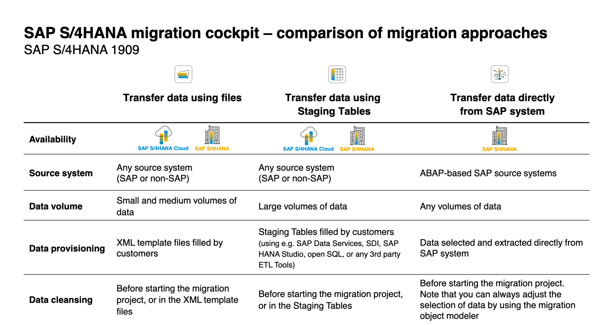

import PDFEmbed from '@/components/PDFEmbed.astro';

1. Migrate using files
2. Migrate using staging Tables
3. Migrate directly from SAP System

[](https://www.sap.com/ "DataMigration")

## S4HANA - Migration Cockpit

<PDFEmbed src="/pdf/sap-erp-s4hana-data-migration/1OVSFp00m7xyZl7xYMRd8u-ybw7eOy8Jo.pdf" />

## ECC - LSMW 

<PDFEmbed src="/pdf/sap-erp-s4hana-data-migration/1ZxSxLDjQhFWUdzwUEwicOgod1yYK1w1G.pdf" />

<details>
<summary>Show extracted text</summary>


```text
SAP LSMW
Step by Step Process
Sajiv Francis
February 2020
Table of Contents
LEGACY SYSTEM MIGRATION WORKBENCH - TRANSACTION DATA UPLOADS................................ .......3
MAINTAIN SOURCE STRUCTURES ................................ ................................ ................................ ............. 52
MAINTAIN SOURCE FIELDS ................................ ................................ ................................ .....................  55
TABLE OVERVIEW. ............................................................................................................................................ 57
PASTE THE COPIED DATA IN SAP LSMW TABLE.................................................................................................... 58
MAINTAIN STRUCTURE RELATIONS ................................ ................................ ................................ ........... 61
MAINTAIN FIELD MAPPING AND CONVERSION RULES ................................ ................................ ................... 63
SPECIFY FILES ................................ ................................ ................................ ................................ ...... 69
ASSIGN FILES ................................ ................................ ................................ ................................ ...... 75
READ DATA ................................ ................................ ................................ ................................ ........ 79
DISPLAY READ DATA ................................ ................................ ................................ .............................  81
CONVERT DATA ................................ ................................ ................................ ................................ ... 83
DISPLAY CONVERTED DATA ................................ ................................ ................................ ....................  85
CREATE BATCH INPUT SESSION ................................ ................................ ................................ ................ 87
RUN BATCH INPUT SESSION ................................ ................................ ................................ ....................  89
DOCUMENT OVERVIEW: .................................................................................................................................... 91
Legacy System Migration Workbench - Transaction data uploads
What is the LSM workbench?
The LSMW (Legacy System Migration Workbench) is a tool based on SAP software that supports single
or periodic data transfer from non-SAP to SAP systems (and with restriction from SAP to SAP system). Its
core functions are:
• Importing legacy data from PC spreadsheet tables or sequential files
• Converting data from its original (legacy system) format to the target (SAP) format
• Importing the data using the standard interfaces of SAP (IDoc inbound processing, Batch Input,
Direct Input)
Which data can be migrated using the LSMW?
• By means of standard transfer programs: a wide range of master data (e.g.  G/L accounts,
customer master, vendor master, material master, bills of material) and transaction data (e.g.
financial documents, sales orders)
• By means of recording of transactions: further data objects (if the transaction can be run in batch
input mode)
GO to SAP Easy Access Session and follow the following steps:
GO to Transaction code “LSMW” in C ommand box from the SAP Easy Access
Session/Window/Screen:
Enter Tcode – LSMW Click as below
Click on "Continue (push button)"
Update following fields with Unique name for Project, Subproject and  Object.
After update the below fields, click “Enter” than click “Create (Shift+F1)”.
Update the description for Project, Sub Project and Object and click on “Continue”.
Now “Execute” or press CTRL+F8.
Maintain Object Attributes
Step 1 : Now Select 1st step “Maintain Object Attributes” and “Execute” or press CTRL+F8.
Click on “Display<->Change” tab as shown below.
Click on “Batch Input Recording” radio button tab as shown below.
Click on recording “Overview” as shown below.
Select /click on “Recordings” as shown below.
Select /click on “Create Recordings” as shown below.
Recording Overview.
Update Recording and Description fields and click on “Continue” or Enter.
Note: In “Recording” field NO space and Special character allowed (alphanumeric allowed).
Insert Transaction code or required transaction data upload transaction code.
(In this case it is F-02/FB01).
Update Transaction code “F-02” and click on “Continue” or enter.
Transaction code F-02 Overview/window/session/screen.
Update required & necessary fields as shown below (in this case filled required some of fields for
posting). Than press “Enter”. (Header data and Debit line item).
Update “Amount” and “Text” field than click on “More data” for assign cost objects as shown
below. (Debit line item data).
Update “Cost Center” field and click on “Continue” or enter as shown below. (Debit line item data).
Screen 2:
Update “Posting Key” and “Account”. Than press “Enter”.
(Credit line item data).
Update “Amount, Value & Text” fields than click on “More data” tab as shown below.
(Credit line item data).
Update “Profit Center” and click on “Continue” or enter. (Credit line item data).
Go to “Document” tab on menu bar and click on “Simulate” option as shown below.
Entry Overview as shown below and Click on “Save” button or CTLR+S. (Debit and Credit line item).
After Save the Transaction, system enter in the below overview with “Screen Field” name and
“Transaction data” .
Note: Page 1
Note: Page 2
Click on “Default All” tab on Application toolbar.
Click on “Default All” tab, Field Name and Description will auto update as shown below.
Note: Page 1 (Debit line item data).
Note: Page 2 (Credit line item data).
Note: Page 3
(Last two row are included in page 3 and same can be ignored at the time of prepared excel file of
transaction data for uploading purpose).
Before going to next process please read and understand the below info.
Important Info:
If you compare Page 1 (Debit line) and Page 2 (Credit line) there are 4 Field names are same that are:
1.NEWBS Posting Key for the Next Line Item
2.NEWKO Account or Match code for the Next Line Item
3.WRBTR Amount in document currency
4.SGTXT  Item Text
We need to change the Page 2 (Credit line) Field name with like “NEWBS_2” for all 4 Field names.
(If we not change the second same field name, will get error at the time of file upload).
Double click on page 2 (Credit) “NEWBS” field name and change to “NEWBS_2” and click
“Continue” or enter.
Same as above process do it for remaining 3 fields that are “NEWKO”, “WRBTR” and “SGTXT”
like
“NEWKO_2”, WRBTR_2” and “SGTXT_2”.
After Completion of Field name change, click on “Save” button or CTRL+S.
Go to Menu Bar click on “System→List→Save→Local File”.
Note: Exporting the Filed name and Description in excel file for preparing the transaction data.
Select “Spreadsheet” radio button and click on “Continue” or enter.
Update “File Name.XLS” with simple name & excel format (in this case File name is
“LSMWTrans.xls) and click on “Generate” button for save the file as shown below (Save on
desktop).
Once again click on “Save” and click on “Back” button or press F3.
Again click on “Back” button for press F3.
Select “Recording field” and press F4 (Field will get update) and click on “Save” and “Back” button as
shown below.
```

</details>

## IDOCS

### IDOC Structure

- Control Record: The administration part which has the type of idoc, message type, the current status, the sender, receiver etc.

    - All control record data is stored in EDIDC table. The key to this table is the IDOC Number
    - It contains information like IDOC number, the direction(inbound/outbound),  sender, recipient information, channel it is using, which port it is using etc.
    - Direction '1' indicates outbound, '2' indicates inbound.

- Data Record: The application data record which contains the data, these are called the data records/segments.

    - Data record contains application data like employee header info, weekly details, client details etc
    - All data record data is stored in EDID2 to EDID4 tables and EDIDD is a structure where you can see its components.
    - It contains data like the idoc number, name and number of the segment in the idoc, the hierarchy and the data
    - The actual data is stored as a string in a field called SDATA, which is a 1000 char long field.

- Status Record: Gives you information about the various stages the idoc has passed through.
    - Status record is attached to an I-DOC at every milestone or when it encounter errors.
    - All status record data is stored in EDIDS table.
    - Statuses 1-42 are for outbound while 50-75 for inbound.

### IDOCS - Outbound Process

- Create segments(WE31)
- Create an idoc type(WE30)
- Create a message type (WE81)
- Associate a message type to idoc type(WE82)
- Create a port(WE21)
- If you are going to use the message control method to trigger idocs then create the function module for creating the idoc and associate the function module to an outbound process code
- If not, create the function module or stand-alone program which will create the idoc
- Create a partner profile(WE20) with the necessary information in the outbound parameters for the partner you want to exchange the idoc with to trigger the idoc.

### IDOCS - Inbound Process

- Creation of basic Idoc type (Transaction WE30)
- Creating message type (Transaction WE81)
- Associating the Message type to basic Idoc type (Transaction WE82)
- Create the function module for processing the idoc
- Define the function module characteristics (BD51)
- Allocate the inbound function module to the message type(WE57)
- Defining process code (Transaction WE42)
- Creation of partner profile (Transaction WE20)

### IDOC Configuration Guide

<PDFEmbed src="/pdf/sap-erp-s4hana-data-migration/1O-Uh_wjZBnCd_7jR963xP8SQrnmNO1fn.pdf" />

<details>
<summary>Show extracted text</summary>


```text
IDOC CONFIGURATION
January 2021
Table of Contents
IDoc Configuration ................................ ................................ ................................ ......................... 3
Purpose ................................ ................................ ................................ ................................ .........3
Prerequisites ................................ ................................ ................................ ................................ ..3
Setting Up IDoc ................................ ................................ ................................ .............................. 3
Setting Up IDoc Administrator ................................ ................................ ................................ ........3
Defining Logical System and Assign Number Range ................................ ................................ .........3
Setting Up Application Link Enabling ................................ ................................ ............................... 4
Creating IDoc Configuration File ................................ ................................ ................................ ......4
Setting Up Partner Profile ................................ ................................ ................................ ...............6
Procedure: .............................................................................................................................................................. 6
Result ..................................................................................................................................................................... 8
Changing Partner Profile Settings (Optional) ................................ ................................ ...................8
Creating BAPI/ALE Interface (Optional) ................................ ................................ ........................... 8
Background ............................................................................................................................................................ 8
Prerequisites .......................................................................................................................................................... 9
Procedure ............................................................................................................................................................... 9
IDoc Monitoring Functionality ................................ ................................ ................................ ...... 11
Prerequisite .......................................................................................................................................................... 11
Procedure ............................................................................................................................................................. 11
Troubleshooting ................................ ................................ ................................ ...........................  11
Performance of IDoc Inbound Handling in SAP ................................ ................................ .............. 11
Problem ................................................................................................................................................................ 11
Resolution ............................................................................................................................................................ 11
Appendix ................................ ................................ ................................ ................................ ..... 12
6.1 Source Code for Report Z_DM_IDOC_SETUP ................................................................................................ 12
IDoc Configuration
Purpose
This configuration guide provides the information that you need to set up the Intermediate
Document (IDoc) for processing SAP S/4HANA objects.
Prerequisites
• The Configuration Guide − Getting Started (also called Quick Guide) has been
completed successfully.
• The SAP user has sufficient authorizations for the following tasks.
Setting Up IDoc
Setting Up IDoc Administrator
1. On the SAP Easy Access screen, access the activity using the following transaction:
Transaction code SALE
2. Choose Basic Settings → IDoc Administration.
3. Switch to Change mode.
4. Select the User (US) object type.
5. In the Identification field, enter the username of a valid SAP user (to be assigned as the
IDoc administrator).
6. Save the entry.
Defining Logical System and Assign Number Range
1. On the SAP Easy Access screen, access the activity using the following transaction:
Transaction code SALE
2. Choose Basic Settings → Logical Systems → Define Logical System.
3. Choose New Entries.
4. Make the following entries:
Field User Action or Values
Logical System BOBJTFR
Name Data Transfer
5. Save the entry.
6. On the SAP Easy Access screen, enter the following data:
Transaction code OYSN
7. On the Number Range Object Maintenance screen, enter EDIDOC. Choose Number Ranges.
8. On the following screen, choose Change Intervals.
9. On the Maintain Number Range Intervals screen, the From number and To number values
are automatically generated. If not, enter those values.
10. Save the entry.
Setting Up Application Link Enabling
1. On the SAP Easy Access screen, access the activity using the following transaction:
Transaction code SALE
2. Choose IDoc Interface/Application Link Enabling (ALE) → Modelling and Implementing
Business Processes → Global Organizational Units → Cross-System Company Codes.
3. In the Choose Activity dialog box, double-click Cross-System Company Codes.
Cross-system company codes are used in distribution in financial accounting.
There’s one central system for each cross-system company code in the distributed
environment. One company code must be assigned to this cross-system company
code on each system, involved in the distribution.
When sending an IDoc with company code-dependent data, the company code is
replaced with the cross-system company code in all company code fields. When
receiving this kind of IDoc, the reverse conversion takes place on the target system.
In this section, you maintain the cross-system company codes and allocate them to
the local company codes.
4. Choose New Entries.
5. In the Company code field, enter the company code to migrate (for example, 1010).
6. Save the entry.
7. Choose Back.
8. Double-click Assign Company Code to Cross-System Company Code.
9. Scroll to the row for the company code that you’re working on (for example,1010: Company
Code 1010). In the Global CoCde column, enter the company code (for example, 1010).
10. Save the entry.
11. Repeat steps 2 to 9 for company code 1010.
Creating IDoc Configuration File
1. Create an empty text file named DM_IDoc_Partner_Profile_S4HANA.txt in the
C:\Migration_S4HANA\MISC folder.
If the MISC folder does not exist, create it.
2. Copy the following table data into the given text file that you’ve just created.
ACC_DOCUMENT BAPI X
ACC_STAT_KEY_FIG BAPI X
ACTIVITYTYPE_CREATE BAPI X
ACTIVITYTYPEGROUP_CREATE BAPI X
ACTIVITYTYPEGROUP_ADDNODE BAPI X
BANK_CREATE BAPI X
BOMMAT BOMM X
CAP_ACTOUT BAPI X
CHRMAS CHRM X
CLFMAS CLFM X
CLSMAS CLSM X
CNPMAS CNPM X
COND_A COND X
COSMAS COSM X
COSTCENTERGROUP_ADDNODE BAPI X
COSTCENTERGROUP_CREATE BAPI X
COSTTYPE_CREATE BAPI X
CREMAS CRE1 X
DEBMAS DEBM X
EQUIPMENT_CREATE BAPI X
EXCHANGE_RATE BAPI X
FIXEDASSET_CREATEINCLVALUES BAPI X
FUNC_LOC_CREATE BAPI X
INFREC INFR X
INSPECTIONPLAN_CREATE BAPI X
INTERNAL_ORDER_CREATE BAPI X
KNOMAS KNOM X
MATERIALRESERVATION_CREATE1 BAPI X
MATMAS_MASS_BAPI BAPI X
MATQM BAPI X
MBGMCR BAPI X
PORDCR1 BAPI X
PREQCR BAPI X
PROFITCENTERGROUP_ADDNODE BAPI X
PROFITCENTER_CREATE BAPI X
PROFITCENTERGROUP_CREATE BAPI X
PROJECT BAPI X
PURCONTRACT_CREATE BAPI X
PURSAG_CREATE BAPI X
QPGR BAPI X
QPMK BAPI X
QSMT BAPI X
REFSETOFOPERATIONS_C
```

</details>

## BAPI's

BAPIs are defined in the  BOR(Business object repository) as methods of SAP business object types that carry out specific business functions.They  are implemented as RFC-enabled function modules and are created in the Function Builder of the ABAP Workbench - SW01.


### List of Standardized BAPIs:

- BAPIs for Reading Data - GetList() , GetDetail() , GetStatus() , ExistenceCheck().
- BAPIs for Creating or Changing Data- Create() ,Change(),Delete() and Undelete().
- BAPIs for Mass Processing -ChangeMultiple(), CreateMultiple(), DeleteMultiple().