import PDFEmbed from '@/components/PDFEmbed.astro';

```
DOCS FOR SAP FI

```

Commands:

```
SAP FINANCE

```

## Process Modeling:

### Finance Process Flow

[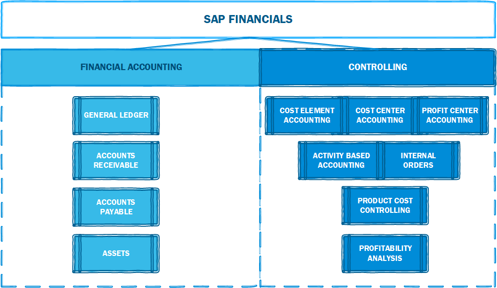](https://www.sap.com "SAP")

[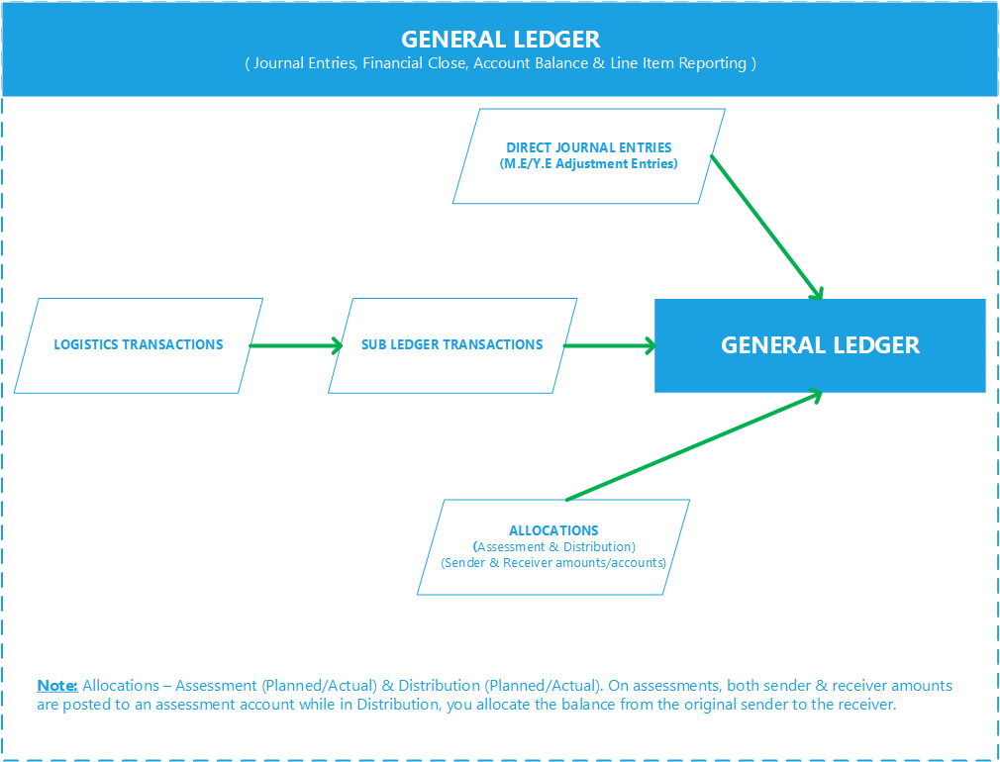](https://www.sap.com "SAP")

[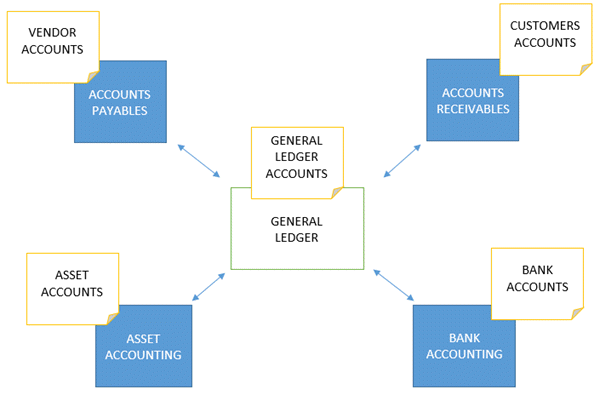](https://www.sap.com "SAP")


### Group Reporting - Financial Consolidation

[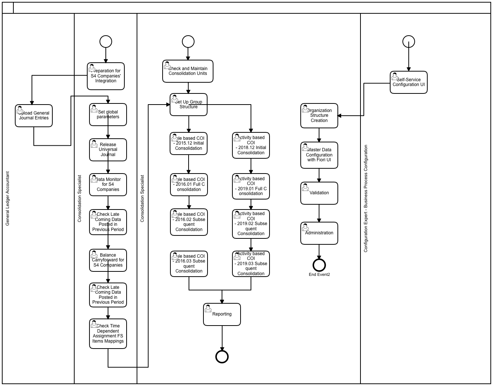](https://www.sap.com "SAP")

### Year End Closing:

[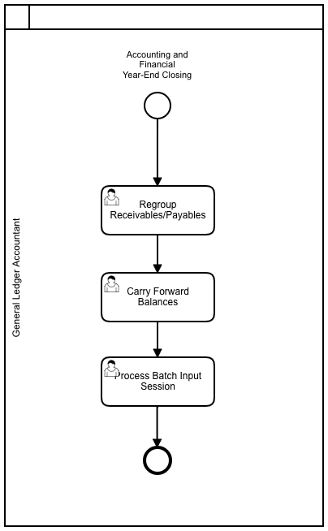](https://www.sap.com "SAP")

### Period End Closing:

[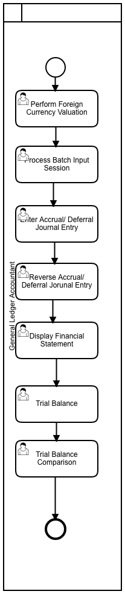](https://www.sap.com "SAP")

## SAP Best Practices Receivables Account Structure:

<PDFEmbed src="/pdf/sap-erp-s4hana-finance/1IaNAkDCaUiO9GrAGyqBnNBzEc2-ZV6Yu.pdf" />

<details>
<summary>Show extracted text</summary>


```text
1/19/2021
https://help.sap.com/http.svc/dynamicpdfcontentpreview?deliverable_id=23188577&topics=c6cf9701693c4e0e980cfe4f539d… 2/70
12543000 - Receivables from Partners (no recon acct)
G/L Account Number
(I_SAKNR)
12543000
G/L Acct Long Text (SKAT) Receivables from Partners (no recon acct)
G/L Account Group SAKO
Balance/ P&L Account Balance
Account Category Asset/Liability - AR
Account Purpose Receivables from Partners, relevant for foreign currency revaluation
Account Hierarchy Level ASSETS | CURRENT ASSETS | TRADE AND OTHER RECEIVABLES | Accounts participators
Used in Conguration or Master
Data
X
Where Used in the Global
Account Determination or
Master Data
Acct Determ. for Open Item Exch.Rate Differences
Account Usage In the documentation group for Accounts participators, the following accounts are described:
G/L Account Number (I_SAKNR) G/L Acct Long Text (SKAT)
12543000 Receivables from Partners (no recon
acct)
The Account Receivables application component records and administers accounting data of all
customers. It is also an integral part of sales management.
Features of the accounts receivable application component include the following:
All postings in Accounts Receivable are also recorded directly in the General Ledger. Different
G/L accounts are updated depending on the transaction involved (for example, receivables,
down payments, and bills of exchange)
The system contains a range of tools that you can use to monitor open items, such as account
analysis, alarm reports, due date lists, and a exible dunning program.
The correspondence linked to all these tools can be individually formulated to suit your
requirements. This is also the case for payment notices, balance conrmations, account
statements, and interest calculations.
The payment program can automatically carry out direct debiting and down payments.
Process Related Information In order to distinguish between other receivables and liabilities between shareholders and Ltd., a
separate clearing account should be established for each shareholder.
Example Germany
If the shareholder account accounts for a balance at the expense of the shareholder, he must pay
interest on it because the tax office assumes that the Ltd. would not provide a third party with a credit
free of charge. Otherwise, shareholders risk a hidden prot.
As a matter of fact, the tax authorities accept an interest rate of approximately 6% on shareholder
accounts. This interest rate is to be applied to the annual average value of the shareholder account.
Posting Examples Posting of interest on shareholder account
The shareholder account accounts for a claim of the Ltd. against its managing director for the entire
year.
1/19/2021
https://help.sap.com/http.svc/dynamicpdfcontentpreview?deliverable_id=23188577&topics=c6cf9701693c4e0e980cfe4f539d… 3/70
The balance is EUR 20000 at the beginning of the nancial year, and EUR 12000 at the end of the
nancial year. If this is the mean value, the managing director of the Ltd. owes an average of EUR 16000
during the year. This amount is payable at 6%.
The following posting occurs if interest rates are left as short-term receivables. However, you can also
postpone the interest to the shareholder account
Debit Credit
1254300 - Receivables from Partners (no recon
acct) 960EUR
70100000 - Interest Income 960EUR
12400000 - Allowance for Doubtful Receivables
G/L Account Number
(I_SAKNR)
12400000
G/L Acct Long Text (SKAT) Allowance for Doubtful Receivables
G/L Account Group ABST
Balance/ P&L Account Balance
Account Category Reconcil. Acct.
Account Purpose Reconciliation account for AR
Account Hierarchy Level ASSETS | CURRENT ASSETS | TRADE AND OTHER RECEIVABLES | Allowance for Doubtful Receivables
Used in Conguration or Master
Data
X
Where Used in the Global
Account Determination or
Master Data
Reconciliation accounts for Year-Closing/Opening posting / Account Determ.for special G/L indicators
Account Usage In the documentation group for Allowance for Doubtful Receivables, the following accounts are
described:
G/L Account Number (I_SAKNR) G/L Acct Long Text (SKAT)
12400000 Allowance for Doubtful Receivables
12401100 Allowance for Doubtful
Receivables(Valuation)
The Account Receivables application component records and administers accounting data of all
customers. It is also an integral part of sales management.
Features of the accounts receivable application component include the following:
All postings in Accounts Receivable are also recorded directly in the General Ledger. Different
G/L accounts are updated depending on the transaction involved (for example, receivables,
down payments, and bills of exchange)
The system contains a range of tools that you can use to monitor open items, such as account
analysis, alarm reports, due date lists, and a exible dunning program.
The correspondence linked to all these tools can be individually formulated to suit your
requirements. This is also the case for payment notices, balance conrmations, account
statements, and interest calculations.
The payment program can automatically carry out direct debiting and down payments.
1/19/2021
https://help.sap.com/http.svc/dynamicpdfcontentpreview?deliverable_id=23188577&topics=c6cf9701693c4e0e980cfe4f539d… 4/70
The account is a reconciliation account.
The Allowance for Doubtful Receivables Valuation Account is used as Allowance for bad debt used in
tcode F107 per IFRS 9.
Process Related Information Doubtful Receivables are made if the incoming payment appears to be uncertain and is not only
associated with a latent default risk. Reasons for this can be:
Payment delays by the customer,
Customer refuses payment due to defects,
Debtor has lodged an objection against dunning notice.
If it is still not predictable on the balance sheet date to which extent the doubtful receivables have
become unrecoverable, the loss of receivables must be estimated and amortized.
For reasons of balance sheet clarity, it is advisable to separate the balance sheet into doubtful
receivables and "normal" receivables before the balance sheet date. The account for doubtful accounts
is an active asset account. The prot is not affected by this transfer alone.
The depreciation for doubtful receivables does not automatically lead to the adjustment of the value-
added tax. An adjustment of the value-added tax is only possible if the loss of receivables is certain.
Posting Examples Company posts Doubtful Receivables
An entrepreneur has receivables in the amout of 59500 EUR (19% VAT). On the balance sheet date,
these requirements were doubtful. The entrepreneur reckons with a maximum payment inow in the
amout of 50%. The VAT can only be corrected if the payment actually fails. As of the balance sheet
date, he booked doubtful receivables.
Debit Credit
12400000 - Allowance for Doubtful Receivables
25000EUR
12100000 - Receivables Domestic 25000EUR
12401100 - Allowance for Doubtful Receivables(Valuation)
G/L Account Number
(I_SAKNR)
12401100
G/L Acct Long Text (SKAT) Allowance for Doubtful Receivables(Valuation)
G/L Account Group SAKO
Balance/ P&L Account Balance
Account Category Asset/Liability - AP
Account Purpose Allowance for bad debt used in tcode F107 per IFRS 9
Account Hierarchy Level ASSETS | CURRENT ASSETS | TRADE AND OTHER RECEIVABLES | Allowance for Doubtful Receivables
Used in Conguration or Master
Data
X
Where Used in the Global
Account Determination or
Master Data
Account Determination for Balance Sheet Transfer Postings
Account Usage In the documentation group for Allowance for Doubtful Receivables, the following accounts are
described:
G/L Account Number (I_SAKNR) G/L Acct Long Text (SKAT)
1/19/2021
https://help.sap.com/http.svc/dynamicpdfcontentpreview?deliverable_id=23188577&topics=c6cf9701693c4e0e980cfe4f539d… 5/70
12400000 Allowance for Doubtful Receivables
12401100 Allowance for Doubtful
Receivables(Valuation)
The Account Receivables application component records and administers accounting data of all
customers. It is also an
```

</details>

## SAP Best Practices Payables Account Structure:

<PDFEmbed src="/pdf/sap-erp-s4hana-finance/10KwGNvrL5ZotuMeXfRbHVYLj73cm7vnk.pdf" />

<details>
<summary>Show extracted text</summary>


```text
1/19/2021
https://help.sap.com/http.svc/dynamicpdfcontentpreview?deliverable_id=23188577&topics=aecefc96a9294a48a36d40b548f8… 2/80
21310000 - Accounts Payable - BoE Payable
G/L Account Number
(I_SAKNR)
21310000
G/L Acct Long Text (SKAT) Accounts Payable - BoE Payable
G/L Account Group ABST
Balance/ P&L Account Balance
Account Category Reconcil. Acct.
Account Purpose Reconciliation account for AP - BoE F110
Account Hierarchy Level LIABILITIES | CURRENT LIABILITIES | BILL OF EXCHANGE | Accounts Payable - BoE Payable
Used in Conguration or Master
Data
X
Where Used in the Global
Account Determination or
Master Data
Account Determ.for special G/L indicators
Account Usage In the documentation group for Bill of Exchange, the following accounts are described:
G/L Account Number
(I_SAKNR)
G/L Acct Long Text (SKAT)
21310000 Accounts Payable - BoE Payable
The following topics explain how to post and process bills of exchange.
Bills of Exchange: Overview
The following types of bill of exchange can be managed in and posted to the Accounts
Receivable:
Bills of Exchange Receivable
Bank Bills and Bills of Exchange Payment Requests
Bills of Exchange Payable
Check/bill of exchange in Accounts Receivable (reverse bill of exchange)
Check/bill of exchange in Accounts Payable (reverse bill of exchange)
Bills of exchange are handled as special General Ledger transactions in the Cloud. These
transactions are thus maintained independently of other transactions in the subsidiary ledger
and are posted to a special G/L account in the general ledger. This affords you an overview of
bills of exchange receivables and bills of exchange payables at any stage. Transfer postings are
not usually necessary to display these items on the balance sheet.
Bills of Exchange Receivable
Bills of exchange are a form of short-term nance. If your customer pays by bill of exchange, he
does not make payment immediately, but only once the period specied on the bill has elapsed
(three months, for example). Bills of exchange can be passed onto third parties for renancing
(bill of exchange usage).
A bill of exchange can be discounted at a bank in advance of its due date (discounting) . The
bank buys the bill of exchange from you. Since the bank does not receive the amount until the
date recorded on the bill, it charges you interest (discount) to cover the period between
receiving the bill of exchange and its actual payment. Some form of handling charge is also
usually levied.
1/19/2021
https://help.sap.com/http.svc/dynamicpdfcontentpreview?deliverable_id=23188577&topics=aecefc96a9294a48a36d40b548f8… 3/80
If you do not use the bill for renancing in this way, you can either present it to your customer
for payment on the due date, or deposit it at a bank shortly before the due date for collection.
The bank charges you a collection fee for this service.
In some countries, you can also pass on a bill of exchange to a third party as a means of
payment. You may pass it onto a vendor, for example, to clear your own payables (means of
payment).
You can also sell your bills of exchange receivables abroad (forfeiting). When you use the bill in
this way (otherwise known as non-recourse nancing of receivables) you are freed, from any
liability to recourse.
When you deposit a bill of exchange receivable at a bank, you can make use of the following two
functions offered by the system:
You can create a bill of exchange presentation list for your bank. If required, the system posts
this bill of exchange usage automatically. This procedure applies to bills of exchange not yet
due, for example in Italy.
You can present the bill of exchange at your bank and post the bill of exchange usage manually.
In the general ledger, the bill liability is managed in separate G/L accounts that offset the entry
in the bank account.
Once the due date has been reached and the country/region-specic protest period has
elapsed, you reverse the bill liability. You are no longer subject to any liability to recourse. The
protest period enables the last holder of a bill to make use of his or her right of recourse
whereby he or she demands that one of the parties recorded on the bill of exchange make
payment of the amount. The protest is an official record that the drawee has not paid the bill of
exchange.
By accepting a bill of exchange you incur costs which the customer pays if the bill is due later
than the invoice. When you post a bill of exchange payment, you therefore levy bill of exchange
charges on your customer. These can include interest charges (discount), and collection fees.
You can enter the bill of exchange charges when you post the bill or you can have the system
calculate them automatically. Any combination of the above-mentioned bill of exchange charges
is possible. The charges are levied on the customer automatically. Generally, bill of exchange
charges are due net immediately. If you require special terms of payment for the charges, these
can be dened in the customer master record.
In some countries, you must record bills of exchange receivable in a bill of exchange list. The bill
of exchange list is a subsidiary ledger and contains all the essential data of incoming bill of
exchange receivables. The day of expiration of the bill of exchange and the address data of the
issuer are included in this list.
In the system, you can distinguish between rediscountable and non-rediscountable bills of
exchange. Rediscountable bills of exchange must meet country/region-specic conditions that
allow a commercial bank to pass on the bill of exchange for rediscounting to the State Central
Bank. In Germany for example, the following conditions exist:
Three authorized signatures on the bill of exchange.
Remaining life may not exceed three months.
Bill of exchange must be payable at a State Central Bank city. This is a city in which the
State Central Bank has an office.
Commercial banks cannot pass on non-rediscountable bills of exchange to the State
Central Bank for rediscounting. By distinguishing between these two types of bills
during entry, you can have the system display them separately in the balance sheet. The
special G/L indicator indicates the type of bill of exchange entered. The bills of
exchange are posted to different special G/L accounts. When a change to the status of a
bill of exchange occurs, transfer postings are necessary before preparation of the
balance sheet. For example, a non-rediscountable bill of exchange becomes
rediscountable if its remaining life has changed.
1/19/2021
https://help.sap.com/http.svc/dynamicpdfcontentpreview?deliverable_id=23188577&topics=aecefc96a9294a48a36d40b548f8… 4/80
If such a distinction is not required in your country or region, you will post all bills of
exchange receivable using the same special G/L indicator.
Bank Bills and Bills of Exchange Payment Requests
Bank bills and bill of exchange payment requests are special bills of exchange receivables that
are not issued by the customer but by you. Bill of exchange payment requests are sent to the
customer for acceptance, and bank bills are passed directly on to a bank for nancing. Bank
bills are subject to a general agreement with the customer whereby the customer’s acceptance
is not required. Both payment procedures are common in Italy, France, and Spain.
Bill of Exchange List
In some countries, all bill of exchange receivables must be listed. The bill of exchange list is a
subsidiary ledger and contains all essential data of incoming bills of exchange receivable. The
day of expiration of the bill of exchange and the address data of the issuer are included in this
list. The reports for creating the bill of exchange list can be found in the Accounts Receivable
and Accounts Payable menus under the menu option Periodic processing.
Bills of Exchange Payable
You will normally use the payment program to post bills of exchange payable. All subsequent
postings, such as the payment of a bill of exchange by the bank and the cancellation of the bill
```

</details>

## Matching Principle:

Revenue and COGS should be posted in the same period as per Matching Principle in Accounting. SAP standard set up is to post COGS at Goods Issue but this can be configured per business requirement. If your business process includes Goods Issue without Billing in one period then change SAP setup to post COGS at Billing instead of at Goods Issue.

### Steps to Post COGS at Billing:

1. Transaction OBYC > GBB > VAX > Goods in transit account:

Switch the COGS account with a Goods in Transit Account, the goods issue entry will change to below

[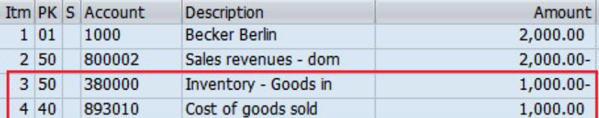](https://docs.sajivfrancis.com "SAP")

2. Transaction V/08 > Pricing Procedure > VPRS > Accrual Account Key:

Maintain a new account key and assign to VPRS:

[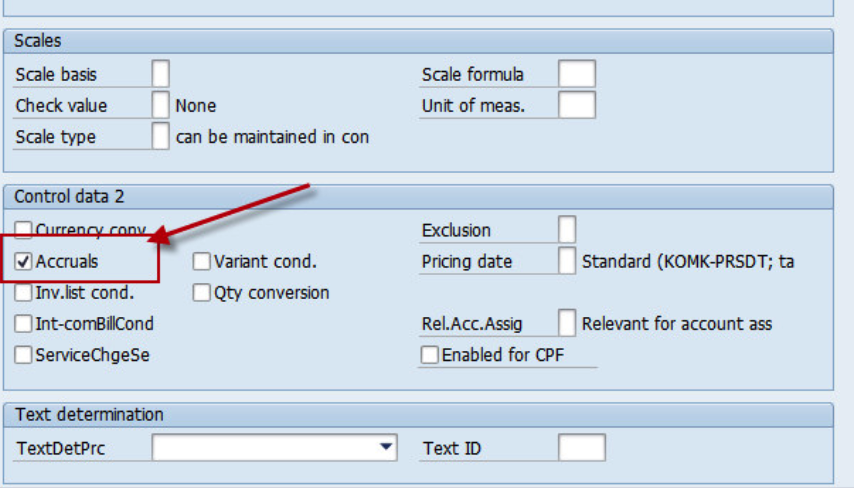](https://docs.sajivfrancis.com "SAP")

3. Transaction VKOA > Assign GL Accounts to the new Account Key:

Assign COGS account in the provision column and Goods in Transit in GL column:

[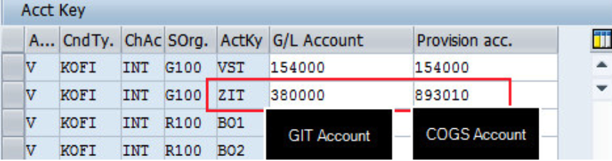](https://docs.sajivfrancis.com "SAP")

4. Change VPRS condition to accept accruals:

This tells SAP to post the VPRS value to the 2 accounts maintained in VKOA:

[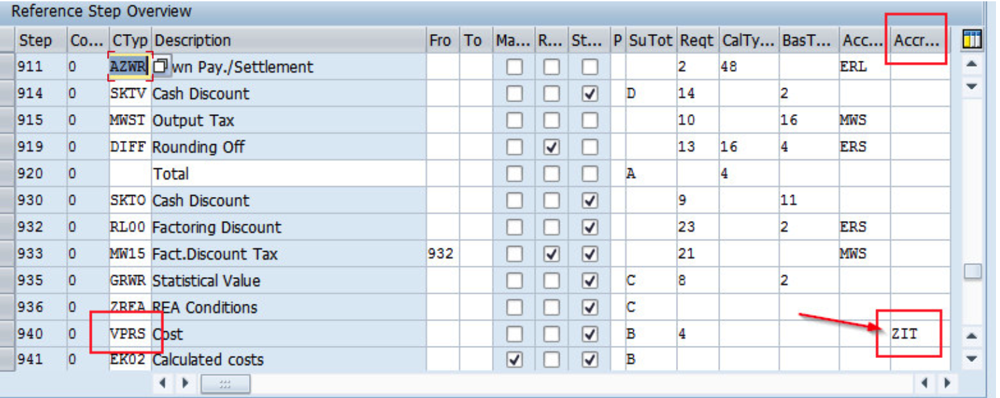](https://docs.sajivfrancis.com "SAP")

5. Billing Document Posted as below:

[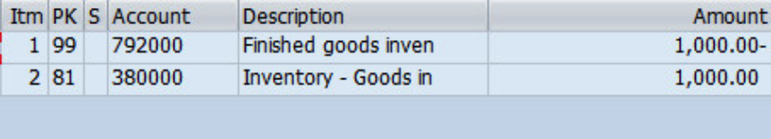](https://docs.sajivfrancis.com "SAP")


## Tables:

### Universal Journal

[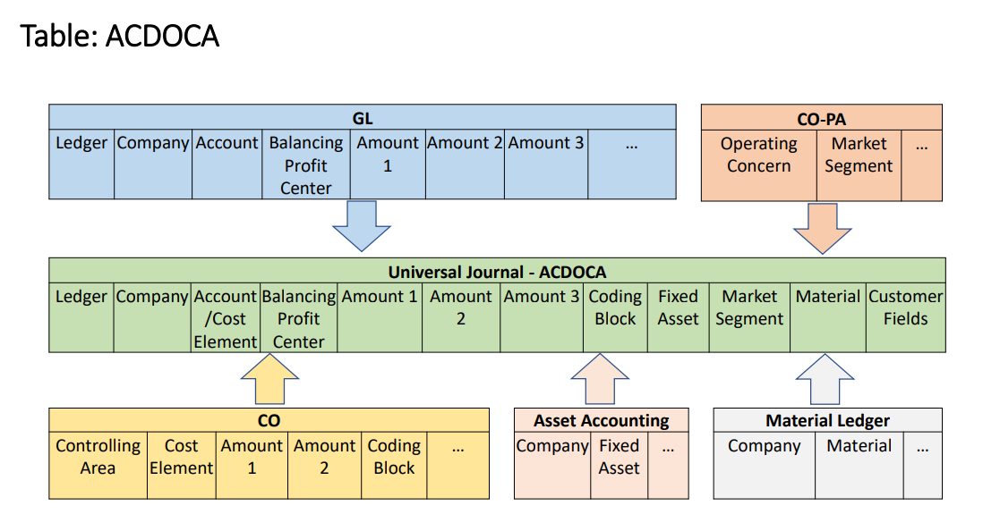](https://www.sap.com "SAP")

### Extensibility (Coding Block & COPA)

[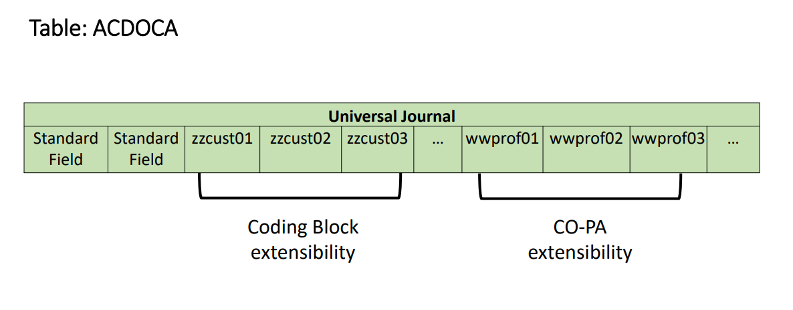](https://www.sap.com "SAP")


### List of tables

| Table | Name | S/4HANA - Notes |
|-------|------|-----------------|
| SKA1 | G/L Account Master (Chart of Accounts) | GLACCOUNT_TYPE for Cost Element Definition. Logical Database BRF GLU3 SDF. |
| SKAT | G/L Account Master Record (Chart of Accounts: Description) |  |
| SKB1 | G/L account master (company code) | In Logical Database BRF GLU3 SDF. |
| BKPF | Accounting Document Header | In Logical Database BMM BRF BRM DDF KDF SDF. |
| BSEG | Accounting Document Segment | In Logical Database BMM BRF BRM DDF KDF SDF. |
| VBKPF | Document Header for Document Parking |  |
| BSEG_ADD | Entry View of Accounting Document | When the document is not relevant for the leading ledger. |
| FAGLFLEXA | General Ledger: Items |  |
| FAGLFLEXP | General Ledger: Plan Line Items |  |
| FAGLFLEXT | General Ledger: Totals |  |
| ACDOCA | Universal Journal Entry Line Items |  |
| ACDOCC | Consolidation Journal |  |
| ACDOCP | Plan Data Line Items |  |
| T007A | Tax Keys |  |
| T007B | Tax Processing in Accounting |  |
| T007S | Tax Code Names |  |
| T030K | Tax Accounts Determination |  |
| T059A | Type of Recipient For Vendors |  |
| T059B | Withholding Tax Classes for Vendors: Names |  |
| T059C | Types of Recipient: Vendors per Withholding Tax Type |  |
| T059E | Income Types |  |
| T059F | Formulas for Calculating Withholding Tax |  |
| T059G | Income Types: Names |  |
| T059K | Withholding tax code and processing key |  |
| T059P | Withholding tax types |  |
| T059Z | Withholding tax code (enhanced functions) |  |
| T001B | Permitted Posting Periods |  |
| FAGL_SEGM | Master Data for Segments |  |
| FM01 | Financial Management Areas |  |
| T001 | Company Codes |  |
| T014 | Credit control areas |  |
| T880 | Global Company Data (for KONS Ledger) |  |
| TFKB | Functional areas |  |
| TGSB | Business Areas |  |
| TGSBK | Consolidation business areas |  |
| TKA02 | Controlling area assignment | Assigment Company Code to Controlling area. |
| NRIV | Number Range Intervals | Edit with transaction SNUM. Object=RF_Beleg for FI-documents. |
| T003 | Document Types |  |
| KNA1 | General Data in Customer Master | In Logical Database BRF DDF SD_KUSTA VC1 VC2 VDF WTY. |
| KNB1 | Customer Master (Company Code) | In Logical Database BRF DDF VDF. |
| KNB4 | Customer Payment History | In Logical Database BRF DDF. |
| KNB5 | Customer master (dunning data) | In Logical Database BRF DDF. |
| KNBK | Customer Master (Bank Details) | In Logical Database BRF DDF. |
| TIBAN | IBAN | In Logical Database IBAN. |
| BUT000 | Business Partner: General data I | In Logical Database REBP UKM_BUPA. |
| BUT020 | Business Partner: Addresses | In Logical Database REBP. |
| BUT0BK | BP: Bank Details |  |
| BUT100 | Business Partner: Roles | In Logical Database REBP. |
| CVI_CUST_LINK | Assignment Between Customer and Business Partner |  |
| BSAD | Accounting: Secondary Index for Customers (Cleared Items) |  |
| BSEC | One-Time Account Data Document Segment | In Logical Database BRM. |
| BSID | Accounting: Secondary Index for Customers | For open items migration Accounts Receivable. In Logical Database DDF VDF. |
| REGUH | Settlement data from payment program | In Logical Database PYF. |
| REGUP | Processed items from payment program | In Logical Database PYF. |
| VBSEGD | Document Segment for Customer Document Parking |  |
| FAGL_SPLINFO | Splittling Information of Open Items |  |
| NRIV | Number Range Intervals | Edit with transaction SNUM. |
| LFA1 | Vendor Master (General Section) | In Logical Database BRF KDF WTY. |
| LFB1 | Vendor Master (Company Code) | In Logical Database BRF KDF. |
| LFBK | Vendor Master (Bank Details) | In Logical Database BRF KDF. |
| LFM1 | Vendor master record purchasing organization data |  |
| CVI_VEND_LINK | Assignment Between Vendor and Business Partner |  |
| BSAK | Accounting: Secondary Index for Vendors (Cleared Items) |  |
| BSIK | Accounting: Secondary Index for Vendors | For open items migration Account Payable. In Logical Database KDF. |
| BSIP | Index for Vendor Validation of Double Documents |  |
| FPAYHX | Payment Medium: Prepared Data for Payment |  |
| REGUV | Control records for the payment program |  |
| VBSEC | Document Parking One-Time Data Document Segment |  |
| VBSEGK | Document Segment for Vendor Document Parking |  |
| VBSEGS | Document Segment for Document Parking - G/L Account Database |  |
| VBSET | Document Segment for Taxes Document Parking |  |
| T052 | Terms of Payment |  |
|-----------------|--------------|

## Transactions:

| ECC Tr. | S4 Tr. | Description |
|-------------------|-------------------|-------------|
| FS01 | FS00 | Create G/L Accounts |
| FS02 | FS00 | Change G/L Accounts |
| FS03 | FS00 | Display G/L Accounts |
| KA01 | FS00 | Create Primary Cost Element |
| KA02 | FS00 | Change Cost Element |
| KA03 | FS00 | Display Cost Element |
| KA06 | FS00 | Create Secondary Cost Element |
| F.24 | FINT | A/R: Interest for Days Overdue |
| F.2A | FINT | A/R Overdue Int.: Post (Without OI) |
| F.2B | FINT | A/R Overdue Int.: Post (with OI) |
| F.2C | FINT | Calc.cust.int.on arr.: w/o postings |
| F.4A | FINTAP | Calc.vend.int.on arr.: Post (w/o OI) |
| F.4B | FINTIAP | Calc.vend.int.on arr.: Post(with OI) |
| F.4C | FINTAP | Calc.vend.int.on arr.: w/o postings |
| FA39 | obsolete |  |
| F.47 | FINTAP | Vendors: calc.of interest on arrears |
| S_PL0_86000030 | FIS_FPM_GRID_GLACC_B AL | G/L Account Balances |
| S_PCO_36000218 | FCOM_FIS_AR_OVP | Receivables Segment |
| S_PCO_36000219 | FCOM_FIS_AP_OVP | Payables Segment |
| S_ALR_87012326 | FCOM_FIS_GLACCOUNT_O VP | Chart of Accounts |
| S_AC0_52000887 | Receivables: Profit Center | Receivables Profit Center |
| S_AC0_52000888 | Payables: Profit Center | Payables Profit center |
| S_ALR_87100992 | Account Assignment Manual |  |
| F.16 | FAGLGVTR | Balance Carry Forward |
| F04N/ F.05 | FAGL_FCV | Foreign Currency valuation |
| F101 | FAGLF101 | Regrouping |
| F.01 | FAGLF03 | Comparison: Documents/ transaction figues |
| FS10N | FAGLB03 | G/L account balances display |
| FBL3N | FAGLL03H/FBL3H | Line item display G/L |
| FBL1N | FBL1H | Vendor line items (FBL1N & FBL1H is optional) |
| FBL5N | FBL5H | Customer line items (FBL5N & FBL5H is optional) |
| N/A | FAGLCOFIFLUP | Transfer CO documents from worklist to FI (Realtime – integration) |
| N/A | FGI3 | Financial Statement |
|-----|------|---------------------|


## Programs, Function Modules and Exits:

| Programs | Description | Type |
|-----------------|--------------|--------------|
| RFBILA00  |  Financial Statements  | GL |
| RFBILA00  |  Financial Statements  | GL |
| SAPF100  |  Foreign Currency Valuation  | GL |
| RFUSVS14  |  Annual Operations Report  | GL |
| RFITEMGL  |  G/L Account Line Item Display  | GL |
| RFITEMAP  |  Vendor Line Item Display  | GL |
| RFITEMAR  |  Customer Line Item Display  | GL |
| RFPOSXEXTEND  |  Correction: Change/Activate RFPOSXEXT  | GL |
| RFWT0020  |  Recreate and Change Withholding Tax Data with Witholding TaxRate of 0%  | GL |
| RFBISA00  |  Interface for General Ledger Account Master Data  | GL |
| RFDOPR10  |  Customer Open Item Analysis by Balance of Overdue Items  | GL |
| RFUMSV25  |  Deferred Tax Transfer  | GL |
| SAPMFCJ0  |  SAPMFCJ0: Cash Journal  | GL |
| RFBNUM00  |  Gaps in Document Number Assignment  | GL |
| RFGSTAUS  |  Perform for the GST Calculation Sheet (F_RFUVAU___01)  | GL |
| RFEBCK00  |  Cashed Checks  | GL |
| RFCASH00  |  Cash Journal  | GL |
| RGGBS000  |  Exit Routines for Substitutions  | FI |
| SAPMGCU0  |  Module Pool for FI-SL Customizing  | FI |
| RGUGBR00  |  Generates ABAP Coding for Validations/Substitutions/Rules  | FI |
| RGGBR000  |  Exit Routines for Rules  | FI |
| SAPMGSBM  |  Module Pool for Set Maintenance  | FI |
| SAPMGSGM  |  Maintain Variables  | FI |
| RGZZGLUX  |  FI-SL XPRA: Generation GLU1, GLU2, FI-SL Programs  | FI |
| RGUREC10  |  Transfer Documents from Financial Accounting  | FI |
| RGURECGLFLEX  |  Transfer of Opening Balance Actual Data to General Ledger  | FI |
| SAPMGTRA  |  Transport of Customizing Objects  | FI |
| SAPFGVTR  |  Balance carryforward  | FI |
| RGUREC00  |  Example of External Data Transfer into FI-SL  | FI |
| RGIMOVV0  |  FI-SL: Generate Variable Field Movements  | FI |
| SAPMGRWJ  |  SAP Report Writer: Processing of Object Type ‘Report Group’  | FI |
| SAPMF02C  |  Credit Management Master Data  | AR |
| SAPF150D2  |  FI Dunning   Print Program | AR |
| SAPMFKM0  |  Configuration Menu: Call Transactions and Dialog Modules  | AR |
| SAPF150D  |  Dunning Notice Print (With Update of Line Items and Master Records)  | AR |
| RF150SMS  |  Program RF150SMS  | AR |
| RFDRRANZ  |  Accounts Receivable Information System  | AR |
| SAPF150V  |  Module Pool for the Dunning Program (Parameter Maintenance and Run)  | AR |
| RFDUZI00  |  Calculate Interest on Arrears  | AR |
| SAPMFKD0  |  Dunning Procedure Customizing  | AR |
| RFCORR14  |  Resetting of Dunning Run via MHNK/MHND  | AR |
| SAPMFBWE  |  Bill of Exchange Presentation  | AR |
| RFDRRE05  |  Due Date Analysis   Create Evaluations (Subroutine Pool) | AR |
| RFDKLI41  |  Credit Master Sheet  | AR |
| RFDKLI40  |  Credit Overview  | AR |
| SAPMF02K  |  Vendor Master Data  | AP |
| RFFOUS_C  |  International Payment Medium   Check (with check management) | AP |
| RFFOUS_T  |  Payment Medium USA   Transfers/Bank Direct Debits in ACH Format | AP |
| RFFOEDI1  |  International Payment Medium   Payment Orders by EDI | AP |
| RFFOAVIS_FPAYM  |  Payment Medium   Correspondence for Generic Payment Medium Program | AP |
| RFWT0010  |  Adjustment of Withholding Tax Information to Relevant Types  | AP |
| SAPF110S  |  Payment Program  | AP |
| RFFOCH_P  |  Payment Medium Switzerland   Postal Giro/SAD/BAD | AP |
| RFFOM100  |  International Payment Medium   SWIFT Format MT100 | AP |
| RFZALI20  |  Payment List  | AP |
| RFFOCH_U  |  Payment Medium Switzerland   Transfers, Bank Collection / DME | AP |
| SAPMFCHK  |  Check management module pool  | AP |
| RFFOAVIS  |  Payment Medium International   Zero Balance Notice | AP |
| RFW1099M  |  USA: Withholding Tax Report for 1099-MISC  | AP |
| RFFOGB_T  |  Payment Medium Great Britain and Ireland   BACWAY, BACSBOX, EFTS, EMTS | AP |
| RFFOD__L | Payment Medium Germany - Pmts in Ger.For.Tr.Regs (Z1 Form)/Foreign DME | PMW |
| RFFOD__S | International Payment Medium - Check (without check management) | PMW |
| RFFOUS_T | Payment Medium USA - Transfers/Bank Direct Debits in ACH Format | PMW | 
| RFFOM200 | International Payment Medium - SWIFT Format MT200 | PMW | 
| RFFOM202 | International Payment Medium - SWIFT Format MT202 | PMW |
| RFFOM210 | International Payment Medium - SWIFT Format MT210 | PMW |
|-----------------|--------------|--------------|


## Platforms:

|     ECC      |  S/4 HANA    |      U/X      |  Database     |
|--------------|--------------|---------------|---------------|
|   SAP ERP    | SAP S/4 HANA |  SAP FIORI    |  SAP HANA     |
|--------------|--------------|---------------|---------------|

Note: S/4 (cloud & on-premise) works only on Hana DB while SAP ERP is compatible with Hana DB, MS Sql, Oracle DB, IBM DB2 etc.

## Finance S4 - 1909 Doc:

<PDFEmbed src="/pdf/sap-erp-s4hana-finance/1eT_MkMTv1muO6ZXd2tmsaFwpfUL4Rtdc.pdf" />

<details>
<summary>Show extracted text</summary>


```text
PUBLIC
Michel Haesendonckx, SAP SE
September 2019
Finance in SAP S/4HANA 1909
2PUBLIC© 2019 SAP SE or an SAP affiliate company. All rights reserved.  ǀ
The information in this presentation is confidential and proprietary to SAP and may not be disclosed without the permission of SAP.
Except for your obligation to protect confidential information, this presentation is not subject to your license agreement orany other service
or subscription agreement with SAP. SAP has no obligation to pursue any course of business outlined in this presentation or any related
document, or to develop or release any functionality mentioned therein.
This presentation, or any related document and SAP's strategy and possible future developments, products and or platforms directions and
functionality are all subject to change and may be changed by SAP at any time for any reason without notice. The information in this
presentation is not a commitment, promise or legal obligation to deliver any material, code or functionality.  This presentation is provided
without a warranty of any kind, either express or implied, including but not limited to, the implied warranties of merchantability, fitness for a
particular purpose, or non-infringement. This presentation is for informational purposes and may not be incorporated into a contract. SAP
assumes no responsibility for errors or omissions in this presentation, except if such damages were caused by SAP’s intentional or gross
negligence.
All forward-looking statements are subject to various risks and uncertainties that could cause actual results to differ materially from
expectations. Readers are cautioned not to place undue reliance on these forward-looking statements, which speak only as of their dates,
and they should not be relied upon in making purchasing decisions.
Disclaimer
3PUBLIC© 2019 SAP SE or an SAP affiliate company. All rights reserved.  ǀ
SAP S/4HANA Customer Story Flipbook
Including Finance Transformation examples
SAP S/4HANA Customer Story Flipbook
4PUBLIC© 2019 SAP SE or an SAP affiliate company. All rights reserved.  ǀ
Examples:
Superior Steering with Intelligent Accounting and Financial
Close (Christoph Ernst 13 min)
Automating Closing and Consolidation (Elizabeth Milne 14 min)
Start your Finance Transformation with Central Finance (David
Ormerod 15 min)
Machine Learning in Finance (Sebastian Schroetel 17 min)
Predictive Accounting (Michel Haesendonckx 10 min)
Margin Analysis (Michel Haesendonckx 19 min)
… and far more (customer testimonials, panels, whitepapers,…)
Finance topics on YouTubeand on the Virtual Finance Summit platform
Finance SAP S/4HANA 1809 “What’s new” information
(also accessible via blog here):
Finance 1809 Overview (Michel Haesendonckx)
https://youtu.be/CzPhDejuft8
Margin Analysis (Michel Haesendonckx)
https://youtu.be/TfbthMsYcrc
Predictive Accounting (Michel Haesendonckx)
https://youtu.be/yH-HJWeDyXA
Embedded Analytics (Michel Haesendonckx)
https://youtu.be/wpakxWVEQv8
Accruals Management (Christoph Ernst)
https://youtu.be/wEru-hqfj1w
Goods and Invoice Receipt Reconciliation (Christoph Ernst)
https://youtu.be/jJXqWF1wJkw
Group Reporting (Christoph Ernst)
https://youtu.be/mwn3O1rxd0I
Tax Service (Stefanie Schuetz-Tschiersky)
https://youtu.be/EEhIAJfQjXM
Treasury (Christian Mnich)
https://www.youtube.com/watch?v=cGQuSpdaBS8
SAP Finance playlist on YouTube:
https://www.youtube.com/playlist?list=PL3ZRUb1AKkpTQ
scw2i-DjiEv0C-PTQINd
SAP Offering for Record-to-Report and FP&A in SAP
S/4HANA (Michel Haesendonckx) on YouTube:
Why move to SAP S/4HANA for Accounting and FP&A: An
extensive process view
E2E view on financials – Enabling group-wide steering
(Michel Haesendonckx) on YouTube:
https://www.youtube.com/watch?v=_tZTVdOzRds
Video Overview 1909 What’s New Videos 1809 What’s New Videos
Virtual Summit (link)
SAP S/4HANA 1909 - Finance “What’s new” information
(also accessible via blog on sap.com/finance ):
1909 - Highlights for Finance and Risk (Benno Eberle)
https://youtu.be/Jc7_sZHDESQ
1909 – SAP Contract and Lease Management (Tom Anderson)
https://youtu.be/280GPAHPz-E
1909 – SAP Receivables Management (Nicole Baranov)
https://youtu.be/I5KWi7PxBMI
1909 – SAP Treasury Management (Arif Esa)
https://youtu.be/NyJKmaaVNRU
1909 – Orchestrating an Accelerated Financial Close
(Katharina Reichert) https://youtu.be/Kw_nZ_BLADY
1909 – SAP S/4HANA for Group Reporting (Philip Aliband)
https://youtu.be/3M7a1lsMrL8
(All Michel Haesendonckx:)
1909 - Driver-based Planning with SAP S/4HANA and SAP
Analytics Cloud  - https://youtu.be/hYCCIX6SN4U )
1909 - Margin Analysis with SAP S/4HANA Cloud and On
Premise - https://youtu.be/f6IAs5EUiP0
1909 - Universal Allocation in SAP S/4HANA
https://youtu.be/XvxIrzSRxck
1909 - Embedded Analytics - Integrating S/4HANA and SAC -
https://youtu.be/PP4MERLl69w
5PUBLIC© 2019 SAP SE or an SAP affiliate company. All rights reserved.  ǀ
THE pricing guide for Accounting and Closing can be retrieved from:
https://jam4.sapjam.com/groups/RPadq9Uyvh8E1ChNAx59ry/documents/nWumpB3LMB1XorPf9J3
vwn/slide_viewer?_lightbox=true
Latest version of this slide deck can be retrieved from:
https://jam4.sapjam.com/groups/RPadq9Uyvh8E1ChNAx59ry/documents/jbvqL8bPIYEhBz4euQ7F
x7/slide_viewer?_lightbox=true
INTERNAL – Pricing guide and latest version of slide deck
6PUBLIC© 2019 SAP SE or an SAP affiliate company. All rights reserved.  ǀ
SAP S/4HANA – Accounting at the Heart of Every Enterprise
Transform from executing daily operations to drive growth and new business models
Margin Analysis Simulate & OptimizeManagement
Accounting
Financial CloseRecord Financial ReportingFinancial
Accounting
FP&A
Financial Planning
& Analysis
R2R
Record-to-Report
Plan & Predict
https://www.youtube.com/watch?v=mWmiAsY8y4w
Plan & Prepare Accounting Close Report & Steer
7PUBLIC© 2019 SAP SE or an SAP affiliate company. All rights reserved.  ǀ
 SAP S/4HANA Central
Finance:
• Accounting View on
Logistics Information
(AVL)
• Indirect tax
reporting
 Accruals management
 SAP S/4HANA for goods
and invoice receipt
reconciliation
 Time-dependent Tax
 T-Account Display
 SAP Account Reconciliation
and Automation
by Blackline
 SAP S/4HANA Cloud for
Advanced Financial
Closing
 SAP S/4HANA for Group
Reporting
 SAP Intercompany
Financial Hub
by Blackline
 SAP Intelligent Robotic
Process Automation
 SAP Revenue Accounting
and Reporting (IFRS 15)
 SAP S/4HANA Cloud for
Contract & Lease
Management (IFRS 16)
R2R
Record-to-Report
Financial CloseRecord Financial ReportingFinancial
Accounting
Plan & Prepare Accounting Close Report & Steer
SAP S/4HANA Record-to-Report
What’s new in S/4HANA Finance 1909
New
Enhanced
Enhanced
New
New
Enhanced
Enhanced
Enhanced
New
Enhanced
New
Topic specific video
available on YouTube
(see resources overview)
8PUBLIC© 2019 SAP SE or an SAP affiliate company. All rights reserved.  ǀ
Margin AnalysisPlan & Predict Simulate & OptimizeManagement
Accounting
 Financial planning content,
integrated with SAP Analytics
Cloud for Planning
 Predictive accounting
 Universal Allocation
 Where used list
 Real Spend
 Margin Analysis
 Financial Statement
Insights
 SAP Analytics Cloud and
embedded reporting
 Customer Profitability
Analytics
FP&A
Financial Planning
& Analysis
Plan & Prepare Accounting Close Report & Steer
SAP S/4HANA Financial Planning & Analysis
What’s new in S/4HANA Finance 1909
New
Integrated
Enhanced
Enhanced
New
Enhanced
Enhanced
Enhanced
New
Topic specific video
available on YouTube
(see resources overview)
9PUBLIC© 2019 SAP SE or an SAP affiliate company. All rights reserved.  ǀ
overview
Area Key Topic/Enhancements to be planned with 1909 On premise Separate
License
R2R Record Central Finance: Indirect Tax Reporting 1809, FPS02 x (CF + ACR)
Financial Accounting Accruals Management: ML-Service 1909 x (only ML-
service)
Goods and Invoice Receipt Reconciliation: ML-Service + Enhancements 1909 x
Time-dependent tax code Tbd. (not 1909)
T-Account Display 1909
SAP Account Reconciliation and Autom
```

</details>
