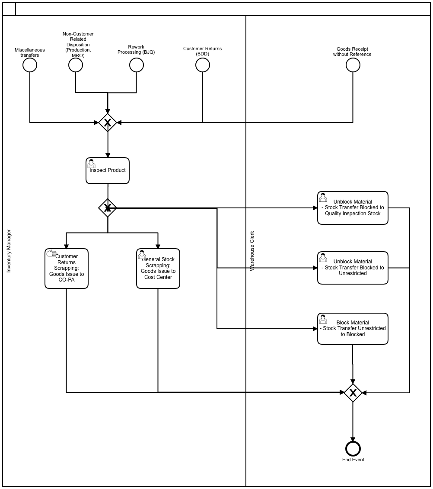
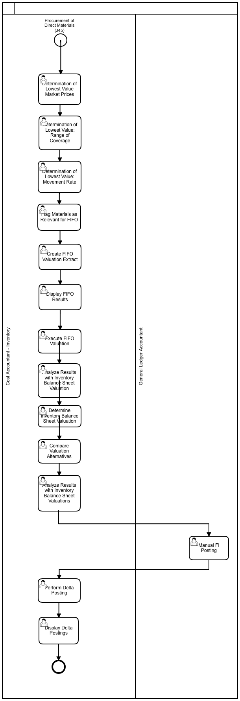
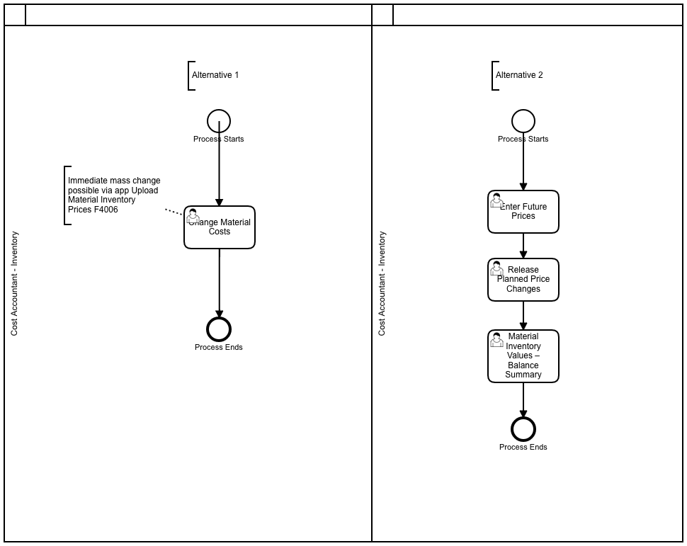

import PDFEmbed from '@/components/PDFEmbed.astro';

```
DOCS related to Inventory Valuation & Management

```

## Process Modeling:

### Core Inventory Management

[](https://www.sap.com "SAP")

### Inventory Valuation for Year End Closing

[](https://www.sap.com "SAP")

### Managing Material Price Changes & Inventory Values

[](https://www.sap.com "SAP")


## SAP Best Practices Inventory Account Structure:

<PDFEmbed src="/pdf/sap-erp-s4hana-inventory/15hgsskJjLOFgNhsDzqoqQZRC4_2Pel1s.pdf" />

<details>
<summary>Show extracted text</summary>


```text
1/19/2021
https://help.sap.com/http.svc/dynamicpdfcontentpreview?deliverable_id=23188577&topics=6d9d9941af3547b79a31999550a… 2/35
12110000 - Other Down Payments Made Current Assets
G/L Account Number
(I_SAKNR)
12110000
G/L Acct Long Text (SKAT) Other Down Payments Made Current Assets
G/L Account Group ABST
Balance/ P&L Account Balance
Account Category Reconcil. Acct.
Account Purpose Reconciliation account for AR, relevant for open item reclassication and foreign currency revaluation
Account Hierarchy Level ASSETS | CURRENT ASSETS | INVENTORIES | Advances to suppliers for Inventories
Used in Conguration or Master
Data
X
Where Used in the Global
Account Determination or
Master Data
Acct Determ. for Open Item Exch.Rate Differences / Reconciliation accounts for Year-Closing/Opening
posting / Account Determ.for Balance Sheet Transfer Postings / Account Determ.for special G/L
indicators
Account Usage In the documentation group for Advances to suppliers for Inventories, the following accounts are
described:
G/L Account Number (I_SAKNR) G/L Acct Long Text (SKAT)
12110000 Other Down Payments Made Current
Assets
12112000 Down Payments made for Inventory
12113000 Input Tax Clearing Inventory Down
Payments made
These accounts are used in goods movement processes.
Goods movement is a process that causes a change to stock.
Goods Receipt
A goods receipt (GR) is a movement of goods, with which the receipt of goods is posted by an
external supplier or from production. A goods receipt leads to an increase in the stock level.
Goods issue
A goods issue (WA) is a goods movement with which a material withdrawal or issue, a material
consumption or a shipment of goods to a customer is posted. A goods issue results in a
reduction in the inventory.
Rearrangement
A stock transfer is the removal of materials from a particular storage location and their storage
at another storage location. Rearrangements can take place both within the same plant and
between two plants.
Transfer
A transfer is an override for stock transfers and changes to the stock identication or
qualication of a material, regardless of whether the posting is associated with a physical
movement or not.
Summary:
1/19/2021
https://help.sap.com/http.svc/dynamicpdfcontentpreview?deliverable_id=23188577&topics=6d9d9941af3547b79a31999550a… 3/35
Purchasing of raw material and supplies or goods is not an expense, but is recorded as an asset-
neutral item in the case of cash payment and as an asset-liability item in the case of payment to
the target
Discounts (bonuses, discounts) reduce the acquisition costs and are booked accordingly
The following accounts are reconciliation accounts:
G/L Account Number (I_SAKNR) G/L Acct Long Text (SKAT)
12110000 Other Down Payments Made Current
Assets
12112000 Down Payments made for Inventory
Process Related Information
Posting Examples
12112000 - Down Payments made for Inventory
G/L Account Number
(I_SAKNR)
12112000
G/L Acct Long Text (SKAT) Down Payments made for Inventory
G/L Account Group ABST
Balance/ P&L Account Balance
Account Category Reconcil. Acct.
Account Purpose Reconciliation account for AR
Account Hierarchy Level ASSETS | CURRENT ASSETS | INVENTORIES | Advances to suppliers for Inventories
Used in Conguration or Master
Data
X
Where Used in the Global
Account Determination or
Master Data
Reconciliation accounts for Year-Closing/Opening posting
Account Usage In the documentation group for Advances to suppliers for Inventories, the following accounts are
described:
G/L Account Number (I_SAKNR) G/L Acct Long Text (SKAT)
12110000 Other Down Payments Made Current
Assets
12112000 Down Payments made for Inventory
12113000 Input Tax Clearing Inventory Down
Payments made
These accounts are used in goods movement processes.
Goods movement is a process that causes a change to stock.
Goods Receipt
1/19/2021
https://help.sap.com/http.svc/dynamicpdfcontentpreview?deliverable_id=23188577&topics=6d9d9941af3547b79a31999550a… 4/35
A goods receipt (GR) is a movement of goods, with which the receipt of goods is posted by an
external supplier or from production. A goods receipt leads to an increase in the stock level.
Goods issue
A goods issue (WA) is a goods movement with which a material withdrawal or issue, a material
consumption or a shipment of goods to a customer is posted. A goods issue results in a
reduction in the inventory.
Rearrangement
A stock transfer is the removal of materials from a particular storage location and their storage
at another storage location. Rearrangements can take place both within the same plant and
between two plants.
Transfer
A transfer is an override for stock transfers and changes to the stock identication or
qualication of a material, regardless of whether the posting is associated with a physical
movement or not.
Summary:
Purchasing of raw material and supplies or goods is not an expense, but is recorded as an asset-
neutral item in the case of cash payment and as an asset-liability item in the case of payment to
the target
Discounts (bonuses, discounts) reduce the acquisition costs and are booked accordingly
The following accounts are reconciliation accounts:
G/L Account Number (I_SAKNR) G/L Acct Long Text (SKAT)
12110000 Other Down Payments Made Current
Assets
12112000 Down Payments made for Inventory
Process Related Information
Posting Examples
12113000 - Input Tax Clearing Inventory Down Payments made
G/L Account Number
(I_SAKNR)
12113000
G/L Acct Long Text (SKAT) Input Tax Clearing Inventory Down Payments made
G/L Account Group SAKO
Balance/ P&L Account Balance
Account Category Tax
Account Purpose Tax clearing account
Account Hierarchy Level ASSETS | CURRENT ASSETS | INVENTORIES | Advances to suppliers for Inventories
Used in Conguration or Master
Data
Where Used in the Global
Account Determination or
1/19/2021
https://help.sap.com/http.svc/dynamicpdfcontentpreview?deliverable_id=23188577&topics=6d9d9941af3547b79a31999550a… 5/35
Master Data
Account Usage In the documentation group for Advances to suppliers for Inventories, the following accounts are
described:
G/L Account Number (I_SAKNR) G/L Acct Long Text (SKAT)
12110000 Other Down Payments Made Current
Assets
12112000 Down Payments made for Inventory
12113000 Input Tax Clearing Inventory Down
Payments made
These accounts are used in goods movement processes.
Goods movement is a process that causes a change to stock.
Goods Receipt
A goods receipt (GR) is a movement of goods, with which the receipt of goods is posted by an
external supplier or from production. A goods receipt leads to an increase in the stock level.
Goods issue
A goods issue (WA) is a goods movement with which a material withdrawal or issue, a material
consumption or a shipment of goods to a customer is posted. A goods issue results in a
reduction in the inventory.
Rearrangement
A stock transfer is the removal of materials from a particular storage location and their storage
at another storage location. Rearrangements can take place both within the same plant and
between two plants.
Transfer
A transfer is an override for stock transfers and changes to the stock identication or
qualication of a material, regardless of whether the posting is associated with a physical
movement or not.
Summary:
Purchasing of raw material and supplies or goods is not an expense, but is recorded as an asset-
neutral item in the case of cash payment and as an asset-liability item in the case of payment to
the target
Discounts (bonuses, discounts) reduce the acquisition costs and are booked accordingly
The following accounts are reconciliation accounts:
G/L Account Number (I_SAKNR) G/L Acct Long Text (SKAT)
12110000 Other Down Payments Made Current
Assets
12112000 Down Payments made for Inventory
Process Related Information
Posting Examples
13400000 - Inventory - Finished Goods
1/19/2021
https://help.sap.com/http.svc/dynamicpdfcontentpreview?deliverable_id=23188577&topics=6d9d9941af3547b79a31999550a… 6/35
G/L Account Number
(I_SAKNR)
13400000
G
```

</details>

## Tables:

| Table | Name | S/4HANA - Notes |
|-------|------|-----------------|
| IKPF | Header: Physical Inventory Document | In Logical Database IMM INM IRM. |
| ISEG | Physical Inventory Document Items | In Logical Database IMM INM IRM. |
| MCHB | Batch Stocks | In Logical Database /SAPSLL/CUSMSM MSM. |
| MKOL | Special Stocks from Vendor | In Logical Database MSM. |
| MSKA | Sales Order Stock |  |
| MSKU | Special Stocks with Customer |  |
| MSLB | Special Stocks with Supplier |  |
| MSPR | Project Stock |  |
| MSSA | Total Customer Orders on Hand |  |
| MSSQ | Project Stock Total |  |
| MSTB | Stock in Transit |  |
| MSTE | Stock in Transit to Sales and Distribution Document |  |
| MSTQ | Stock in Transit for Project |  |
|-------|------|-----------------|


## Programs, Function Modules and Exits:

| Programs | Description | Type |
|-----------------|--------------|--------------|
|-----------------|--------------|--------------|

## Role-based Fiori Apps:

- Material Inventory Values - Rounding Diff (Design Studio)
- Schedule Inventory Accounting Jobs


## Platforms:

|     ECC      |  S/4 HANA    |      U/X      |  Database     |
|--------------|--------------|---------------|---------------|
|   SAP ERP    | SAP S/4 HANA |  SAP FIORI    |  SAP HANA     |
|--------------|--------------|---------------|---------------|

Note: S/4 (cloud & on-premise) works only on Hana DB while SAP ERP is compatible with Hana DB, MS Sql, Oracle DB, IBM DB2 etc.
