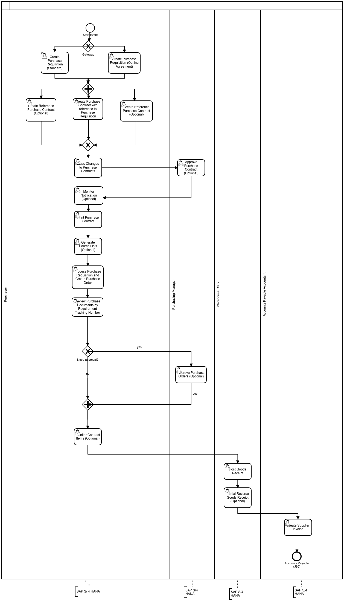
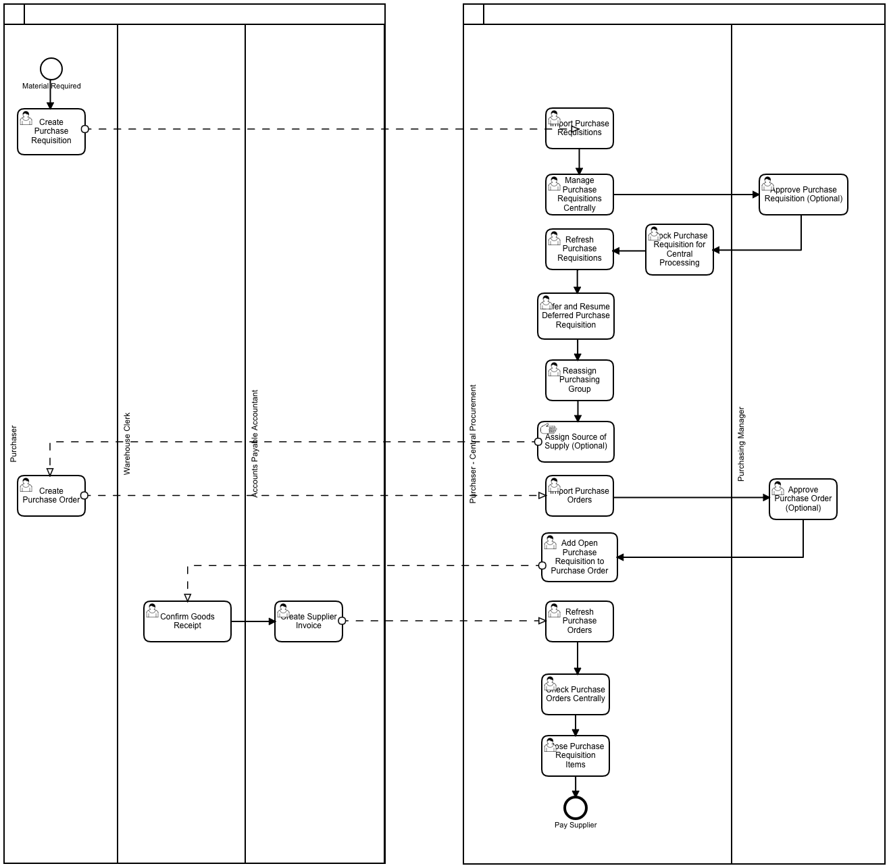

```
DOCS related to Materials Management in SAP

```

Commands:

```
SAP MM ...

```

## Process Modeling:

### Purchase Contract:

[](https://www.sap.com "SAP")

### Central Purchasing:

[](https://www.sap.com "SAP")

### Material Types:

| Material types | Description |
|----------------|-------------|
| ROH  | Raw materials |
| KMAT | Configurable Materials |
| HALB | Semi finished materials |
| LIEH | Returnable Packaging |
| HIBE | Operating Supplies |
| HAWA | Trading goods |
| FERT | Finished products |
| ERSA | Spare Parts |
| VERP | Packing Material |
| NLAG | Non stock items |
| PIPE | Pipe line |
| DIEN | Services |
| UNBW | Non valuated items |
|----------------|-------------|

Note: Configuration - Material Valuation by Material Type (MAP vs Standard)

### Material Views:

| Sr.No. | Material Type | Basic Data | Sales  | MRP  | Purchase  | Store  | Accounting | Forecaste | Costing |
|----|------|---|---|---|---|---|---|---|---|
| 1 | ROH | X | - | X | X | X | X | X | - |
| 2 | KMAT | X | X | X | X | X | X | X | - |
| 3 | HALB | X | X | X | X | X | X | X | - |
| 4 | LIEH | X | - | - | X | X | X | - | X |
| 5 | HIBE | X | - | X | X | X | X | X | - |
| 6 | NLAG | X | - | X | X | X | X | X | - |
| 7 | HAWA | X | X | X | - | X | X | X | - |
| 8 | FERT | X | - | X | X | X | X | X | - |
| 9 | ERSA | X | - | - | X | - | X | - | - |
| 10 | VERP | X | - | - | X | X | - | - | - |
| 11 | PIPE | X | - | - | X | X | - | - | - |
| 12 | DIEN | X | - | - | X | X | - | - | - |
| 13 | UNBW | X | - | - | X | X | - | - | - |
|----|------|---|---|---|---|---|---|---|---|

### Material Groups:

| Sr. No | Material Group | Code (SAP) |
|--------|----------------|------------|
| 1 | 21 | MT21 |
| 2 | 22 | MT22 |
| 3 | 23 | MT23 |
| 4 | 24 | MT24 |
| 5 | 25 | MT25 |
| 6 | 26 | MT26 |
| 7 | 27 | MT27 |
| 8 | 28 | MT28 |
| 9 | 29 | MT29 |
| 10 | 30 | MT30 |
| 11 | 31 | MT31 |
| 12 | 32 | MT32 |
| 13 | 33 | MT33 |
| 14 | 34 | MT34 |
| 15 | 35 | MT35 |
| 16 | 36 | MT36 |
| 17 | 37 | MT37 |
| 18 | 38 | MT38 |
| 19 | 39 | MT39 |
| 20 | 40 | MT40 |
| 21 | 41 | MT41 |
|--------|----------------|------------|


## Tables:

| Table | Name | S/4HANA - Notes |
|-------|------|-----------------|
| MAEX | Material Master: Legal Control |  |
| MAKT | Material Descriptions | Field ‘Mat. desc MAKTG' for search. Logical Database MMIMRKPFRESB S1L S2L. |
| MAKV | Material Cost Distribution |  |
| MAKZ | Material cost distribution equivalence numbers |  |
| MAPE | Material Master: Export Control File |  |
| MAPL | Assignment of Task Lists to Materials | In Logical Database PNM PNM_OLD. |
| MARA | General Material Data | In Logical Database /SAPSLL/CUSMSM BAM BKM BMM CKM EBM ECM ENM ESM IFM S1L WTY. |
| MARC | Plant Data for Material | S/4: Master data without stock aggregates. In Logical Database /SAPSLL/CUSMSM S1L. |
| MARD | Storage Location Data for Material | S/4: Master data without stock aggregates. In Logical Database /SAPSLL/CUSMSM MSM. |
| MARM | Units of Measure for Material | In Logical Database MSM. |
| MARV | Material Control Record | Current MM-Period. |
| MAST | Material to BOM Link | In Logical Database CKA CSR. |
| MBEW | Material Valuation | In Logical Database /SAPSLL/CUSMSM BMM CKA. |
| MDFD | MRP firming date |  |
| MDIP | Material: MRP Profiles (Field Contents) |  |
| MKAL | Production Versions of Material |  |
| MLAN | Tax Classification for Material |  |
| MLGN | Material Data for Each Warehouse Number | In Logical Database MSM S1L. |
| MLGT | Material Data for Each Storage Type | In Logical Database MSM. |
| MPGD_MASS | Planning Data |  |
| MPOP | Forecast Parameters |  |
| MSPR | Project Stock |  |
| MSSA | Total Customer Orders on Hand |  |
| MSSL | Total Special Stocks with Vendor |  |
| MVER | Material Consumption |  |
| MVKE | Sales Data for Material | In Logical Database MSM. |
| PROP | Forecast parameters |  |
| QMAT | Inspection type - material parameters | Inspection type. |
| STXH | STXD SAPscript text file header | In Logical Database AAV AKV ALV ARV BBM ERM ILM. |
| STXL | STXD SAPscript text file lines | In Logical Database AAV AKV ALV ARV BBM ERM ILM. |
| T179 | Materials: Product Hierarchies |  |

| Production     |  |  |
|-------|------|-----------------|
| CHVW | Table CHVW for Batch Where-Used List |  |
| MCH1 | Batches (if Batch Management Cross-Plant) |  |
| MCHA | Batches |  |
| MCHB | Batch Stocks | In Logical Database /SAPSLL/CUSMSM MSM. |

| Dispatch data     |  |  |
|-------|------|-----------------|
| DBVM | Planning File Entry, MRP Area |  |
| DVER | Material Consumption for MRP Area |  |
| MAPR | Material Index for Forecast |  |
| MDMA | MRP Area for Material |  |

| Status     |  |  |
|-------|------|-----------------|
| MOFF | Outstanding Material Master Records |  |
| MSTA | Material Master Status |  |

| Historical data     |  |  |
|-------|------|-----------------|
| MARCH | Material Master C Segment: History |  |
| MARDH | Material Master Storage Location Segment: History |  |
| MBEWH | Material Valuation: History |  |
| MCHBH | Batch Stocks: History |  |
| MKOLH | Special Stocks from Vendor: History |  |
| MSCAH | Sales Order Stock at Vendor: History |  |
| MSKAH | Sales Order Stock: History |  |
| MSKUH | Special Stocks at Customer: History |  |
| MSLBH | Special Stocks at Vendor: History |  |
| MSPRH | Project Stock: History |  |
| MSSAH | Total Sales Order Stocks: History |  |
| MSSQH | Total Project Stocks: History |  |
| MSTBH | Stock in Transit - History |  |
| MSTEH | SiT to Sales and Distribution Document - History |  |
| MSTQH | Stock in Transit for Project - History |  |

| Material Ledger    Mandatory in S/4 |  |  |
|-------|------|-----------------|
| CKMLCR | Material Ledger: Period Totals Records Values |  |
| CKMLKEPH | Material Ledger: Cost Component Split (Elements) |  |
| CKMLPP | Material Ledger Period Totals Records Quantity |  |
| CKMLPPWIP | Material-Ledger: Period Records WIP (Quantities) |  |
| MLCD | Material Ledger: Summarization Record (from Documents) |  |
| MLCR | Material Ledger Document: Currencies and Values |  |
| MLCRF | Material Ledger Document: Field Groups (Currencies) |  |
| MLHD | Material Ledger Document: Header |  |
| MLIT | Material Ledger Document: Items |  |
| MLPP | Material Ledger Document: Posting Periods and Quantities |  |
| MLPPF | Material Ledger Document: Field Groups (Posting Periods) |  |

| Material documents     |  |  |
|-------|------|-----------------|
| MKPF | Header: Material Document | In Logical Database BMM LMM LNM MRM PGQ. |
| MSEG | Document Segment: Material | In Logical Database BMM L1M LMM LNM MRM PGQ. |

| Material documents in S/4     |  |  |
|-------|------|-----------------|
| MATDOC | Material Documents |  |
| MLDOC | Material Ledger Document |  |
| MLDOCCCS | Material Ledger Document Cost Component Split |  |

| Reservation     |  |  |
|-------|------|-----------------|
| RESB | Reservation/dependent requirements | In Logical Database BBM ERM MEPOLDB MMIMRKPFRESB ODC OFC OHC OPC POH RMM RNM. |
| RKPF | Document Header: Reservation | In Logical Database MMIMRKPFRESB RKM RNM. |

| Enterprise Structure    Part of the Customizing |  |  |
|-------|------|-----------------|
| T001K | Valuation area |  |
| T001L | Storage Locations |  |
| T001W | Plants/Branches |  |
| T024 | Purchasing Groups |  |
| T024E | Purchasing Organizations |  |
| T024W | Valid Purchasing Organizations for Plant |  |
| T024Z | Purchasing Organizations |  |
| T499S | Location |  |
| TSPA | Organizational Unit: Sales Divisions |  |

| Customizing     |  |  |
|-------|------|-----------------|
| MDLG | Customizing: MRP Area Storage Location |  |
| MDLL | Customizing: MRP Area Subcontractor |  |
| MDLV | Customizing MRP Area |  |
| MDLW | Customizing: MRP Area Plants |  |
| NRIV | Number Range Intervals | Edit with transaction SNUM. Object=MATERIALNR for materials |
| T025T | Valuation Class Descriptions |  |
| T030 | Standard Accounts Table | FI-Accounting determination in MM. Edit with transaction OBYC or OMWB. |
| T030H | Acct Determ.for Open Item Exch.Rate Differences |  |
| T137 | Industries for materials |  |
| T156 | Movement Type |  |
| T156M | Posting String: Quantity |  |
| T156SY | Mvt Type: Qty/Value Update: System Table; Rel. 4.6A |  |
| T156T | Movement Type Text | In Logical Database MMIMRKPFRESB. |
| T156W | Posting string values |  |
| T157H | Help Texts for Movement Types |  |
|-------|------|-----------------|


## Programs, Function Modules and Exits:

## Role-based Fiori Apps:

### Overhead

- Allocation Results
- Cost Center (Plan/Actual) 
- Functional Area
- Internal Orders
- Projects
- Statistical Key Figures


## Platforms:

|     ECC      |  S/4 HANA    |      U/X      |  Database     |
|--------------|--------------|---------------|---------------|
|   SAP ERP    | SAP S/4 HANA |  SAP FIORI    |  SAP HANA     |
|--------------|--------------|---------------|---------------|

Note: S/4 (cloud & on-premise) works only on Hana DB while SAP ERP is compatible with Hana DB, MS Sql, Oracle DB, IBM DB2 etc.
