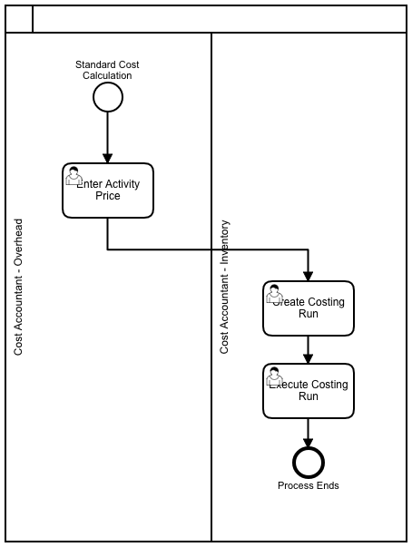

```
SAP PRODUCT COSTING

```
## Process Modeling:

### Standard Cost Calculation

[](https://www.sap.com "SAP")


## Tables:

| Table | Name | S/4HANA - Notes |
|-------|------|-----------------|
| KALA | Costing Run: General Data/Parameters |  |
| KALO | Costing Run: Costing Objects (KVMK) |  |
| KANZ | Assignment of Sales Order Items - Costing Objects |  |
| KEKO | Product Costing - Header Data | In Logical Database CKA. |
| KEPH | Product Costing: Cost Components for Cost of Goods Mfd |  |
| TKZSL | Overhead Key |  |
| MAKV | Material Cost Distribution |  |
| MAKZ | Material cost distribution equivalence numbers |  |
| MAST | Material to BOM Link | In Logical Database CKA CSR. |
| MBEW | Material Valuation | In Logical Database /SAPSLL/CUSMSM BMM CKA. |
| CKMLCR | Material Ledger: Period Totals Records Values |  |
| CKMLKEPH | Material Ledger: Cost Component Split (Elements) |  |
| CKMLPP | Material Ledger Period Totals Records Quantity |  |
| CKMLPPWIP | Material-Ledger: Period Records WIP (Quantities) |  |
| MLCD | Material Ledger: Summarization Record (from Documents) |  |
| MLCR | Material Ledger Document: Currencies and Values |  |
| MLCRF | Material Ledger Document: Field Groups (Currencies) |  |
| MLHD | Material Ledger Document: Header |  |
| MLIT | Material Ledger Document: Items |  |
| MLPP | Material Ledger Document: Posting Periods and Quantities |  |
| MLPPF | Material Ledger Document: Field Groups (Posting Periods) |  |
| CKIS | Items Unit Costing/Itemization Product Costing |  |
| ACDOCA | Universal Journal Entry Line Items |  |
| ACDOCC | Consolidation Journal |  |
| ACDOCP | Plan Data Line Items |  |
| KAPS | CO Period Locks |  |
| MARV | Material Control Record | Current MM-Period. |
| T001K | Valuation area |  |
| T001W | Plants/Branches |  |
| TKA01 | Controlling Areas |  |
| TCKH1 | Cost Components - Texts |  |
| TCKH2 | Assignment: Cost Element Interval - Cost Component Structure |  |
| TCKH3 | Cost Components |  |
| TCKH4 | Cost Component Structure for Cost of Goods Manufactured |  |
| TCKH5 | Cost Component Structure - Texts |  |
| TCKH6 | Cost Component Groups - Texts |  |
| TCKH7 | Cost Component Groups |  |
| TCKH8 | Cost Component Views in Display |  |
| TCKH9 | Texts for Cost Component Views in Display |  |
| TCKHA | Cost Element/Origin Assignment with Additive Costs |  |
|-----------------|--------------|--------------|

## Programs, Function Modules and Exits:

| Programs | Description | Type |
|-----------------|--------------|--------------|
| KARIN  |  Message Call  | PC |
| RKKBRPTR  |  Call for Reporting Tree  | PC |
| RKKBKIS1  |  Line Item Report Costing Items  | PC |
| SAPRCK23  |  Price Update  | PC |
| SAPRCKBA1  |  Transaction Handler for CKBA  | PC |
| SAPRCKBA  |  CK Report for Batch Handling for Costing Run  | PC |
| RKKKS1N0  |  Variances: Manufacturing Orders and Product Cost Collectors  | PC |
| SAPMKKB5  |  Maintain Application-Dependent Reporting Parameters  | PC |
| SAPKKA07  |  Work in Process: List  | PC |
| SAPKKA12  |  Sales Orders: Set CO Status Under Specified Conditions  | PC |
| SAPMKKB2  |  Maintain User-Specific Reports for Costing KKB  | PC |
| MLCCS_STARTUP  |  Creates actual cost comp. split for already productive ML customer  | PC |
| MLCCS_RESET  |  Deletes All Data in Actual Cost Component Split  | PC |
| RKKBCAL2  |  Analyze/Compare Material Cost Estimates  | PC |
| RKKKS000  |  Background Processing: Variance / Scrap Calculation  | PC |
|-----------------|--------------|--------------|

## Platforms:

|     ECC      |  S/4 HANA    |      U/X      |  Database     |
|--------------|--------------|---------------|---------------|
|   SAP ERP    | SAP S/4 HANA |  SAP FIORI    |  SAP HANA     |
|--------------|--------------|---------------|---------------|

Note: S/4 (cloud & on-premise) works only on Hana DB while SAP ERP is compatible with Hana DB, MS Sql, Oracle DB, IBM DB2 etc.

## Product Costing Doc:

