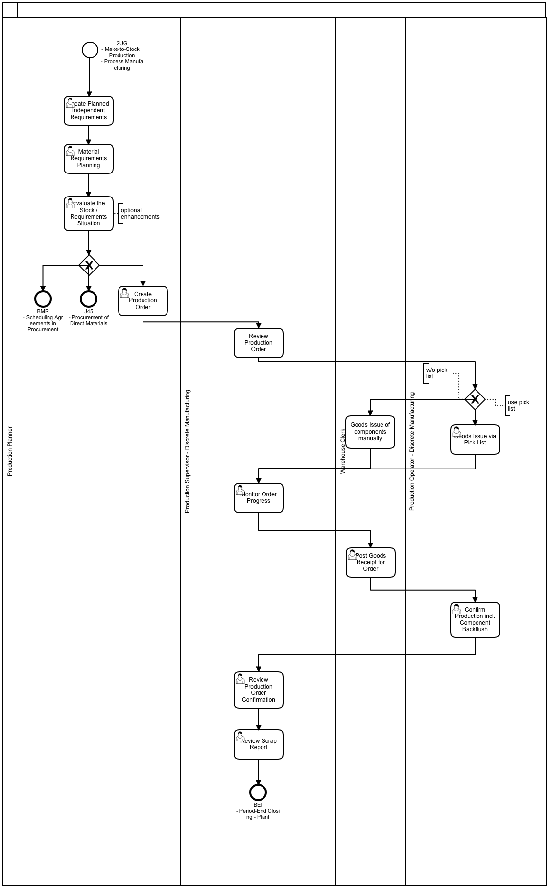
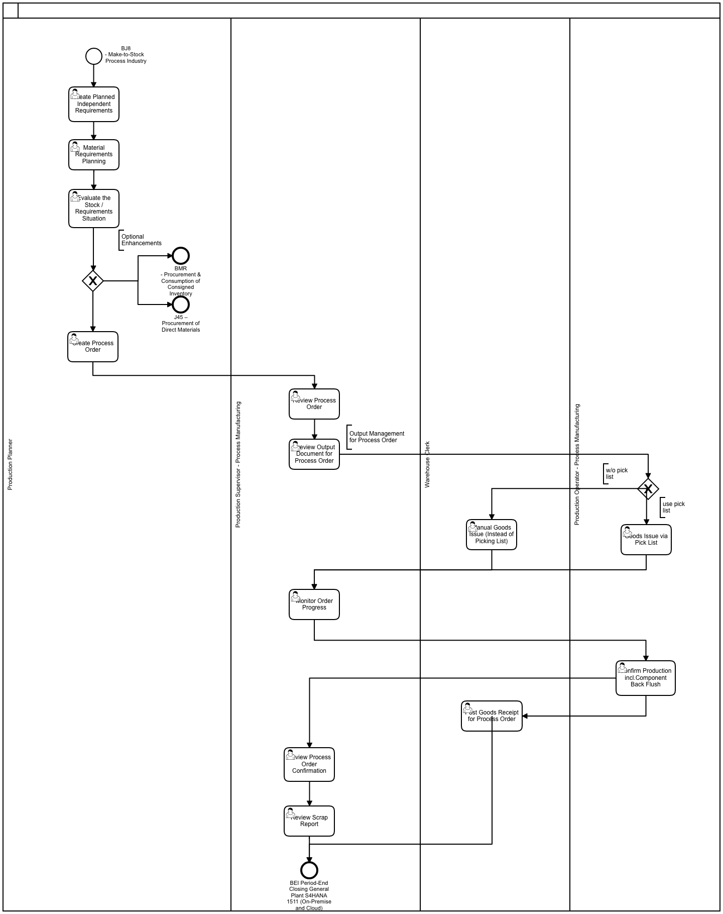
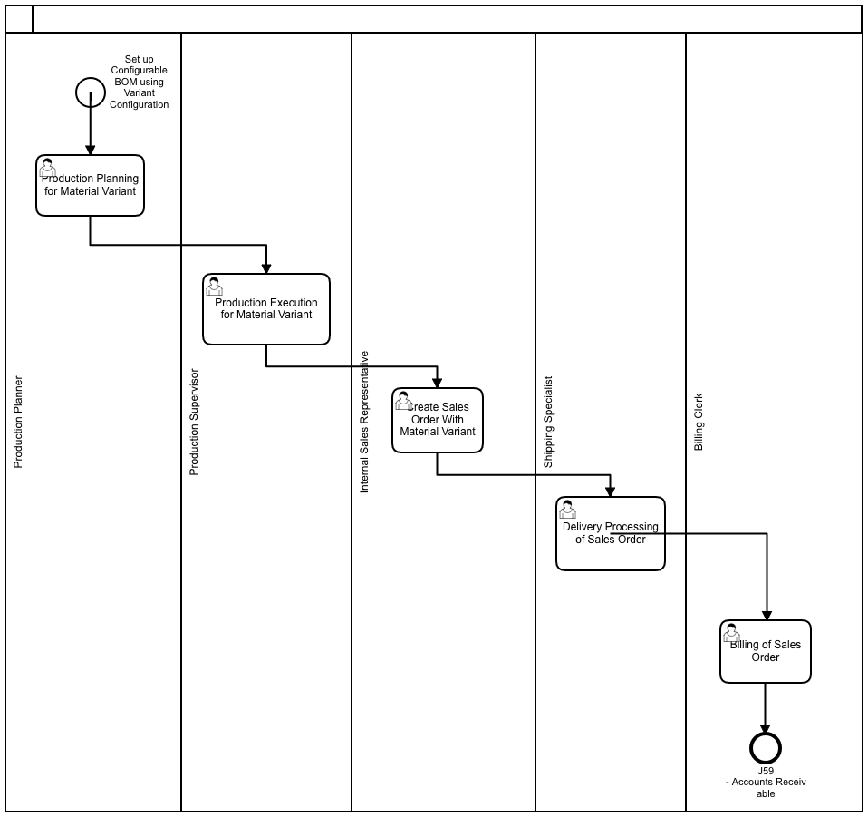
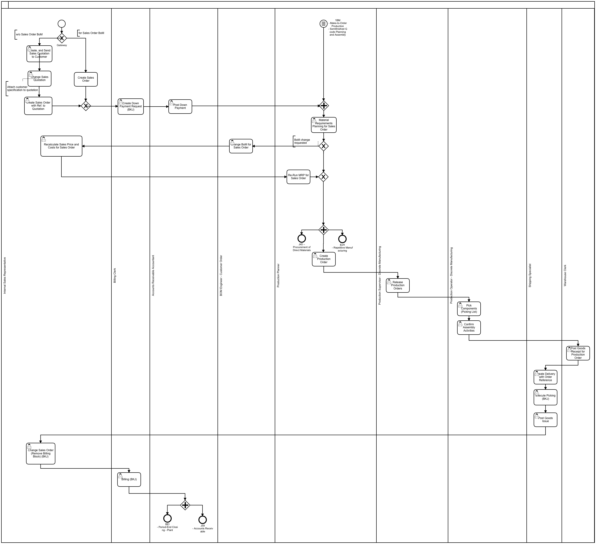
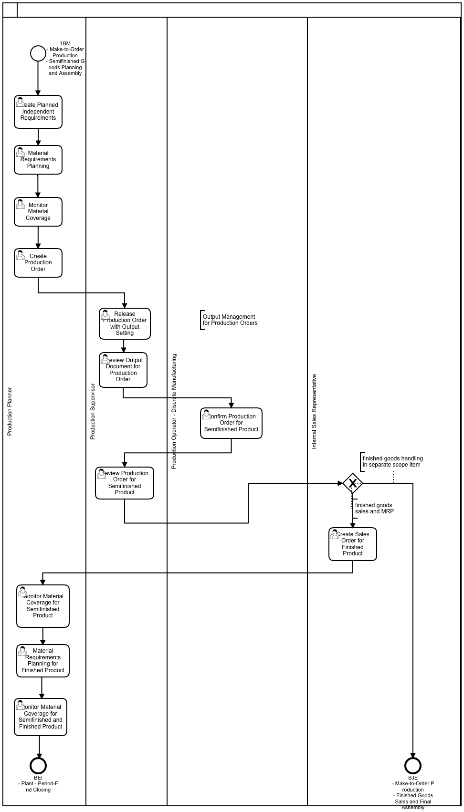

```
DOCS FOR SAP Production Planning

```

Commands:

```
Production Planning in SAP ...

```

## Process Modeling:

### Make to Stock based on Production Order:

[](https://www.sap.com "SAP")

### Make to Stock based on Process Order:

[](https://www.sap.com "SAP")

### Make to Stock based on Variant Configuration:

[](https://www.sap.com "SAP")

### Make to Order - Finished Goods Sales & Final Assembly:

[](https://www.sap.com "SAP")

### Make to Order - Semi-Finished Goods Planning & Assembly:

[](https://www.sap.com "SAP")


## Tables:

| Table | Name | S/4HANA - Notes |
|-------|------|-----------------|
| CRCA | Work Center Capacity Allocation | In Logical Database CRC. |
| CRCO | Assignment of Work Center to Cost Center |  |
| CRHD | Work Center Header |  |
| CRHH | Hierarchy Header Data |  |
| CRHS | Hierarchy Structure |  |
| CRTX | Text for the Work Center or Production Resource/Tool |  |
| KAKO | Capacity Header Segment |  |
| TC24 | Person responsible for the work center |  |
| MAPL | Assignment of Task Lists to Materials | In Logical Database PNM PNM_OLD. |
| PLAS | Task list - selection of operations/activities |  |
| PLFH | Task list - production resources/tools |  |
| PLFL | Task list - sequences |  |
| PLKO | Task list - header |  |
| PLKZ | Task list: main header |  |
| PLMZ | Allocation of bill of material items to operations |  |
| PLPH | CAPP: Sub-operations |  |
| PLPO | Task list - operation/activity |  |
| PLPR | Log collector for task lists |  |
| KDST | Sales Order to BOM Link | In Logical Database CSR. |
| MAST | Material to BOM Link | In Logical Database CKA CSR. |
| PLMZ | Allocation of bill of material items to operations |  |
| STAS | BOMs - Item Selection | In Logical Database CSR. |
| STKO | BOM Header | In Logical Database CSR. |
| STPN | BOM Follow-Up Control | In Logical Database CSR. |
| STPO | BOM item | In Logical Database CSR. |
| STPU | BOM Subitem | In Logical Database CSR. |
| STZU | Permanent BOM data | In Logical Database CSR. |
| AFFH | PRT assignment data for the work order | In Logical Database POH. |
| AFKO | Order Header Data PP Orders | In Logical Database ODK PSJ. |
| AFPO | Order item | In Logical Database ODC ODK OFC OHC OPC POH PSJ. |
| AFRU | Order Confirmations | In Logical Database ODC OFC OHC OPC POH. |
| AFVC | Operation within an order | In Logical Database BTM. |
| AFVU | DB structure of the user fields of the operation |  |
| AFVV | DB structure of the quantities/dates/values in the operation |  |
| AUFK | Order master data | In Logical Database ODK PSJ. |
| AUFM | Goods movements for order |  |
| CAUFV | View Order Headers PP/CO | In Logical Database BTM POH. |
| JSTO | Status object information | In Logical Database ODK PSJ. |
| RESB | Reservation/dependent requirements | In Logical Database BBM ERM MEPOLDB MMIMRKPFRESB ODC OFC OHC OPC POH RMM RNM. |
| PLAF | Planned Order | In Logical Database DPM PSJ. |
| PKER | Error Log of the Kanban Containers |  |
| PKHD | Control Cycle |  |
| PKPS | Control Cycle Item / Kanban |  |
| RESB | Reservation/dependent requirements | In Logical Database BBM ERM MEPOLDB MMIMRKPFRESB ODC OFC OHC OPC POH RMM RNM. |
| RKPF | Document Header: Reservation | In Logical Database MMIMRKPFRESB RKM RNM. |
| KBED | Capacity Requirements Records | In Logical Database ODC OFC OHC OPC POH. |
| KBEZ | Add. data for table KBED (for indiv. capacities/splits) | In Logical Database PSJ. |
| KBKO | Header Record for Capacity Requirements |  |
| PBED | Independent Requirements Data |  |
| PBHI | Independent Requirements History |  |
| PBIC | Ind. reqmts index for customer requirements (without RV) |  |
| PBIM | Independent Requirements for Material |  |
| PBIV | Ind. reqmts index for consump. of exter. non-variable parts |  |
| MAKT | Material Descriptions | Field ‘Mat. desc - MAKTG' for the search. Logical Database MMIMRKPFRESB S1L S2L. |
| MAPL | Assignment of Task Lists to Materials | In Logical Database PNM PNM_OLD. |
| MARA | General Material Data | In Logical Database /SAPSLL/CUSMSM BAM BKM BMM CKM EBM ECM ENM ESM IFM S1L WTY. |
| MARC | Plant Data for Material | S/4: Master data without stock aggregates. In Logical Database /SAPSLL/CUSMSM S1L. |
| MARD | Storage Location Data for Material | S/4: Master data without stock aggregates. In Logical Database /SAPSLL/CUSMSM MSM. |
| MAST | Material to BOM Link | In Logical Database CKA CSR. |
| T001K | Valuation area |  |
| T001L | Storage Locations |  |
| T001W | Plants/Branches |  |
| T499S | Location |  |
| TSPA | Organizational Unit: Sales Divisions |  |
| T003O | Order Types |  |
| TCX00 | Scheduling: Planning Levels and Control Parameters |  |
|-------|------|-----------------|

## Programs, Function Modules and Exits:


## Platforms:

|     ECC      |  S/4 HANA    |      U/X      |  Database     |
|--------------|--------------|---------------|---------------|
|   SAP ERP    | SAP S/4 HANA |  SAP FIORI    |  SAP HANA     |
|--------------|--------------|---------------|---------------|

Note: S/4 (cloud & on-premise) works only on Hana DB while SAP ERP is compatible with Hana DB, MS Sql, Oracle DB, IBM DB2 etc.
