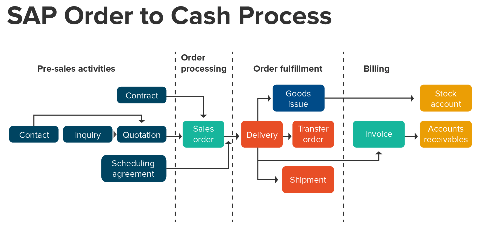
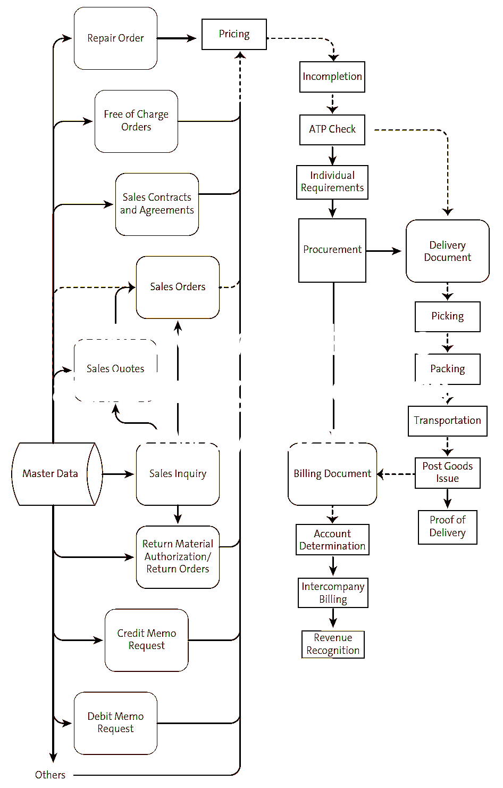

import PDFEmbed from '@/components/PDFEmbed.astro';

```
DOCS related to SAP Selling & Distribution

```

## Process Modeling:

### Order to cash process overview:

[](https://docs.sajivfrancis.com "DOCS")

### Selling & Distribution process overview:

[](https://docs.sajivfrancis.com "DOCS")

## SD Variant Configuration:

1.	Create Characteristics (CT04)	
2.	Create Class (CL01)	
3.	Assign Class to Material Master (CL20N)	
4.	Assign Class to Bill of Material (CS01/CS02)
5.	Create Configuration Profile for FERT (Root Code Item) (CU41)
6.	Create Configuration Profile for KMAT (Configurable Item) (CU41)
7.	Create Dependency
8.	Dependency types
    - Precondition:
    - Action:
    - Selection Condition:
    - Procedure	
9.	Create Table Structure (CU61)
10.	Maintain Table Contents (CU60)
11.	Create Configurable Material Master (MM01)

### Variant Configuration Guide:

<PDFEmbed src="/pdf/sap-erp-s4hana-sd/1d6pQrU1Mfxz2mci6S8wwLKJc2u6PXFSP.pdf" />

<details>
<summary>Show extracted text</summary>


```text
1
SAP
VARIANT CONFIGURATION
Sajiv Francis
January 2021
2
Variant Configuration User Manual
Contents
1. Create Characteristics (CT04).................................................................................................................2
2. Create Class (CL01) .................................................................................................................................6
3. Assign Class to Material Master (CL20N) ...............................................................................................8
4. Assign Class to Bill of Material (CS01/CS02) ....................................................................................... 10
5. Create Configuration Profile for FERT (Root Code Item) (CU41) ........................................................ 11
6. Create Configuration Profile for KMAT (Configurable Item) (CU41) .................................................. 14
7. Create Dependency............................................................................................................................. 19
8. Dependency types .............................................................................................................................. 21
1. Precondition: ................................................................................................................................... 21
2. Action: ............................................................................................................................................. 21
3. Selection Condition: ........................................................................................................................ 22
4. Procedure ........................................................................................................................................ 22
9. Create Table Structure (CU61) ............................................................................................................ 24
10. Maintain Table Contents (CU60)..................................................................................................... 27
11. Create Configurable Material Master (MM01) ............................................................................... 28
3
1. Enter the Characteristic
Name
2. Press  (Create)
1. Enter Characteristic Description,
Characteristic Group and Status
as “Released”
2. Maintain Data type as
“Character  Format”  or “Numeric
format”
3. Maintain Number of Characters
4. Select the Value assignment
either single value or  multiple
value
5. Go to view “Values”
1. Create Characteristics (CT04)
(Logistics
 Central Functions
 Variant C o n f igu r a tion
 E n v i r o nme n t
 C l a s s i fic a t i o n
 Master
Data
 CT04 – Characteristics)
4
1. Select the Characteristic value
and go to “Extras
 Object
dependencies
 Editor” to
assign dependencies
1. Maintain the all possible
Characteristic values
5
1. Write the Source  code for Dependency
2. Press  (Check  Consistency)
3. Press  (Save) to save the dependency
1. Select the Dependency  type. Ex
Precondition
2. Press Enter
6
1. Maintain Valid Class Types i.e.
200(Material  Configurable  Objects)  and
300 (Variants)
2. Save the Characteristic
1. Maintain  Dependency  for the required
characteristic Values
2. Go to view “Restrictions”
7
1. Enter the Class Name and Class Type as
300 (Variant)
2. Press (Create)
1. Enter Class Description
2. Maintain the Status  “Released”
3. Go to View “Char”
2. Create Class (CL01)
(Logistics
 Central Functions
 Variant C o n f igu r a tion
 E n v i r o nme n t
 C l a s s i fic a t i o n
 Master
Data
 CL02 ‐ Classes)
8
1. Make a tick mark for “Allowed in
BOMs
2. Enter Base unit of Measure  and Res.
Item category
3. Press  (Save)
1. Enter/Assign  all required
characteristics to the Class
2. Go to View “Addnl  Data”
9
1.
2.
3.
Enter Material  code to which class is
to be assigned
Enter Class type as 300
Press (Enter)
1. Select the Class using F4 Help
2. Press  (Enter)
3. Assign Class to Material Master (CL20N)
(Logistics
 Central Functions
 Variant Configuration
 Environment
 Classification
 Classification
CL20N ‐ Assign Object to Classes)
10
1. Choose  the Characteristic  values that are
required as “Default” (While
maintaining configuration data these
values will appear default)
2. Press (Save)
11
1. Enter Material  Code, Plant and BOM
Usage
2. Press  (Enter)
1. Select the Item Category  as “K(Class  Item”
2. Enter Resulting  Item Category  as “L(Stock
Item)”
3. Select Class Type 300 (Variant)
4. Enter the Class and quantity
5. Press  (Save) the  BOM
4. Assign Class to Bill of Material (CS01/CS02)
(Logistics
 Production
 Master Data
 Bills of Material
 Bill of Mat e rial
 Mat e r i al BOM
 C S 0 1
– Create/CS02  – Change)
12
1. Select Configurable Object “Material”
2. Press  (Enter)
1. Enter Material Code
2. Press (Enter)
5. Create Configuration Profile for FERT (Root Code Item) (CU41)
(Logistics
 Central Functions
 Variant Configuration
 Configuration Profile
 CU41 – Create)
13
1. Select the Status “1” i.e. Released
2. Go to Tab “Configuration  initial  screen”
1. Enter Priority number as “10”
2. Maintain  Prof. Name and Class “300”
3. Select the Line and Press
Detail)
(Profile
14
1. Select the required dependencies using
F4 help
2. Press button (Save)
1. Check Configuration  Parameters
2. Press the Button
Assignments)
(Dependency
15
1. Select Configurable Object “Material”
2. Press  (Enter)
1. Enter Material Code
2. Press  (Enter)
6. Create Configuration Profile for KMAT (Configurable Item) (CU41)
(Logistics
 Central Functions
 Variant Configuration
 Configuration Profile
 CU41 – Create)
16
1. Select  the Line and Press
Detail)
(Profile
1. Select the Status “1” i.e. Released
2. Go to Tab “Configuration  initial screen”
1. Enter Priority number as “10”
2. Maintain  Prof. Name and Class “300”
17
1. Maintain  User Interface  design  data
2. Go to View “Order BOM”
1. Maintain Configuration  Parameters
2. Go to View “UserInterf”
18
1. Select the required dependencies
using F4 help
2. Press button (Enter)
1. Make a tic mark for “Maint. In Order
Allowed and Automatic Fixing”
2. Press to assign dependency
19
1. Check all dependencies  are assigned
correctly
2. Press (Save)
20
1. Enter the Dependency  Name
2. Press  (Enter)
1. Maintain the Dependency Description
2. Put the Status as “2 (In Preparation)”
3. Select the Dependency Type
4. Press
7. Create Dependency
(Logistics
  Central Functions
  Variant Configuration
  Dependency
  Single D e penden c y
C U 0 1 – Create)
21
1. Change  the Status to “1 (Released)”
2. Press  (Save)
1. Write the Source Code
2. Press to check error in syntax
3. Press (Save)
22
8. Dependency types
1. Precondition:
A precondition describes when an object (characteristic, characteristic value, BOM item, operation,
and so on) can be copied to the configuration.
If a precondition is linked to an object, for example a characteristic value, the object only appears in
configuration if the condition described in the precondition is fulfilled.
A precondition is used to ensure the consistency of the configuration.
Ex. Characteristic: CONSTRUCTION_FORM_EVALUATION
Char. Value: MD35/6
Source Code: ALTERNATOR_SERIES='ECP3'
Ex. Characteristic: CONSTRUCTION_FORM_EVALUATION
Char. Value: MD35/2
Source Code: ALTERNATOR_SERIES='ECO 28' or ALTERNATOR_SERIES='ECO 32'
2. Action:
An action allows characteristic values to be inferred automatically. An action is always carried out
when the object to which the action is linked is copied to the configuration.
An action can only affect the object which is currently being processed. For this reason, the syntax
must always start with "$SELF.” followed by the name of the characteristic whose value is to be inferred.
Ex. Action: B20_RPM
Material: 0319100201
Profile name: 0319100201 CONFG MATERIAL
Source Code:
$SELF.REV_PER_MINUTE='1800'
IF $ROOT.POLES_NUMBER='4' and FREQUENCY='60'
```

</details>


## Tables:

| Table | Name | S/4HANA - Notes |
|-------|------|-----------------|
| LIKP | SD Document: Delivery Header Data | In Logical Database ALV PSJ VLV. |
| LIKPUK | View: Delivery Header + Status Data |  |
| VBAK | Sales Document: Header Data | In Logical Database AAV CKS CKS_WAO PSJ SD_ORDER SD_SALES_DOCUMENT VAV VC1. |
| VBAKUK | Generated Table for View | VBAK & VBUK. |
| VBAP | Sales Document: Item Data | In Logical Database AAV CKS CKS_WAO PSJ SD_ORDER SD_SALES_DOCUMENT VAV VC2. |
| VBBE | Sales Requirements: Individual Records |  |
| VBDKA | Document Header View for Inquiry,Quotation,Order |  |
| VBDPA | Document Item View for Inquiries,Quotation,Order |  |
| VBEP | Sales Document: Schedule Line Data | In Logical Database AAV SD_ORDER SD_SALES_DOCUMENT VAV. |
| VBFA | Sales Document Flow | In Logical Database AAV AKV ALV ARV SD_ORDER SD_SALES_DOCUMENT VAV VC1 VFV VLV. |
| VBKA | Sales Activities | In Logical Database AKV VC1 VC2. |
| VBKD | Sales Document: Business Data | In Logical Database AAV PSJ SD_ORDER SD_SALES_DOCUMENT VAV. |
| VBPA | Sales Document: Partner | In Logical Database AAV AKV ALV ARV SD_ORDER SD_SALES_DOCUMENT VAV VC1 VFV VLV. |
| VBUK | Sales Document: Header Status and Administrative Data | In Logical Database AAV AKV ALV ARV PSJ SD_ORDER 

| SD_SALES_DOCUMENT VAV VFV VLV. | | |
|-------|------|-----------------|
| VBUV | Sales Document: Incompletion Log | In Logical Database AAV AKV SD_ORDER SD_SALES_DOCUMENT VAV. |
| VEDA | Contract Data | In Logical Database SD_ORDER SD_SALES_DOCUMENT. |

| Billing and Pricing     |  |  |
|-------|------|-----------------|
| A005 | Customer/Material | For items get the value in Condition record number (KNUMH) and go to table KONP. |
| FPLA | Billing Plan | In Logical Database ERM PSJ SD_SALES_DOCUMENT. Category (FPTYP)=0 for Billing plan in SD |
| KOMK | Communication Header for Pricing |  |
| KOMP | Communication Item for Pricing |  |
| KONP | Conditions (Item) | In Logical Database ERM ILM V12L. |
| VBRK | Billing Document: Header Data | In Logical Database ARV VFV VXV. |
| VBRKUK | Billing Document Header and Status Data |  |
| VBRP | Billing Document: Item Data | In Logical Database ARV VC2 VFV VXV. |
| VRPMA | SD Index: Billing Items per Material |  |

| Billing Documents Copy Control     |  |  |
|-------|------|-----------------|
| TVCPF | Billing: Copying Control |  |
| TVFSP | Billing: Blocking Reasons |  |

| Customer for Sales and Distribution     |  |  |
|-------|------|-----------------|
| BUT000 | Business Partner: General data I | In Logical Database REBP UKM_BUPA. |
| BUT020 | Business Partner: Addresses | In Logical Database REBP. |
| BUT100 | Business Partner: Roles | In Logical Database REBP. |
| CVI_CUST_LINK | Assignment Between Customer and Business Partner |  |
| KLPA | Customer/Vendor Linking |  |
| KNA1 | General Data in Customer Master | In Logical Database BRF DDF SD_KUSTA VC1 VC2 VDF WTY. |
| KNB1 | Customer Master (Company Code) | In Logical Database BRF DDF VDF. |
| KNB4 | Customer Payment History | In Logical Database BRF DDF. |
| KNB5 | Customer master (dunning data) | In Logical Database BRF DDF. |
| KNBK | Customer Master (Bank Details) | In Logical Database BRF DDF. |
| KNKA | Customer master credit management: Central data | In Logical Database DDF. |
| KNKK | Customer master credit management: Control area data | In Logical Database BRF DDF. |
| KNVA | Customer Master Unloading Points |  |
| KNVD | Customer master record sales request form |  |
| KNVH | Customer Hierarchies |  |
| KNVI | Customer Master Tax Indicator |  |
| KNVK | Customer Master Contact Partner | In Logical Database SD_KUSTA VC1 VC2. |
| KNVL | Customer Master Licenses |  |
| KNVP | Customer Master Partner Functions | In Logical Database SD_KUSTA VC2. |
| KNVS | Customer Master Shipping Data |  |
| KNVV | Customer Master Sales Data | In Logical Database SD_KUSTA VC1 VC2. |

| Finance Links for Sales and Distribution     |  |  |
|-------|------|-----------------|
| COES | CO Object: Sales Order Value Line Items |  |
| KNA1 | General Data in Customer Master | In Logical Database BRF DDF SD_KUSTA VC1 VC2 VDF WTY. |
| KNB1 | Customer Master (Company Code) | In Logical Database BRF DDF VDF. |
| KNB5 | Customer master (dunning data) | In Logical Database BRF DDF. |
| KNVD | Customer master record sales request form |  |
| KNVP | Customer Master Partner Functions | In Logical Database SD_KUSTA VC2. |
| KNVV | Customer Master Sales Data | In Logical Database SD_KUSTA VC1 VC2. |

| Material Management-Link for Sales and Distribution      |  |  |
|-------|------|-----------------|
| MAKT | Material Descriptions | Field ‘Mat. desc MAKTG' for search. Logical Database MMIMRKPFRESB S1L S2L. |
| MARA | General Material Data | In Logical Database /SAPSLL/CUSMSM BAM BKM BMM CKM EBM ECM ENM ESM IFM S1L WTY. |
| MARC | Plant Data for Material | S/4: Master data without stock aggregates. In Logical Database /SAPSLL/CUSMSM S1L. |
| MARD | Storage Location Data for Material | S/4: Master data without stock aggregates. In Logical Database /SAPSLL/CUSMSM MSM. |
| MARM | Units of Measure for Material | In Logical Database MSM. |
| MBEW | Material Valuation | In Logical Database /SAPSLL/CUSMSM BMM CKA. |
| MLAN | Tax Classification for Material |  |
| MVKE | Sales Data for Material | In Logical Database MSM. |
| T179 | Materials: Product Hierarchies |  |

| Sales Documents Copy Control     |  |  |
|-------|------|-----------------|
| TVAK | Sales Document Types |  |
| TVASP | Sales Documents: Blocking Reasons |  |
| TVCPA | Sales Documents: Copying Control |  |
| TVCPF | Billing: Copying Control |  |
| TVCPL | Deliveries: Copying Control |  |

| Sales Document Item Categories Copy Control     |  |  |
|-------|------|-----------------|
| T184 | Sales Documents: Item Category Determination |  |
| TVAPT | Sales document item categories: Texts |  |
| TVCPA | Sales Documents: Copying Control |  |
| TVCPF | Billing: Copying Control |  |
| TVCPL | Deliveries: Copying Control |  |
| TVEPZ | Sales Document: Schedule Line Category Determination |  |
| TVLP | Deliveries: Item Categories |  |
| TVPT | Sales documents: Item categories |  |

| Delivery Documents Copy Control     |  |  |
|-------|------|-----------------|
| T184L | Sales Documents: Item Category Determination |  |
| TVCPF | Billing: Copying Control |  |
| TVCPL | Deliveries: Copying Control |  |
| TVLSP | Delivery Blocks |  |

| More Sales and Distribution Tables     |  |  |
|-------|------|-----------------|
| NAST | Message Status | In Logical Database AAV AKV ALV ARV ERM. |
| SADR | Address Management: Company Data | In Logical Database AAV AKV ALV ARV. |
| T049E | Control Data for Swiss ISR Procedure |  |
| TNAPR | Processing programs for output |  |

| Enterprise Structure    Part of the Customizing |  |  |
|-------|------|-----------------|
| Table | Table - Name | S/4HANA -Table and general Notes |
| T001K | Valuation area |  |
| T001L | Storage Locations |  |
| T001W | Plants/Branches |  |
| T499S | Location |  |
| TSPA | Organizational Unit: Sales Divisions |  |
| TVBUR | Organizational Unit: Sales Offices |  |
| TVBVK | Organizational Unit: Sales Groups per Sales Office |  |
| TVKBZ | Org.Unit: Sales Office: Assignment to Organizational Unit |  |
| TVKGR | Organizational Unit: Sales Groups |  |
| TVKO | Organizational Unit: Sales Organizations |  |
| TVKWZ | Org.Unit: Allowed Plants per Sales Organization |  |
| TVTA | Organizational Unit: Sales Area(s) |  |
| TVTW | Organizational Unit: Distribution Channels |  |

| Customizing     |  |  |
|-------|------|-----------------|
| Table | Table - Name | S/4HANA -Table and general Notes |
| C001 | Cust.Grp/MaterialGrp/AcctKey | FI-Accounting determination in SD for invoices. |
| NRIV | Number Range Intervals | Edit with transaction SNUM. |
|-----------------|--------------|


## Programs, Function Modules and Exits:

| Programs | Description | Type |
|-----------------|--------------|--------------|
| RVSCD100  | Display Document Changes | SD |
| RFDKLI20  |  SD, FI: Recreation of Credit Data after Organizational Changes  | SD |
|-----------------|--------------|--------------|

## Role-based Fiori Apps:

### Sales

- Event based Revenue Recognition
- Market Segments
- P&L
- Project WIP Details
- Projects
- Realignment Results (Profitability Analysis)
- Revenue Recognition for Projects
- Sales Orders

## Platforms:

|     ECC      |  S/4 HANA    |      U/X      |  Database     |
|--------------|--------------|---------------|---------------|
|   SAP ERP    | SAP S/4 HANA |  SAP FIORI    |  SAP HANA     |
|--------------|--------------|---------------|---------------|

Note: S/4 (cloud & on-premise) works only on Hana DB while SAP ERP is compatible with Hana DB, MS Sql, Oracle DB, IBM DB2 etc.
