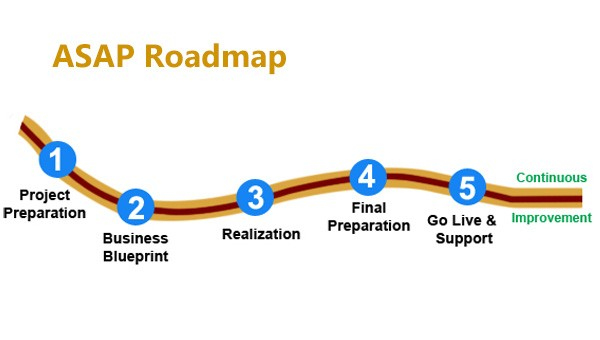
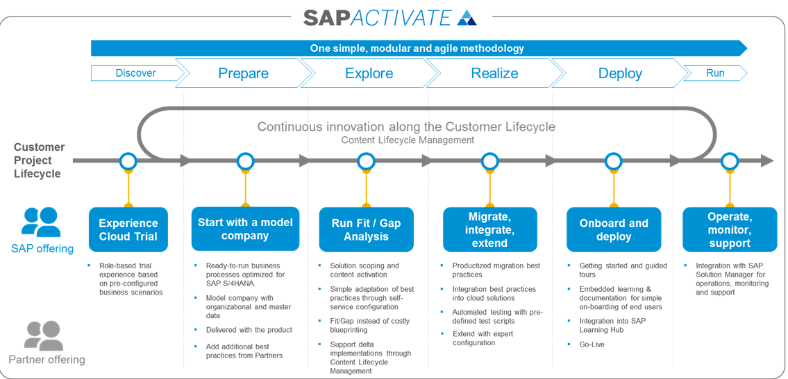
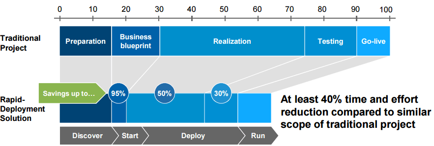
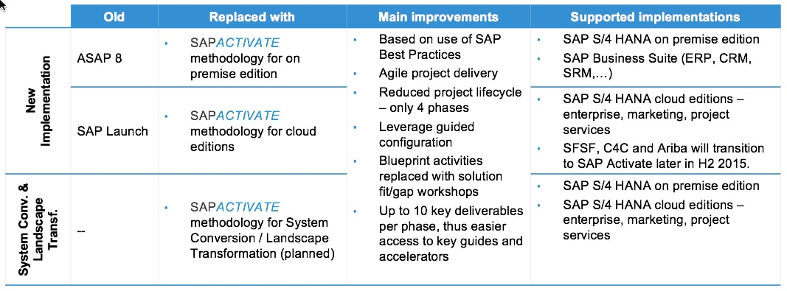

import PDFEmbed from '@/components/PDFEmbed.astro';

```
DOCS FOR SAP Methodology, Blueprints, Functional & Technical Specs etc..

```

Commands:

## ASAP Methodology:

[](https://docs.sajivfrancis.com "SAP")


## Activate Methodology:

[](https://docs.sajivfrancis.com "SAP")

## Differences between ASAP and Activate Methodologies:

[](https://docs.sajivfrancis.com "SAP")

[](https://docs.sajivfrancis.com "SAP")

## Blueprint Template:

<PDFEmbed src="/pdf/sap-erp-s4hana-templates/1qQZy3i6fxtZW8iZS1AdAA5AYGOmtAhWi.pdf" />

<details>
<summary>Show extracted text</summary>


```text
BUSINESS BLUEPRINT
SCENARIO (BUSINESS AREA) :<NAME>
BUSINESS PROCESS: <NAME>
PROJECT IDENTIFICATION
Project Name CPI/Project Number
Project Type
(Business Consulting, Implementation,
Upgrade, Internal, other)
Customer Name Customer Number Planned Start/Finish
Project Sponsor Program Manager Project Manager (Customer)
Project Manager (SAP) SAP Service Partner(s) Project Manager (Service Partner)
TABLE OF CONTENTS
Introduction ....................................................................................................................................................... 4
Introduction ......................................................................................................................................................... 4
Management / Executive Summary ................................................................................................................... 4
Reference Documents ........................................................................................................................................ 4
How to Read this Document ............................................................................................................................... 4
Project Charter .................................................................................................................................................. 5
Project Overview ................................................................................................................................................ 5
Project Scope/Scope Document ........................................................................................................................ 5
Project Objectives ............................................................................................................................................... 5
Project Stakeholders .......................................................................................................................................... 6
Assumptions and Constraints ............................................................................................................................. 7
Risk Assessment ................................................................................................................................................ 7
Significant Changes to the Current Status ......................................................................................................... 7
Value Determination ......................................................................................................................................... 8
Business Objectives and Expected Benefits ...................................................................................................... 8
Major Business Pain Points (to achieve business objective) ............................................................................. 8
Key Financial Performance Indicators (KPIs) .................................................................................................... 8
SAP Organizational Structure ......................................................................................................................... 9
Introduction “Organizational Unit” <Org Unit Name> ......................................................................................... 9
Requirements & Expectations ............................................................................................................................ 9
Global Design Decisions .................................................................................................................................... 9
Naming Convention ............................................................................................................................................ 9
Assignment of SAP Organizational Units ........................................................................................................... 9
Changes to Enterprise Structure ........................................................................................................................ 9
Impact of Future State Organization on SAP Organization Elements ............................................................... 9
Configuration Considerations ............................................................................................................................. 9
Authorization/Security Considerations ............................................................................................................. 10
Control Requirements....................................................................................................................................... 10
Organizational Model........................................................................................................................................ 10
Business Requirements.................................................................................................................................... 10
Design Aspects ................................................................................................................................................. 10
Master Data Concept ...................................................................................................................................... 11
Master Data Element, e.g. Vendor ................................................................................................................... 11
Requirements & Expectations .......................................................................................................................... 11
Systems List ..................................................................................................................................................... 11
Data Conversion Requirements ....................................................................................................................... 11
Data Cleansing Requirements ......................................................................................................................... 11
Master Data Ownership .................................................................................................................................... 12
Authorization/Security Considerations ............................................................................................................. 12
Control Requirements....................................................................................................................................... 12
Data Archiving Requirements ........................................................................................................................... 12
Organization Impact Considerations ................................................................................................................ 12
Data Management ........................................................................................................................................... 12
High-Level Migration Concept .......................................................................................................................... 13
Business Object Scope .................................................................................................................................... 13
Business Object Detail ..................................................................................................................................... 13
<Business Object> Data Element Mapping ..................................................................................................... 14
<Object Name> Data Entry Input Format and Data Preparation Procedure ................................................... 14
<Object Name> Dependencies ........................................................................................................................ 15
```

</details>

## WRICEF (ABAP based Custom Dev) - FS - Workflow:

<PDFEmbed src="/pdf/sap-erp-s4hana-templates/1C40iEsKsBbsAf_Y_SvNlDvTjedGugCTU.pdf" />

<details>
<summary>Show extracted text</summary>


```text
{Workstream}
FUNCTIONAL SPECIFICATION
ABAP custom development – Workflow
{WRICEF ID Description}
{Organisation / Project Name}
Role and Reason for Approval
Role Reason for Approval
Author The author is signing to confirm that this document has been
prepared in accordance with the programme document
management process, that relevant input from any contributory
authors has been included and that an appropriate review/editing
process has been conducted.
SAP Solution
Lead or
Architect
The SAP Solution Lead or Architect is signing, on behalf of the
Workstream, to confirm that this Functional Specification meets the
Acceptance Criteria expected of it and assigned to it in the
Deliverable Quality Log.
SAP
Development
Lead or
Manager
The SAP Development Lead or Manager is signing, on behalf of the
Development Team, to confirm that this Functional Specification
meets the Acceptance Criteria expected of it and assigned to it in
the Deliverable Quality Log.
Note. Master copy of this document, with signatories, is held on Solution Manager
DATE: 02/02/2021
FS {WRICEF ID Description}
 {Workstream}
{Organisation / Project Name}
© 2021 SAP SE or a SAP affiliate company. All rights reserved.  Page 2 of 8
Version Date Name Alteration Reason
1 02/02/2021 Roger Sainsbury Initial draft
Table of Content
1 Context 3
1.1 Business Background 3
1.2 Why is SAP standard not appropriate or sufficient? 3
1.3 Alternative Approaches Considered 3
1.4 Out of Scope 3
1.5 Assumptions 3
1.6 Dependencies 3
1.7 Links 3
2 Solution Design Error! Bookmark not defined.
2.1 Existing Form to Copy Error! Bookmark not defined.
2.2 Print Program and Data Model Error! Bookmark not defined.
2.3 Form Layout Error! Bookmark not defined.
2.4 Styles Error! Bookmark not defined.
2.5 Paper and Printing Error! Bookmark not defined.
2.6 Long Texts Error! Bookmark not defined.
2.7 Legal Requirements Error! Bookmark not defined.
2.8 Follow-on Activities Error! Bookmark not defined.
3 How to Test Error! Bookmark not defined.
FS {WRICEF ID Description}
 {Workstream}
{Organisation / Project Name}
© 2021 SAP SE or a SAP affiliate company. All rights reserved.  Page 3 of 8
1 Context
1.1 Business Background
Explain the business scenario that requires the development.
1.2 Why is SAP standard not appropriate or sufficient?
Generally we want to keep the system as standard as possible, so each custom development requires a
justification.
1.3 Alternative Approaches Considered
Sometimes a number of different approaches are possible to meet a requirement. If that is the case, outline
what the other options were, and why they were rejected in favour of this one.
1.4 Out of Scope
If functionality has been considered and decided to be out of scope for the development, then please record it
here.
1.5 Assumptions
If the proposed design relies on any assumptions, please state them here.
1.6 Dependencies
If the proposed design has dependencies on other developments or configuration, please state them here.
1.7 Links
Provide any links here to further relevant information (e.g. from SAP Help, SCN, SAP Notes).
FS {WRICEF ID Description}
 {Workstream}
{Organisation / Project Name}
© 2021 SAP SE or a SAP affiliate company. All rights reserved.  Page 4 of 8
2 Solution Design
2.1 SAP Standard Workflow
Workflow developments are typically based on an existing, standard Workflow. If such a Workflow is known,
then name it here. E.g.
WS 03100019 - General Notification Process.
2.2 Triggers and Start Conditions
What Transactions and Batch Programs trigger the workflow?
Are Start Conditions required? E.g. ‘Purchase Order workflow should trigger only for PO Types XYZ'.
2.3 Process Overview
Provide a high-level description of the required workflow process and/or a flow diagram . The individual steps
should then be defined in detail below.
If starting from a standard workflow, then i t may be possible to get a flow diagram of that process and then
make any changes.
Please specify any conditions which will make the workflow approval invalid. For example, if a leave request
is in approval; then the  employee decides to retract it, this will make the ongoing leave request approval
process obsolete.
2.4 Data Model
If any custom configuration tables are required, which will be read by the workflow logic, then specify the m
here.
FS {WRICEF ID Description}
 {Workstream}
{Organisation / Project Name}
© 2021 SAP SE or a SAP affiliate company. All rights reserved.  Page 5 of 8
2.5 Step by Step Process Description
Specify requirements for each step in the process. Repeat and complete the example steps below, as many
times as needed to describe all the steps.
2.5.1 Example user decision or dialog step
Step Description e.g. ‘PO Approval level 1’
Approve / Reject
texts and actions
(for user decision
steps)
Specify any custom text for the Approve and Reject buttons.
Which step should follow an approval? E.g. a higher level approval step, or a
background task to complete an action?
Should a rejection cause the workflow item to be closed, or should it revert to
the person who raised it?
Functionality to
call
(for dialog steps)
The step could call a SAPGUI transaction or web application.
Subject Text
(Work Item Text)
e.g. ‘PO Approval level 1’
Body Text
(Task Description)
e.g. ‘PO Approval level 1’
Possible
Approvers
(Possible Agents)
Describe here any rules to determine the pool of possible approvers. This
could be some restriction based on the Org Structure, on configuration, or on
Authorisation Roles.
E.g. a rule might say that only Managers can approve leave requests.
Alternatively, define the step as a General Task, meaning that anyone could
potentially approve it.
Approver
Selection
(Selected Agents)
Describe here the rules to determine who, from the possible approvers,
should actually perform the approval. Typically this will be based on the data
in the Workflow item. For example specific people or roles may deal with
approvals for particular org units or countries; senior executives may need to
approve payments of a higher value.
If there are multiple  valid approvers, then specify if ALL  of them need to
approve the item, or if only one approval/rejection is sufficient to move ahead.
Also specify what to do when an approver cannot be determined. E.g.
• Fall back on all possible approvers OR
• Workflow goes into error (so that the workflow administrator can pick it up
during his/her daily activity run) OR
• A notification should be sent out to particular recipient.
Escalation What should happen if the workflow item is not processed in a timely fashion?
Various events can be used to trigger escalation actions, e.g.
• Latest Start – e.g. you may wish to send the selected approvers a reminder
if the approval process has not started within a given time.
FS {WRICEF ID Description}
 {Workstream}
{Organisation / Project Name}
© 2021 SAP SE or a SAP affiliate company. All rights reserved.  Page 6 of 8
• Requested End – after this time the workflow item would be considered to
be late. You may wish to notify the selected approver’s manager. If so,
should the manager also be able to approve or reject?
• Latest End  – at this point you may wish to skip the standard approval
process and go directly to a super user for urgent action.
For each escalation event clearly specify:
• How is the time of the event determined? (E.g. x working days after the
item was raised; y wo rking days before some deadline date from the
document.)
• Who should receive the workflow escalation?
• What should the escalation Subject and Body text be?
Preferred Inbox If the user is expected to find and process this item from an inbox, where
should that be? E.g.
• Fiori ‘My Inbox’ app
• SAPGUI Business Workplace
• SAP Portal UWL
• NetWeaver Business Client (NWBC), e.g. in a Power List (POWL)
Alternatively it may be that the user will be notified by email, and is expected
to process the item from a link in the email.
Email Notification Is email notification required? If so, should it be:
• Coll
```

</details>


## WRICEF (ABAP based Custom Dev) - FS - Reports:

<PDFEmbed src="/pdf/sap-erp-s4hana-templates/1ZuFDTbeZjWxhNoqZ1QpbikdEmEogWoPT.pdf" />

<details>
<summary>Show extracted text</summary>


```text
{Workstream}
FUNCTIONAL SPECIFICATION
ABAP custom development – Reports
{WRICEF ID Description}
{Organisation / Project Name}
Role and Reason for Approval
Role Reason for Approval
Author The author is signing to confirm that this document has been
prepared in accordance with the programme document
management process, that relevant input from any contributory
authors has been included and that an appropriate review/editing
process has been conducted.
SAP Solution
Lead or
Architect
The SAP Solution Lead or Architect is signing, on behalf of the
Workstream, to confirm that this Functional Specification meets the
Acceptance Criteria expected of it and assigned to it in the
Deliverable Quality Log.
SAP
Development
Lead or
Manager
The SAP Development Lead or Manager is signing, on behalf of the
Development Team, to confirm that this Functional Specification
meets the Acceptance Criteria expected of it and assigned to it in
the Deliverable Quality Log.
Note. Master copy of this document, with signatories, is held on Solution Manager
DATE: 02/02/2021
FS {WRICEF ID Description}
 {Workstream}
{Organisation / Project Name}
© 2021 SAP AG or a SAP affiliate company. All rights reserved.  Page 2 of 6
Version Date Name Alteration Reason
1 02/02/2021 Roger Sainsbury Initial draft
Table of Content
1 Context 3
1.1 Business Background 3
1.2 Why is SAP standard not appropriate or sufficient? 3
1.3 Alternative Approaches Considered 3
1.4 Out of Scope 3
1.5 Assumptions 3
1.6 Dependencies 3
1.7 Links 3
2 Solution Design 4
2.1 Selection Criteria 4
2.2 Validation 4
2.3 Authorizations 4
2.4 Data Selection and Error Handling 4
2.5 Process Flow Diagram 4
2.6 Report Output 4
2.7 Drilldown and follow-on activities 4
2.8 Batch Frequency and Timing 5
Appendix 1. Selection Screen Requirements 6
FS {WRICEF ID Description}
 {Workstream}
{Organisation / Project Name}
© 2021 SAP AG or a SAP affiliate company. All rights reserved.  Page 3 of 6
1 Context
1.1 Business Background
Explain the business scenario that requires the development.
1.2 Why is SAP standard not appropriate or sufficient?
Generally we want to keep the system as standard as possible, so each custom development requires a
justification.
1.3 Alternative Approaches Considered
Sometimes a number of different approaches are possible to meet a requirement. If that is the case, outline
what the other options were, and why they were rejected in favour of this one.
1.4 Out of Scope
If functionality has been considered and decided to be out of scope for the development, then please record it
here.
1.5 Assumptions
If the proposed design relies on any assumptions, please state them here.
1.6 Dependencies
If the proposed design has dependencies on other developments or configuration, please state them here.
1.7 Links
Provide any links here to further relevant information (e.g. from SAP Help, SCN, SAP Notes).
FS {WRICEF ID Description}
 {Workstream}
{Organisation / Project Name}
© 2021 SAP AG or a SAP affiliate company. All rights reserved.  Page 4 of 6
2 Solution Design
2.1 Selection Criteria
Specify the selection criteria that should be available to users before running the report. Indicate if the criteria
are optional or mandatory and if any data restrictions should apply . Either use the table in Appendix 1 below
to specify the details, or provide a mock-up here.
2.2  Validation
For the selection parameters, only valid values will be allowed, as defined by the underlying Data Element and
Domain (e.g. fixed values or a value table). However if an y additional validation logic is  required it can be
described here, along with related error messages.
2.3 Authorizations
Authorizations are used to restrict what data and actions a user has access to.
Please consider if the data selection should be restricted by authorization objects - for example by Company
Code or other org units.
2.4 Data Selection and Error Handling
What is the data to be reported? You may provide table and field names here, and/or explain where to see the
data in transactions.
How should the data be processed in the program – any functional logic? E.g. any calculated fields? Grouping
totals or subtotals?
Is a particular message required if the report finds no data? Are there any other situations that should produce
a message?
2.5 Process Flow Diagram
If the selection logic described above is complex, then please provide a flow diagram to illustrate it.
2.6 Report Output
Provide a mock -up of the output here . Ideally use real example data from the development environment.
Alternatively work directly with the developer to design the output.
For a batch job it may be that only a success message is needed rather than  an output screen.
2.7 Drilldown and follow-on activities
If the user should be able to drilldown from the report, then specify from which fields, and to what transactions.
If any other buttons or actions are required on the report, described the requirement s here.
Will the user need the option to download the report as a spreadsheet?
FS {WRICEF ID Description}
 {Workstream}
{Organisation / Project Name}
© 2021 SAP AG or a SAP affiliate company. All rights reserved.  Page 5 of 6
2.8 Batch Frequency and Timing
If the report is to run as a batch job, please indicate the frequency that it should run; i.e. Ad Hoc, Daily, Weekly,
Quarterly etc, and any timing considerations that should be applied; i.e. ‘must be run before 7am Monday
morning’. Will the batch job have preceding or subsequent steps?
TS {WRICEF ID Description}
 {Workstream}
{Organisation / Project Name}
© 2021 SAP AG or a SAP affiliate company. All rights reserved.  Page 6 of 6
Appendix 1.  Selection Screen Requirements
Table/Structure Name Field Name Format Default Value Table
Value /
Checkbox
/ Radio
Button /
Radio
Button
Group
Select
Option or
Parameter
Single,
Range,
Multiple
ranges
Mandatory
or
Optional
Field Labels
Table 1 Selection Parameters
Any grouping of selection screen fields into blocks? Title of Selection Screen Block?  Any preferred layout of the Selection Screen?
```

</details>


## WRICEF (ABAP based Custom Dev) - FS - Interfaces:

<PDFEmbed src="/pdf/sap-erp-s4hana-templates/1jMOtl2tQ57E1cezaJVH_cw-AkR6lpPE8.pdf" />

<details>
<summary>Show extracted text</summary>


```text
{Workstream}
FUNCTIONAL SPECIFICATION
ABAP custom development – Interfaces
{WRICEF ID Description}
{Organisation / Project Name}
Role and Reason for Approval
Role Reason for Approval
Author The author is signing to confirm that this document has been
prepared in accordance with the programme document
management process, that relevant input from any contributory
authors has been included and that an appropriate review/editing
process has been conducted.
SAP Solution
Lead or
Architect
The SAP Solution Lead or Architect is signing, on behalf of the
Workstream, to confirm that this Functional Specification meets the
Acceptance Criteria expected of it and assigned to it in the
Deliverable Quality Log.
SAP
Development
Lead or
Manager
The SAP Development Lead or Manager is signing, on behalf of the
Development Team, to confirm that this Functional Specification
meets the Acceptance Criteria expected of it and assigned to it in
the Deliverable Quality Log.
Note. Master copy of this document, with signatories, is held on Solution Manager
DATE: 02/02/2021
FS {WRICEF ID Description}
 {Workstream}
{Organisation / Project Name}
© 2021 SAP SE or a SAP affiliate company. All rights reserved.  Page 2 of 6
Version Date Name Alteration Reason
1 02/02/2021 Roger Sainsbury Initial draft
Table of Content
1 Context 3
1.1 Business Background 3
1.2 Why is SAP standard not appropriate or sufficient? 3
1.3 Alternative Approaches Considered 3
1.4 Out of Scope 3
1.5 Assumptions 3
1.6 Dependencies 3
1.7 Links 3
2 Solution Design – APIs and Web Services 4
2.1 Business Object 4
2.2 API Signature 4
2.3 Data Validation 4
2.4 API Logic 4
2.5 Confirmation and Error Handling 4
3 Solution Design – IDOC extensions and custom IDOCs 5
3.1 Business Object 5
3.2 IDOC Structure 5
3.3 Inbound Processing 5
3.4 Outbound Processing 5
4 How to Test 6
FS {WRICEF ID Description}
 {Workstream}
{Organisation / Project Name}
© 2021 SAP SE or a SAP affiliate company. All rights reserved.  Page 3 of 6
1 Context
1.1 Business Background
Explain the business scenario that requires the development.
1.2 Why is SAP standard not appropriate or sufficient?
Generally we want to keep the system as standard as possible, so each custom development requires a
justification.
1.3 Alternative Approaches Considered
Sometimes a number of different approaches are possible to meet a requirement. If that is the case, outline
what the other options were, and why they were rejected in favour of this one.
1.4 Out of Scope
This Functional Spec only covers any ABAP development required for an Interface. The definition of the
interface itself, including data mapping, is to be covered in a separate document.
If functionality has been considered and decided to be out of scope for the development, then please record it
here.
1.5 Assumptions
If the proposed design relies on any assumptions, please state them here.
1.6 Dependencies
If the proposed design has dependencies on other developments or configuration, please state them here.
1.7 Links
Provide any links here to further relevant information (e.g. from SAP Help, SCN, SAP Notes).
FS {WRICEF ID Description}
 {Workstream}
{Organisation / Project Name}
© 2021 SAP SE or a SAP affiliate company. All rights reserved.  Page 4 of 6
2 Solution Design – APIs and Web Services
APIs usually take the form of an RFC -enabled function module, from which it’s possible to generate a web
service. Please delete this section if the development is a custom IDOC.
2.1 Business Object
What is the Business Object that the API will create/update/delete?
What transaction(s) can be used to see this type of object?
(If known) what tables hold the business object data?
2.2 API Signature
What input parameters should the API have?
2.3 Data Validation
If the inbound data should first be validated, then describe the requirements here.
2.4 API Logic
For standard business objects, any updates should be performed using a supported method such as a BAPI
call or Call Transaction (BDC). If you know of a suitable update method that may be used, then state it here.
For Call Transactions, if possible provide a BDC recording or a screen recording which the dev eloper can
replay.
For custom business objects the code to perform the updates will be custom too – in which case specify here
any logic required.
Is the API to create, update, delete or read objects? It may be that all four of these activities (known as CRUD)
will be required.
2.5 Confirmation and Error Handling
Typically an RFC will return a table of messages indicating success or error, and perhaps the key of any object
created. If there are any more specific requirements for what the API should return, t hen state them here.
FS {WRICEF ID Description}
 {Workstream}
{Organisation / Project Name}
© 2021 SAP SE or a SAP affiliate company. All rights reserved.  Page 5 of 6
3 Solution Design – IDOC extensions and custom IDOCs
It may be necessary to define a custom IDOC type, or an extension to a standard type. Please delete this
section if the development is an API or web service.
3.1 Business Object
What is the Business Object that the IDOC will represent?
What transaction(s) can be used to see this type of object?
(If known) what tables hold the business object data?
3.2 IDOC Structure
Describe the required IDOC structure, referencing the standard IDOC type if there is one to be extended.
3.3 Inbound Processing
Typically a custom IDOC is needed for only outbound or inbound processing – delete this section if there’s no
inbound processing required.
Specify how the data from the custom parts of the IDOC should be saved. When extending a standard IDOC,
explain where is the standard inbound processing (usually a function module), and is there a known
enhancement point – e.g. a BAdI?
3.4 Outbound Processing
Typically a custom IDOC is needed for only outbound or inbound processing – delete this section if there’s no
outbound processing required.
Specify how the the custom parts of the IDOC should be filled. When extending a standard IDOC, explain
where is the standard outbound processing (usually a function modul e), and is there a known enhancement
point – e.g. a BAdI?
FS {WRICEF ID Description}
 {Workstream}
{Organisation / Project Name}
© 2021 SAP SE or a SAP affiliate company. All rights reserved.  Page 6 of 6
4 How to Test
If this is an enhancement to a standard application, then p lease provide some guidance and/or test data to
help the developer unit test the development. This can be included here or in a separate document.
The developer will need to test repeatedly, so where appropriate provide instructions to reverse the actions
performed so the test may be run again, or explain how to create new input data to the test.
```

</details>


## WRICEF (ABAP based Custom Dev) - FS - Conversions:

<PDFEmbed src="/pdf/sap-erp-s4hana-templates/1RYAAZquQ5LHB6r0sTmcBtk1oy1LSMLtK.pdf" />

<details>
<summary>Show extracted text</summary>


```text
{Workstream}
FUNCTIONAL SPECIFICATION
ABAP custom development – Conversions
{WRICEF ID Description}
{Organisation / Project Name}
Role and Reason for Approval
Role Reason for Approval
Author The author is signing to confirm that this document has been
prepared in accordance with the programme document
management process, that relevant input from any contributory
authors has been included and that an appropriate review/editing
process has been conducted.
SAP Solution
Lead or
Architect
The SAP Solution Lead or Architect is signing, on behalf of the
Workstream, to confirm that this Functional Specification meets the
Acceptance Criteria expected of it and assigned to it in the
Deliverable Quality Log.
SAP
Development
Lead or
Manager
The SAP Development Lead or Manager is signing, on behalf of the
Development Team, to confirm that this Functional Specification
meets the Acceptance Criteria expected of it and assigned to it in
the Deliverable Quality Log.
Note. Master copy of this document, with signatories, is held on Solution Manager
DATE: 02/02/2021
FS {WRICEF ID Description}
 {Workstream}
{Organisation / Project Name}
© 2021 SAP AG or a SAP affiliate company. All rights reserved.  Page 2 of 8
Version Date Name Alteration Reason
1 02/02/2021 Roger Sainsbury Initial draft
Table of Content
1 Context 3
1.1 Business Background 3
1.2 Why is SAP standard not appropriate or sufficient? 3
1.3 Alternative Approaches Considered 3
1.4 Out of Scope 3
1.5 Assumptions 3
1.6 Dependencies 3
1.7 Links 3
2 Solution Design - Upload 4
2.1 Business Object 4
2.2 Source File 4
2.3 Source Data Validation 4
2.4 Selection Screen 4
2.5 Update Method 4
2.6 Data Mapping 4
2.7 Reporting 4
2.8 Error Handling 5
2.9 Transaction Volume 5
2.10 Batch Frequency & Timing 5
3 Solution Design – Download 6
3.1 Target File 6
3.2 Selection Criteria 6
3.3 Validation 6
3.4 Authorizations 6
3.5 Data Selection and Error Handling 6
3.6 Process Flow Diagram 6
3.7 Data Mapping 7
3.8 Reporting 7
3.9 Batch Frequency and Timing 7
Appendix 1. Selection Screen Requirements 8
FS {WRICEF ID Description}
 {Workstream}
{Organisation / Project Name}
© 2021 SAP AG or a SAP affiliate company. All rights reserved.  Page 3 of 8
1 Context
1.1 Business Background
Explain the business scenario that requires the development.
1.2 Why is SAP standard not appropriate or sufficient?
Generally we want to keep the system as standard as possible, so each custom development requires a
justification.
1.3 Alternative Approaches Considered
Sometimes a number of different approaches are possible to meet a requirement. If that is the case, outline
what the other options were, and why they were rejected in favour of this one.
1.4 Out of Scope
If functionality has been considered and decided to be out of scope for the development, then please record it
here.
1.5 Assumptions
If the proposed design relies on any assumptions, please state them here.
1.6 Dependencies
If the proposed design has dependencies on other developments or configuration, please state them here .
1.7 Links
Provide any links here to further relevant information (e.g. from SAP Help, SCN, SAP Notes).
FS {WRICEF ID Description}
 {Workstream}
{Organisation / Project Name}
© 2021 SAP AG or a SAP affiliate company. All rights reserved.  Page 4 of 8
2 Solution Design - Upload
This section may be used to specify ABAP programs that upload data from a flat file. Note that an upload could
be implemented using LSMW, or as a stand -alone program. Please delete this whole section if you are only
specifying a download program.
2.1 Business Object
What is the Business Object to be uploaded?
What transaction(s) can be used to see this type of object?
(If known) what tables hold the business object data?
2.2 Source File
Please provide an example source data file. If the data is at a number of levels (e.g. header and item data) be
sure to include examples of all of them. The data in the file should be valid for the Dev system, so the developer
can test.
Will the source file be uploaded from a user’s local PC, from the Application Server, or both? The program will
only be able to run in background if the file is taken from the Application Server.
2.3 Source Data Validation
If the source data should first be validated, then describe the requirements here.
2.4 Selection Screen
If the program requires a selection screen (beyond a simple file upload dialog), then specify the requirements
here or in Appendix 1 below, or provide a mock-up.
2.5 Update Method
The data must be processed in SAP using a supported method such as a BAPI call , Web Service  or Call
Transaction (BDC). If you know of a suitable update method that may be used, then state it here.  For Call
Transactions, if possible provide a BDC recording or a screen recording which the developer can replay. Is the
program only to create new objects, or will it need to update or delete existing objects?
2.6 Data Mapping
Please provide details of the expected mapping be tween the Source file  and SAP fields. This can either be
done within a table in this document or as an attached Mapping Document.  Also describe here any additional
logic required beyond basic mapping – for example calculations.
2.7 Reporting
If the upload is successful, what should be reported back to the user?  E.g. just a success message? The
number of objects created/updated? The object keys?
FS {WRICEF ID Description}
 {Workstream}
{Organisation / Project Name}
© 2021 SAP AG or a SAP affiliate company. All rights reserved.  Page 5 of 8
2.8 Error Handling
How should errors be handled and reported?  For example should the program stop, or continue to try and
process the next object?
2.9 Transaction Volume
Please provide an indication of how many records may be loaded in a single run of this program.
2.10 Batch Frequency & Timing
If the conversion is a batch job, please indicate the frequency that it should run; i.e. Ad Hoc, Daily, Weekly,
Quarterly etc., and any timing considerations that should be applied; i.e. ‘must be run before 7am Monday
morning’. Will the batch job have preceding or subsequent steps?
FS {WRICEF ID Description}
 {Workstream}
{Organisation / Project Name}
© 2021 SAP AG or a SAP affiliate company. All rights reserved.  Page 6 of 8
3 Solution Design – Download
This section may be used to specify ABAP programs that download data to a flat file in a specific format.
Please delete this whole section if you are only specifying an upload program.
3.1 Target File
Please provide an example target data file. If the data is at a number of levels (e.g. header and item data) be
sure to include examples of all of them.
Will the target file be downloaded to a user’s local PC, to the Application Server, or both? The program will
only be able to run in background if the file is written to the Application Server.
3.2 Selection Criteria
Specify any selection criteria which the user may use to choose the data selected, or to specify any options.
Either use the table in Appendix 1 below to do this, or provide a mock-up here. If the program should be able
to download data to the Application Server (necessary to run in batch), then the selection screen must include
a parameter for the filepath.
3.3 Validation
For the selection parameters, only valid values will be allowed, as defined by the underlying Data Element and
Domain (e.g. fixed values or a value table). However if an y additional validation logic is  required it can be
described here, along with related error messages.
3.4 Authorizations
Authorizations are used to restrict what data and actions a user has access to.
Please consider if the data selection should be restricted by authorization objects - for example by Company
Code or other org units.
3.5 Data Selection and Error Handling
What is the data to be reported? You may provide table and field names here, and/or explain where to see the
data in transactions.
How should the data be processed in the program – any functional logic? E.g. any calculated fiel
```

</details>


## WRICEF (ABAP based Custom Dev) - FS - Enhancements (Simple):

<PDFEmbed src="/pdf/sap-erp-s4hana-templates/1-CvrOHrSrhGi-bzcBp5UHCcccBvi_9mf.pdf" />

<details>
<summary>Show extracted text</summary>


```text
{Workstream}
FUNCTIONAL SPECIFICATION
ABAP custom development – Enhancements
{WRICEF ID Description}
{Organisation / Project Name}
Role and Reason for Approval
Role Reason for Approval
Author The author is signing to confirm that this document has been
prepared in accordance with the programme document
management process, that relevant input from any contributory
authors has been included and that an appropriate review/editing
process has been conducted.
SAP Solution
Lead or
Architect
The SAP Solution Lead or Architect is signing, on behalf of the
Workstream, to confirm that this Functional Specification meets the
Acceptance Criteria expected of it and assigned to it in the
Deliverable Quality Log.
SAP
Development
Lead or
Manager
The SAP Development Lead or Manager is signing, on behalf of the
Development Team, to confirm that this Functional Specification
meets the Acceptance Criteria expected of it and assigned to it in
the Deliverable Quality Log.
Note. Master copy of this document, with signatories, is held on Solution Manager
DATE: 02/02/2021
FS {WRICEF ID Description}
 {Workstream}
{Organisation / Project Name}
© 2021 SAP AG or a SAP affiliate company. All rights reserved.  Page 2 of 3
Version Date Name Alteration Reason
1 02/02/2021 Roger Sainsbury Initial draft
1 Context
1.1 Business Background
Explain the business scenario that requires the development.
1.2 Why is SAP standard not appropriate or sufficient?
Generally we want to keep the system as standard as possible, so each custom development requires a
justification.
1.3 Alternative Approaches Considered
Sometimes a number of different approaches are possible to meet a requirement. If that is the case, outline
what the other options were, and why they were rejected in favour of this one.
1.4 Out of Scope
If functionality has been considered and decided to be out of scope for the development, then please record it
here.
1.5 Assumptions
If the proposed design relies on any assumptions, please state them here.
1.6 Dependencies
If the proposed design has dependencies on other developments or configuration, please state them here.
1.7 Links
Provide any links here to further relevant information (e.g. from SAP Help, SCN, SAP Notes).
FS {WRICEF ID Description}
 {Workstream}
{Organisation / Project Name}
© 2021 SAP AG or a SAP affiliate company. All rights reserved.  Page 3 of 3
2 Solution Design
This template may be used to specify simple enhancements to SAP standard applications or transactions. For
more complex enhancements involving changes to standard tables or user interfaces, use the Enhancements
(transactions and apps) template instead.
2.1 Enhancement Logic
Create a new subsection for each enhancement to be made, if one than one is required.
Enhancement Spot
BAdI Definition
Method
Changes to existing SAP applications may be made using enhancement techniques such as BAdIs, Customer
Exits (CMOD), BTEs or VOFM routines. Specify here the enhancement point to be implemented, changing the
headings in the table above as required. Then specify the logic required.
2.2 Data Model
If any custom configuration tables are required, which will be read by the enha ncement logic, then specify
them here.
3 How to Test
Please provide some guidance and/or test data to help the developer unit test the development. This can be
included here or in a separate document.
The developer will need to test repeatedly, so where appropriate provide instructions to reverse the actions
performed so the test may be run again, or explain how to create new input data to the test.
```

</details>


## WRICEF (ABAP based Custom Dev) - FS - Enhancements (Transactions and Apps):

<PDFEmbed src="/pdf/sap-erp-s4hana-templates/1BaMxF2U0cN1mUW_KWJ4RDJHlR-knX8PR.pdf" />

<details>
<summary>Show extracted text</summary>


```text
{Workstream}
FUNCTIONAL SPECIFICATION
ABAP custom development – Enhancements
(Transactions and Apps)
{WRICEF ID Description}
{Organisation / Project Name}
Role and Reason for Approval
Role Reason for Approval
Author The author is signing to confirm that this document has been
prepared in accordance with the programme document
management process, that relevant input from any contributory
authors has been included and that an appropriate review/editing
process has been conducted.
SAP Solution
Lead or
Architect
The SAP Solution Lead or Architect is signing, on behalf of the
Workstream, to confirm that this Functional Specification meets the
Acceptance Criteria expected of it and assigned to it in the
Deliverable Quality Log.
SAP
Development
Lead or
Manager
The SAP Development Lead or Manager is signing, on behalf of the
Development Team, to confirm that this Functional Specification
meets the Acceptance Criteria expected of it and assigned to it in
the Deliverable Quality Log.
Note. Master copy of this document, with signatories, is held on Solution Manager
DATE: 02/02/2021
FS {WRICEF ID Description}
 {Workstream}
{Organisation / Project Name}
© 2021 SAP SE or a SAP affiliate company. All rights reserved.  Page 2 of 7
Version Date Name Alteration Reason
1 02/02/2021 Roger Sainsbury Initial draft
Table of Content
1 Context 3
1.1 Business Background 3
1.2 Why is SAP standard not appropriate or sufficient? 3
1.3 Alternative Approaches Considered 3
1.4 Out of Scope 3
1.5 Assumptions 3
1.6 Dependencies 3
1.7 Links 3
2 Solution Design 4
2.1 Data Model 4
2.2 User Interface 4
2.3 Enhancement Logic 5
2.4 Application Logic 5
2.5 Flow Diagram 5
2.6 Validation and Error Handling 5
2.7 Authorizations 5
2.8 Extension of Associated Objects for Interfaces, Data Migration and Reporting 6
2.8.1 IDOC 6
2.8.2 APIs: e.g. BAPI, RFC or Web Service 6
2.8.3 LSMW 6
2.8.4 Analytics Data Model (HANA Live or CDS Views) 6
3 How to Test 7
FS {WRICEF ID Description}
 {Workstream}
{Organisation / Project Name}
© 2021 SAP SE or a SAP affiliate company. All rights reserved.  Page 3 of 7
1 Context
1.1 Business Background
Explain the business scenario that requires the development.
1.2 Why is SAP standard not appropriate or sufficient?
Generally we want to keep the system as standard as possible, so each custom development requires a
justification.
1.3 Alternative Approaches Considered
Sometimes a number of different approaches are possible to meet a requirement. If that is the case, outline
what the other options were, and why they were rejected in favour of this one.
1.4 Out of Scope
If functionality has been considered and decided to be out of scope for the development, then please record it
here.
1.5 Assumptions
If the proposed design relies on any assumptions, please state them here.
1.6 Dependencies
If the proposed design has dependencies on other developments or configuration, please state them here .
1.7 Links
Provide any links here to further relevant information (e.g. from SAP Help, SCN, SAP Notes).
FS {WRICEF ID Description}
 {Workstream}
{Organisation / Project Name}
© 2021 SAP SE or a SAP affiliate company. All rights reserved.  Page 4 of 7
2 Solution Design
This template may be used to specify:
• New custom applications or transactions.
• Major enhancements to SAP standard applications or transactions, for example adding custom fields. For
simple enhancements that don’t involve changes to the data model or user i nterface, use the
Enhancements (simple) template instead.
2.1 Data Model
If new database tables are required, or extensions to standard tables, then specify the requirements here. You
may prefer to explain the requirements in high -level terms here, and then work directly with the developer or
development lead to agree the detail. But if going into detail…
• For each field a Data Element is required. This defines what the data actually  means in business
terms, and carries the text descriptions and long text (F4 help). Existing, SAP standard data elements
should be used as the first choice. Where a new data element is required, then the descriptions, long
text, data type, length, fixed values or foreign keys need to be defined.
Enhancements to other Data Dictionary objects may be specified here too.
2.2 User Interface
If changes to a SAP standard UI are required, then provide screenshots marked up with the changes required
- for example wha t fields are to be added and where. Also explain here, or as part of How to Test, h ow the
developer can access the screens in the standard application or transaction. If you know of a BAdI or other
enhancement point to facilitate the changes, then reference it here too.
For entirely new applications, UI technologies available in Business Suite are:
• SAPGUI (Dynpro) – e.g. for any programs to be run in batch
• Web Dynpro and Floorplan Manager (FPM) applications. FPM is a framework built on top of Web
Dynpro.
• Web UI – for CRM; also used by some other solutions.
• SAP UI5 – e.g. Fiori Apps
Consider which technology will be most appropriate – the project/customer may have a policy to follow which
determines this, or check with the development lead.
Please provide a mock-up of the new application’s screens. As well as design of the screens, it is also important
to consider:
• Is any dynamic screen behaviour required? This typically sets the visibility, read -only or mandatory
properties of the UI elements. E.g. if field ‘a’ has a value ‘x’, then make fields ‘b’, ‘c’ and ‘d’ read -only,
and make field ‘e’ mandatory.
• How will the user navigate between screens?
FS {WRICEF ID Description}
 {Workstream}
{Organisation / Project Name}
© 2021 SAP SE or a SAP affiliate company. All rights reserved.  Page 5 of 7
• For simple input fields, does the value need to be validated? Can a value-help be assigned?
• Can tooltips or input prompts be used to help and guide the user?
A prototyping tool such as SAP Build (for UI5) or iRise may be used to mock -up a design. The developers
should follow UI best practice to keep the screens user -friendly and consistent. So either involve a developer
in the prototyping; or provide the mock -up as guidance, and be aware that some of the design details may
change in implementation.
2.3 Enhancement Logic
Changes to existing SAP applications may be made using enhancement techniques such as BA dIs or User
Exits. Specify here the enhancement points to be changed and the logic required. Create a new subsection
for each enhancement to be made, if one than one is required.
Enhancement Spot
BAdI Definition
Method
2.4 Application Logic
For new applications, specify the business logic here. The developer will then build and structure the required
ABAP following the development guidelines. There is no need to specify names or details of development
objects such as classes or transaction codes.
2.5 Flow Diagram
Please illustrate any complex logic requirements with a flow diagram.
2.6 Validation and Error Handling
As far as possible the application should actively prevent the user from taking an invalid course of action, for
example by:
• Using dropdown lists and radiobuttons to restrict input to valid choices
• Making irrelevant fields read-only or hidden
• Keeping buttons inactive unless their functions are relevant at that moment
However sometimes it will be necessary to provide error or warning messages. Please provide the text of any
such messages (short and long), and details of when the message should be raised.
2.7 Authorizations
Authorizations are used to restrict what data and actions a user has access to.
If your application logic involves reading from database tables, then please consider if the data selection should
be restricted by authorization objects - for example by an org unit.
FS {WRICEF ID Description}
 {Workstream}
{Organisation / Project Name}
© 2021 SAP SE or a SAP affiliate company. All rights reserved.  Page 6 of 7
If this is a new Application that maintains a business object, then there may b
```

</details>