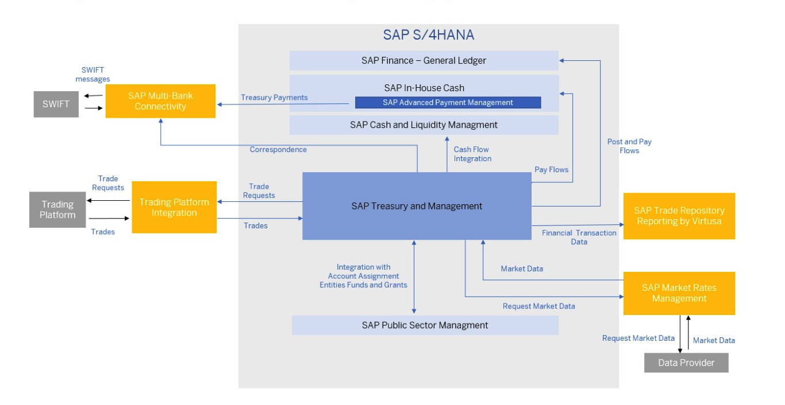
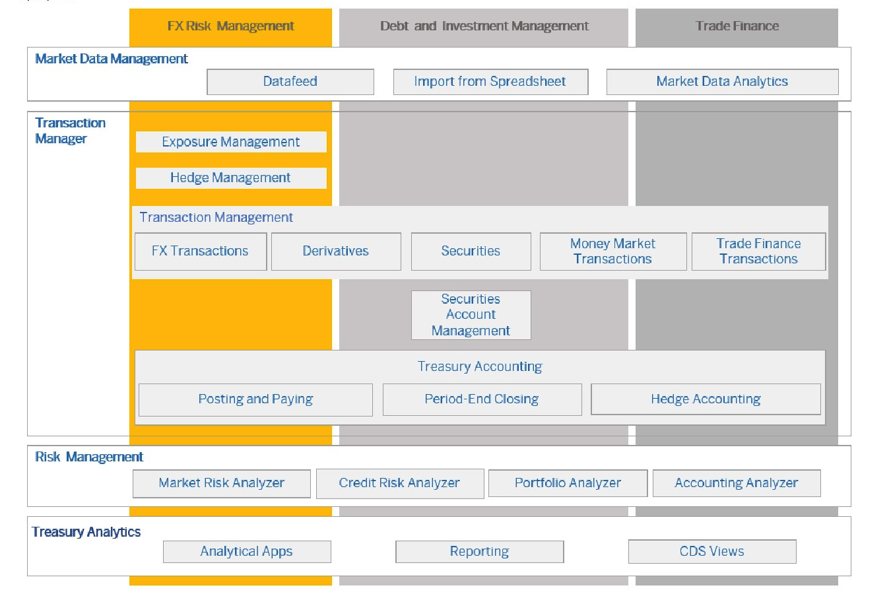
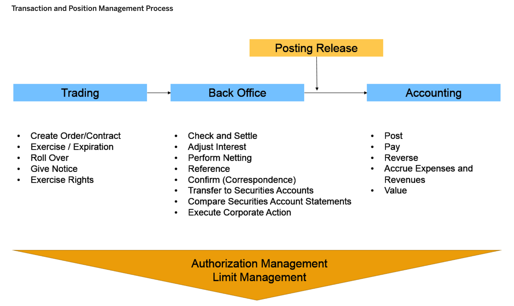

```
FSCM - TREASURY & RISK MANAGEMENT - Overview

```
## Integration

[](https://community.sap.com/ "TRM Integration")

## Components and Business Processes

[](https://community.sap.com/ "TRM Integration")

## Market Data Management:

- Manual Entry (Back End)
- Manual Entry (App)
- Datafeed (Back End)
- Datafeed (SAP Market Rates Management Service)
- Market Data Transfer from Spreadsheet (Back End)
- Import Market Data (App)
- Import Foreign Exchange Rates (App)

## Transaction Manager:

[](https://community.sap.com/ "TRM Integration")

## Roles in TRM:

- SAP_BR_TREASURY_RISK_MANAGER
- SAP_BR_TREASURY_SPECIALIST_FOE
- SAP_BR_TREASURY_SPECIALIST_MOE
- SAP_BR_TREASURY_SPECIALIST_BOE
- SAP_BR_TREASURY_ACCOUNTANT

## Configuration Document

<iframe src="https://onedrive.live.com/embed?cid=971D1A17FB31F32E&resid=971D1A17FB31F32E%21352&authkey=AMzuDPRM-w800H8&em=2" width="476" height="288" frameborder="0" scrolling="no"></iframe>