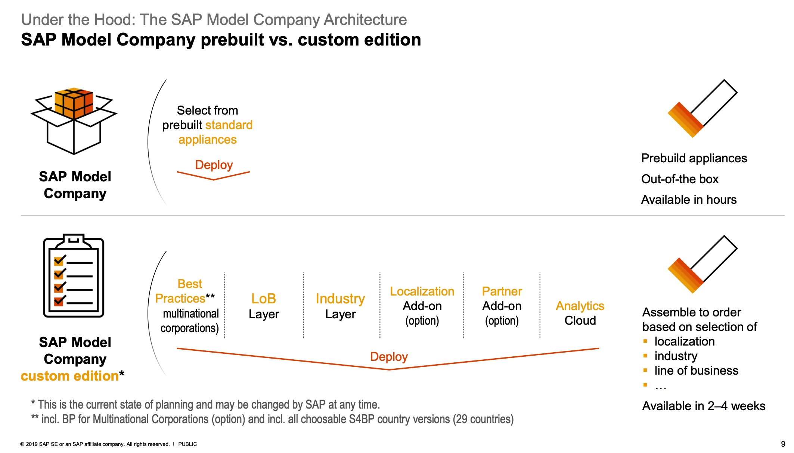
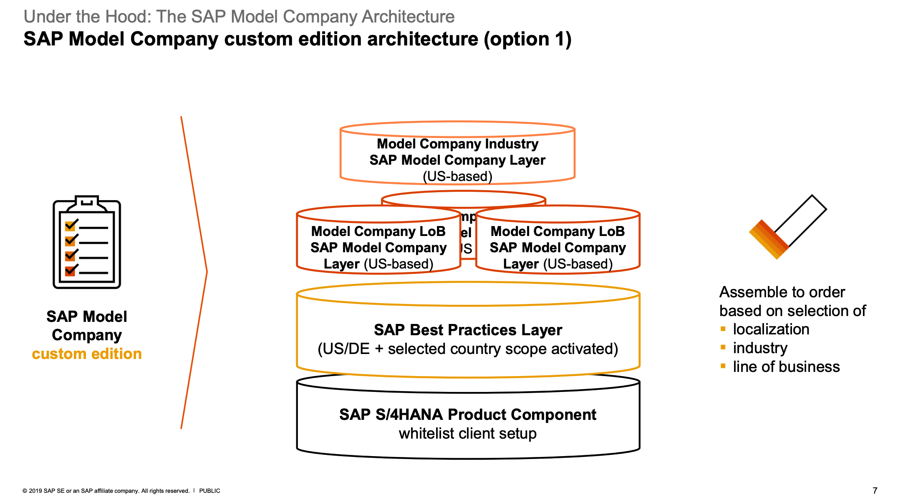
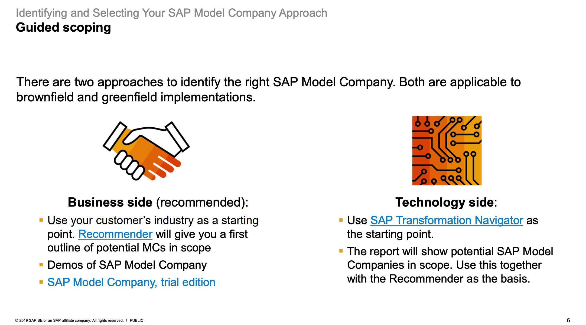
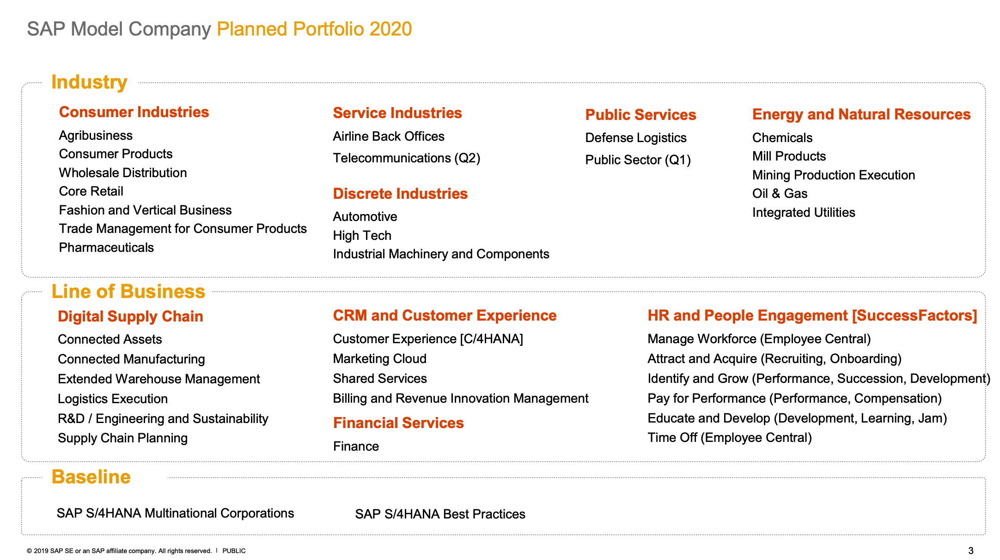
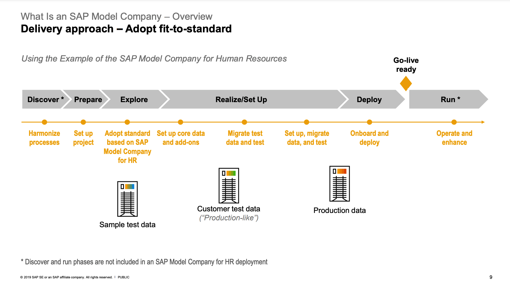

## Prebuilt versus Custom:

## Custom Edition Architecture:

## Guided Scoping - Business vs Technology Side:

## Industry, Line of business & Baseline Portfolios:

## Delivery Approach - Adopt Fit-to-standard:

