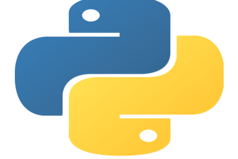
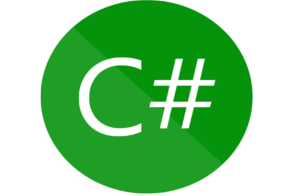

```
DOCS FOR BACKEND DEVELOPMENT

```

Commands:

```
SOFTWARE PROGRAMMING

```

## php

<a href="https://codesnippets.sajivfrancis.com/phpall.html"></a>

[](https://codesnippets.sajivfrancis.com/phpall.html)

## python

<a href="https://codesnippets.sajivfrancis.com/pythonall.html"></a>

[](https://codesnippets.sajivfrancis.com/pythonall.html)

## csharp

<a href="https://codesnippets.sajivfrancis.com/csharpall.html"></a>

[](https://codesnippets.sajivfrancis.com/csharpall.html)